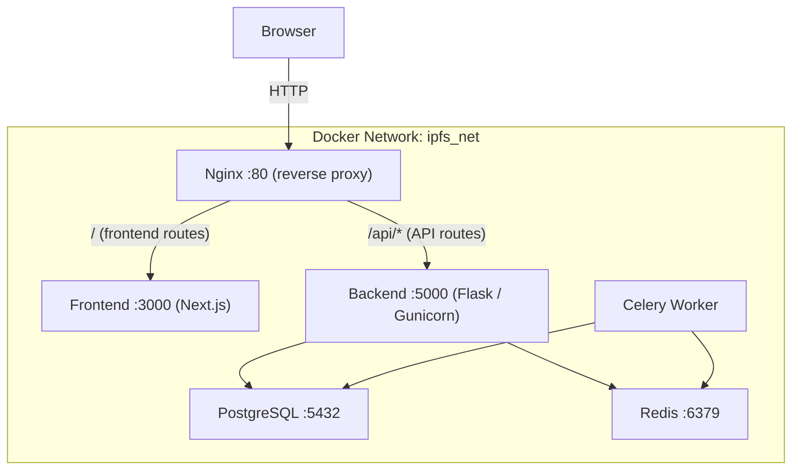
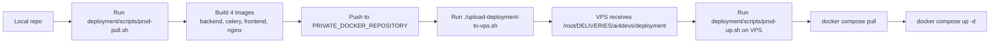

# IPFS Gateway — Deployment Guide

This directory contains all Docker and container-orchestration artefacts for the IPFS Gateway platform.

Project-level helper script related to deployment:

- `upload-deployment-to-vps.sh` (repository root) uploads this entire `deployment/` directory to the VPS target path `/root/DELIVERIES/ai4devs/`.

## Architecture



## Directory Structure

```
deployment/
├── docker/
│   ├── backend/
│   │   ├── Dockerfile          # Multi-stage backend image
│   │   └── .dockerignore
│   ├── frontend/
│   │   ├── Dockerfile          # Multi-stage frontend image (standalone output)
│   │   └── .dockerignore
│   └── nginx/
│       ├── Dockerfile          # Nginx image with custom config
│       └── nginx.conf          # Reverse-proxy routing rules
├── docker-compose.dev.yml      # Development stack (source mounts, Flask dev server)
├── docker-compose.prod.yml     # Production stack (health checks, resource limits)
├── docker-compose.yml          # Default local stack alias
├── .env.example                # Environment variable template
├── scripts/                    # Helper shell scripts for common workflows
└── README.md                   # This file
```

Repository root:

```text
upload-deployment-to-vps.sh     # Upload deployment/ to VPS (/root/DELIVERIES/ai4devs/)
```

## Production Image Shipping Workflow



## Script Reference

| Script | Location | Purpose |
|--------|----------|---------|
| `dev-up.sh` | `deployment/scripts/` | Start development stack with build (`docker compose ... up --build`). |
| `dev-down.sh` | `deployment/scripts/` | Stop development stack (`docker compose ... down`). |
| `prod-up.sh` | `deployment/scripts/` | Pull production images from registry and start stack. |
| `prod-down.sh` | `deployment/scripts/` | Stop production stack. |
| `prod-pull.sh` | `deployment/scripts/` | Build and push latest production images to `PRIVATE_DOCKER_REPOSITORY`. |
| `deploy.sh` | `deployment/scripts/` | Interactive deployment CLI for Linux/macOS. |
| `deploy.ps1` | `deployment/scripts/` | Interactive deployment CLI for Windows PowerShell. |
| `upload-to-vps.sh` | `deployment/scripts/` | Wrapper that calls root `upload-deployment-to-vps.sh`. |
| `upload-deployment-to-vps.sh` | repository root | Upload local `deployment/` directory to VPS at `/root/DELIVERIES/ai4devs/`. |

## Prerequisites

| Tool          | Minimum version |
|---------------|----------------|
| Docker        | 24.x            |
| Docker Compose | 2.x (plugin)  |

## Deployment CLI Scripts (US-202)

US-202 adds interactive deployment scripts with command parity across Linux/macOS and Windows:

- `deployment/scripts/deploy.sh` (Bash)
- `deployment/scripts/deploy.ps1` (PowerShell)

Both scripts include:

- Interactive menu-based operations
- Environment selection (`development`, `staging`, `production`)
- Image listing, build, retag, and registry push helpers
- Compose-based deploy/stop/restart and logs commands
- Dry-run support and timestamped logs under `deployment/logs/`

### Linux/macOS Usage

```bash
chmod +x deployment/scripts/deploy.sh
./deployment/scripts/deploy.sh

# Optional flags
./deployment/scripts/deploy.sh --dry-run --env development --registry ghcr.io/your-org
```

### Windows Usage

```powershell
# If execution policy blocks scripts in your environment:
Set-ExecutionPolicy -Scope Process -ExecutionPolicy Bypass

.\deployment\scripts\deploy.ps1

# Optional flags
.\deployment\scripts\deploy.ps1 -DryRun -Env development -Registry ghcr.io/your-org
```

### Menu Reference

```text
1. Select Environment
2. List Images
3. Build Images
4. Tag/Rename Image
5. Push to Registry
6. Deploy Application
7. Run Single Container
8. View Logs
9. Stop Services
10. Restart Services
11. Toggle Dry-Run
12. Set Registry URL
0. Exit
```

---

## Quick Start — Development

### 1. Prepare the environment file

```bash
cp deployment/.env.example deployment/.env
# Edit deployment/.env and fill in the required values
```

### 2. Start the full stack

```bash
# From the repository root
docker compose -f deployment/docker-compose.dev.yml up --build
```

Shortcut:

```bash
docker compose -f deployment/docker-compose.yml up --build
```

Services and their exposed ports in development:

| Service  | URL                        |
|----------|----------------------------|
| Nginx    | http://localhost            |
| Frontend | http://localhost:3000 (direct) |
| Backend  | http://localhost:5000 (direct) |
| Postgres | localhost:5432              |
| Redis    | localhost:6379              |

### 3. Database migrations

After the backend container is running, apply Alembic migrations:

```bash
docker compose -f deployment/docker-compose.dev.yml exec backend \
  alembic upgrade head
```

### 4. Stop the stack

```bash
docker compose -f deployment/docker-compose.dev.yml down
# To also remove volumes (destroys data):
docker compose -f deployment/docker-compose.dev.yml down -v
```

---

## Production Deployment

### 1. Prepare the environment file

```bash
cp deployment/.env.example deployment/.env
# Fill in ALL secrets — never leave placeholder values
```

> **Security note:** Ensure `SECRET_KEY`, `POSTGRES_PASSWORD`, `FILEBASE_ACCESS_KEY`, `FILEBASE_SECRET_KEY`, `INTERNAL_API_KEY`, and `ADMIN_TOKEN` contain strong random values.

Set the private registry image variable in `deployment/.env`:

```env
PRIVATE_DOCKER_REPOSITORY=CHANGE_TO_YOUR_DOCKER_REGISTRY
```

With this value, production compose will pull these exact images:

- `CHANGE_TO_YOUR_DOCKER_REGISTRY:ipfs-gateway-prod-backend-latest`
- `CHANGE_TO_YOUR_DOCKER_REGISTRY:ipfs-gateway-prod-celery-latest`
- `CHANGE_TO_YOUR_DOCKER_REGISTRY:ipfs-gateway-prod-frontend-latest`
- `CHANGE_TO_YOUR_DOCKER_REGISTRY:ipfs-gateway-prod-nginx-latest`

### 2. Pull and start the stack

```bash
docker compose -f deployment/docker-compose.prod.yml pull
docker compose -f deployment/docker-compose.prod.yml up -d
```

Or with helper scripts:

```bash
./deployment/scripts/dev-up.sh
./deployment/scripts/dev-down.sh
./deployment/scripts/prod-pull.sh
./deployment/scripts/prod-up.sh
./deployment/scripts/prod-down.sh
./deployment/scripts/upload-to-vps.sh
./upload-deployment-to-vps.sh
```

Recommended release sequence from repository root:

```bash
# 1) Build and push updated production images to registry
./deployment/scripts/prod-pull.sh

# 2) Upload deployment files/scripts to VPS
./upload-deployment-to-vps.sh
# or
./deployment/scripts/upload-to-vps.sh

# 3) On VPS: pull and start updated stack
cd /root/DELIVERIES/ai4devs/deployment
./scripts/prod-up.sh
```

### 3. Apply database migrations

```bash
docker compose -f deployment/docker-compose.prod.yml exec backend \
  alembic upgrade head
```

### 4. Verify health

```bash
# All services report healthy
docker compose -f deployment/docker-compose.prod.yml ps

# Backend health endpoint
curl http://localhost/health
# Expected: {"service": "ipfs-gateway-backend", "status": "ok"}
```

---

## Service Health Checks

Each service implements a Docker health check:

| Service  | Check                                     | Interval |
|----------|-------------------------------------------|----------|
| postgres | `pg_isready`                              | 30 s     |
| redis    | `redis-cli ping`                          | 30 s     |
| backend  | HTTP GET `http://localhost:5000/health`   | 30 s     |
| celery   | `celery inspect ping`                     | 60 s     |
| frontend | HTTP GET `http://localhost:3000/`         | 30 s     |
| nginx    | HTTP GET `http://localhost:80/health`     | 30 s     |

---

## Useful Commands

```bash
# Tail all service logs
docker compose -f deployment/docker-compose.dev.yml logs -f

# Tail a single service
docker compose -f deployment/docker-compose.dev.yml logs -f backend

# Restart a single service
docker compose -f deployment/docker-compose.dev.yml restart celery

# Open a shell in the backend container
docker compose -f deployment/docker-compose.dev.yml exec backend bash

# Run a one-off management command (e.g. seed data)
docker compose -f deployment/docker-compose.dev.yml exec backend \
  python -c "from core import create_app; app = create_app(); print(app.config['APP_ENV'])"

# Rebuild only one service image
docker compose -f deployment/docker-compose.dev.yml build backend
```

---

## Environment Variables

See [`.env.example`](.env.example) for a full list with descriptions. Key variables:

| Variable                | Required | Description                                    |
|-------------------------|----------|------------------------------------------------|
| `SECRET_KEY`            | Yes      | Flask secret key — must be a long random string |
| `POSTGRES_USER`         | Yes      | PostgreSQL username                            |
| `POSTGRES_PASSWORD`     | Yes      | PostgreSQL password                            |
| `POSTGRES_DB`           | Yes      | PostgreSQL database name                       |
| `FILEBASE_ACCESS_KEY`   | Yes      | Filebase S3-compatible access key              |
| `FILEBASE_SECRET_KEY`   | Yes      | Filebase S3-compatible secret key              |
| `FILEBASE_BUCKET`       | Yes      | Filebase bucket name                           |
| `INTERNAL_API_KEY`      | Yes      | Key for internal service-to-service calls      |
| `ADMIN_TOKEN`           | Yes      | Admin API token                                |
| `ALLOWED_ORIGINS`       | Yes      | Comma-separated list of allowed CORS origins   |
| `NEXT_PUBLIC_API_URL`   | Yes      | Public URL of the backend API (seen by browser)|

---

## Troubleshooting

### Backend fails to connect to the database

- Ensure `DATABASE_URL` points to `postgres:5432` (not `localhost`) inside containers.
- Wait for the postgres health check to pass before the backend starts.

### Frontend shows API errors

- Check that `NEXT_PUBLIC_API_URL` is set to `http://localhost/api` (via Nginx) in the compose `.env`.
- Verify Nginx is running: `docker compose ... ps nginx`.

### Celery tasks are not processing

- Check `CELERY_BROKER_URL` and `CELERY_RESULT_BACKEND` point to `redis://redis:6379/0`.
- Inspect worker logs: `docker compose ... logs celery`.

### Port conflicts

- If port `80`, `5000`, or `3000` is in use, edit the `ports:` mapping in the compose file before starting.
