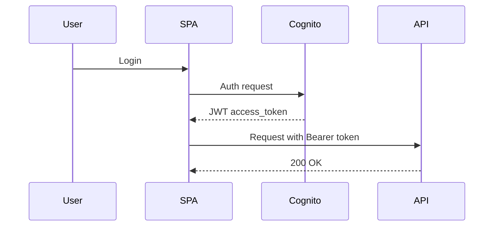
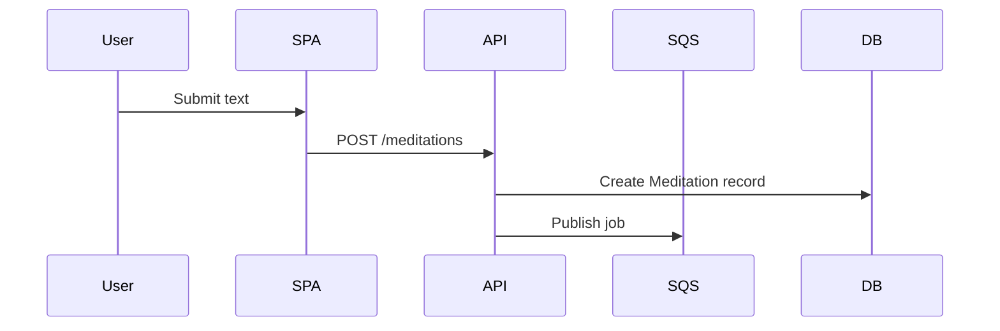
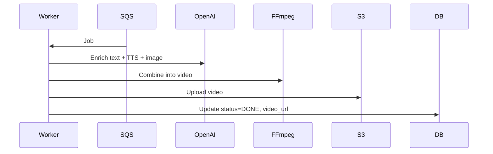
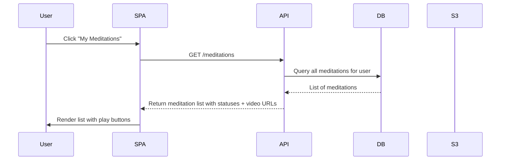
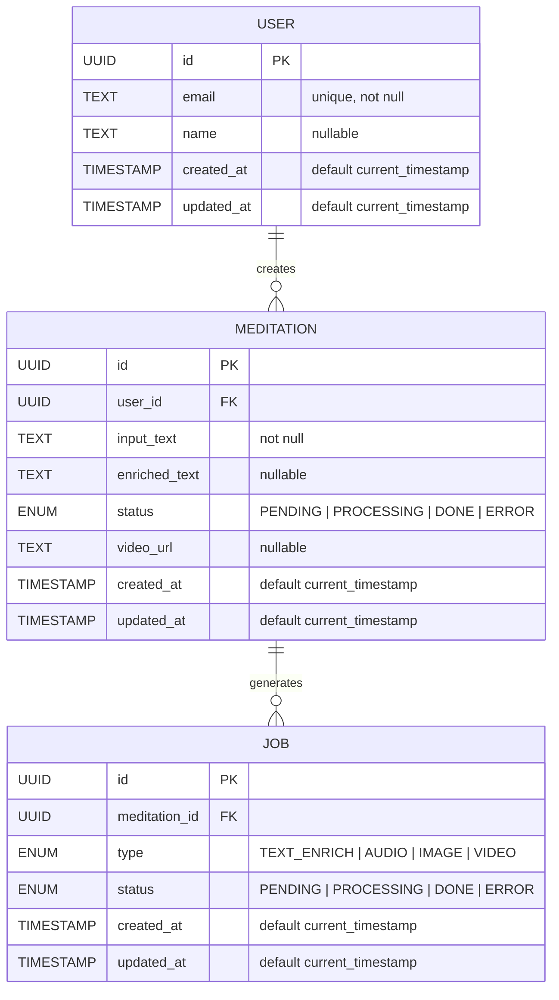
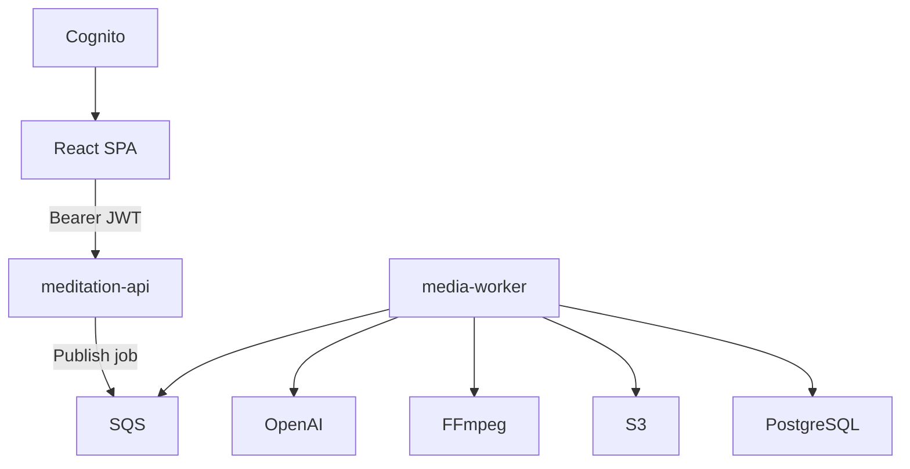
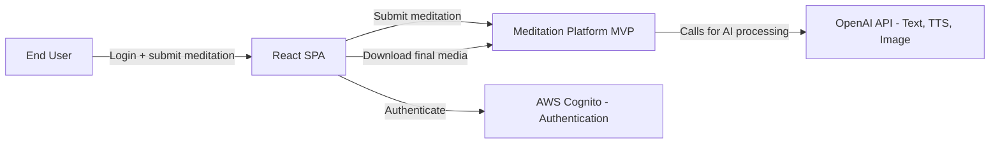
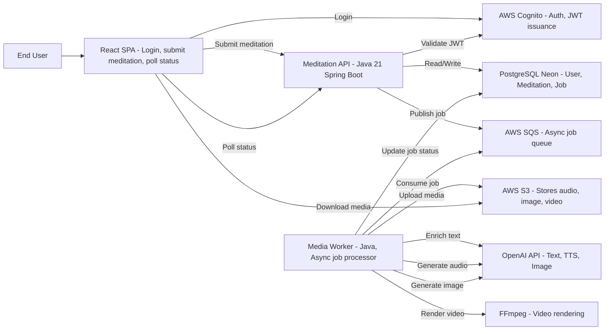
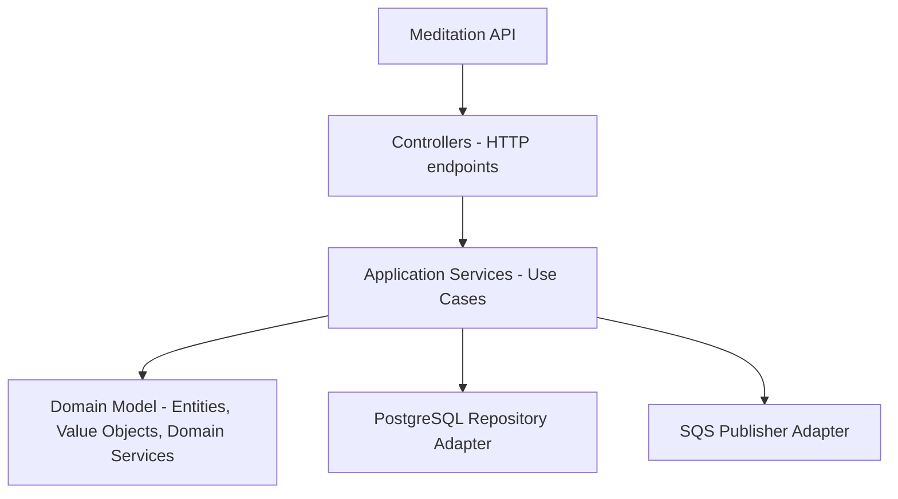
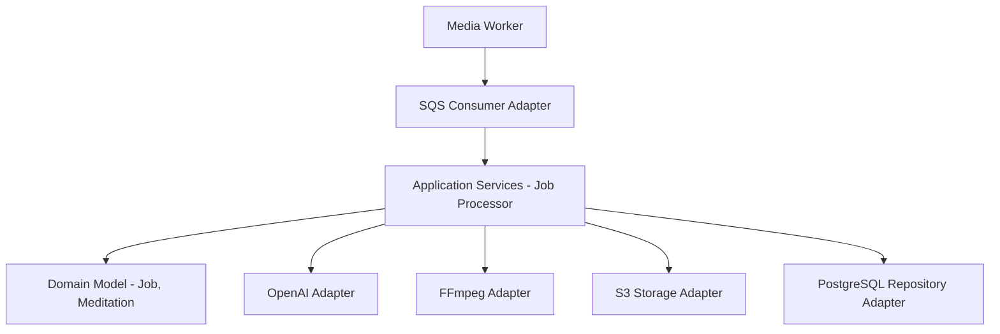

# 🧪 **Meditation Generation Platform — MVP Design Document**

## 1️⃣ Software Overview

**Short Description:**

The Meditation Generation Platform converts user-provided text into personalized meditation experiences, generating enriched text, audio (TTS), images, and video. It supports async processing, traceability, and playback.

**Unique Value Proposition:**

- Fully automated end-to-end meditation generation
- High-quality multimedia output
- Traceable, resumable, and playable content

**Main Features (MVP):**

1. User authentication & JWT-based session
2. Submit meditation text → async processing pipeline
3. Job queue processing: text, audio, images, video
4. List & play completed meditations
5. Track meditation status
6. Observability: metrics, logs, tracing
7. Cloud storage for generated media

---

## 2️⃣ Lean Canvas (textual)

| Field | Content |
| --- | --- |
| Problem | Users need personalized meditation content; manual creation is slow and inconsistent |
| Customer Segments | Individuals interested in wellness and meditation apps |
| Unique Value Proposition | Fast, AI-driven, end-to-end meditation content generation |
| Solution | SPA + API + Worker + S3 + PostgreSQL + Queue |
| Channels | Web SPA, app integration, social sharing |
| Revenue Streams | Subscription, pay-per-video, premium content |
| Cost Structure | AI API calls, compute, storage, queue, infra |
| Key Metrics | Meditation generation time, completion rate, user engagement |
| Unfair Advantage | Fully automated multimedia pipeline with traceability |

---

## 3️⃣ Use Cases

### **US1 — User Authentication**

- **Goal:** Authenticate users via AWS Cognito
- **Actors:** User, meditation-api
- **Flow:**
    1. User logs in via SPA (Cognito hosted UI)
    2. SPA receives `access_token` JWT
    3. Backend validates JWT for protected endpoints
- **BDD Scenarios:**
    
    **Happy Path:**
    
    ```
    Given the user has a Cognito account
    When the user logsin via SPA
    Then SPA receives a valid JWT
    And the user can access protected endpoints
    ```
    
    **Edge Case:**
    
    ```
    Given the user enters invalid credentials
    When they attempt to login
    Then authentication is denied
    And an error message is returned
    ```
    
    **Alternative Flows:**
    
    - Invalid credentials → 401 Unauthorized
    - Expired token → 403 Forbidden
    - Unconfirmed user → redirect to confirmation

**API Spec:**

- POST `/auth/login`
    
    Request: `{ "email": "...", "password": "..." }`
    
    Response 200: `{ "access_token": "...", "expires_in": 3600 }`
    
    Response 401: `{ "error": "Invalid credentials" }`
    
- **Diagram:** *(Mermaid textual example)*



---

### **US2 — Create Meditation**

- **Goal:** Submit a text and enqueue a job for processing
- **Actors:** User, meditation-api, SQS
- **Flow:**
    1. User submits base text via SPA
    2. meditation-api creates Meditation record (status=PENDING)
    3. Job is published to SQS
- **BDD Scenarios:**
    
    **Happy Path:**
    
    ```
    Given theuseris authenticated
    When they submit a basetextfor a meditation
    Then a Meditationrecordis createdwith status PENDING
    And a Jobis publishedto SQSfor processing
    ```
    
    **Edge Case:**
    
    ```
    Given the submitted text is empty
    When the user submits it
    Then the API rejects the request with validation error
    And no Meditation or Job is created
    ```
    
    **Alternative Flows:**
    
    - Empty text → 400 Validation Error
    - Queue unavailable → Retry up to 3 times, log failure
    - Unauthenticated user → 401 Unauthorized

**API Spec:**

- POST `/meditations`
    
    Request: `{ "input_text": "..." }`
    
    Response 201: `{ "meditationId": "uuid", "status": "PENDING" }`
    
- **Diagram:** *(Mermaid example)*



---

### **US3 — Process Meditation Job**

- **Goal:** Transform text into enriched multimedia meditation
- **Actors:** media-worker, OpenAI, FFmpeg, S3, PostgreSQL
- **Flow:**
    1. media-worker consumes job from SQS
    2. Calls OpenAI for text enrichment
    3. Generates audio via TTS
    4. Generates image/video assets
    5. Combines media using FFmpeg
    6. Uploads final video to S3
    7. Updates Meditation record status to DONE
- **BDD Scenarios:**
    
    **Happy Path:**
    
    ```
    Given a Jobexistsin SQS
    When the media-worker consumes the Job
    Thentextis enrichedusing OpenAI
    And audioisgenerated via TTS
    And image/video is generated
    And final video is rendered with FFmpeg
    And videois uploadedto S3
    And Meditation statusis updatedto DONE
    ```
    
    **Edge Case:**
    
    ```
    Given OpenAI returns anerror
    When the media-worker processes the Job
    Then Meditation statusissettoERROR
    And anerror logis generated
    ```
    
    **Alternative Flows:**
    
    - TTS fails → log error, continue optional media
    - FFmpeg fails → mark meditation as ERROR
    - Job fails repeatedly → max retries, notify user
- **Diagram:**



---

### **US4 — List & Playback Meditations**

- **Goal:** User can see all their meditations and access final videos for playback.
- **Actors:** User, SPA, meditation-api, PostgreSQL, S3
- **BDD Scenarios:**
    
    **Happy Path:**
    
    ```
    Given theuseris authenticated
    When they requestGET /meditations
    Then the APIreturns a listofall meditationsfor thatuser
    Andeach meditation includes: id, input_text, status, video_url (if DONE)
    ```
    
    **Edge Case 1 (No meditations):**
    
    ```
    Given theuser hasno meditations
    When they requestGET/meditations
    Then the APIreturns anempty list
    ```
    
    **Edge Case 2 (Partial completion):**
    
    ```
    Given theuser hassome meditationsin DONEandsomein PROCESSING
    When they requestGET /meditations
    Then the APIreturnsall meditationswith theircurrent status
    Andonly the DONE meditationsinclude the video_url
    ```
    
- **Flow:**
    1. User clicks “My Meditations” in SPA
    2. SPA calls `GET /meditations` with JWT
    3. meditation-api queries PostgreSQL for all meditations of that user
    4. API returns list of meditations with id, input_text, status, video_url (if DONE)
    5. SPA renders a list with play buttons for DONE videos
- **Diagram:**



---

**Notas y recomendaciones:**

- Mantener paginación o lazy-loading si la lista crece mucho (escalable para el futuro).
- Video playback se hace directamente desde S3 con URLs pre-firmadas (seguridad).

## 4️⃣ Data Model (PostgreSQL)

### **User**

| Field | Type | Constraints |
| --- | --- | --- |
| id | UUID | PK, not null |
| email | Text | Unique, not null |
| name | Text | Nullable |
| created_at | Timestamp | Default current_timestamp |
| updated_at | Timestamp | Default current_timestamp |

### **Meditation**

| Field | Type | Constraints |
| --- | --- | --- |
| id | UUID | PK, not null |
| user_id | UUID | FK → User(id), not null |
| input_text | Text | not null |
| enriched_text | Text | Nullable |
| status | Enum | PENDING / PROCESSING / DONE / ERROR |
| video_url | Text | Nullable |
| created_at | Timestamp | Default current_timestamp |
| updated_at | Timestamp | Default current_timestamp |

### **Job**

| Field | Type | Constraints |
| --- | --- | --- |
| id | UUID | PK, not null |
| meditation_id | UUID | FK → Meditation(id), not null |
| type | Enum | TEXT_ENRICH / AUDIO / IMAGE / VIDEO |
| status | Enum | PENDING / PROCESSING / DONE / ERROR |
| created_at | Timestamp | Default current_timestamp |
| updated_at | Timestamp | Default current_timestamp |

**Relationships:**

- *User 1.. → Meditation*: a user can have multiple meditations.
- *Meditation 1.. → Job*: each meditation can generate multiple processing jobs (text enrichment, audio generation, image/video generation).

**Rationale:**

- Introduces **traceability of processing jobs**.
- Enables **asynchronous job management**.
- Supports **future extensions** (e.g., multiple voices, multiple image styles).

---



## 5️⃣ High-Level Architecture

**Components:**

- SPA Frontend (React)
- meditation-api (Fly.io) — Spring Boot + PostgreSQL
- media-worker (Fly.io) — Spring Boot + SQS + FFmpeg + OpenAI
- S3 for video storage
- Cognito for authentication

**Communication:**

- SPA → API: JWT Bearer
- API → SQS: publish job
- Worker → API DB: update status
- Worker → S3: upload final video
- Optional monitoring/logging through structured logs

**Diagram (Mermaid C4-like textual)**



---

## Non-Functional Requirements

- **Scalability:** Horizontal scaling for workers and API pods; S3 for storage
- **Security:** JWT authentication, TLS, least privilege S3 access
- **Observability:** Prometheus metrics, structured logs, tracing
- **Resilience:** Retry with exponential backoff, idempotent jobs

## 6️⃣ Deployment Strategy

- **Backend / Worker:** Fly.io (separate containers)
- **Database:** Neon.tech (PostgreSQL)
- **Queue:** AWS SQS
- **Storage:** AWS S3
- **Authentication:** AWS Cognito
- **Secrets:** Environment variables on Fly.io
- **Async processing:** Worker consumes jobs independently

**Rationale:**

- Fly.io enables free-tier deployment of 2–3 microservices
- SQS ensures decoupled, scalable asynchronous job handling
- No Keycloak needed; JWT validated at each microservice
- MVP-focused: minimal but realistic deployment

---

## 7️⃣ Security Considerations

- JWT validated by each microservice
- No server-side session state
- TLS enforced for all HTTP endpoints
- Principle of least privilege for S3 access
- Secrets managed via environment variables

---

## 8️⃣ Done Criteria

- BDD scenarios pass for all MVP use cases
- Domain covered by unit tests (TDD)
- APIs compliant with contract-first design
- Infrastructure verified (DB, SQS, S3 connectivity)
- Logs and metrics available for monitoring
- MVP is deployable and functional end-to-end

## 9️⃣ Diagramas C4

### **1️⃣ System Context Diagram**



---

### **2️⃣ Container Diagram**



---

### **3️⃣ Component Diagram - Meditation API**



---

### **4️⃣ Component Diagram - Media Worker**

