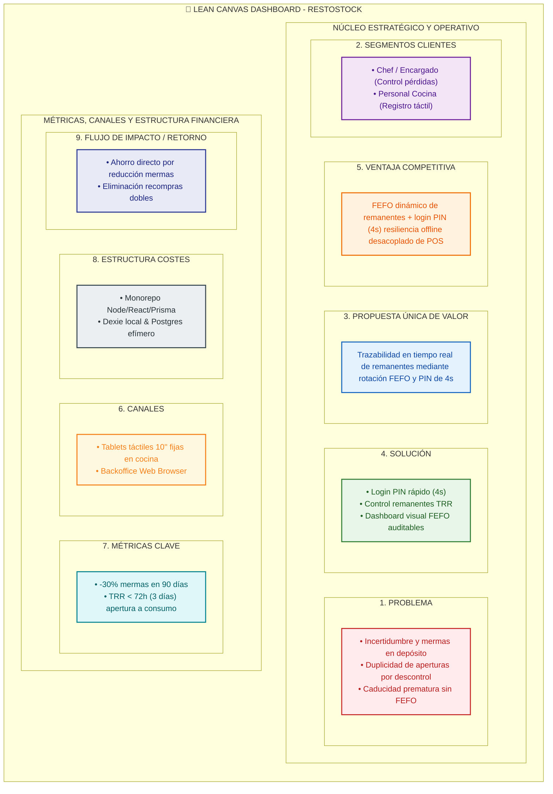

> **Navegación:** `[ 01_product_discovery.md ]` ➔ [01_glosario_y_reglas_negocio.md](./01_glosario_y_reglas_negocio.md) | [02_prd.md](./02_prd.md)

---

# 🚀 Paso 1: Concepción, Descubrimiento e Investigación (Product Discovery) - RestoStock

## 📌 ÍNDICE DE CONTENIDOS
1. [Resumen Ejecutivo (Lean Canvas Dashboard)](#1-resumen-ejecutivo-lean-canvas-dashboard)
2. [Investigación de Mercado, Buy vs. Build y Frontera Problema/Solución](#2-investigación-de-mercado-buy-vs-build-y-frontera-problemasolución)
3. [Visión y Métricas de Éxito (KPIs)](#3-visión-y-métricas-de-éxito-kpis)
4. [Lenguaje Ubicuo (Glosario DDD)](#4-lenguaje-ubicuo-glosario-ddd)
5. [Flujo Principal (Happy Path E2E)](#5-flujo-principal-happy-path-e2e)
6. [Fuera de Alcance (Non-Goals)](#6-fuera-de-alcance-non-goals)
7. [Preguntas de Clarificación para el Diseño Técnico](#7-preguntas-de-clarificación-para-el-diseño-técnico)

---

## 1. Resumen Ejecutivo (Lean Canvas Dashboard)

---

## 2. Investigación de Mercado, "Buy vs. Build" y Frontera Problema/Solución

*   **Análisis del Mercado y Competencia (Decisión Buy vs. Build):**
    *   *Sistemas POS Tradicionales (Toast, Lightspeed, Micros):* Orientados a facturación y comandas. Sus módulos de inventario se limitan a descontar ingredientes de forma teórica en bodega, ignorando la realidad táctica de la cocina, las aperturas de empaques y los remanentes abiertos.
    *   *Software de Gestión de Restaurantes (MarketMan, Restaurant365):* Soluciones SaaS complejas orientadas a compras, proveedores y finanzas. Requieren largos procesos de carga y no ofrecen interfaces táctiles ultrarrápidas por PIN para cocineros en estaciones de trabajo aceleradas.
    *   *Justificación del Desarrollo Propio (Build):* RestoStock no compite con el POS ni con el ERP de compras; resuelve la **brecha operativa táctil en la cocina** (trazabilidad de remanentes, caducidad dinámica TRR y rotación FEFO) en terminales de 10" con autenticación PIN de 4 segundos y resiliencia *offline-first*.

*   **Evaluación de Oportunidades de IA vs. Algoritmos Deterministas (Mini-Framework IA):**
    1.  *Impacto en KPIs de Negocio:* El retorno principal surge de eliminar la latencia de registro en cocina y forzar la rotación FEFO visual.
    2.  *Viabilidad de Datos:* Los datos de inventario son inmediatos y transaccionales en la terminal local del restaurante.
    3.  *Riesgos & Compliance:* Cero riesgo de alucinación o sesgo al evitar modelos probabilísticos (GDPR/EU AI Act compliant por diseño).
    4.  *Complejidad Técnica:* **Se descarta el uso de modelos IA/LLM/RAG en este núcleo operativo.** Se opta por una **lógica determinista basada en reglas estrictas (algoritmo FEFO + `decimal.js`)**, garantizando tiempo de respuesta sub-segundo (4s) y 100% de previsibilidad matemática.

*   **Descripción Breve del Software:**
    **RestoStock** es un sistema de gestión y trazabilidad operativa de inventario en tiempo real para cocinas de restaurantes. Permite controlar la cadena de custodia de las materias primas desde su extracción del depósito principal hasta el registro y consumo fraccionado de sus remanentes en las estaciones de trabajo de cocina, garantizando rotación prioritaria por método FEFO y prevención de mermas desconocidas.

*   **Valor Añadido y Ventajas Competitivas:**
    *   **Valor Añadido:** Trazabilidad granular en tiempo real por operario autorizado, erradicación de la reapertura innecesaria de empaques cerrados mediante visibilidad inmediata de remanentes activos en cocina, y cálculo dinámico de caducidad secundaria (*Secondary Shelf Life*).
    *   **Ventaja Competitiva:** Interfaz ultra-ergonómica optimizada para pantallas táctiles de cocina con autenticación rápida por PIN de 4 segundos, resiliencia offline-first con sincronización automática (que evita detener el servicio ante caídas de internet), y un enfoque 100% enfocado en remanentes y FEFO desacoplado de sistemas POS tradicionales pesados.

*   **Separación de Roles (Estratégico vs. Operativo):**
    *   **Perfil Estratégico / Auditor (Chef Ejecutivo, Manager, Administrador):** Requiere tableros de control de mermas, auditoría transaccional de pérdidas, trazabilidad por empleado y reportes de cuadratura financiera sin interactuar con las pantallas de cocina durante el servicio.
    *   **Perfil Operativo de Línea (Cocineros Autorizados, Barman, Personal de Depósito):** Requiere una interfaz táctil limpia, botones grandes (mínimo 48px), ingreso mediante PIN de 4 dígitos en menos de 4 segundos y cero burocracia documental para no ralentizar la preparación de platos.

*   **El Problema Real y Contexto del Usuario:**
    Existe una profunda **incertidumbre, descontrol y falta de visibilidad operativa** en el depósito de insumos del restaurante, ya que se desconoce con certeza qué empleado accede a las materias primas y cuál es el destino final de cada producto. Esta carencia de supervisión física y documental genera mermas misteriosas y pérdidas de inventario. Adicionalmente, cuando un insumo es abierto y consumido de forma fraccionada, el sobrante se almacena en la cocina sin un registro de su ubicación física exacta, lo que provoca duplicidad en la apertura de empaques cerrados, compras innecesarias y caducidad prematura de alimentos.

---

## 3. Visión y Métricas de Éxito (KPIs)

*   **Hipótesis de Negocio:**
    > **Creemos que si permitimos al** personal de cocina y almacén **registrar de manera rápida y obligatoria cada extracción de depósito, el consumo parcial de materia prima y la ubicación física de su remanente, lograremos** erradicar la merma desconocida en la cadena de custodia y optimizar el aprovechamiento de los productos ya abiertos antes de que caduquen.

*   **Métricas de Negocio (KPIs):**
    1.  **Reducción de Merma Desconocida:** Disminuir en un **30%** la diferencia financiera entre el inventario teórico del sistema y las auditorías de inventario físico semanal en un plazo de 90 días.
    2.  **Tasa de Rotación de Remanentes (TRR):** Conseguir que el tiempo promedio desde que un insumo abierto (remanente) se registra en la cocina hasta que es marcado como "totalmente consumido" sea **menor a 72 horas (3 días)**.

---

## 4. Lenguaje Ubicuo (Glosario DDD)

Para que el modelo de datos, la API, la interfaz de usuario y los futuros agentes de programación utilicen exactamente el mismo idioma y evitar código inconsistente, se definen los siguientes términos de dominio:

*   **`Insumo` (Ingredient/Item):** Cualquier materia prima, producto o bebida registrado en el catálogo maestro del restaurante, caracterizado por su marca, categoría, unidad de medida de compra y presentación física (ej: caja, bolsa o lata).
*   **`Movimiento` (StockMovement):** Registro transaccional que documenta cualquier cambio físico en el inventario de un almacén (ingreso de proveedor, traslado interno entre áreas de la cocina, consumo o descarte). Puede detallar unidades enteras (para el depósito principal) o unidades de consumo/remanentes (para la cocina y descartes), especificando el **operario autorizado** que lo registró, fecha, cantidad y finalidad.
*   **`Uso Parcial` (PartialConsumption):** El acto de retirar un insumo del depósito, abrirlo y consumir una porción de su capacidad total medida en una unidad de consumo directo (gramos o mililitros) para la preparación de los servicios.
*   **`Remanente` (Leftover/Residual):** La porción sobrante y abierta de un insumo que ya ha sufrido un uso parcial y que debe ser reubicada en un almacén secundario específico (ej: heladera de línea) para ser rastreada y consumida con prioridad.

---

## 5. Delimitación del Alcance y Flujo Principal (Slice Vertical MVP)

*   **Estrategia de Graduación por Incertidumbre (Slice Vertical Mínimo):**
    RestoStock se delimita como un **Slice Vertical Mínimo Viable (E2E)** centrado en resolver con rigor extremo un único problema core: la trazabilidad del consumo parcial de materias primas y la rotación FEFO de sus remanentes en la cocina. Se prioriza la velocidad de validación en terminales físicas de cocina sobre la complejidad de un ERP completo.

*   **Flujo Principal (Happy Path E2E):**
    1.  **Extracción del Depósito:** Un **operario autorizado** (ej: Encargado de Almacén o Cocinero con permisos) accede al sistema de forma rápida, busca un **insumo** en el Almacén Principal (ej: Queso Parmesano) y registra un **movimiento** de extracción para trasladar una unidad entera sellada a la Cocina.
    2.  **Registro de Uso Parcial:** Tras realizar la preparación del plato, el cocinero de línea pesa la porción utilizada. Un **operario autorizado** registra de forma directa y rápida en la terminal de la cocina (mediante su PIN de 4 dígitos) la cantidad exacta consumida (ej: 400 gramos), detallando el motivo del uso.
    3.  **Cálculo Automático de Remanente:** El sistema procesa la apertura de la unidad (previamente extraída en el Paso 1), descuenta su capacidad total consumida y genera de inmediato un registro de **remanente** con la cantidad sobrante medida en unidades de consumo (ej: 5000g de capacidad inicial - 400g consumidos = 4600g remanentes).
    4.  **Resguardo Físico:** El **operario autorizado** selecciona en la pantalla el almacén o sububicación de cocina (ej: Heladera A de Línea de Fríos) donde se almacenará el producto abierto y confirma el guardado.
    5.  **Actualización y Rotación Prioritaria:** El sistema actualiza en tiempo real la disponibilidad y ubicación del sobrante, mostrándolo destacado en la pantalla de consultas de la cocina para que el siguiente turno lo use de forma prioritaria antes de abrir un insumo sellado del depósito.

---

## 6. Fuera de Alcance (Non-Goals)

Para evitar la complejidad innecesaria y proteger los límites del desarrollo de este MVP, queda explícitamente excluido:

*   **Descuento automático de inventario por receta (BOM):** El sistema no calculará mermas ni deducirá ingredientes de forma implícita basándose en la facturación o las comandas de los platos vendidos; todo registro de uso parcial se realiza manualmente por el personal de cocina.
*   **Módulo de Compras y Proveedores:** No se gestionarán órdenes de compra automáticas, cuentas por pagar ni comunicación directa con proveedores externos en esta fase.
*   **Gestión de Almacenes Multisede:** El software estará estrictamente delimitado para controlar los almacenes, áreas y personal de una única sucursal física del restaurante.

---

## 7. Preguntas de Clarificación para el Diseño Técnico

1.  **Manejo de Unidades de Compra vs. Consumo y Formateo de Decimales:**
    *   **Solución Profesional:** Introducir un **Factor de Conversión** en la entidad `Insumo`. Cada ingrediente se registra con su `Unidad de Compra` (ej. Caja de 5 kg, Horma, Bidón) y su `Unidad de Consumo` (ej. gramos, mililitros, unidades).
    *   **Flujo Operativo & Precisión Dual:** Las extracciones del Depósito Principal se realizan en unidades enteras de compra (ej. -1 Horma). Al registrar el primer `Uso Parcial` en la cocina, esa unidad se abre y el sistema genera automáticamente un `Remanente` expresado en la unidad de consumo multiplicando la unidad de compra por el factor de conversión (ej. 1 Horma x 5000g = 5000g de capacidad inicial, restándole el consumo inicial). Todo el stock de cocina y los remanentes se rastrean y descuentan en el backend con precisión `decimal.js`, pero **en la interfaz táctil (UI) se muestran formateados con máximo 2 decimales significativos** (y 0 decimales si la unidad es gramos/mililitros) para evitar la fatiga y el ruido visual en la cocina.

2.  **Fecha de Caducidad Acelerada del Remanente:**
    *   **Solución Profesional:** Añadir un campo opcional `Vida Útil Abierto (días)` (Secondary Shelf Life) en la definición de cada `Insumo`.
    *   **Flujo Operativo:** Cuando un lote cerrado se abre y registra su primer `Uso Parcial`, el sistema calcula dinámicamente la nueva fecha de vencimiento: `Fecha Vencimiento Remanente = Min(Fecha Vencimiento del Lote Cerrado, Fecha de Apertura + Vida Útil Abierto)`. En las pantallas de la cocina, los remanentes se listan de manera prioritaria usando ordenamiento FEFO (First Expired, First Out) y alertas de color (Rojo para vencidos, Amarillo para los que expiran en menos de 24 horas) para forzar su uso inmediato.

3.  **Mecanismo de Autenticación Rápida (PIN de Cocina) vs. Datos Confidenciales:**
    *   **Solución Profesional:** Implementar un **Esquema de Autenticación de Doble Capa** optimizado para entornos de alta velocidad:
        *   *Acceso Administrativo (Web/Backoffice):* El Chef Ejecutivo y Administradores inician sesión de forma tradicional con correo electrónico y contraseña robusta para gestionar catálogos, ver reportes y configurar el sistema.
        *   *Acceso en Estaciones de Cocina (Tablets/Terminales):* El dispositivo del área mantiene una sesión de aplicación activa bajo el rol del área (ej. "Terminal Cocina Fríos"). Al registrar cualquier movimiento, uso parcial o descarte, el **operario autorizado** simplemente selecciona su perfil (nombre y foto) de la lista de personal autorizado y digita su **PIN numérico de 4 dígitos**. Esto proporciona trazabilidad y responsabilidad individual en 3 segundos, asegurando que solo el personal con permisos pueda confirmar transacciones de inventario.

4.  **Límites Físicos y Capacidad de Almacenes Secundarios:**
    *   **Solución Profesional:** Optar por un enfoque de **Capacidades Informativas y Advertencias de Saturación (Soft Limits)**.
    *   **Flujo Operativo:** En lugar de bloquear de forma estricta las inserciones en base de datos si un almacén está "lleno" (lo cual interrumpiría la velocidad del servicio ante imprecisiones de peso), el sistema permitirá registrar el traslado del remanente de manera libre. No obstante, al asignar el remanente a una ubicación (ej. Heladera A de Línea), la UI mostrará un indicador visual de su nivel de saturación aproximado basado en la cantidad de remanentes activos. Si está sobrecargada, emitirá un aviso visual no bloqueante aconsejando almacenar en una ubicación alternativa viable (ej. Heladera B).

5.  **Flujo de Descarte de Remanentes Caducados:**
    *   **Solución Profesional:** Diseñar una funcionalidad específica de **Descarte y Registro de Merma**.
    *   **Flujo Operativo:** Desde el panel de control de inventario de cocina, los operarios podrán ver el listado de remanentes próximos a vencer o ya vencidos. Al hacer clic en "Descartar", el sistema solicitará ingresar la cantidad a desechar, seleccionar un motivo estandarizado obligatorio (ej. *Vencimiento*, *Rotura/Caída*, *Contaminación*, *Mal Estado*) y confirmar la acción mediante el PIN de un **operario autorizado**. La aplicación pondrá a cero el remanente y creará un registro de `Movimiento` tipo "Descarte", asegurando que el costo de la merma conocida sea completamente auditable en los reportes financieros del restaurante.
