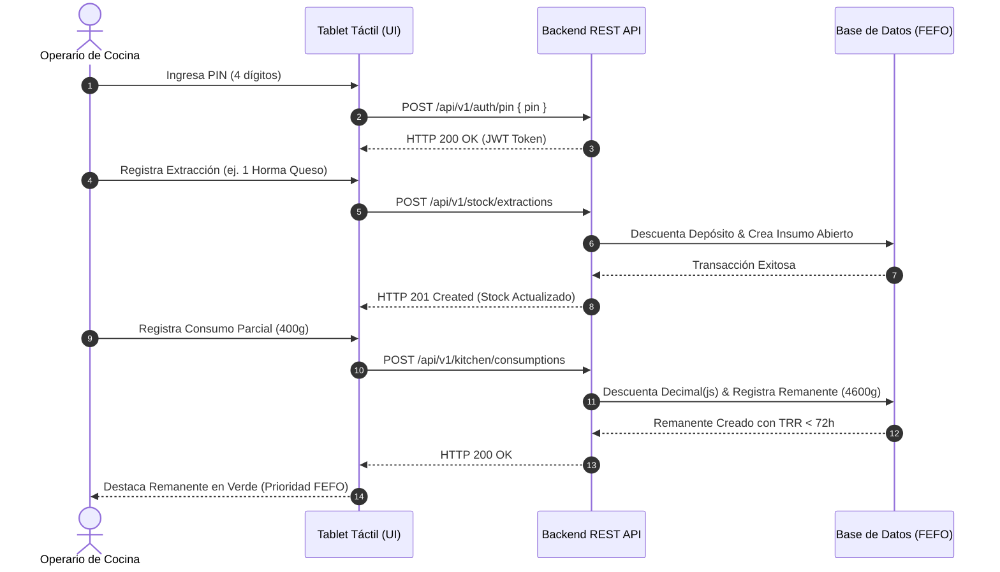

> **Navegación:** [01_product_discovery.md](./01_product_discovery.md) ➔ [01_glosario_y_reglas_negocio.md](./01_glosario_y_reglas_negocio.md) ➔ [ 02_prd.md ]

---

# 📝 Documento de Requisitos de Producto (PRD): RestoStock

## 📌 ÍNDICE DE CONTENIDOS
1. [Descripción General del Producto](#1-descripción-general-del-producto)
   - 1.1. [Problemática de Negocio](#11-problemática-de-negocio)
   - 1.2. [Propuesta de Solución (MVP)](#12-propuesta-de-solución-mvp)
   - 1.3. [Objetivos de Negocio y KPIs](#13-objetivos-de-negocio-y-kpis-métricas-de-éxito)
2. [Definición de Usuarios (User Personas)](#2-definición-de-usuarios-user-personas)
3. [Flujo End-to-End Prioritario](#3-flujo-end-to-end-prioritario)
   - 3.1. [Happy Path: Secuencia de Pasos](#31-happy-path-secuencia-de-pasos)
   - 3.2. [Diagrama Visual de Secuencia del Caso de Uso E2E (Mermaid)](#32-diagrama-visual-de-secuencia-del-caso-de-uso-e2e-mermaid)
   - 3.3. [Flujos Alternativos y Manejo de Errores (Edge Cases)](#33-flujos-alternativos-y-manejo-de-errores-edge-cases)
4. [Límites del Sistema y Non-Goals (Fuera de Alcance)](#4-límites-del-sistema-y-non-goals-fuera-de-alcance)
5. [Backlog de Historias de Usuario (INVEST)](#5-backlog-de-historias-de-usuario-invest)
   - [US-001: Autenticación por PIN del Personal de Cocina](#us-001-autenticación-por-pin-del-personal-de-cocina)
   - [US-002: Registro de Extracciones de Bodega](#us-002-registro-de-extracciones-de-bodega)
   - [US-003: Consulta Táctil de Remanentes Activos en Orden FEFO](#us-003-consulta-táctil-de-remanentes-activos-en-orden-fefo)
   - [US-004: Registro de Consumo Parcial de Remanentes](#us-004-registro-de-consumo-parcial-de-remanentes)
   - [US-005: Registro de Descartes y Mermas](#us-005-registro-de-descartes-y-mermas)
   - [US-006: Consulta de Alertas y Notificaciones Críticas en Cocina](#us-006-consulta-de-alertas-y-notificaciones-críticas-en-cocina)
   - [US-007: Consumo Rápido de Stock por Recetas](#us-007-consumo-rápido-de-stock-por-recetas)
   - [US-008: Cierre de Turno y Conciliación de Cocina](#us-008-cierre-de-turno-y-conciliación-de-cocina)
   - [US-009: Dashboard y Reporte de Mermas Visibles](#us-009-dashboard-y-reporte-de-mermas-visibles)
   - [US-010: Gestión Mínima de Personal (Alta y Bloqueo de Operarios)](#us-010-gestión-mínima-de-personal-alta-y-bloqueo-de-operarios)
   - [US-011: Trazabilidad y Auditoría de Movimientos de Stock](#us-011-trazabilidad-y-auditoría-de-movimientos-de-stock)
6. [Estrategia de Calidad y Verificación (QA/Testing)](#6-estrategia-de-calidad-y-verificación-qatesting)
7. [Roadmap Post-MVP (Fase 2)](#7-roadmap-post-mvp-fase-2)

---

## 1. Descripción General del Producto

### 1.1. Problemática de Negocio
En la gestión operativa diaria de los restaurantes se produce un flujo descontrolado de insumos en el depósito principal. La falta de registro de quién extrae la mercancía y para qué área de la cocina se destina genera mermas misteriosas y pérdidas de inventario que afectan directamente el margen de ganancia. 

Adicionalmente, el desperdicio se multiplica una vez que los insumos ingresan a la cocina. Cuando una unidad de compra (ej. una horma de queso de 5 kg o una caja de salsa) se abre, el remanente sobrante suele almacenarse en heladeras o alacenas sin ningún tipo de registro físico ni de caducidad dinámica. Esto produce tres graves ineficiencias:
1. Cocineros que abren un lote nuevo sellado porque desconocen que ya hay un empaque abierto (duplicidad de aperturas).
2. Tiempo desperdiciado por el personal buscando ingredientes abiertos en diferentes áreas de frío/secos.
3. Insumos que caducan prematuramente al no ser rotados de forma prioritaria tras ser abiertos.

### 1.2. Propuesta de Solución (MVP)
**RestoStock** es una aplicación web de control de inventario y trazabilidad diseñada específicamente para cocinas. El MVP permite a los encargados y personal autorizado registrar de manera ultra rápida cada extracción del depósito principal, reportar el uso parcial de un insumo y rastrear la ubicación física exacta de su remanente dentro de los almacenes secundarios de la cocina (ej. heladeras, congeladores, estanterías). 

El sistema optimiza la rotación de inventarios forzando una lógica FEFO (First Expired, First Out) y alertando al personal sobre los insumos abiertos para asegurar su consumo prioritario. Esto se complementa con:
*   **Feed táctil de notificaciones críticas:** Tarjetas de alertas sobre vencimientos FEFO inminentes, rotura de stock de seguridad de línea y estado de red offline.
*   **Consumo rápido por recetas (manual):** Registro manual de uso de insumos mediante plantillas de recetas guardadas en la terminal, descontando de forma secuencial en orden FEFO sin integrarse con sistemas de comandas externos o facturación (BOM).
*   **Cierre de turno y conciliación física:** Flujo de fin de jornada para que el operario declare el inventario real en cocina y el sistema genere de manera guiada los registros de merma y discrepancias.
*   **Dashboard y reporte de mermas visibles:** Panel web administrativo para que el administrador visualice en tiempo real los descartes acumulados agrupados por insumo y causa, haciendo la merma visible de inmediato.

### 1.3. Objetivos de Negocio y KPIs (Métricas de Éxito)
*   **Reducción de Merma Desconocida:** Disminuir en un **30%** la diferencia financiera entre el inventario teórico del sistema y las auditorías físicas semanales en un periodo de 90 días.
*   **Tasa de Rotación de Remanentes (TRR):** Lograr que el tiempo promedio desde que se abre un insumo y se registra su remanente hasta que se marca como "totalmente consumido" sea **menor a 72 horas (3 días)**.
*   **Reducción de Duplicidad de Aperturas:** Bajar a cero la incidencia de apertura de nuevos insumos sellados cuando ya existe un remanente activo del mismo ingrediente en la cocina.

---

## 2. Definición de Usuarios (User Personas)

### 2.1. Chef de Cocina / Encargado de Almacén (Rol: Administrador / Auditor)
*   **Contexto operativo:** Trabajo mixto entre oficina y almacén. Utiliza computadoras de escritorio y dispositivos móviles fuera del horario pico de servicio.
*   **Necesidades específicas:** Control de costos y auditoría de inventarios. Necesita parametrizar el catálogo maestro de insumos (factores de conversión, vidas útiles), configurar ubicaciones físicas y auditar los reportes financieros de mermas y descartes.
*   **Identificación y Permisos:** Autenticación robusta tradicional (correo electrónico y contraseña). Posee permisos totales de lectura, escritura y configuración en el sistema (Backoffice).

### 2.2. Cocinero / Barman (Rol: Personal de Línea)
*   **Contexto operativo:** Entorno de alta velocidad, estrés físico, ruido y temperatura. Manipula alimentos y trabaja con las manos ocupadas o sucias. Interactúa con pantallas táctiles (tablets) fijas en la cocina.
*   **Necesidades específicas:** Consulta ultrarrápida y visual del stock de insumos abiertos. Requiere saber inmediatamente si hay un ingrediente abierto (y en qué heladera exacta está) antes de ir a buscar uno nuevo al almacén principal.
*   **Identificación y Permisos:** Acceso de consulta libre en las terminales de cocina (sin autenticación individual para lectura). No tiene permisos de escritura directa en el inventario a menos que cuente con credenciales de operario autorizado.

### 2.3. Operarios Autorizados (Rol: Operario de Inventario)
*   **Contexto operativo:** Cocineros experimentados, jefes de partida o personal de cocina con la responsabilidad del control de stock en su turno.
*   **Necesidades específicas:** Registrar las extracciones y consumos en medio del servicio sin interrumpir el ritmo de la cocina.
*   **Identificación y Permisos:** Autenticación rápida en las pantallas táctiles mediante **selección de perfil (nombre y foto) + PIN numérico de 4 dígitos** (en menos de 4s). Tienen permisos para crear registros de movimiento, uso parcial de insumos y descartes por merma. No pueden modificar el catálogo maestro, precios, configuraciones ni ver reportes financieros consolidados.

---

## 3. Flujo End-to-End Prioritario

### 3.1. Happy Path: Secuencia de Pasos
1.  **Extracción del Depósito:** Un *Operario Autorizado* accede a la terminal, selecciona su perfil, ingresa su PIN de 4 dígitos y registra el traslado de una unidad de compra sellada (ej. 1 Horma de Queso Parmesano) desde el Almacén Principal hacia el sector de Cocina. El stock del depósito principal decrece en 1 unidad.
2.  **Registro de Uso Parcial:** Tras utilizar el ingrediente para el servicio, el cocinero pesa la porción consumida (ej. 400 gramos). El *Operario Autorizado* ingresa su PIN en la tablet de la cocina y registra el consumo indicando el insumo y la cantidad exacta en la unidad de consumo directo.
3.  **Cálculo Automático de Remanente:** El sistema detecta la apertura del insumo, multiplica la unidad de compra extraída por el factor de conversión parametrizado (ej. 1 Horma = 5000g), resta el consumo registrado y genera de inmediato un registro de `Remanente` por la diferencia (ej. 4600g).
4.  **Resguardo Físico:** El *Operario Autorizado* selecciona la sububicación de destino (ej. "Heladera A - Línea de Fríos") en la pantalla y confirma el guardado.
5.  **Rotación Prioritaria:** El sistema actualiza en tiempo real el catálogo de insumos abiertos de la cocina. El remanente recién guardado se destaca visualmente en la pantalla de consultas de cocina para que el resto del personal lo use antes de abrir cualquier lote nuevo sellado del depósito.

### 3.2. Diagrama Visual de Secuencia del Caso de Uso E2E (Mermaid)

### 3.3. Flujos Alternativos y Manejo de Errores (Edge Cases)

#### 3.2.1. Validaciones de Entrada de Datos e Invariantes
*   **Prohibición de Saldos Lógicos Negativos (Invariante 1):** El sistema debe impedir registros de consumo parcial superiores a la capacidad máxima del insumo (ej. registrar un uso de 6000g de una horma de 5000g). Si una transacción intenta dejar el saldo menor a cero, debe ser rechazada atómicamente retornando una respuesta HTTP 422 Unprocessable Entity.
*   **Precisión Aritmética Interna vs. Formateo en UI (Invariante 2):** Los cálculos de stock y consumos se ejecutan internamente con `decimal.js` en el backend (`Decimal(12,4)`). En la interfaz de usuario se muestran formateados con **máximo 2 decimales significativos** en kilogramos/litros (ej. `4.6 kg`) y **0 decimales** cuando la unidad sea gramos o mililitros (ej. `4,600 g`), evitando ruido visual en pantalla.

#### 3.2.2. Fallas de Conectividad o Red (Resiliencia Transaccional)
*   **Cola de Movimientos Offline (IndexedDB / LocalStorage):** Si la terminal de cocina pierde conexión a internet, la aplicación entrará en modo offline mostrando una alerta visual.
*   **Almacenamiento Temporal:** Los registros de extracción, consumos parciales y descartes se encolarán de manera local en el navegador. El PIN del operario nunca se almacena en el cliente de manera persistent ni legible.
*   **Sincronización:** Una vez restablecida la red, la cola de transacciones se enviará al servidor de forma secuencial respetando el orden cronológico determinista (`clientTimestamp`).

#### 3.2.3. Políticas de Vencimiento Acelerado (TRR / FEFO)
*   **Fecha de Caducidad Acelerada:** Al abrir un producto, el sistema calcula de forma obligatoria la fecha límite de consumo del remanente: `Fecha Vencimiento Remanente = Min(Fecha Vencimiento del Lote Cerrado, Fecha de Apertura + Vida Útil Abierto)`.
*   **Caducidad Dinámica:** Si un ingrediente abierto alcanza su fecha de vencimiento acelerada (TRR < 72h) sin haber sido consumido al 100%, el remanente se bloqueará para su uso y se marcará visualmente en rojo como "Caducado", requiriendo un flujo obligatorio de descarte.

---

## 4. Límites del Sistema y Non-Goals (Fuera de Alcance)

*   **Descuento automático de inventario por receta (BOM):** No se calcularán deducciones automáticas de ingredientes basándose en el software de facturación o comandas. Todos los consumos y aperturas se declaran explícitamente en la terminal.
*   **Gestión de Compras y Proveedores:** Quedan fuera de alcance las alertas automáticas de reabastecimiento, generación de órdenes de compra y el módulo de cuentas por pagar a proveedores.
*   **Multisede:** La base de datos y la arquitectura del backend operan estrictamente para una sucursal física única.
*   **Integración de Hardware Físico:** No se integran balanzas electrónicas por USB/Bluetooth ni escáneres de código de barras en esta primera fase.

---

## 5. Backlog de Historias de Usuario (INVEST)

A continuación se resume el backlog del MVP de RestoStock, estructurado bajo el estándar INVEST con escenarios BDD de validación:

### US-001: Autenticación por PIN del Personal de Cocina
*   **Historia:** Como operario de cocina (Staff), quiero autenticarme en la terminal táctil ingresando mi PIN personal de 4 dígitos, para registrar mis movimientos de insumos y consumos de forma rápida y segura sin interrumpir el ritmo del servicio.
*   **Complejidad:** S
*   **Evaluación INVEST:** Independiente, Negociable, Valiosa, Estimable, Small (Pequeña), Testeable.
*   **Criterios de Aceptación (BDD - Sintaxis Gherkin):**
    *   **Escenario 1 (PIN Correcto):**
        *   **Given** Un operario registrado con PIN `"1234"` en la terminal de cocina.
        *   **When** Ingresa el PIN `"1234"` mediante el teclado táctil de 4 dígitos.
        *   **Then** El sistema emite un token de sesión de operario y retorna `HTTP 200 OK` en menos de 4 segundos.
    *   **Escenario 2 (PIN Erróneo):**
        *   **Given** Un operario registrado en la terminal de cocina.
        *   **When** Ingresa un PIN erróneo `"9999"`.
        *   **Then** El sistema rechaza la autenticación, retorna `HTTP 401 Unauthorized` y muestra una alerta táctil en rojo.

### US-002: Registro de Extracciones de Bodega
*   **Historia:** Como operario de cocina (Staff), quiero registrar la extracción física de un insumo desde la bodega principal, para transferir la materia prima al inventario activo de cocina e iniciar su ciclo de vida y control de expiración dinámica.
*   **Complejidad:** M
*   **Evaluación INVEST:** Independiente, Negociable, Valiosa, Estimable, Small, Testeable.
*   **Criterios de Aceptación (BDD - Sintaxis Gherkin):**
    *   **Escenario 1 (Extracción Exitosa):**
        *   **Given** Depósito Principal con stock disponible de 10 unidades de "Horma Queso Parmesano".
        *   **When** Un operario autenticado registra la extracción de 1 unidad hacia Cocina.
        *   **Then** El sistema descuenta 1 unidad del depósito principal, registra la transacción y retorna `HTTP 200 OK`.
    *   **Escenario 2 (Stock Insuficiente / Invariante 1):**
        *   **Given** Depósito Principal con stock 0 unidades.
        *   **When** Un operario intenta registrar la extracción de 1 unidad.
        *   **Then** El sistema bloquea la operación y retorna `HTTP 422 Unprocessable Entity` (Invariante 1: Prohibición de saldos negativos).

### US-003: Consulta Táctil de Remanentes Activos en Orden FEFO
*   **Historia:** Como operario de cocina (Staff), quiero visualizar en la terminal táctil la lista de insumos abiertos y activos de forma ordenada por fecha de vencimiento acelerado, para priorizar el uso de los ingredientes más próximos a expirar (FEFO) y minimizar el desperdicio.
*   **Complejidad:** S
*   **Evaluación INVEST:** Independiente, Negociable, Valiosa, Estimable, Small, Testeable.
*   **Criterios de Aceptación (BDD - Sintaxis Gherkin):**
    *   **Escenario 1 (Ordenamiento FEFO):**
        *   **Given** Dos remanentes abiertos de "Salsa Tomate": Remanente A (vence en 12h) y Remanente B (vence en 48h).
        *   **When** El cocinero consulta la pantalla de remanentes activos en cocina.
        *   **Then** El sistema retorna `HTTP 200 OK` listando primero el Remanente A con resaltado de prioridad alta FEFO.

### US-004: Registro de Consumo Parcial de Remanentes
*   **Historia:** Como operario de cocina (Staff), quiero registrar consumos parciales aplicados a preparaciones durante el turno, para mantener el inventario de la línea al día y registrar cuándo un ingrediente abierto se ha agotado por completo.
*   **Complejidad:** L
*   **Evaluación INVEST:** Independiente, Negociable, Valiosa, Estimable, Small, Testeable.
*   **Criterios de Aceptación (BDD - Sintaxis Gherkin):**
    *   **Escenario 1 (Consumo Parcial Exitoso y Formateo UI):**
        *   **Given** Un insumo recién abierto de 5000g de queso en cocina.
        *   **When** El operario registra un consumo parcial de 400g.
        *   **Then** El sistema calcula 4600g remanentes con `decimal.js`, retorna `HTTP 200 OK` y en la UI muestra `"4.6 kg"` (Invariante 2).

### US-005: Registro de Descartes y Mermas
*   **Historia:** Como operario de cocina (Staff), quiero descartar un remanente vencido o deteriorado indicando el motivo de forma obligatoria, para asegurar que el stock físico de la cocina coincida con el sistema y auditar el costo de la pérdida.
*   **Complejidad:** S
*   **Evaluación INVEST:** Independiente, Negociable, Valiosa, Estimable, Small, Testeable.
*   **Criterios de Aceptación (BDD - Sintaxis Gherkin):**
    *   **Escenario 1 (Descarte por Caducidad TRR):**
        *   **Given** Un remanente activo de "Crema de Leche" con TRR expirado (> 72h).
        *   **When** El operario registra el descarte seleccionando motivo "Caducado TRR".
        *   **Then** El estado cambia a `DISCARDED`, se registra la merma financiera y el sistema retorna `HTTP 200 OK` (Invariante 3).

### US-006: Consulta de Alertas y Notificaciones Críticas en Cocina
*   **Historia:** Como operario de cocina (Staff), quiero visualizar alertas instantáneas en la pantalla sobre vencimientos inminentes, falta de insumos de cocina o desconexión offline, para tomar medidas preventivas sin demorar el servicio.
*   **Complejidad:** M
*   **Evaluación INVEST:** Independiente, Negociable, Valiosa, Estimable, Small, Testeable.

### US-007: Consumo Rápido de Stock por Recetas
*   **Historia:** Como operario de cocina (Staff), quiero declarar la preparación de un plato indicando sus porciones producidas, para que el sistema descuente automáticamente el stock teórico en cascada (FEFO) según la receta de insumos.
*   **Complejidad:** L
*   **Evaluación INVEST:** Independiente, Negociable, Valiosa, Estimable, Small, Testeable.

### US-008: Cierre de Turno y Conciliación de Cocina
*   **Historia:** Como operario de cocina (Staff), quiero realizar un flujo guiado de cierre para registrar el inventario físico real y auto-descartar de forma masiva los remanentes vencidos, para iniciar el siguiente turno con información limpia y precisa.
*   **Complejidad:** M
*   **Evaluación INVEST:** Independiente, Negociable, Valiosa, Estimable, Small, Testeable.

### US-009: Dashboard y Reporte de Mermas Visibles
*   **Historia:** Como Administrador, quiero visualizar en el backoffice el desglose y sumatoria de mermas físicas registradas, agrupadas por insumo y motivo de descarte, para identificar pérdidas y tomar acciones correctivas sobre el desperdicio.
*   **Complejidad:** S
*   **Evaluación INVEST:** Independiente, Negociable, Valiosa, Estimable, Small, Testeable.

### US-010: Gestión Mínima de Personal (Alta y Bloqueo de Operarios)
*   **Historia:** Como Administrador, quiero dar de alta operarios y bloquear/reactivar cuentas existentes sin depender de un redeploy de código, para mantener el control de acceso al día a medida que cambia el personal del restaurante.
*   **Complejidad:** S
*   **Evaluación INVEST:** Independiente, Negociable, Valiosa, Estimable, Small, Testeable.
*   **Estado:** ✅ Done — Backend (`TK-049`, `TK-056`) y Frontend (`TK-049-FE`) implementados — ver [Matriz de Trazabilidad](../05_agile_planning/13_matriz_trazabilidad.md).

### US-011: Trazabilidad y Auditoría de Movimientos de Stock
*   **Historia:** Como Administrador, quiero consultar el historial completo de movimientos de stock filtrado por insumo y rango de fechas, para investigar discrepancias de inventario y auditar quién movió qué y cuándo.
*   **Complejidad:** S
*   **Evaluación INVEST:** Independiente, Negociable, Valiosa, Estimable, Small, Testeable.
*   **Estado:** ✅ Done — Backend (`TK-050`) y Frontend (`TK-050-FE`) implementados — ver [Matriz de Trazabilidad](../05_agile_planning/13_matriz_trazabilidad.md).

---

## 6. Estrategia de Calidad y Verificación (QA/Testing)

Para garantizar un ciclo de desarrollo robusto y prevenir regresiones en la implementación de RestoStock, se establece la política innegociable de **Test-First (TDD con IA)**.

### 6.1. Reglas de TDD y Prevención de "Test Theater"
1.  **Separación de Ciclos:** Queda estrictamente **prohibido** que una IA genere de manera simultánea el código de producción y los tests correspondientes para mitigar el riesgo de "Test Theater" (validación circular).
2.  **Definición del Oráculo:** Las firmas de los métodos, las estructuras de datos y el comportamiento de los tests (el "qué") deben definirse antes de escribir el código de producción.
3.  **Ciclo Rojo-Verde-Refactor:** El desarrollo de cualquier módulo se ejecutará en tres pasos estrictos:
    *   **Rojo:** Escribir el test que valide la regla de negocio y ejecutarlo para comprobar que falla.
    *   **Verde:** Implementar el código mínimo necesario para lograr que el test pase.
    *   **Refactor:** Limpiar y optimizar el código manteniendo los tests en verde.

### 6.2. Clasificación de Pruebas Mínimas Requeridas
*   **Unitarias:** Pruebas de lógica inmutable de negocio con `decimal.js` (reglas de dominio y validadores Zod puros sin I/O ni llamadas a base de datos).
*   **Integración:** Pruebas sobre llamadas HTTP y transacciones utilizando repositorios en memoria (`InMemory`) o DB de prueba para verificar estados y respuestas REST (`200 OK`, `401 Unauthorized`, `422 Unprocessable Entity`).
*   **End-to-End (E2E):** Un escenario completo con automatización de navegador (React Testing Library / Playwright) que replique el Happy Path prioritario del usuario.

---

## 7. Roadmap Post-MVP (Fase 2)

Las siguientes funcionalidades quedan definidas fuera del alcance del MVP de la Fase 1, agendadas para desarrollo en fases posteriores basadas en la madurez y uso de la aplicación:

### 7.1. Sincronización Inteligente de Conflictos (Background Sync Advanced)
Implementación de un protocolo robusto de reconciliación en segundo plano ante modificaciones concurrentes multi-tablet en modo offline (ej. dos tablets modifican el mismo remanente offline y vuelven online simultáneamente). Se implementará mediante algoritmo LWW (Last-Write-Wins) asistido por timestamps locales de IndexedDB.

### 7.2. Trazabilidad por Lote y Escaneo de Código de Barras
Permitir el escaneo de códigos de barra (UPC/EAN) utilizando la cámara del dispositivo móvil o tablet de cocina al momento de extraer los insumos de bodega, capturando el número de lote físico del fabricante y su fecha original de caducidad industrial.

### 7.3. Reposición Inteligente Predictiva
Algoritmo en el servidor API que analiza las tasas medias de consumo histórico de remanentes por ingrediente para proponer recomendaciones automáticas de volumen a extraer de bodega central antes de cada inicio de turno o rush operativo.
