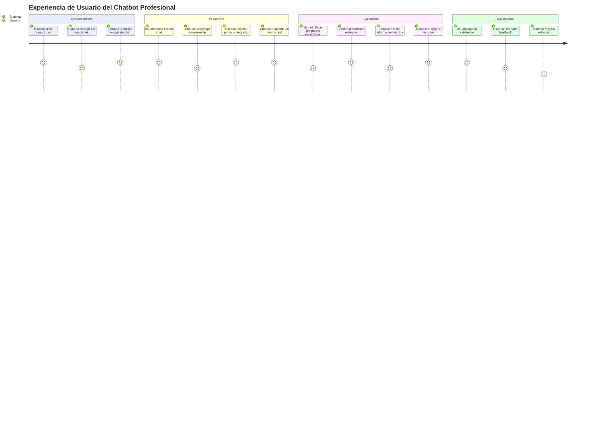

# Descripción General del Producto

## 1.1. Objetivo

El **AI Resume Agent: Your 24/7 Professional Interview** es un sistema de chatbot inteligente que actúa como representante virtual profesional 24/7. Su propósito es revolucionar la manera en que los reclutadores y potenciales clientes interactúan con el perfil profesional, proporcionando información precisa, contextualizada y en tiempo real sobre la trayectoria, habilidades y experiencia del desarrollador.

### Valor que aporta:
- **Disponibilidad 24/7:** Acceso inmediato a información profesional sin restricciones horarias
- **Interacción natural:** Comunicación en lenguaje natural en múltiples idiomas
- **Información contextualizada:** Respuestas precisas basadas en RAG (Retrieval Augmented Generation)
- **Métricas y análisis:** Insights sobre intereses y necesidades de los visitantes
- **Diferenciación competitiva:** Demostración de habilidades en IA y tecnologías emergentes

### Problema que soluciona:
- Limitaciones de tiempo para responder consultas profesionales
- Barreras de idioma en la comunicación internacional
- Falta de información detallada y contextualizada en portfolios tradicionales
- Necesidad de demostrar competencias técnicas en IA

### Público objetivo:
- **Reclutadores técnicos** que necesitan evaluar competencias específicas
- **Potenciales clientes** buscando servicios de desarrollo/consultoría
- **Colegas y profesionales** del sector interesados en networking

## 1.2. Características y funcionalidades principales

### Funcionalidades Core

#### 🤖 ChatBot IA Personalizado
- Respuestas en lenguaje natural sobre experiencia profesional
- Soporte multiidioma (español, inglés, y expandible)
- Disponibilidad 24/7 con monitoreo de estado
- Capacidad de proporcionar ejemplos específicos de proyectos
- Redirección inteligente a recursos relevantes del portfolio

#### 🔍 Sistema RAG (Retrieval Augmented Generation)
- Base de conocimiento estructurada con datos de LinkedIn, GitHub, proyectos y certificaciones
- Búsqueda semántica para respuestas precisas
- Actualización automática de información profesional
- Validación de fuentes para garantizar precisión

#### 📊 Sistema de Analíticas y Métricas
- **Preguntas más frecuentes:** Identificación de temas de mayor interés
- **Satisfacción del usuario:** Medición de calidad de respuestas
- **Áreas de mayor interés:** Análisis de secciones más consultadas
- **Stack tecnológico consultado:** Tecnologías más relevantes para visitantes
- **Industrias de interés:** Rubros y sectores que generan mayor engagement

#### 🔗 Integración con Portfolio
- Widget no intrusivo integrado en el portfolio existente en [almapi.dev](https://almapi.dev/)
- **Primera entrega:** Prototipo funcional mediante Streamlit para cumplir con el hito
- **Objetivo secundario:** Integración directa en almapi.dev si queda tiempo disponible
- Diseño consistente con la identidad visual
- Acceso desde cualquier sección del sitio
- Experiencia fluida sin recargas de página

#### 🛡️ Seguridad y Privacidad
- Cumplimiento con OWASP Top 10 for LLM
- Protección de datos personales
- Autenticación y autorización robusta
- Monitoreo de seguridad en tiempo real

#### 🛡️ Ciberseguridad Avanzada
- **Cloud Armor:** Protección DDoS y WAF rules automáticas
- **Threat Detection:** Detección en tiempo real de ataques y amenazas
- **Prompt Injection Protection:** Protección contra inyección de prompts maliciosos
- **Rate Limiting:** Protección contra abuso de API y ataques de fuerza bruta
- **Security Command Center:** Monitoreo centralizado de amenazas de seguridad

#### 💰 Control de Costos y Optimización
- **Budget Management:** Presupuesto mensual configurable con alertas automáticas
- **Resource Quotas:** Límites estrictos por servicio para evitar gastos excesivos
- **Emergency Mode:** Activación automática de modo de emergencia al exceder presupuesto
- **Cost Monitoring:** Dashboard en tiempo real de gastos y métricas de costos
- **Auto-scaling Limits:** Control inteligente del escalado automático

## 1.3. Diseño y experiencia de usuario

### Flujo de Usuario Principal

### Características de UX/UI
- **Diseño minimalista:** Interfaz limpia que no distrae del contenido principal
- **Responsive:** Adaptación perfecta a dispositivos móviles y desktop
- **Accesibilidad:** Cumplimiento con estándares WCAG 2.1
- **Velocidad:** Respuestas en menos de 2 segundos
- **Personalización:** Adaptación al contexto de la conversación

## 1.4. Instrucciones de instalación

### Prerrequisitos
- Node.js 18+ (para el frontend ya desplegado en almapi.dev)
- Python 3.11+ (para el backend - nuevo repositorio)
- Google Cloud Platform account 