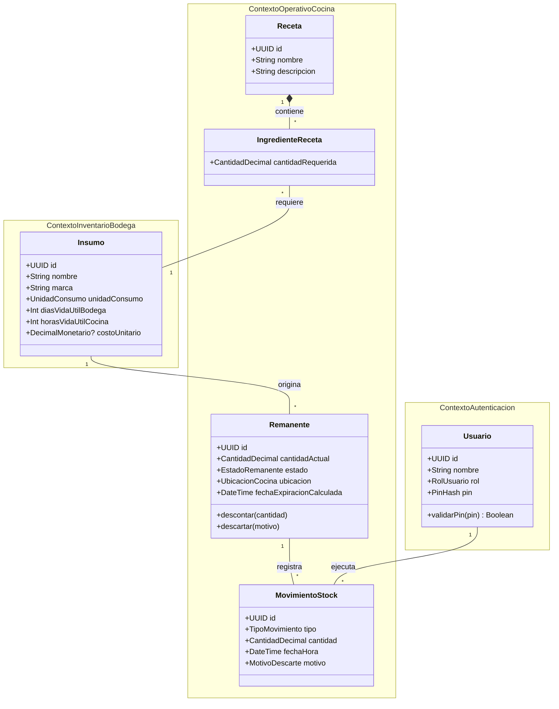
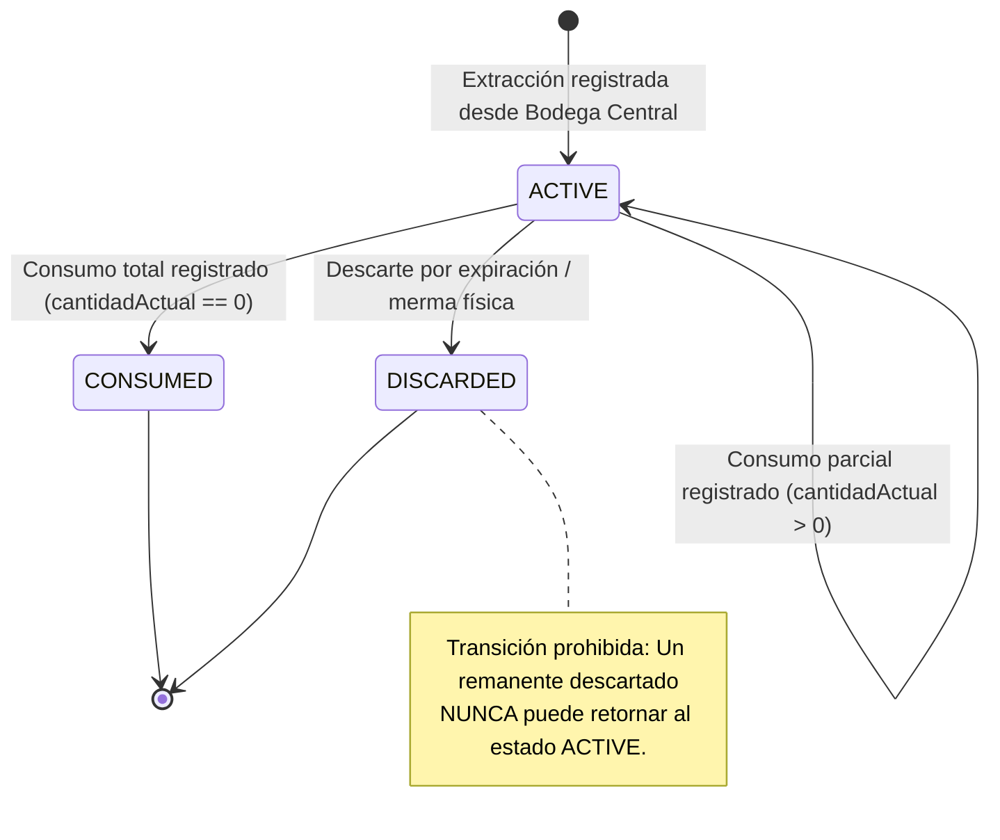

# 🧠 Modelo Conceptual de Dominio Agnóstico (RestoStock)

> **Navegación del Framework SDD:**  
> [⬅️ Volver al PRD (02_prd.md)](../01_product_definition/02_prd.md) | [📖 Glosario & Reglas](../01_product_definition/01_glosario_y_reglas_negocio.md) | [Siguiente: Diseño Técnico (04_technical_design.md) ➡️](./04_technical_design.md)

---

## 🧭 1. Contextos Delimitados (Bounded Contexts) & Agregados

---

## 🔄 2. Ciclo de Vida y Transiciones de Estado del Remanente

---

## 💎 3. Value Objects (Objetos de Valor Inmutables)

1. **`CantidadDecimal`:** Representa un volumen, masa o cantidad física no negativa con escala explícita de **4 decimales** (ej. `"1.5000"`). Garantiza que las operaciones aritméticas de suma y resta no generen saldos en negativo ni errores flotantes.
2. **`PinOperario`:** Credencial de autenticación rápida en cocina de exactamente 4 dígitos numéricos.
3. **`RangoExpiracion`:** Modela la regla FEFO (First Expired, First Out) calculando la fecha límite entre el vencimiento industrial de bodega y el límite TRR de 24 horas de la cocina.

---

## ⚡ 4. Eventos de Dominio (Domain Events)

- **`RemanenteCreadoEvent`:** Emitido cuando un insumo cerrado se abre y pasa a cocina como remanente activo.
- **`StockDescontadoEvent`:** Emitido al registrar un consumo parcial o total por preparación o receta.
- **`RemanenteDescartadoEvent`:** Emitido cuando un remanente es dado de baja por expiración o merma física.
- **`ConciliacionTurnoCompletadaEvent`:** Emitido al cerrar el turno y auto-descartar remanentes vencidos.

---

## 🛡️ 5. Invariantes de Dominio Innegociables

- **Invariante 1 (No Saldos Negativos):** La `cantidadActual` de un `Remanente` nunca puede decrecer por debajo de `0.0000`.
- **Invariante 2 (Caducidad Acelerada TRR):** Todo `Remanente` abierto en cocina hereda como límite máximo de vida útil el valor menor entre su vencimiento original y 24 horas.
- **Invariante 3 (Trazabilidad e Inmutabilidad de Movimientos):** Un `MovimientoStock` registrado es inmutable.
