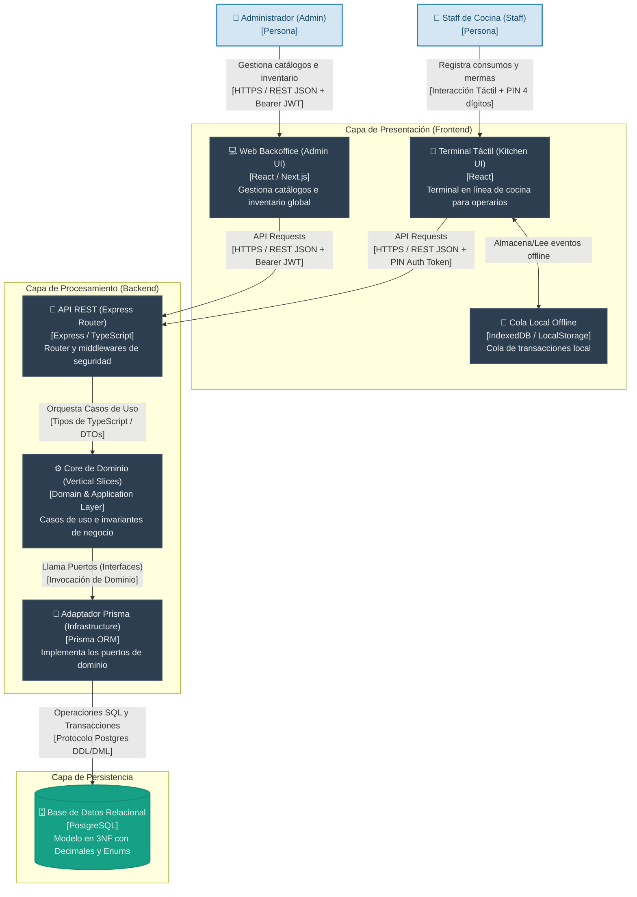

```mermaid
graph TB
    %% Users/Personas
    Admin["👤 Administrador (Admin)<br/>[Persona]"]
    Staff["👤 Staff de Cocina (Staff)<br/>[Persona]"]

    %% presentation layer
    subgraph Presentation ["Capa de Presentación (Frontend)"]
        WebBO["💻 Web Backoffice (Admin UI)<br/>[React / Next.js]<br/>Gestiona catálogos e inventario global"]
        TabletUI["📱 Terminal Táctil (Kitchen UI)<br/>[React]<br/>Terminal en línea de cocina para operarios"]
        OfflineQueue["💾 Cola Local Offline<br/>[IndexedDB / LocalStorage]<br/>Cola de transacciones local"]
    end

    %% processing layer
    subgraph Processing ["Capa de Procesamiento (Backend)"]
        API["🔌 API REST (Express Router)<br/>[Express / TypeScript]<br/>Router y middlewares de seguridad"]
        Core["⚙️ Core de Dominio (Vertical Slices)<br/>[Domain & Application Layer]<br/>Casos de uso e invariantes de negocio"]
        Prisma["💾 Adaptador Prisma (Infrastructure)<br/>[Prisma ORM]<br/>Implementa los puertos de dominio"]
    end

    %% persistence layer
    subgraph Persistence ["Capa de Persistencia"]
        DB[("🗄️ Base de Datos Relacional<br/>[PostgreSQL]<br/>Modelo en 3NF con Decimales y Enums")]
    end

    %% Flows
    Admin -->|"Gestiona catálogos e inventario<br/>[HTTPS / REST JSON + Bearer JWT]"| WebBO
    Staff -->|"Registra consumos y mermas<br/>[Interacción Táctil + PIN 4 dígitos]"| TabletUI

    TabletUI <-->|Almacena/Lee eventos offline| OfflineQueue

    WebBO -->|"API Requests<br/>[HTTPS / REST JSON + Bearer JWT]"| API
    TabletUI -->|"API Requests<br/>[HTTPS / REST JSON + PIN Auth Token]"| API

    API -->|"Orquesta Casos de Uso<br/>[Tipos de TypeScript / DTOs]"| Core
    Core -->|"Llama Puertos (Interfaces)<br/>[Invocación de Dominio]"| Prisma
    Prisma -->|"Operaciones SQL y Transacciones<br/>[Protocolo Postgres DDL/DML]"| DB

    %% Styles
    classDef persona fill:#D4E6F1,stroke:#2980B9,stroke-width:2px,color:#1B4F72;
    classDef container fill:#2C3E50,stroke:#34495E,stroke-width:2px,color:#ECF0F1;
    classDef db fill:#16A085,stroke:#138D75,stroke-width:2px,color:#E8F8F5;

    class Admin,Staff persona;
    class WebBO,TabletUI,OfflineQueue,API,Core,Prisma container;
    class DB db;
```
