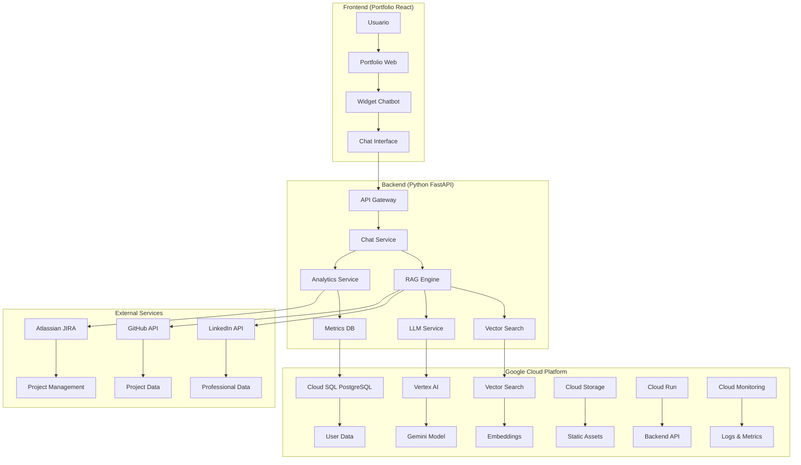
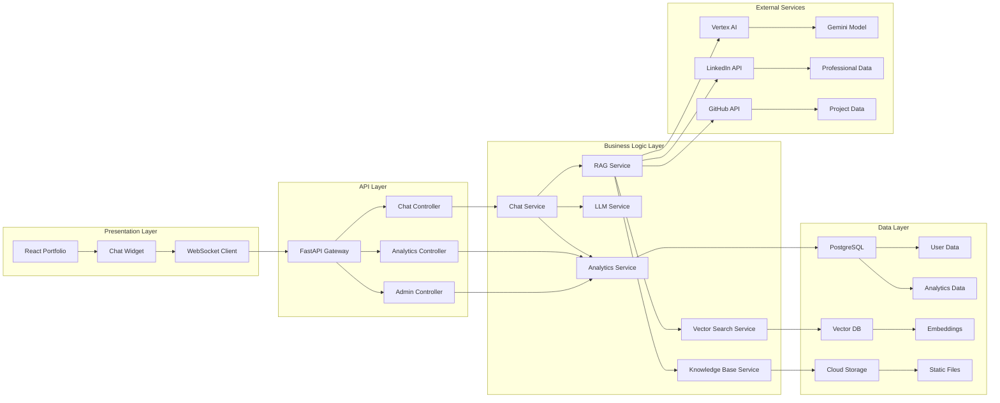
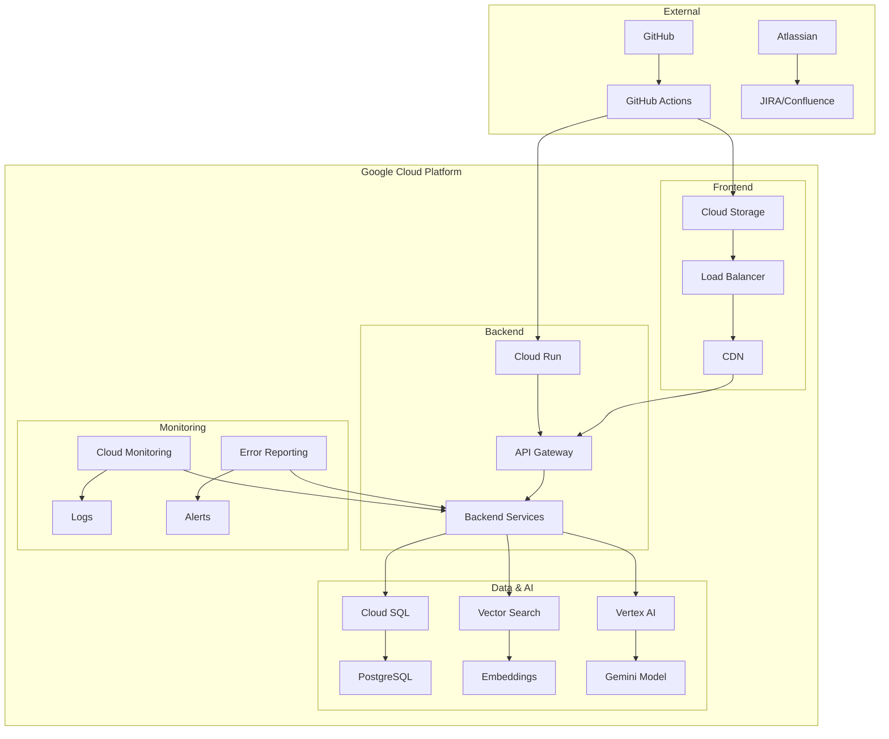
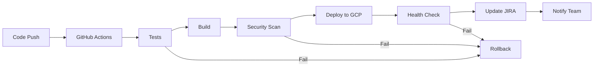
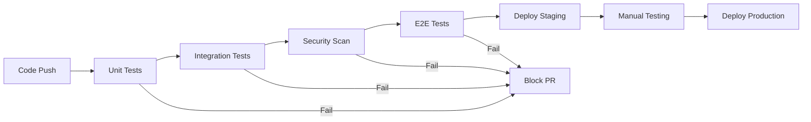

# Arquitectura del Sistema

## 2.1. Diagrama de arquitectura

### Arquitectura General del Sistema



### Arquitectura de Componentes



## 2.2. Descripción de componentes principales

### Frontend Components

#### Portfolio React (Existente)
- **Tecnología:** React 18 con TypeScript
- **Propósito:** Portfolio web principal con integración del chatbot
- **Responsabilidades:** Presentación del contenido profesional, navegación, integración del widget de chat

#### Chat Widget
- **Tecnología:** React Component con WebSocket
- **Propósito:** Interfaz de usuario para el chatbot
- **Responsabilidades:** 
  - Renderizado de la interfaz de chat
  - Gestión de WebSocket para comunicación en tiempo real
  - Manejo de estados de carga y errores
  - Integración con el portfolio existente

### Backend Components

#### FastAPI Gateway
- **Tecnología:** Python FastAPI
- **Propósito:** API REST principal del sistema
- **Responsabilidades:**
  - Enrutamiento de requests
  - Autenticación y autorización
  - Rate limiting
  - Logging y monitoreo
  - Documentación automática (Swagger/OpenAPI)

#### Chat Service
- **Tecnología:** Python con async/await
- **Propósito:** Orquestación de la lógica del chatbot
- **Responsabilidades:**
  - Procesamiento de mensajes del usuario
  - Coordinación entre RAG y LLM
  - Gestión de contexto de conversación
  - Validación de inputs

#### RAG Engine
- **Tecnología:** Python con Vertex AI
- **Propósito:** Sistema de Retrieval Augmented Generation
- **Responsabilidades:**
  - Búsqueda semántica en la base de conocimiento
  - Generación de embeddings
  - Recuperación de contexto relevante
  - Ranking de resultados

#### LLM Service
- **Tecnología:** Google Vertex AI con Gemini
- **Propósito:** Generación de respuestas en lenguaje natural
- **Responsabilidades:**
  - Procesamiento de prompts
  - Generación de respuestas contextualizadas
  - Manejo de múltiples idiomas
  - Control de calidad de respuestas

#### Analytics Service
- **Tecnología:** Python con pandas/numpy
- **Propósito:** Análisis y métricas del sistema
- **Responsabilidades:**
  - Recopilación de datos de interacción
  - Análisis de preguntas frecuentes
  - Medición de satisfacción del usuario
  - Generación de reportes

### Data Layer Components

#### PostgreSQL Database
- **Tecnología:** Google Cloud SQL
- **Propósito:** Base de datos relacional principal
- **Responsabilidades:**
  - Almacenamiento de datos de usuario
  - Métricas y analytics
  - Configuración del sistema
  - Logs de auditoría

#### Vector Database
- **Tecnología:** Google Cloud Vector Search
- **Propósito:** Almacenamiento de embeddings para búsqueda semántica
- **Responsabilidades:**
  - Indexación de documentos
  - Búsqueda por similitud
  - Actualización de embeddings
  - Optimización de consultas

### External Services

#### Google Vertex AI
- **Propósito:** Plataforma de IA/ML de Google
- **Responsabilidades:**
  - Hosting del modelo Gemini
  - Generación de embeddings
  - Fine-tuning de modelos
  - Monitoreo de rendimiento

#### Atlassian Suite (JIRA + Confluence)
- **Propósito:** Gestión de proyecto y documentación
- **Responsabilidades:**
  - Tracking de tickets y tareas
  - Documentación técnica
  - Gestión de sprints
  - Reportes de progreso

## 2.3. Descripción de alto nivel del proyecto y estructura de ficheros

### Estructura del Repositorio

```
my-resume-react/
├── frontend/                    # Portfolio React existente
│   ├── src/
│   │   ├── components/
│   │   │   ├── ChatWidget/      # Nuevo componente de chat
│   │   │   └── ...              # Componentes existentes
│   │   ├── services/
│   │   │   ├── chatService.js   # Servicio de comunicación con backend
│   │   │   └── ...              # Servicios existentes
│   │   └── ...
│   ├── public/
│   └── package.json
├── backend/                     # Nuevo desarrollo
│   ├── app/
│   │   ├── api/
│   │   │   ├── chat.py          # Endpoints de chat
│   │   │   ├── analytics.py     # Endpoints de analytics
│   │   │   └── admin.py         # Endpoints administrativos
│   │   ├── services/
│   │   │   ├── chat_service.py  # Lógica de chat
│   │   │   ├── rag_service.py   # Servicio RAG
│   │   │   ├── llm_service.py   # Servicio LLM
│   │   │   └── analytics_service.py
│   │   ├── models/
│   │   │   ├── chat.py          # Modelos de datos
│   │   │   └── analytics.py
│   │   ├── database/
│   │   │   ├── connection.py    # Configuración de BD
│   │   │   └── migrations/      # Migraciones
│   │   └── utils/
│   │       ├── security.py      # Utilidades de seguridad
│   │       └── logging.py       # Configuración de logs
│   ├── tests/
│   │   ├── unit/
│   │   ├── integration/
│   │   └── e2e/
│   ├── requirements.txt
│   └── main.py
├── infrastructure/              # Configuración de infraestructura
│   ├── terraform/               # Terraform para GCP
│   ├── docker/                  # Dockerfiles
│   └── github-actions/          # CI/CD
├── docs/                        # Documentación
│   ├── api/                     # Especificación de API
│   ├── architecture/            # Diagramas de arquitectura
│   └── deployment/              # Guías de despliegue
└── scripts/                     # Scripts de utilidad
    ├── setup.sh                 # Script de configuración
    └── deploy.sh                # Script de despliegue
```

### Patrones Arquitectónicos

#### Clean Architecture
- **Separación de responsabilidades:** Cada capa tiene responsabilidades específicas
- **Independencia de frameworks:** La lógica de negocio es independiente de la tecnología
- **Testabilidad:** Cada componente puede ser testeado de forma aislada
- **Mantenibilidad:** Cambios en una capa no afectan otras

#### Microservices Pattern
- **Servicios independientes:** Chat, Analytics, RAG como servicios separados
- **Comunicación asíncrona:** WebSockets para comunicación en tiempo real
- **Escalabilidad:** Cada servicio puede escalar independientemente
- **Resiliencia:** Fallos en un servicio no afectan otros

#### Event-Driven Architecture
- **Eventos de usuario:** Cada interacción genera eventos
- **Procesamiento asíncrono:** Analytics y métricas se procesan de forma asíncrona
- **Desacoplamiento:** Componentes se comunican a través de eventos
- **Trazabilidad:** Todos los eventos se registran para auditoría

## 2.4. Infraestructura y despliegue

### Diagrama de Despliegue



### Flujo de CI/CD



### Configuración de Infraestructura

#### Google Cloud Platform
- **Region:** us-central1 (Iowa)
- **Project:** chatbot-portfolio-{environment}
- **Billing:** Budget alerts configurados

#### Servicios Utilizados
- **Cloud Run:** Backend API (serverless)
- **Cloud Storage:** Frontend estático + CDN
- **Cloud SQL:** Base de datos PostgreSQL
- **Vector Search:** Base de datos vectorial
- **Vertex AI:** Modelos de IA
- **Cloud Monitoring:** Monitoreo y alertas
- **Cloud Logging:** Logs centralizados
- **Cloud IAM:** Gestión de identidades

#### Configuración de Seguridad
- **VPC:** Red privada para recursos sensibles
- **Firewall:** Reglas restrictivas
- **IAM:** Principio de menor privilegio
- **Encryption:** Datos en reposo y tránsito
- **Secrets Manager:** Gestión segura de secretos

## 2.5. Seguridad

### OWASP Top 10 for LLM Compliance

#### LLM-01: Prompt Injection
- **Mitigación:** Validación estricta de inputs
- **Implementación:** Sanitización de prompts, listas blancas de comandos
- **Monitoreo:** Detección de patrones sospechosos

#### LLM-02: Insecure Output Handling
- **Mitigación:** Validación de respuestas del LLM
- **Implementación:** Filtros de contenido, escape de HTML/JS
- **Monitoreo:** Análisis de respuestas generadas

#### LLM-03: Training Data Poisoning
- **Mitigación:** Validación de fuentes de datos
- **Implementación:** Verificación de integridad de datos
- **Monitoreo:** Detección de anomalías en datos

#### LLM-04: Model Denial of Service
- **Mitigación:** Rate limiting y quotas
- **Implementación:** Límites por usuario/IP
- **Monitoreo:** Métricas de uso y costos

#### LLM-05: Supply Chain Vulnerabilities
- **Mitigación:** Verificación de dependencias
- **Implementación:** Escaneo de vulnerabilidades
- **Monitoreo:** Actualizaciones de seguridad

### Medidas de Seguridad Implementadas

#### Autenticación y Autorización
- **JWT Tokens:** Para autenticación de API
- **OAuth 2.0:** Para integración con servicios externos
- **Role-Based Access Control:** Diferentes niveles de acceso

#### Protección de Datos
- **Encryption at Rest:** Todos los datos cifrados
- **Encryption in Transit:** TLS 1.3 obligatorio
- **Data Masking:** Información sensible ofuscada
- **Audit Logging:** Registro de todas las acciones

#### Seguridad de la Aplicación
- **Input Validation:** Validación estricta de todos los inputs
- **SQL Injection Prevention:** Uso de ORM con parámetros
- **XSS Prevention:** Escape de contenido dinámico
- **CSRF Protection:** Tokens CSRF en formularios

## 2.6. Tests

### Estrategia de Testing

#### Pirámide de Testing
```
    /\
   /  \     E2E Tests (2%)
  /____\    Integration Tests (18%)
 /______\   Unit Tests (80%)
```

#### Tipos de Tests

##### Unit Tests (80%)
- **Cobertura:** >90% de líneas de código
- **Frameworks:** pytest para Python, Jest para JavaScript
- **Foco:** Lógica de negocio, servicios individuales
- **Ejecución:** En cada commit, <30 segundos

##### Integration Tests (18%)
- **Cobertura:** APIs, base de datos, servicios externos
- **Frameworks:** pytest-asyncio, TestContainers
- **Foco:** Comunicación entre componentes
- **Ejecución:** En cada PR, <5 minutos

##### E2E Tests (2%)
- **Cobertura:** Flujos completos de usuario
- **Frameworks:** Playwright, Cypress
- **Foco:** Experiencia de usuario completa
- **Ejecución:** En cada release, <15 minutos

### Tests Específicos del Sistema

#### Tests de Chatbot
- **Respuestas del LLM:** Validación de calidad y relevancia
- **RAG System:** Precisión de búsqueda semántica
- **Multiidioma:** Traducción y contexto cultural
- **Performance:** Latencia de respuestas

#### Tests de Analytics
- **Recopilación de datos:** Precisión de métricas
- **Procesamiento:** Análisis estadístico correcto
- **Reportes:** Generación de insights válidos

#### Tests de Seguridad
- **Penetration Testing:** Vulnerabilidades conocidas
- **OWASP Compliance:** Verificación de mitigaciones
- **Data Protection:** Cumplimiento de privacidad

### Automatización de Tests

#### CI/CD Pipeline


#### Herramientas de Testing
- **Python:** pytest, pytest-asyncio, pytest-cov
- **JavaScript:** Jest, React Testing Library
- **Security:** OWASP ZAP, Bandit
- **Performance:** Locust, Artillery
- **Monitoring:** Test observability con OpenTelemetry 