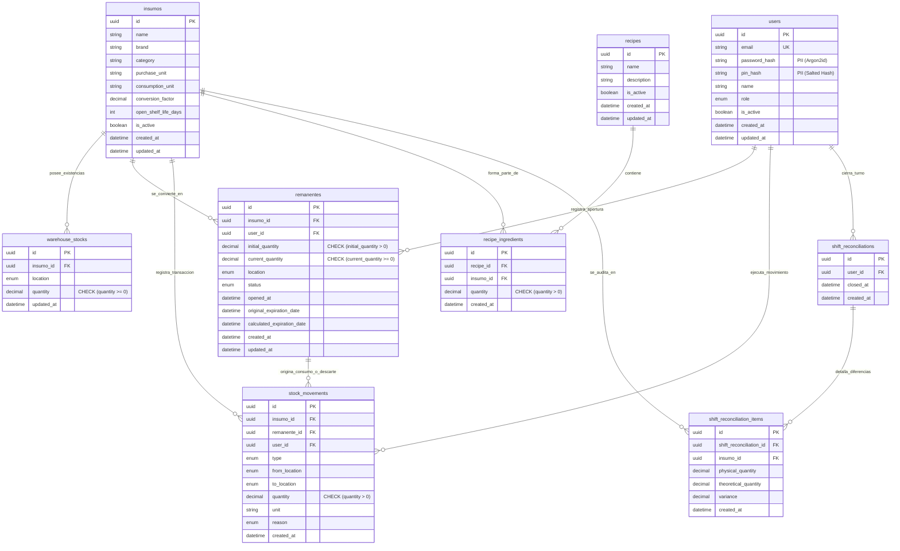

# 🗄️ Especificación del Modelo de Datos y Esquema de Persistencia

> **Navegación del Framework SDD:**  
> [⬅️ Volver a Arquitectura de Sistema (04_technical_design.md)](../02_architecture_design/04_technical_design.md) | [📖 Glosario & Reglas](../01_product_definition/01_glosario_y_reglas_negocio.md) | [Siguiente: Especificación API REST (07_api_specification.md) ➡️](./07_api_specification.md)

---

## 📐 1. Diagrama Entidad-Relación Lógico (Mermaid 3NF ERD)



---

## 📚 2. Diccionario Físico de Entidades & Gobernanza PII

| Tabla | Campo | Tipo Físico | Restricción / Index | Sensibilidad PII / Cifrado | Descripción |
| :--- | :--- | :--- | :--- | :--- | :--- |
| `users` | `id` | `UUID` | `PRIMARY KEY` | Ninguna | Identificador único del usuario |
| `users` | `email` | `VARCHAR(255)` | `UNIQUE` | PII (Dato Personal) | Correo de acceso administrativo |
| `users` | `password_hash` | `VARCHAR(255)` | `NULLABLE` | Alta (`Argon2id Hash`) | Contraseña cifrada con sal |
| `users` | `pin_hash` | `VARCHAR(255)` | `NULLABLE` | Alta (`Salted PIN Hash`) | PIN de 4 dígitos para cocina táctil |
| `insumos` | `conversion_factor` | `DECIMAL(10,2)` | `NOT NULL` | Ninguna | Factor de conversión entre unidad de compra y consumo |
| `warehouse_stocks` | `quantity` | `DECIMAL(12,4)` | `CHECK (quantity >= 0)` | Ninguna | Cantidad física en depósito principal |
| `remanentes` | `current_quantity` | `DECIMAL(12,4)` | `CHECK (current_quantity >= 0)` | Ninguna | Cantidad remanente utilizable en cocina |
| `remanentes` | `calculated_expiration_date` | `TIMESTAMP` | `INDEX (status, exp_date)` | Ninguna | Fecha FEFO calculada según TRR |

---

## 🌱 3. Datos Semilla Iniciales (Seed Data Fixtures)

Al inicializar el sistema (*cold-start*), la base de datos se poblará obligatoriamente con los siguientes registros maestros:

```sql
-- Usuario Administrador por Defecto
INSERT INTO users (id, email, password_hash, pin_hash, name, role, is_active, created_at, updated_at)
VALUES (
    'c596e191-230d-45db-99ff-411a2f6412b1',
    'admin@restostock.com',
    '$argon2id$v=19$m=65536,t=3,p=4$c2FsdF9kZW1v$hash_admin',
    '$argon2id$v=19$m=65536,t=3,p=4$c2FsdF9kZW1v$hash_pin_1234',
    'Administrador Central',
    'ADMIN',
    true,
    NOW(),
    NOW()
);

-- Insumos Maestros de Prueba (Categorías Lácteos y Salsas)
INSERT INTO insumos (id, name, brand, category, purchase_unit, consumption_unit, conversion_factor, open_shelf_life_days, is_active, created_at, updated_at)
VALUES 
(
    'e2298c5d-6c17-4886-9a2d-4f1b80e8efea',
    'Queso Mozzarella',
    'La Serenísima',
    'Lácteos',
    'Horma',
    'KG',
    4.00,
    3,
    true,
    NOW(),
    NOW()
),
(
    'd9b01518-9276-46c5-84a1-db9b01518f88',
    'Salsa de Tomate',
    'Pomarola',
    'Salsas',
    'Bidón 5L',
    'L',
    5.00,
    2,
    true,
    NOW(),
    NOW()
);
```

---

## 📄 4. Código del Esquema (`schema.prisma`)

```prisma
datasource db {
  provider = "postgresql"
  url      = env("DATABASE_URL")
}

generator client {
  provider = "prisma-client-js"
}

// ==========================================
// 1. DICCIONARIO DE ENUMS (Dominios Cerrados)
// ==========================================

enum Role {
  ADMIN
  OPERATOR
}

enum MovementType {
  EXTRACTION  // Salida de depósito cerrado a cocina
  CONSUMPTION // Registro de consumo parcial de remanente
  TRANSFER    // Traslado entre sububicaciones o terminales
  DISCARD     // Descarte o merma física
}

enum DiscardReason {
  EXPIRATION
  DAMAGE_OR_DROP
  CONTAMINATION
  SPOILAGE
}

enum LocationType {
  MAIN_WAREHOUSE    // Depósito central / Bodega principal
  KITCHEN_FRIDGE    // Heladera de cocina
  KITCHEN_FREEZER   // Congelador de cocina
  KITCHEN_PANTRY    // Alacena de secos
  KITCHEN_PREP      // Línea de despacho / Preparación
}

enum RemanenteStatus {
  ACTIVE      // Disponible para su uso en cocina
  CONSUMED    // Agotado al 100%
  DISCARDED   // Retirado por merma/vencimiento
}

// ==========================================
// 2. MODELOS / ENTIDADES (3NF)
// ==========================================

model User {
  id           String   @id @default(uuid()) @db.Uuid
  email        String?  @unique @db.VarChar(255)
  passwordHash String?  @map("password_hash") @db.VarChar(255)
  pinHash      String?  @map("pin_hash") @db.VarChar(255)
  name         String   @db.VarChar(100)
  photoUrl     String?  @map("photo_url") @db.VarChar(500)
  role         Role     @default(OPERATOR)
  isActive     Boolean  @default(true) @map("is_active")
  createdAt    DateTime @default(now()) @map("created_at")
  updatedAt    DateTime @updatedAt @map("updated_at")

  // Relaciones
  remanentes           Remanente[]
  stockMovements       StockMovement[]
  shiftReconciliations ShiftReconciliation[]

  @@map("users")
}

model Insumo {
  id                String   @id @default(uuid()) @db.Uuid
  name              String   @db.VarChar(100)
  brand             String?  @db.VarChar(100)
  category          String   @db.VarChar(50)
  purchaseUnit      String   @map("purchase_unit") @db.VarChar(20)
  consumptionUnit   String   @map("consumption_unit") @db.VarChar(20)
  conversionFactor  Decimal  @map("conversion_factor") @db.Decimal(10, 2)
  openShelfLifeDays Int?     @map("open_shelf_life_days")
  isActive          Boolean  @default(true) @map("is_active")
  createdAt         DateTime @default(now()) @map("created_at")
  updatedAt         DateTime @updatedAt @map("updated_at")

  // Relaciones
  warehouseStocks          WarehouseStock[]
  remanentes               Remanente[]
  stockMovements           StockMovement[]
  recipeIngredients        RecipeIngredient[]
  shiftReconciliationItems ShiftReconciliationItem[]

  @@map("insumos")
}

model Permission {
  id          String           @id @default(uuid())
  code        String           @unique
  name        String
  module      String
  description String?
  roles       RolePermission[]
}

model RolePermission {
  roleId       String
  permissionId String
  role         Role       @relation(fields: [roleId], references: [id], onDelete: Cascade)
  permission   Permission @relation(fields: [permissionId], references: [id], onDelete: Cascade)

  @@id([roleId, permissionId])
}

model StorageLocation {
  id          String       @id @default(uuid())
  name        String       @unique
  type        LocationType @default(KITCHEN)
  description String?
  isActive    Boolean      @default(true)
  createdAt   DateTime     @default(now())
  updatedAt   DateTime     @updatedAt
}

model SystemSettings {
  id                       String   @id @default("default")
  restaurantName           String   @default("RestoStock Kitchen")
  taxId                    String?
  currencySymbol           String   @default("$")
  criticalAlertHours       Int      @default(24)
  defaultRemanenteHours    Int      @default(24)
  varianceTolerancePercent Decimal  @default(5.0) @db.Decimal(5, 2)
  updatedAt                DateTime @updatedAt
}

model WarehouseStock {
  id        String       @id @default(uuid()) @db.Uuid
  insumoId  String       @map("insumo_id") @db.Uuid
  location  LocationType
  quantity  Decimal      @db.Decimal(12, 4)
  updatedAt DateTime     @updatedAt @map("updated_at")

  // Relaciones e Integridad Referencial
  insumo Insumo @relation(fields: [insumoId], references: [id], onDelete: Cascade, onUpdate: Cascade)

  // Restricciones e Índices
  @@unique([insumoId, location], name: "idx_unique_insumo_location")
  @@index([location])
  @@map("warehouse_stocks")
}

model Remanente {
  id                       String          @id @default(uuid()) @db.Uuid
  insumoId                 String          @map("insumo_id") @db.Uuid
  userId                   String          @map("user_id") @db.Uuid
  initialQuantity          Decimal         @map("initial_quantity") @db.Decimal(12, 4)
  currentQuantity          Decimal         @map("current_quantity") @db.Decimal(12, 4)
  location                 LocationType
  sublocation              String?         @db.VarChar(100)
  status                   RemanenteStatus @default(ACTIVE)
  openedAt                 DateTime        @default(now()) @map("opened_at")
  originalExpirationDate   DateTime        @map("original_expiration_date")
  calculatedExpirationDate DateTime        @map("calculated_expiration_date")
  createdAt                DateTime        @default(now()) @map("created_at")
  updatedAt                DateTime        @updatedAt @map("updated_at")

  // Relaciones
  insumo Insumo @relation(fields: [insumoId], references: [id], onDelete: Cascade, onUpdate: Cascade)
  user   User   @relation(fields: [userId], references: [id], onDelete: Restrict, onUpdate: Cascade)

  stockMovements StockMovement[]

  // Índices
  @@index([status, calculatedExpirationDate])
  @@index([insumoId])
  @@index([userId])
  @@map("remanentes")
}

model StockMovement {
  id           String         @id @default(uuid()) @db.Uuid
  insumoId     String         @map("insumo_id") @db.Uuid
  remanenteId  String?        @map("remanente_id") @db.Uuid
  userId       String         @map("user_id") @db.Uuid
  type         MovementType
  fromLocation LocationType   @map("from_location")
  toLocation   LocationType   @map("to_location")
  quantity     Decimal        @db.Decimal(12, 4)
  unit         String         @db.VarChar(20)
  reason       DiscardReason?
  createdAt    DateTime       @default(now()) @map("created_at")

  // Relaciones
  insumo    Insumo     @relation(fields: [insumoId], references: [id], onDelete: Cascade, onUpdate: Cascade)
  remanente Remanente? @relation(fields: [remanenteId], references: [id], onDelete: SetNull, onUpdate: Cascade)
  user      User       @relation(fields: [userId], references: [id], onDelete: Restrict, onUpdate: Cascade)

  // Índices
  @@index([createdAt, insumoId])
  @@index([userId])
  @@index([remanenteId])
  @@map("stock_movements")
}

model Recipe {
  id          String             @id @default(uuid()) @db.Uuid
  name        String             @db.VarChar(100)
  description String?            @db.VarChar(500)
  isActive    Boolean            @default(true) @map("is_active")
  createdAt   DateTime           @default(now()) @map("created_at")
  updatedAt   DateTime           @updatedAt @map("updated_at")
  ingredients RecipeIngredient[]

  @@map("recipes")
}

model RecipeIngredient {
  id        String   @id @default(uuid()) @db.Uuid
  recipeId  String   @map("recipe_id") @db.Uuid
  insumoId  String   @map("insumo_id") @db.Uuid
  quantity  Decimal  @db.Decimal(12, 4)
  createdAt DateTime @default(now()) @map("created_at")

  // Relaciones
  recipe Recipe @relation(fields: [recipeId], references: [id], onDelete: Cascade, onUpdate: Cascade)
  insumo Insumo @relation(fields: [insumoId], references: [id], onDelete: Cascade, onUpdate: Cascade)

  // Restricciones
  @@unique([recipeId, insumoId], name: "idx_unique_recipe_insumo")
  @@index([insumoId])
  @@map("recipe_ingredients")
}

model ShiftReconciliation {
  id        String                    @id @default(uuid()) @db.Uuid
  userId    String                    @map("user_id") @db.Uuid
  closedAt  DateTime                  @default(now()) @map("closed_at")
  createdAt DateTime                  @default(now()) @map("created_at")
  user      User                      @relation(fields: [userId], references: [id], onDelete: Restrict, onUpdate: Cascade)
  items     ShiftReconciliationItem[]

  @@index([userId])
  @@map("shift_reconciliations")
}

model ShiftReconciliationItem {
  id                    String   @id @default(uuid()) @db.Uuid
  shiftReconciliationId String   @map("shift_reconciliation_id") @db.Uuid
  insumoId              String   @map("insumo_id") @db.Uuid
  physicalQuantity      Decimal  @map("physical_quantity") @db.Decimal(12, 4)
  theoreticalQuantity   Decimal  @map("theoretical_quantity") @db.Decimal(12, 4)
  variance              Decimal  @db.Decimal(12, 4)
  createdAt             DateTime @default(now()) @map("created_at")

  // Relaciones
  shiftReconciliation ShiftReconciliation @relation(fields: [shiftReconciliationId], references: [id], onDelete: Cascade, onUpdate: Cascade)
  insumo              Insumo              @relation(fields: [insumoId], references: [id], onDelete: Restrict, onUpdate: Cascade)

  // Restricciones
  @@unique([shiftReconciliationId, insumoId], name: "idx_unique_reconciliation_insumo")
  @@index([insumoId])
  @@map("shift_reconciliation_items")
}
```

---

## 📈 5. Estrategia y Justificación de Índices Físicos

Para garantizar el rendimiento óptimo del motor PostgreSQL ante alta concurrencia de consultas en la cocina táctil y reportes del backoffice, se implementan los siguientes índices:

1. **Índice FEFO en `remanentes (status, calculated_expiration_date)`**:
   - *Justificación:* La pantalla táctil del cocinero consulta constantemente los insumos abiertos y utilizables (`status = 'ACTIVE'`) ordenados del de vencimiento más próximo al más lejano (política FEFO). Un índice compuesto ordenado permite resolver esta consulta con un costo de búsqueda logarítmico $O(\log N)$ directo sobre el índice.

2. **Índice Único en `warehouse_stocks (insumo_id, location)`**:
   - *Justificación:* Asegura la consistencia lógica de que no existan registros de stock duplicados para el mismo insumo en una ubicación física específica.

3. **Índice Cronológico Compuesto en `stock_movements (created_at, insumo_id)`**:
   - *Justificación:* Las consultas en el panel administrativo del backoffice suelen listar transacciones de inventario filtrando por rangos de fecha y agrupando por insumo.
