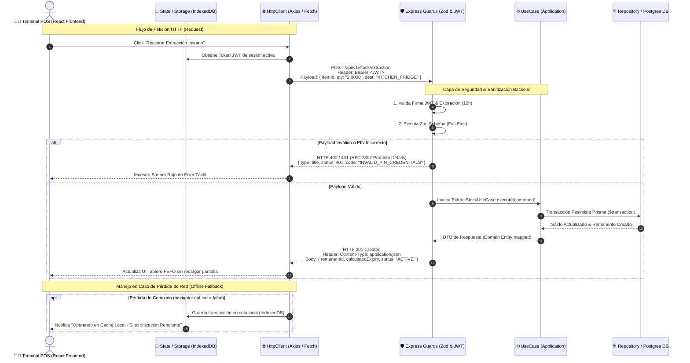

# 🔌 Especificación de API REST y Contratos de Dominio

> **Navegación del Framework SDD:**  
> [⬅️ Volver a Esquema de Base de Datos (06_database_schema.md)](./06_database_schema.md) | [📖 Glosario & Reglas](../01_product_definition/01_glosario_y_reglas_negocio.md) | [Siguiente: Estrategia de Seguridad (08_security_strategy.md) ➡️](../04_governance_and_quality/08_security_strategy.md)

---


## 📊 1. Tabla de Endpoints del MVP

| Método | Endpoint | Payload (Input) | Respuesta (Output) | Descripción |
| :--- | :--- | :--- | :--- | :--- |
| **POST** | `/api/v1/auth/pin` | `AuthPinRequest` | `AuthPinResponse` | Autenticación de operarios de cocina en la tablet mediante PIN de 4 dígitos. |
| **POST** | `/api/v1/stock/extraction` | `RecordExtractionRequest` | `RecordExtractionResponse` | Registra el traslado de insumos cerrados desde la bodega principal hacia la cocina. |
| **GET** | `/api/v1/kitchen/remanentes` | *Ninguno (Query Params)* | `GetRemanentesResponse` | Obtiene la lista de remanentes activos en cocina ordenados bajo el principio FEFO. |
| **POST** | `/api/v1/kitchen/consumption` | `RecordConsumptionRequest` | `RecordConsumptionResponse` | Registra consumos parciales de insumos abiertos (remanentes) durante el servicio. |
| **POST** | `/api/v1/kitchen/remanentes/:id/discard`| `DiscardRemanenteRequest` | `DiscardRemanenteResponse` | Registra el descarte físico total de un remanente activo por merma o expiración. |
| **POST** | `/api/catalog/recipes` 🚧 | `CreateRecipeRequest` | `CreateRecipeResponse` | *(Pendiente — ver TK-008)* Crear una nueva receta de comida con sus ingredientes y proporciones. No implementado aún; ausente de `openapi.yaml` hasta que exista un controller real. |
| **GET** | `/api/v1/kitchen/recipes` | *Ninguno* | `ListRecipesResponse` | Obtiene la lista de recetas disponibles en cocina para consumo rápido. |
| **POST** | `/api/v1/kitchen/recipes/:id/consume` | `ConsumeRecipeRequest` | `ConsumeRecipeResponse` | Descuenta stock en cocina en cascada FEFO basado en los ingredientes de la receta. |
| **POST** | `/api/v1/kitchen/shift-reconciliation` | `ShiftReconciliationRequest` | `ShiftReconciliationResponse` | Ejecuta el cierre de turno, auto-descarta vencidos y reporta auditoría de discrepancias. |

---

## 📡 1.5. Diagrama de Comunicación Frontend ↔ Backend (Data Flow Sequence)




---

## 🛠️ 2. Detalle Técnico por Endpoint (OpenAPI Spec Blueprint)

### 2.1. `POST /api/v1/auth/pin`
*   **Descripción:** Permite a un operario de cocina iniciar su turno en la tablet táctil ingresando su código PIN de 4 dígitos asociado a su identificador de usuario.
*   **Cabeceras Requeridas:**
    *   `Content-Type: application/json`
*   **Request Payload (`AuthPinRequest`):**
    ```json
    {
      "userId": "c596e191-230d-45db-99ff-411a2f6412b1",
      "pin": "1234"
    }
    ```
*   **Response Success (`200 OK` - `AuthPinResponse`):**
    ```json
    {
      "token": "eyJhbGciOiJIUzI1NiIsInR5cCI6IkpXVCJ9.eyJ1c2VySWQiOiJjNTk2ZTE5MS0yMzBkLTQ1ZGItOTlmZi00MTFhMmY2NDEyYjEiLCJyb2xlIjoiT1BFUkFUT1IifQ.signature",
      "user": {
        "id": "c596e191-230d-45db-99ff-411a2f6412b1",
        "name": "Carlos Gomez",
        "role": "OPERATOR"
      }
    }
    ```
*   **Response Error (`401 Unauthorized`):**
    *   *Causa:* El PIN ingresado no coincide con el hash almacenado o la cuenta del operario se encuentra desactivada.
    ```json
    {
      "error": "UNAUTHORIZED",
      "message": "Invalid PIN credentials or inactive user profile",
      "timestamp": "2026-07-03T16:36:12Z"
    }
    ```
*   **Response Error (`422 Unprocessable Entity`):**
    *   *Causa:* El payload de entrada no cumple con los formatos requeridos por Zod.
    ```json
    {
      "error": "VALIDATION_FAILED",
      "message": "Input validation failed",
      "details": [
        {
          "field": "pin",
          "message": "PIN must be exactly 4 digits"
        }
      ]
    }
    ```

---

### 2.2. `POST /api/v1/stock/extraction`
*   **Descripción:** Registra la salida física de un insumo desde la bodega principal. Este flujo debita el stock consolidado del depósito central y crea un nuevo remanente abierto en la cocina (en estado `ACTIVE`) con la fecha de expiración acelerada calculada (invariante de vida útil corta en bodega o el límite de 24h TRR si aplica).
*   **Cabeceras Requeridas:**
    *   `Content-Type: application/json`
    *   `Authorization: Bearer <token_jwt>` (Rol mínimo: `OPERATOR` u `ADMIN`)
*   **Request Payload (`RecordExtractionRequest`):**
    ```json
    {
      "insumoId": "e2298c5d-6c17-4886-9a2d-4f1b80e8efea",
      "quantity": "2.0000",
      "unit": "Horma",
      "toLocation": "KITCHEN_FRIDGE"
    }
    ```
*   **Response Success (`201 Created` - `RecordExtractionResponse`):**
    ```json
    {
      "message": "Stock extraction recorded successfully",
      "movementId": "8bf9f8a3-231a-4c22-b91c-22340bb95a31",
      "remanente": {
        "id": "f8a9e223-92b0-464a-93cd-9bc64e22340b",
        "insumoId": "e2298c5d-6c17-4886-9a2d-4f1b80e8efea",
        "currentQuantity": "2.0000",
        "unit": "Horma",
        "status": "ACTIVE",
        "calculatedExpirationDate": "2026-07-05T16:36:12Z"
      }
    }
    ```
*   **Response Error (`422 Unprocessable Entity`):**
    *   *Causa:* Cantidad insuficiente en la bodega principal o violación de restricciones.
    ```json
    {
      "error": "INSUFFICIENT_STOCK",
      "message": "Requested quantity (2.0000 Horma) exceeds available warehouse stock (0.5000 Horma)",
      "timestamp": "2026-07-03T16:36:12Z"
    }
    ```

---

### 2.3. `GET /api/v1/kitchen/remanentes`
*   **Descripción:** Retorna el inventario activo actualmente disponible en la cocina para su uso en preparaciones. La salida está ordenada estrictamente bajo el principio FEFO (First Expired, First Out) según `calculatedExpirationDate` de menor a mayor para evitar mermas por vencimiento.
*   **Cabeceras Requeridas:**
    *   `Authorization: Bearer <token_jwt>` (Rol mínimo: `OPERATOR` u `ADMIN`)
*   **Query Parameters:**
    *   `location` (Opcional): Filtra por ubicación específica (`KITCHEN_FRIDGE`, `KITCHEN_FREEZER`, `KITCHEN_PANTRY`, `KITCHEN_PREP`).
*   **Response Success (`200 OK` - `GetRemanentesResponse`):**
    ```json
    [
      {
        "id": "f8a9e223-92b0-464a-93cd-9bc64e22340b",
        "insumo": {
          "id": "e2298c5d-6c17-4886-9a2d-4f1b80e8efea",
          "name": "Queso Mozzarella",
          "consumptionUnit": "KG"
        },
        "currentQuantity": "1.7500",
        "location": "KITCHEN_FRIDGE",
        "sublocation": "Cámara Lácteos",
        "status": "ACTIVE",
        "calculatedExpirationDate": "2026-07-05T16:30:00Z"
      },
      {
        "id": "31b2e1a3-23ab-41c1-92b1-bb901518f88c",
        "insumo": {
          "id": "d9b01518-9276-46c5-84a1-db9b01518f88",
          "name": "Salsa de Tomate",
          "consumptionUnit": "L"
        },
        "currentQuantity": "5.0000",
        "location": "KITCHEN_PANTRY",
        "sublocation": "Estante Salsas",
        "status": "ACTIVE",
        "calculatedExpirationDate": "2026-07-08T12:00:00Z"
      }
    ]
    ```

---

### 2.4. `POST /api/v1/kitchen/consumption`
*   **Descripción:** Registra el consumo parcial (o total) de un remanente activo para la elaboración de platos en cocina. Si el consumo deja la cantidad remanente en `0.0000`, el estado del remanente cambia automáticamente a `CONSUMED`.
*   **Cabeceras Requeridas:**
    *   `Content-Type: application/json`
    *   `Authorization: Bearer <token_jwt>` (Rol mínimo: `OPERATOR`)
*   **Request Payload (`RecordConsumptionRequest`):**
    ```json
    {
      "remanenteId": "f8a9e223-92b0-464a-93cd-9bc64e22340b",
      "quantityConsumed": "0.2500"
    }
    ```
*   **Response Success (`200 OK` - `RecordConsumptionResponse`):**
    ```json
    {
      "message": "Consumption recorded successfully",
      "remanenteId": "f8a9e223-92b0-464a-93cd-9bc64e22340b",
      "remainingQuantity": "1.5000",
      "status": "ACTIVE"
    }
    ```
*   **Response Error (`422 Unprocessable Entity`):**
    *   *Causa 1:* Intento de consumir de un remanente ya agotado (`CONSUMED`) o descartado (`DISCARDED`).
    *   *Causa 2:* La cantidad a consumir supera las existencias físicas actuales del remanente.
    ```json
    {
      "error": "INVALID_CONSUMPTION",
      "message": "Requested consumption quantity (2.0000) exceeds current remanente stock (1.7500)",
      "timestamp": "2026-07-03T16:36:12Z"
    }
    ```

---

### 2.5. `POST /api/v1/kitchen/remanentes/:id/discard`
*   **Descripción:** Registra la merma física (descarte) total del remanente especificado en el parámetro de la URL. Al realizar esta acción, el remanente cambia su estado a `DISCARDED` y sus existencias se ajustan a `0.0000`, guardando un registro de auditoría en la tabla de movimientos indicando la causa del desperdicio.
*   **Cabeceras Requeridas:**
    *   `Content-Type: application/json`
    *   `Authorization: Bearer <token_jwt>` (Rol mínimo: `OPERATOR`)
*   **Request Payload (`DiscardRemanenteRequest`):**
    ```json
    {
      "reason": "EXPIRATION"
    }
    ```
*   **Response Success (`200 OK` - `DiscardRemanenteResponse`):**
    ```json
    {
      "message": "Remanente discarded successfully",
      "remanenteId": "f8a9e223-92b0-464a-93cd-9bc64e22340b",
      "discardedQuantity": "1.5000",
      "status": "DISCARDED"
    }
    ```
*   **Response Error (`404 Not Found`):**
    *   *Causa:* El ID del remanente provisto no existe en la base de datos.
    ```json
    {
      "error": "REMANENTE_NOT_FOUND",
      "message": "Active remanente with ID f8a9e223-92b0-464a-93cd-9bc64e22340b was not found",
      "timestamp": "2026-07-03T16:36:12Z"
    }
    ```

### 2.6. `POST /api/catalog/recipes` 🚧 *(Pendiente de implementación — ver [TK-008](../05_agile_planning/12_tickets/kitchen/backend/TK-008.md); no existe en `openapi.yaml` ni tiene controller/router activo)*
*   **Descripción:** Permite al administrador crear una nueva receta asociándole una lista de ingredientes e indicando las porciones necesarias expresadas en la unidad de consumo del ingrediente.
*   **Cabeceras Requeridas:**
    *   `Content-Type: application/json`
    *   `Authorization: Bearer <token_jwt>` (Rol requerido: `ADMIN`)
*   **Request Payload (`CreateRecipeRequest`):**
    ```json
    {
      "name": "Pizza Margarita",
      "description": "Pizza tradicional con salsa de tomate y mozzarella",
      "ingredients": [
        {
          "insumoId": "e2298c5d-6c17-4886-9a2d-4f1b80e8efea",
          "quantity": "0.1500"
        },
        {
          "insumoId": "d9b01518-9276-46c5-84a1-db9b01518f88",
          "quantity": "0.1000"
        }
      ]
    }
    ```
*   **Response Success (`201 Created` - `CreateRecipeResponse`):**
    ```json
    {
      "message": "Recipe created successfully",
      "recipeId": "aa9f88d1-12cd-41e2-b9e1-bb901518f88c"
    }
    ```

---

### 2.7. `GET /api/v1/kitchen/recipes`
*   **Descripción:** Retorna la lista de recetas activas configuradas en el catálogo maestro para su visualización y selección en la pantalla táctil de cocina.
*   **Cabeceras Requeridas:**
    *   `Authorization: Bearer <token_jwt>` (Rol mínimo: `OPERATOR`)
*   **Response Success (`200 OK` - `ListRecipesResponse`):**
    ```json
    [
      {
        "id": "aa9f88d1-12cd-41e2-b9e1-bb901518f88c",
        "name": "Pizza Margarita",
        "description": "Pizza tradicional con salsa de tomate y mozzarella"
      }
    ]
    ```

---

### 2.8. `POST /api/v1/kitchen/recipes/:id/consume`
*   **Descripción:** Ejecuta el descuento de stock rápido basado en la receta provista. El sistema buscará de manera automática todos los remanentes activos de los ingredientes requeridos y los debitará en orden FEFO (fecha de vencimiento más antigua primero).
*   **Cabeceras Requeridas:**
    *   `Content-Type: application/json`
    *   `Authorization: Bearer <token_jwt>` (Rol mínimo: `OPERATOR`)
*   **Request Payload (`ConsumeRecipeRequest`):**
    ```json
    {
      "portions": 2
    }
    ```
*   **Response Success (`200 OK` - `ConsumeRecipeResponse`):**
    ```json
    {
      "message": "Recipe consumption recorded successfully in cascade FEFO",
      "recipeId": "aa9f88d1-12cd-41e2-b9e1-bb901518f88c",
      "movementsCount": 4
    }
    ```

---

### 2.9. `POST /api/v1/kitchen/shift-reconciliation`
*   **Descripción:** Procesa el cierre de turno y la conciliación física de inventario de cocina. Auto-descarta todos los remanentes que hayan excedido el tiempo de vida TRR y registra las desviaciones reportadas por el conteo del operario.
*   **Cabeceras Requeridas:**
    *   `Content-Type: application/json`
    *   `Authorization: Bearer <token_jwt>` (Rol mínimo: `OPERATOR`)
*   **Request Payload (`ShiftReconciliationRequest`):**
    ```json
    {
      "items": [
        {
          "insumoId": "e2298c5d-6c17-4886-9a2d-4f1b80e8efea",
          "physicalQuantity": "1.2000"
        }
      ]
    }
    ```
*   **Response Success (`201 Created` - `ShiftReconciliationResponse`):**
    ```json
    {
      "message": "Shift reconciliation processed successfully",
      "reconciliationId": "ab901518-a89e-4c33-b9cd-bb901518f88c",
      "autoDiscardsCount": 3,
      "variancesCount": 1
    }
    ```

---

### 2.10. `GET /api/v1/reports/waste`
*   **Descripción:** Retorna el acumulado consolidado de existencias descartadas (mermas) en un rango de fechas especificado, agrupando el volumen físico total por ingrediente y motivo del descarte.
*   **Cabeceras Requeridas:**
    *   `Authorization: Bearer <token_jwt>` (Rol requerido: `ADMIN`)
*   **Query Parameters:**
    *   `startDate` (String, opcional): Fecha de inicio en formato ISO 8601 (ej: `2026-07-01T00:00:00Z`).
    *   `endDate` (String, opcional): Fecha de fin en formato ISO 8601 (ej: `2026-07-11T23:59:59Z`).
*   **Response Success (`200 OK` - `WasteReportResponse`):**
    ```json
    [
      {
        "insumoId": "e2298c5d-6c17-4886-9a2d-4f1b80e8efea",
        "name": "Queso Mozzarella",
        "brand": "La Serenísima",
        "category": "Lácteos",
        "consumptionUnit": "KG",
        "reason": "EXPIRATION",
        "totalDiscardedQuantity": "3.5000"
      },
      {
        "insumoId": "d9b01518-9276-46c5-84a1-db9b01518f88",
        "name": "Salsa de Tomate",
        "brand": "Pomarola",
        "category": "Salsas",
        "consumptionUnit": "L",
        "reason": "DAMAGE_OR_DROP",
        "totalDiscardedQuantity": "1.0000"
      }
    ]
    ```
*   **Response Error (`400 Bad Request`):**
    *   *Causa:* Formato incorrecto o no-ISO de las fechas `startDate` o `endDate`.
    ```json
    {
      "error": "BAD_REQUEST",
      "message": "Invalid date format for startDate. Must be ISO 8601 standard",
      "timestamp": "2026-07-11T11:51:30Z"
    }
    ```

---


## 📐 3. Mapeo de Tipos de Datos y Preservación de Precisión


Para evitar desajustes y errores en el redondeo financiero y control de stock físico:
1.  **Tipos Decimales de Alta Precisión:** Las cantidades físicas (`quantity`, `initialQuantity`, `currentQuantity`, `quantityConsumed`, `physicalQuantity`) se serializan de forma consistente y determinista exclusivamente como cadenas de texto decimales en formato JSON (ej. `"2.0000"` o `"0.1500"`) para evitar pérdida de precisión por redondeo flotante de JavaScript (IEEE 754). Estas cadenas son validadas en la frontera mediante esquemas de Zod con el patrón `^\d+(\.\d{1,4})?$` y posteriormente convertidas al objeto de valor `DecimalValue` de dominio.
2.  **Formato de Tiempos e Hitos Temporales:** Todas las fechas y vencimientos (`openedAt`, `originalExpirationDate`, `calculatedExpirationDate`) se transmiten obligatoriamente bajo el estándar **ISO 8601** con soporte de huso horario UTC (ej. `YYYY-MM-DDTHH:mm:ssZ`), garantizando total coherencia temporal entre la tablet, la API y la base de datos PostgreSQL.
3.  **Identificadores Únicos Universales:** Todas las entidades lógicas de entrada y salida utilizan exclusivamente identificadores **UUIDv4** para prevenir predecibilidad y asegurar la unicidad entre la base de datos local IndexedDB (desconectada en la cocina) y la base de datos central PostgreSQL.
