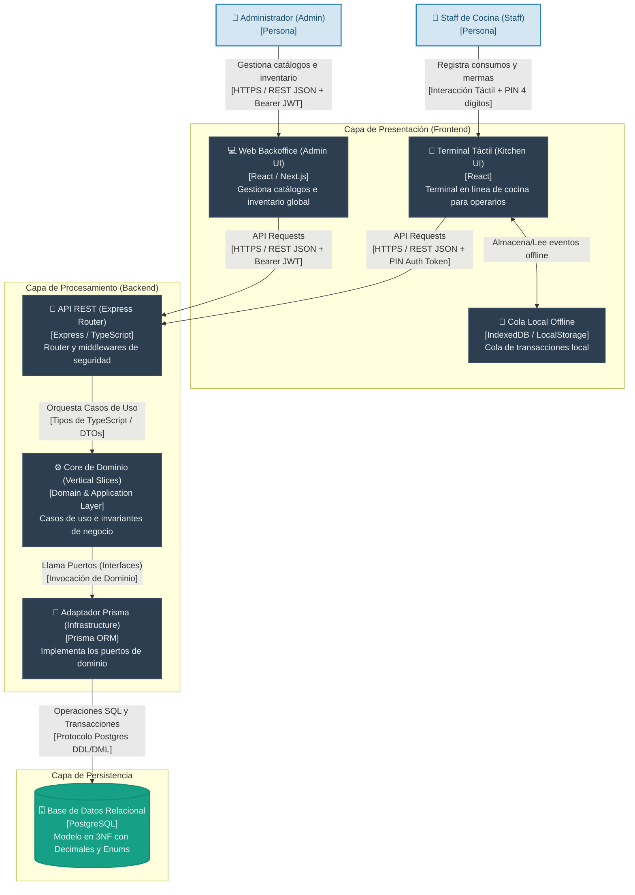
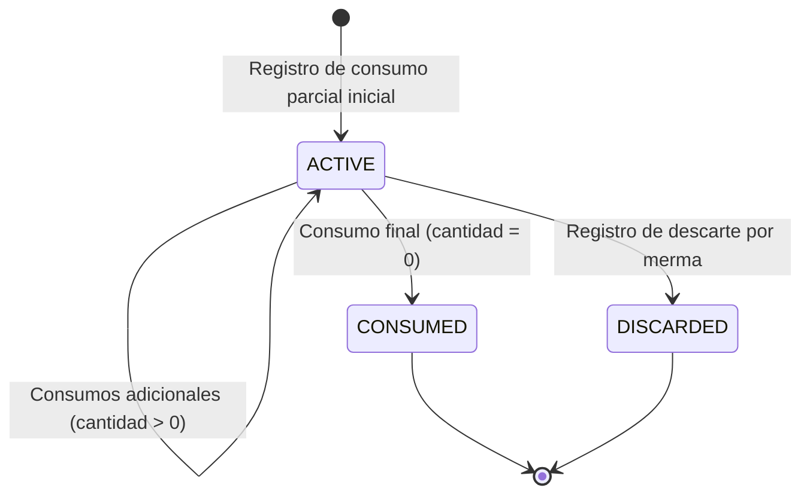

# 📐 Especificación Técnica de Arquitectura y Persistencia: RestoStock

## 📌 Índice
1. [Arquitectura de Referencia (Screaming Architecture & Slices)](#-1-arquitectura-de-referencia-screaming-architecture--slices)
   - 1.1. [Diagrama de Arquitectura de Contenedores (C4 Nivel 2)](#11-diagrama-de-arquitectura-de-contenedores-c4-nivel-2)
   - 1.2. [Mapa de Directorios](#12-mapa-de-directorios)
   - 1.3. [Responsabilidades de Capas](#13-responsabilidades-de-capas)
2. [Modelo de Datos Lógico/Físico Agnóstico (Database-Agnostic Blueprint)](#-2-modelo-de-datos-lógicofísico-agnóstico-database-agnostic-blueprint)
   - 2.1. [Catálogo de Entidades y Campos](#21-catálogo-de-entidades-y-campos)
   - 2.2. [Diccionario de Enums](#22-diccionario-de-enums)
   - 2.3. [Mapa de Relaciones y Cardinalidades](#23-mapa-de-relaciones-y-cardinalidades)
   - 2.4. [Estrategia de Indexación Lógica](#24-estrategia-de-indexación-lógica)
3. [Contratos de la API REST (Especificación de Endpoints)](#-3-contratos-de-la-api-rest-especificación-de-endpoints)
   - 3.1. [POST /api/auth/pin](#31-post-apiauthpin)
   - 3.2. [POST /api/stock/extraction](#32-post-apistockextraction)
   - 3.3. [POST /api/kitchen/consumption](#33-post-apikitchenconsumption)
   - 3.4. [GET /api/kitchen/remanentes](#34-get-apikitchenremanentes)
   - 3.5. [POST /api/kitchen/remanentes/:id/discard](#35-post-apikitchenremanentesiddiscard)
4. [Invariantes del Dominio y Reglas de Validación](#-4-invariantes-del-dominio-y-reglas-de-validación)
   - 4.1. [Invariantes de Reglas de Negocio](#41-invariantes-de-reglas-de-negocio)
   - 4.2. [Ciclo de Vida de Entidades](#42-ciclo-de-vida-de-entidades)

---

## 💻 1. Arquitectura de Referencia (Screaming Architecture & Slices)

Para garantizar un código mantenible, desacoplado y optimizado para el contexto de agentes de codificación, se adopta un diseño de **Vertical Slices (Rebanadas Verticales)** en el primer nivel de directorios. Cada módulo funcional empaqueta su propia lógica de dominio, aplicación e infraestructura siguiendo los principios de la **Arquitectura Hexagonal (Puertos y Adaptadores)**.

### 1.1. Diagrama de Arquitectura de Contenedores (C4 Nivel 2)



### 1.2. Mapa de Directorios

```
src/
├── shared/                       # Shared Kernel (Cross-cutting concerns)
│   ├── domain/                   # Shared value objects, domain errors
│   ├── infrastructure/
│   │   ├── prisma/               # Prisma Client wrapper and database connection
│   │   └── middleware/           # PIN authorization and general middlewares
│   └── index.ts
├── auth/                         # Authentication Slice (PIN and Admin authentication)
│   ├── domain/
│   │   ├── entities/             # User entity
│   │   ├── value-objects/        # PinHash, PasswordHash
│   │   └── ports/                # UserRepository interface
│   ├── application/
│   │   └── use-cases/            # AuthenticateWithPin, AuthenticateAdmin
│   └── infrastructure/
│       ├── controllers/          # AuthController
│       └── repositories/         # PrismaUserRepository
├── catalog/                      # Master Catalog Slice (Insumos/Ingredients management)
│   ├── domain/
│   │   ├── entities/             # Insumo entity
│   │   └── ports/                # InsumoRepository interface
│   ├── application/
│   │   └── use-cases/            # CreateInsumo, GetInsumoDetails
│   └── infrastructure/
│       ├── controllers/          # CatalogController
│       └── repositories/         # PrismaInsumoRepository
├── stock/                        # Inventory & Movement Slice (Warehouse extractions)
│   ├── domain/
│   │   ├── entities/             # StockMovement entity
│   │   └── ports/                # StockRepository interface
│   ├── application/
│   │   └── use-cases/            # RecordExtraction, CheckStock
│   └── infrastructure/
│       ├── controllers/          # StockController
│       └── repositories/         # PrismaStockRepository
└── kitchen/                      # Leftovers & Cooking Slice (Consumption & Discards)
    ├── domain/
    │   ├── entities/             # Remanente, PartialConsumption entities
    │   └── ports/                # RemanenteRepository interface
    ├── application/
    │   └── use-cases/            # RecordPartialConsumption, GetActiveRemanentes, RecordDiscard
    └── infrastructure/
        ├── controllers/          # KitchenController
        └── repositories/         # PrismaRemanenteRepository
```

### 1.3. Responsabilidades de Capas

*   **Capa de Dominio (Domain):** Contiene las reglas inmutables de negocio. Define las entidades, Value Objects, eventos de dominio y los **Puertos (Ports)**, que son interfaces que declaran cómo interactuar con el almacenamiento o sistemas externos. Es 100% agnóstica de Express, Prisma o librerías de infraestructura.
*   **Capa de Aplicación (Application):** Implementa los casos de uso del sistema. Orquesta el flujo de datos invocando las entidades de dominio y utilizando los puertos. No conoce la tecnología física de base de datos ni los protocolos de red (HTTP/gRPC).
*   **Capa de Infraestructura (Infrastructure):** Contiene los adaptadores concretos para interactuar con el mundo exterior. Implementa los controladores de Express, los repositorios utilizando Prisma ORM, mapeadores de datos de persistencia y middlewares de seguridad.

---

## 🗄️ 2. Modelo de Datos Lógico/Físico Agnóstico (Database-Agnostic Blueprint)

Este modelo describe la estructura lógica de persistencia del sistema en la Tercera Forma Normal (3NF). Es completamente independiente de la tecnología final de base de datos (relacional o no relacional).

### 2.1. Catálogo de Entidades y Campos

#### Entidad: `users` (Usuarios del sistema)
| Nombre Físico | Tipo Lógico | Restricciones | Descripción / Propósito en el Negocio |
|---|---|---|---|
| `id` | UUID | PK, NOT NULL | Identificador único universal del usuario. |
| `email` | String(255) | UNIQUE, NULL | Correo para login tradicional (solo administradores). |
| `password_hash` | String(255) | NULL | Hashing de contraseña (administradores). |
| `pin_hash` | String(255) | NULL | Hashing de PIN de 4 dígitos (operarios autorizados). |
| `name` | String(100) | NOT NULL | Nombre legible del empleado. |
| `photo_url` | String(500) | NULL | Foto del usuario para selección rápida en tablet. |
| `role` | Enum(Role) | NOT NULL, DEFAULT 'OPERATOR' | Perfil de permisos del usuario. |
| `is_active` | Boolean | NOT NULL, DEFAULT true | Define si el usuario puede operar el sistema. |
| `created_at` | DateTime | NOT NULL, DEFAULT NOW | Fecha y hora de alta del registro. |
| `updated_at` | DateTime | NOT NULL, DEFAULT NOW | Fecha y hora de la última modificación. |

#### Entidad: `insumos` (Catálogo maestro de ingredientes)
| Nombre Físico | Tipo Lógico | Restricciones | Descripción / Propósito en el Negocio |
|---|---|---|---|
| `id` | UUID | PK, NOT NULL | Identificador único del insumo. |
| `name` | String(100) | NOT NULL | Nombre comercial del ingrediente. |
| `brand` | String(100) | NULL | Marca del ingrediente. |
| `category` | String(50) | NOT NULL | Clasificación (ej. lácteos, carnes, secos). |
| `purchase_unit` | String(20) | NOT NULL | Unidad de compra entera (ej. Horma, Caja). |
| `consumption_unit` | String(20) | NOT NULL | Unidad de consumo en cocina (ej. gramo, ml). |
| `conversion_factor` | Decimal(10, 2) | NOT NULL, CHECK > 0 | Multiplicador para convertir de compra a consumo. |
| `open_shelf_life_days`| Integer | NULL | Vencimiento dinámico en días una vez abierto. |
| `is_active` | Boolean | NOT NULL, DEFAULT true | Define si el insumo está disponible para uso. |
| `created_at` | DateTime | NOT NULL, DEFAULT NOW | Fecha y hora de creación. |
| `updated_at` | DateTime | NOT NULL, DEFAULT NOW | Fecha y hora de modificación. |

#### Entidad: `warehouse_stocks` (Stocks consolidados por ubicación)
| Nombre Físico | Tipo Lógico | Restricciones | Descripción / Propósito en el Negocio |
|---|---|---|---|
| `id` | UUID | PK, NOT NULL | Identificador único del registro de stock. |
| `insumo_id` | UUID | FK, NOT NULL | Vinculado a `insumos.id`. |
| `location` | Enum(LocationType)| NOT NULL | Ubicación general del stock. |
| `quantity` | Decimal(12, 4) | NOT NULL, CHECK >= 0 | Cantidad actual disponible en esa ubicación. |
| `updated_at` | DateTime | NOT NULL, DEFAULT NOW | Fecha y hora del último movimiento que alteró el stock. |

*Restricción física adicional:* `UNIQUE(insumo_id, location)`

#### Entidad: `remanentes` (Insumos abiertos en uso)
| Nombre Físico | Tipo Lógico | Restricciones | Descripción / Propósito en el Negocio |
|---|---|---|---|
| `id` | UUID | PK, NOT NULL | Identificador único del remanente en cocina. |
| `insumo_id` | UUID | FK, NOT NULL | Vinculado a `insumos.id`. |
| `user_id` | UUID | FK, NOT NULL | Vinculado a `users.id` (quién abrió el insumo). |
| `initial_quantity` | Decimal(12, 4) | NOT NULL | Cantidad inicial del remanente al abrirse (en consumo). |
| `current_quantity` | Decimal(12, 4) | NOT NULL, CHECK >= 0 | Cantidad actual restante en cocina (en consumo). |
| `location` | Enum(LocationType)| NOT NULL | Ubicación física general en cocina. |
| `sublocation` | String(100) | NULL | Detalle exacto de ubicación (ej. "Heladera A"). |
| `status` | Enum(RemanenteStatus)| NOT NULL, DEFAULT 'ACTIVE' | Estado del remanente. |
| `opened_at` | DateTime | NOT NULL, DEFAULT NOW | Fecha y hora de apertura. |
| `original_expiration_date`| DateTime | NOT NULL | Vencimiento original de fábrica del lote cerrado. |
| `calculated_expiration_date`| DateTime| NOT NULL | Vencimiento acelerado dinámicamente calculado. |
| `created_at` | DateTime | NOT NULL, DEFAULT NOW | Fecha y hora de inserción. |
| `updated_at` | DateTime | NOT NULL, DEFAULT NOW | Fecha y hora de actualización. |

#### Entidad: `stock_movements` (Historial transaccional auditivo)
| Nombre Físico | Tipo Lógico | Restricciones | Descripción / Propósito en el Negocio |
|---|---|---|---|
| `id` | UUID | PK, NOT NULL | Identificador único de la transacción. |
| `insumo_id` | UUID | FK, NOT NULL | Vinculado a `insumos.id`. |
| `remanente_id` | UUID | FK, NULL | Vinculado a `remanentes.id` (opcional). |
| `user_id` | UUID | FK, NOT NULL | Vinculado a `users.id` (operario autorizador). |
| `type` | Enum(MovementType) | NOT NULL | Tipo de movimiento registrado. |
| `from_location` | Enum(LocationType)| NOT NULL | Ubicación de origen física. |
| `to_location` | Enum(LocationType)| NOT NULL | Ubicación de destino física. |
| `quantity` | Decimal(12, 4) | NOT NULL, CHECK > 0 | Cantidad física transferida. |
| `unit` | String(20) | NOT NULL | Unidad de medida del movimiento. |
| `reason` | Enum(DiscardReason)| NULL | Motivo de descarte (requerido si `type` es 'DISCARD'). |
| `created_at` | DateTime | NOT NULL, DEFAULT NOW | Fecha y hora exacta de la transacción física. |

---

### 2.2. Diccionario de Enums

*   **`Role`**: `ADMIN` (administración), `OPERATOR` (cocineros y operarios de línea).
*   **`MovementType`**: `EXTRACTION` (salida de depósito cerrado a cocina), `CONSUMPTION` (registro de consumo parcial de remanente), `TRANSFER` (traslado entre sububicaciones o terminales), `DISCARD` (descarte/merma).
*   **`DiscardReason`**: `EXPIRATION` (vencido), `DAMAGE_OR_DROP` (daño o caída), `CONTAMINATION` (contaminación física/química), `SPOILAGE` (deterioro organoléptico).
*   **`LocationType`**: `MAIN_WAREHOUSE` (depósito central), `KITCHEN_FRIDGE` (heladera cocina), `KITCHEN_FREEZER` (congelador cocina), `KITCHEN_PANTRY` (alacena secos), `KITCHEN_PREP` (línea de despacho).
*   **`RemanenteStatus`**: `ACTIVE` (disponible para uso), `CONSUMED` (agotado al 100%), `DISCARDED` (retirado del inventario por merma).

---

### 2.3. Mapa de Relaciones y Cardinalidades

```
  [users] 1 -------- 0..N [remanentes]
  [users] 1 -------- 0..N [stock_movements]
  
  [insumos] 1 ------ 0..N [warehouse_stocks]
  [insumos] 1 ------ 0..N [remanentes]
  [insumos] 1 ------ 0..N [stock_movements]
  
  [remanentes] 1 --- 0..N [stock_movements]
```

#### Reglas de Integridad Referencial e Integración Física:
*   **`warehouse_stocks.insumo_id` ----> `insumos.id`**: Relación débil. Acciones: `ON DELETE CASCADE` / `ON UPDATE CASCADE`. Si se borra un insumo del catálogo maestro, se remueven sus registros de stock asociados.
*   **`remanentes.insumo_id` ----> `insumos.id`**: Relación débil. Acciones: `ON DELETE CASCADE` / `ON UPDATE CASCADE`.
*   **`remanentes.user_id` ----> `users.id`**: Relación fuerte de auditoría. Acciones: `ON DELETE RESTRICT` / `ON UPDATE CASCADE`. No se puede eliminar a un usuario del sistema que haya firmado la apertura de un remanente activo o inactivo.
*   **`stock_movements.remanente_id` ----> `remanentes.id`**: Relación de log. Acciones: `ON DELETE SET NULL` / `ON UPDATE CASCADE`. Si un remanente es depurado físicamente, se preserva el log de movimientos históricos con su referencia en nulo para mantener los costos históricos limpios.

---

### 2.4. Estrategia de Indexación Lógica

Para garantizar un rendimiento óptimo de base de datos bajo alta transaccionalidad de consultas (búsquedas táctiles y ordenamientos cronológicos en cocina), se recomiendan los siguientes índices físicos:

1.  **Índice FEFO en `remanentes(status, calculated_expiration_date)`**:
    *   *Justificación:* La consulta prioritaria de la pantalla de cocina solicita remanentes abiertos (`status = 'ACTIVE'`) ordenados de menor a mayor vencimiento. Este índice compuesto evita la ordenación en memoria (*filesort*) y cubre la consulta de forma instantánea.
2.  **Índice de Búsqueda de Stock en `warehouse_stocks(location)`**:
    *   *Justificación:* El sistema filtra los inventarios y sumatorias agrupando por ubicación física (ej. ver stock actual de la cocina). Permite lecturas rápidas sin realizar escaneo completo de la tabla de stock.
3.  **Índice Cronológico de Auditoría en `stock_movements(created_at, insumo_id)`**:
    *   *Justificación:* Las consultas del backoffice administrativo requieren filtrar los movimientos cronológicamente por día o semana para conciliar diferencias y calcular mermas.

---

## 🔌 3. Contratos de la API REST (Especificación de Endpoints)

### 3.1. POST /api/auth/pin
Autenticación rápida de operario autorizado para terminales de cocina.

*   **Middleware:** Ninguno (Público).
*   **Request Body (application/json):**
    ```json
    {
      "userId": "c596e191-230d-45db-99ff-411a2f6412b1",
      "pin": "1234"
    }
    ```
*   **Response Success (HTTP 200 OK):**
    ```json
    {
      "token": "eyJhbGciOiJIUzI1NiIsIn...",
      "user": {
        "id": "c596e191-230d-45db-99ff-411a2f6412b1",
        "name": "Juan Perez",
        "role": "OPERATOR"
      }
    }
    ```
*   **Response Error (HTTP 401 Unauthorized):**
    ```json
    {
      "error": "UNAUTHORIZED",
      "message": "Invalid PIN credentials"
    }
    ```

### 3.2. POST /api/stock/extraction
Registra el movimiento físico de traslado de unidades enteras desde el depósito principal hacia el stock de la cocina.

*   **Middleware:** `authRequire` (Requiere Token JWT).
*   **Request Body (application/json):**
    ```json
    {
      "insumoId": "e2298c5d-6c17-4886-9a2d-4f1b80e8efea",
      "quantity": "2.0000",
      "toLocation": "KITCHEN_FRIDGE"
    }
    ```
*   **Response Success (HTTP 201 Created):**
    ```json
    {
      "movementId": "887a0300-d872-4d22-b5e1-88f5a2e5e1a1",
      "insumoId": "e2298c5d-6c17-4886-9a2d-4f1b80e8efea",
      "quantity": "2.0000",
      "unit": "Horma",
      "from": "MAIN_WAREHOUSE",
      "to": "KITCHEN_FRIDGE",
      "registeredBy": "c596e191-230d-45db-99ff-411a2f6412b1",
      "createdAt": "2026-07-02T22:30:00.000Z"
    }
    ```
*   **Response Error (HTTP 422 Unprocessable Entity):**
    ```json
    {
      "error": "INSUFFICIENT_STOCK",
      "message": "Requested quantity (2.0000) exceeds available stock (1.0000) in MAIN_WAREHOUSE"
    }
    ```

### 3.3. POST /api/kitchen/consumption
Registra la apertura de un insumo y su primer consumo parcial. Descuenta una unidad entera de la cocina e inicializa el remanente.

*   **Middleware:** `authRequire` (Requiere Token JWT).
*   **Request Body (application/json):**
    ```json
    {
      "insumoId": "e2298c5d-6c17-4886-9a2d-4f1b80e8efea",
      "quantityConsumed": "400.0000",
      "location": "KITCHEN_FRIDGE",
      "sublocation": "Heladera A - Línea de Fríos",
      "originalExpirationDate": "2026-07-15T00:00:00.000Z"
    }
    ```
*   **Response Success (HTTP 201 Created):**
    ```json
    {
      "remanente": {
        "id": "44a56a70-74d1-4db8-b5e2-65fde7bb4f3b",
        "insumoId": "e2298c5d-6c17-4886-9a2d-4f1b80e8efea",
        "currentQuantity": "4600.0000",
        "location": "KITCHEN_FRIDGE",
        "sublocation": "Heladera A - Línea de Fríos",
        "calculatedExpirationDate": "2026-07-05T22:30:00.000Z",
        "status": "ACTIVE"
      },
      "movement": {
        "id": "d5236b2f-7023-41bb-b89e-99f55e5db234",
        "type": "TRANSFER",
        "quantity": "400.0000",
        "unit": "gramo"
      }
    }
    ```
*   **Response Error (HTTP 422 Unprocessable Entity):**
    ```json
    {
      "error": "NO_SEALED_STOCK",
      "message": "No sealed units available for this Insumo in KITCHEN_FRIDGE. Perform an extraction first."
    }
    ```

### 3.4. GET /api/kitchen/remanentes
Obtiene el listado de remanentes activos en cocina ordenados bajo estrategia FEFO.

*   **Middleware:** AuthMiddleware (Rol mínimo: `OPERATOR` u `ADMIN`, via `Authorization: Bearer <token_jwt>`).
*   **Query Parameters:**
    *   `location` (opcional): Filtra por ubicación específica (`KITCHEN_FRIDGE`, `KITCHEN_FREEZER`, `KITCHEN_PANTRY`, `KITCHEN_PREP`).
*   **Response Success (HTTP 200 OK):**
    ```json
    [
      {
        "id": "44a56a70-74d1-4db8-b5e2-65fde7bb4f3b",
        "insumo": {
          "id": "e2298c5d-6c17-4886-9a2d-4f1b80e8efea",
          "name": "Queso Parmesano",
          "brand": "Sancor",
          "consumptionUnit": "gramo"
        },
        "currentQuantity": "4600.0000",
        "location": "KITCHEN_FRIDGE",
        "sublocation": "Heladera A - Línea de Fríos",
        "calculatedExpirationDate": "2026-07-05T22:30:00.000Z",
        "alertState": "YELLOW"
      }
    ]
    ```

### 3.5. POST /api/kitchen/remanentes/:id/discard
Registra el descarte por merma de un remanente activo.

*   **Middleware:** `authRequire` (Requiere Token JWT).
*   **Request Body (application/json):**
    ```json
    {
      "reason": "EXPIRATION"
    }
    ```
*   **Response Success (HTTP 200 OK):**
    ```json
    {
      "remanenteId": "44a56a70-74d1-4db8-b5e2-65fde7bb4f3b",
      "status": "DISCARDED",
      "discardedQuantity": "4600.0000",
      "reason": "EXPIRATION",
      "registeredBy": "c596e191-230d-45db-99ff-411a2f6412b1"
    }
    ```
*   **Response Error (HTTP 422 Unprocessable Entity):**
    ```json
    {
      "error": "INVALID_STATE",
      "message": "Remanente has already been consumed or discarded"
    }
    ```

---

## 🛡️ 4. Invariantes del Dominio y Reglas de Validación

Las invariantes de negocio actúan como barreras de seguridad lógicas en memoria antes de permitir transacciones.

### 4.1. Invariantes de Reglas de Negocio

1.  **Consistencia de Unidades de Medida:**
    *   Un `Uso Parcial` o un `Remanente` solo pueden registrar cantidades expresadas en la `consumption_unit` del insumo asociado.
    *   Una `Extracción` solo puede registrar unidades enteras expresadas en la `purchase_unit` del insumo.
2.  **Límite Máximo del Remanente:**
    *   La cantidad del remanente inicial se calcula como: `conversion_factor - quantity_consumed`.
    *   Se debe cumplir en todo momento: `0 <= current_quantity <= (conversion_factor)`.
    *   *Acción correctiva:* Si un registro intenta declarar un uso de `1200 ml` en un insumo de capacidad `1000 ml`, el validador del dominio arrojará un error de violación de invariante.
3.  **Cálculo de Expiración Acelerada:**
    *   `calculated_expiration_date` debe ser exactamente igual al menor valor entre:
        *   `original_expiration_date` (fecha de caducidad del lote cerrado provista por el fabricante).
        *   `opened_at + (open_shelf_life_days)`.
    *   Si `open_shelf_life_days` es nulo, `calculated_expiration_date` heredará el valor de `original_expiration_date`.

### 4.2. Ciclo de Vida de Entidades

#### Estado de Remanentes
Un `Remanente` se comporta como una máquina de estados finitos que transita de la siguiente manera:



*   **Restricciones de Transición:**
    *   No se pueden registrar consumos parciales ni traslados sobre un remanente en estado `CONSUMED` o `DISCARDED`.
    *   El paso a `DISCARDED` requiere obligatoriamente que el motivo sea uno de los valores definidos en el enum `DiscardReason`.
    *   Cuando el estado de un remanente cambia a `CONSUMED` o `DISCARDED`, su `current_quantity` se fuerza lógicamente a `0` en base de datos.

### 4.3. Motor de Alertas y Notificaciones Dinámicas
Para mantener la simplicidad y eficiencia de la base de datos (evitando escrituras redundantes), las alertas de la terminal de cocina se calculan dinámicamente en memoria a nivel del cliente o de la capa de API al consultar el estado actual del inventario:

1. **Alertas de Caducidad Acelerada (FEFO):**
   * **Origen de Datos:** Consulta de remanentes en estado `ACTIVE`.
   * **Regla:** Si `calculated_expiration_date - NOW()` es menor a 6 horas, se genera una notificación de tipo `CRITICAL` (rojo). Si es menor a 24 horas, es de tipo `WARNING` (amarillo).
2. **Alertas de Quiebre de Stock en Cocina:**
   * **Origen de Datos:** Suma de existencias activas en cocina versus stock de seguridad definido por el ingrediente.
   * **Regla:** Si `current_quantity` es inferior al umbral mínimo, se notifica la necesidad de realizar un traslado.
3. **Alertas de Estado de Sincronización:**
   * **Origen de Datos:** Cola local IndexedDB (`OfflineQueue`).
   * **Regla:** Si hay elementos pendientes en cola y el navegador detecta pérdida de red (`navigator.onLine === false`), se notifica el modo offline y la cantidad de transacciones resguardadas.

### 4.4. Descuento Rápido de Stock por Recetas
Para optimizar el flujo operativo y evitar el registro manual unitario de consumos, la cocina táctil dispone del consumo guiado por recetas:
1. **Mapeo de Recetas:** Cada receta (`Recipe`) en el catálogo maestro posee N ingredientes (`RecipeIngredient`), asociados a un `Insumo` y expresados en cantidades basadas en la unidad de consumo.
2. **Algoritmo de Descuento FEFO en Cascadas:** Al invocar `ConsumeRecipeUseCase`, el sistema ejecuta los siguientes pasos:
   * Recupera los ingredientes requeridos y sus porciones.
   * Por cada ingrediente, busca todos los remanentes con estado `ACTIVE` correspondientes al `insumo_id` ordenados cronológicamente por `calculated_expiration_date` (FEFO).
   * Descuenta la cantidad requerida del remanente más antiguo primero. Si la cantidad solicitada excede la cantidad del remanente, actualiza ese remanente a `CONSUMED` (cantidad restante = 0) y continúa debitando el saldo del siguiente remanente más antiguo.
   * Si la suma total de remanentes activos en cocina es insuficiente, el sistema detiene el descuento en cascada al agotar los remanentes `ACTIVE` disponibles (llegando a cero), reporta un error de stock insuficiente y no permite saldos negativos en el inventario ni registros de cantidades remanentes negativas.

### 4.5. Cierre de Turno y Conciliación Rápida
Al final de cada jornada de trabajo, el personal de cocina realiza un flujo de conciliación de inventario:
1. **Auto-Descarte por Caducidad:** El backend consulta automáticamente todos los remanentes en estado `ACTIVE` cuya `calculated_expiration_date` sea menor a la hora actual (`calculated_expiration_date < NOW()`). Estos registros se marcan atómicamente como `DISCARDED` con motivo `EXPIRATION` y se registra el movimiento correspondiente en base de datos.
2. **Conteo Físico e Historial:** El operario ingresa la cantidad física remanente de los insumos seleccionados en la tablet. El sistema calcula la varianza:
   $$\text{Varianza} = \text{Cantidad Física} - \text{Cantidad Teórica}$$
3. **Registro de Conciliación:** Se crea un registro en `ShiftReconciliation` y se detallan las discrepancias en `ShiftReconciliationItem`. Si la discrepancia es significativa (mayor a un umbral configurado), se notifica de inmediato al administrador para auditar la desviación.


