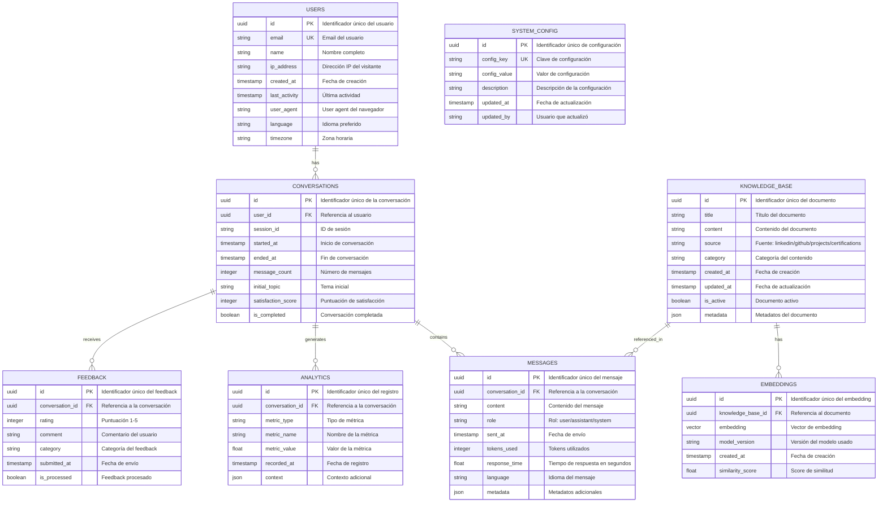
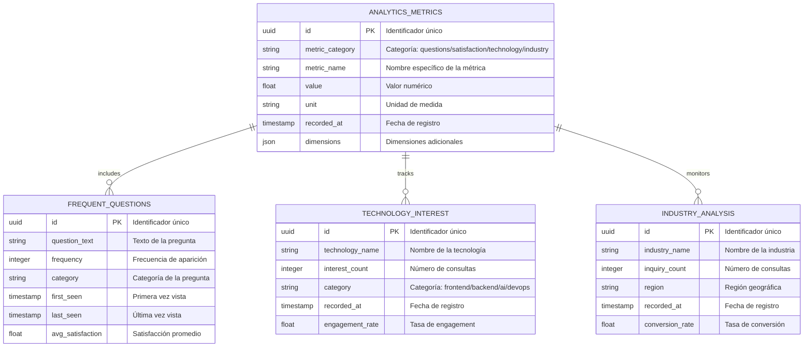

# Modelo de Datos

## 3.1. Diagrama del modelo de datos

### Diagrama ER Principal



### Diagrama de Relaciones de Analytics



## 3.2. Descripción de entidades principales

### USERS
**Descripción:** Almacena información de los visitantes del portfolio que interactúan con el chatbot.

**Atributos:**
- `id` (uuid, PK): Identificador único del usuario, generado automáticamente
- `email` (string, UK): Email del usuario (opcional, para usuarios registrados)
- `name` (string): Nombre completo del visitante (opcional)
- `ip_address` (string): Dirección IP del visitante para análisis geográfico
- `created_at` (timestamp): Fecha y hora de la primera visita
- `last_activity` (timestamp): Última actividad registrada
- `user_agent` (string): Información del navegador y dispositivo
- `language` (string): Idioma preferido del usuario (es, en, etc.)
- `timezone` (string): Zona horaria del usuario

**Restricciones:**
- `id` NOT NULL, UNIQUE
- `email` UNIQUE (si se proporciona)
- `created_at` NOT NULL, DEFAULT NOW()
- `last_activity` NOT NULL

**Relaciones:**
- Uno a muchos con CONVERSATIONS (un usuario puede tener múltiples conversaciones)

### CONVERSATIONS
**Descripción:** Representa una sesión de conversación completa entre un usuario y el chatbot.

**Atributos:**
- `id` (uuid, PK): Identificador único de la conversación
- `user_id` (uuid, FK): Referencia al usuario que inició la conversación
- `session_id` (string): ID de sesión del navegador
- `started_at` (timestamp): Momento de inicio de la conversación
- `ended_at` (timestamp): Momento de finalización (NULL si está activa)
- `message_count` (integer): Número total de mensajes intercambiados
- `initial_topic` (string): Tema o pregunta inicial de la conversación
- `satisfaction_score` (integer): Puntuación de satisfacción 1-5
- `is_completed` (boolean): Indica si la conversación está completada

**Restricciones:**
- `id` NOT NULL, UNIQUE
- `user_id` NOT NULL, FK REFERENCES USERS(id)
- `started_at` NOT NULL, DEFAULT NOW()
- `message_count` >= 0
- `satisfaction_score` BETWEEN 1 AND 5

**Relaciones:**
- Muchos a uno con USERS
- Uno a muchos con MESSAGES
- Uno a muchos con ANALYTICS
- Uno a muchos con FEEDBACK

### MESSAGES
**Descripción:** Almacena cada mensaje individual intercambiado en una conversación.

**Atributos:**
- `id` (uuid, PK): Identificador único del mensaje
- `conversation_id` (uuid, FK): Referencia a la conversación
- `content` (text): Contenido completo del mensaje
- `role` (string): Rol del emisor (user/assistant/system)
- `sent_at` (timestamp): Momento de envío del mensaje
- `tokens_used` (integer): Número de tokens utilizados (para mensajes del assistant)
- `response_time` (float): Tiempo de respuesta en segundos (para mensajes del assistant)
- `language` (string): Idioma detectado del mensaje
- `metadata` (json): Metadatos adicionales (fuentes consultadas, confianza, etc.)

**Restricciones:**
- `id` NOT NULL, UNIQUE
- `conversation_id` NOT NULL, FK REFERENCES CONVERSATIONS(id)
- `content` NOT NULL, NOT EMPTY
- `role` IN ('user', 'assistant', 'system')
- `sent_at` NOT NULL, DEFAULT NOW()
- `tokens_used` >= 0
- `response_time` >= 0

**Relaciones:**
- Muchos a uno con CONVERSATIONS
- Muchos a muchos con KNOWLEDGE_BASE (a través de metadata)

### KNOWLEDGE_BASE
**Descripción:** Base de conocimiento que alimenta el sistema RAG con información profesional.

**Atributos:**
- `id` (uuid, PK): Identificador único del documento
- `title` (string): Título descriptivo del documento
- `content` (text): Contenido completo del documento
- `source` (string): Fuente de la información (linkedin/github/projects/certifications)
- `category` (string): Categoría del contenido (experience/skills/projects/education)
- `created_at` (timestamp): Fecha de creación del registro
- `updated_at` (timestamp): Fecha de última actualización
- `is_active` (boolean): Indica si el documento está activo y disponible
- `metadata` (json): Metadatos adicionales (fechas, tecnologías, enlaces, etc.)

**Restricciones:**
- `id` NOT NULL, UNIQUE
- `title` NOT NULL, NOT EMPTY
- `content` NOT NULL, NOT EMPTY
- `source` IN ('linkedin', 'github', 'projects', 'certifications')
- `category` IN ('experience', 'skills', 'projects', 'education', 'achievements')
- `created_at` NOT NULL, DEFAULT NOW()
- `updated_at` NOT NULL, DEFAULT NOW()
- `is_active` NOT NULL, DEFAULT TRUE

**Relaciones:**
- Uno a muchos con EMBEDDINGS
- Muchos a muchos con MESSAGES (a través de referencias en metadata)

### EMBEDDINGS
**Descripción:** Almacena los vectores de embedding generados para búsqueda semántica.

**Atributos:**
- `id` (uuid, PK): Identificador único del embedding
- `knowledge_base_id` (uuid, FK): Referencia al documento de la base de conocimiento
- `embedding` (vector): Vector de embedding (768 dimensiones para el modelo usado)
- `model_version` (string): Versión del modelo de embedding utilizado
- `created_at` (timestamp): Fecha de creación del embedding
- `similarity_score` (float): Score de similitud calculado durante la búsqueda

**Restricciones:**
- `id` NOT NULL, UNIQUE
- `knowledge_base_id` NOT NULL, FK REFERENCES KNOWLEDGE_BASE(id)
- `embedding` NOT NULL
- `model_version` NOT NULL, NOT EMPTY
- `created_at` NOT NULL, DEFAULT NOW()
- `similarity_score` BETWEEN 0 AND 1

**Relaciones:**
- Muchos a uno con KNOWLEDGE_BASE

### ANALYTICS
**Descripción:** Almacena métricas y datos analíticos generados durante las conversaciones.

**Atributos:**
- `id` (uuid, PK): Identificador único del registro analítico
- `conversation_id` (uuid, FK): Referencia a la conversación
- `metric_type` (string): Tipo de métrica (question_frequency, satisfaction, technology_interest, etc.)
- `metric_name` (string): Nombre específico de la métrica
- `metric_value` (float): Valor numérico de la métrica
- `recorded_at` (timestamp): Fecha y hora del registro
- `context` (json): Contexto adicional de la métrica

**Restricciones:**
- `id` NOT NULL, UNIQUE
- `conversation_id` NOT NULL, FK REFERENCES CONVERSATIONS(id)
- `metric_type` NOT NULL, NOT EMPTY
- `metric_name` NOT NULL, NOT EMPTY
- `metric_value` NOT NULL
- `recorded_at` NOT NULL, DEFAULT NOW()

**Relaciones:**
- Muchos a uno con CONVERSATIONS

### FEEDBACK
**Descripción:** Almacena feedback directo de los usuarios sobre la calidad de las respuestas.

**Atributos:**
- `id` (uuid, PK): Identificador único del feedback
- `conversation_id` (uuid, FK): Referencia a la conversación
- `rating` (integer): Puntuación de satisfacción 1-5
- `comment` (text): Comentario opcional del usuario
- `category` (string): Categoría del feedback (accuracy, helpfulness, speed, etc.)
- `submitted_at` (timestamp): Fecha de envío del feedback
- `is_processed` (boolean): Indica si el feedback ha sido procesado para mejora

**Restricciones:**
- `id` NOT NULL, UNIQUE
- `conversation_id` NOT NULL, FK REFERENCES CONVERSATIONS(id)
- `rating` NOT NULL, BETWEEN 1 AND 5
- `category` IN ('accuracy', 'helpfulness', 'speed', 'relevance', 'general')
- `submitted_at` NOT NULL, DEFAULT NOW()
- `is_processed` NOT NULL, DEFAULT FALSE

**Relaciones:**
- Muchos a uno con CONVERSATIONS

### SYSTEM_CONFIG
**Descripción:** Almacena configuraciones del sistema que pueden ser modificadas dinámicamente.

**Atributos:**
- `id` (uuid, PK): Identificador único de la configuración
- `config_key` (string, UK): Clave única de la configuración
- `config_value` (text): Valor de la configuración
- `description` (text): Descripción de para qué sirve la configuración
- `updated_at` (timestamp): Fecha de última actualización
- `updated_by` (string): Usuario o sistema que realizó la actualización

**Restricciones:**
- `id` NOT NULL, UNIQUE
- `config_key` NOT NULL, UNIQUE, NOT EMPTY
- `config_value` NOT NULL
- `description` NOT NULL, NOT EMPTY
- `updated_at` NOT NULL, DEFAULT NOW()

**Ejemplos de configuraciones:**
- `max_tokens_per_response`: Límite de tokens por respuesta
- `default_language`: Idioma por defecto del chatbot
- `rate_limit_per_minute`: Límite de requests por minuto
- `satisfaction_threshold`: Umbral mínimo de satisfacción para alertas
- `maintenance_mode`: Modo de mantenimiento activo/inactivo

## 3.3. Índices y Optimización

### Índices Principales
```sql
-- Índices para optimizar consultas frecuentes
CREATE INDEX idx_conversations_user_id ON conversations(user_id);
CREATE INDEX idx_conversations_started_at ON conversations(started_at);
CREATE INDEX idx_messages_conversation_id ON messages(conversation_id);
CREATE INDEX idx_messages_sent_at ON messages(sent_at);
CREATE INDEX idx_analytics_conversation_id ON analytics(conversation_id);
CREATE INDEX idx_analytics_metric_type ON analytics(metric_type);
CREATE INDEX idx_knowledge_base_source ON knowledge_base(source);
CREATE INDEX idx_knowledge_base_category ON knowledge_base(category);
CREATE INDEX idx_embeddings_knowledge_base_id ON embeddings(knowledge_base_id);
```

### Particionamiento
- **ANALYTICS:** Particionado por fecha (mensual) para optimizar consultas históricas
- **MESSAGES:** Particionado por fecha (semanal) para conversaciones activas
- **EMBEDDINGS:** Particionado por modelo_version para diferentes versiones de embedding

### Estrategias de Optimización
- **Caché Redis:** Para respuestas frecuentes y sesiones activas
- **Compresión:** Para almacenamiento de embeddings y contenido largo
- **Archivado:** Movimiento automático de datos antiguos a almacenamiento frío
- **Backup:** Backup automático diario con retención de 30 días 