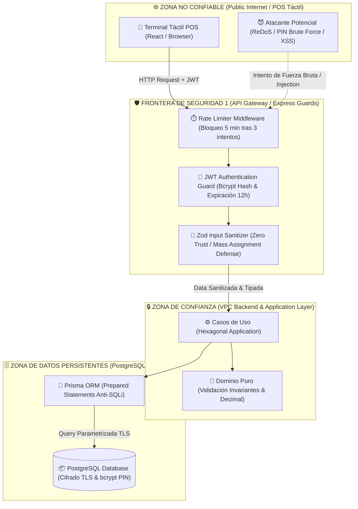

# 🛡️ Especificación de Ciberseguridad, PII y Cumplimiento

> **Navegación del Framework SDD:**  
> [⬅️ Volver a Especificación API REST (07_api_specification.md)](../03_persistence_and_api/07_api_specification.md) | [📖 Glosario & Reglas](../01_product_definition/01_glosario_y_reglas_negocio.md) | [Siguiente: Estrategia de Pruebas (09_testing_strategy.md) ➡️](./09_testing_strategy.md)

---

## 🔒 1. Sanitización de Entrada y Validación en Tiempo de Ejecución (Zero Trust en Entrada)

Para mitigar ataques de **Inyección (OWASP A03:2021)**, **Cross-Site Scripting (XSS)** y **Mass Assignment**, RestoStock implementa una arquitectura de validación de datos desacoplada en dos capas:

### 1.1. Estrategia de Validación en Dos Capas
1.  **Capa del Cliente (Frontend - Validación para UX):** Implementa controles reactivos inmediatos sobre los formularios de la interfaz táctil y de administración (ej. validando que el PIN tenga 4 caracteres antes de habilitar el botón de envío). Su propósito es mejorar la experiencia del usuario y reducir tráfico innecesario al servidor, pero **nunca se considera un control de seguridad**.
2.  **Capa del Servidor (Backend - Validación para Seguridad):** Todos los datos de entrada que cruzan la frontera de la API REST (`req.body`, `req.query`, `req.params`) son tratados como potencialmente maliciosos. Se someten a validación estricta y coercitiva en tiempo de ejecución utilizando esquemas de la librería **Zod** antes de ser expuestos a los casos de uso.

### 1.2. Sanitización y Aislamiento con Zod
Los esquemas de Zod actúan como firewalls lógicos a nivel de controlador. Por defecto, todas las validaciones eliminan de forma activa cualquier propiedad o campo adicional que no esté explícitamente definido en el esquema (estrategia de sanitización automática contra vulnerabilidades de *Mass Assignment* o *Bypassing* de campos).

Ejemplo de esquema de validación para extracción de bodega:
```typescript
import { z } from 'zod';

export const RecordExtractionSchema = z.object({
  insumoId: z.string().uuid({ message: "Insumo ID must be a valid UUIDv4" }),
  userId: z.string().uuid({ message: "User ID must be a valid UUIDv4" }),
  quantity: z.number()
    .positive({ message: "Quantity must be a positive decimal" })
    .max(10000, { message: "Quantity exceeds single transaction limits" }),
  unit: z.string()
    .min(1, { message: "Unit cannot be empty" })
    .max(20, { message: "Unit length exceeds 20 characters" })
}).strict(); // Rechaza activamente campos no definidos
```

### 1.3. Prohibición de Expresiones Regulares Caseras (Custom Regex)
Queda estrictamente prohibida la implementación de expresiones regulares propias (home-cooked regex) para la validación de datos críticos (correos electrónicos, formatos de teléfonos, PINs numéricos) para evitar vulnerabilidades de denegación de servicio por expresiones regulares (**ReDoS**).
*   Se exige el uso exclusivo del validador nativo de Zod (ej. `z.string().email()`) o en su defecto de librerías altamente testeadas y mantenidas por la comunidad (como `validator.js`).
*   Para la prevención de XSS en campos de texto enriquecido o descriptivos (ej. comentarios de mermas o nombres de insumos), la API limpiará la entrada utilizando **DOMPurify** o librerías equivalentes de sanitización HTML antes de guardarlos.

---

## 🛡️ 1.4. Diagrama de Fronteras de Confianza y Modelo STRIDE (Security Boundaries)



---

## 🛡️ 2. Protección de Persistencia y Seguridad Física de Datos

### 2.1. Mitigación de SQL Injection (SQLi)
Para neutralizar ataques de inyección SQL:
*   Todas las consultas e interacciones con el motor PostgreSQL se ejecutan de manera nativa mediante **consultas parametrizadas (Prepared Statements)** proporcionadas automáticamente por el motor de mapeo del ORM (Prisma).
*   Queda estrictamente prohibido el uso de consultas directas desprotegidas o concatenación de strings de entrada dentro del ORM. Se prohíbe el uso de comandos como `prisma.$queryRawUnsafe()` en Prisma o `sql.raw()` en Drizzle. Cualquier consulta que requiera SQL crudo por razones de rendimiento debe ser parametrizada usando plantillas tagged lógicas seguras (`prisma.$queryRaw` pasándole parámetros tipados).

### 2.2. Gobernanza de Secretos de Entorno
*   **Prohibición de Credenciales Hardcodeadas:** Ningún archivo de configuración, script local o código de repositorio debe almacenar secretos en texto plano, incluyendo credenciales de bases de datos (`DATABASE_URL`), claves API de servicios externos, o llaves de cifrado (`JWT_SECRET`, `PIN_SECRET`).
*   **Inyección Dinámica:** Todos los secretos se inyectan en caliente durante la inicialización del contenedor en producción a través del entorno de ejecución, utilizando un gestor de secretos centralizado y seguro (como Doppler, Infisical o variables protegidas de GitHub Actions Secrets en el runner).
*   **Validación de Entorno:** El sistema utiliza un proveedor de configuración tipado con Zod para validar la presencia y el formato correcto de todos los secretos requeridos antes de iniciar el socket de la API, bloqueando el proceso de arranque (`process.exit(1)`) si falta algún secreto.

### 2.3. Conexiones Seguras y Cifrado
*   **Canales Cifrados (TLS):** Es obligatorio configurar la conexión hacia la base de datos de producción utilizando cifrado de transporte TLS completo (`sslmode=verify-full` o equivalente). Esto garantiza que no se puedan interceptar credenciales o datos mediante técnicas de *Man-in-the-Middle* (MitM).
*   **Cifrado a Nivel de Columna (Encryption at Rest):** Los datos altamente sensibles y confidenciales de acceso rápido (como los PINs de 4 dígitos de los empleados) nunca se almacenan en texto plano en la base de datos PostgreSQL. Deben ser encriptados de forma irreversible utilizando hashes con sal única por registro mediante **bcrypt** con un factor de trabajo (salt rounds) mínimo de 10.

---

## 📊 3. Clasificación de Riesgo bajo el EU AI Act y Privacidad de Datos

### 3.1. Clasificación bajo el EU AI Act (Regulación Europea 2026)
*   **Clasificación del Sistema:** **Riesgo Mínimo o Nulo (Minimal/No Risk).**
*   **Justificación:** RestoStock opera como un sistema transaccional determinista orientado al control y trazabilidad de inventarios. No emplea modelos de aprendizaje automático (Machine Learning), redes neuronales, ni agentes autónomos basados en Inteligencia Artificial Generativa (LLM) para la toma de decisiones críticas (como la asignación de roles o descartes de alimentos). Por tanto, queda fuera de las obligaciones regulatorias estrictas aplicables a sistemas de "Riesgo Alto" o de "Propósito General".
*   **Excepción Futura:** En caso de integrar módulos de analítica predictiva basados en IA en futuras fases (ej. un recomendador de compras automatizado que analice patrones de desperdicio), el sistema se clasificará como **Riesgo Limitado (Limited Risk)**, activando obligaciones inmediatas de transparencia (informar a los usuarios que interactúan con un sistema de IA) y evaluaciones de impacto en privacidad.

### 3.2. Cumplimiento de la Directiva GDPR (Reglamento General de Protección de Datos)
El sistema cumple estrictamente con las regulaciones de privacidad europeas para la protección de datos personales identificables (PII):

1.  **Principio de Minimización de Datos:** RestoStock limita el almacenamiento de datos del personal al mínimo absoluto requerido para la operación: nombre de usuario, correo electrónico, rol organizativo y el hash del PIN. No se recopilan datos biométricos, números de seguridad social, direcciones particulares ni información médica.
2.  **Privacidad por Diseño (Privacy by Design) en Integración con LLMs:** Si los datos de inventario o las métricas de mermas físicas de cocina deben ser expuestos a APIs de modelos LLM externos (como OpenAI o Anthropic) para análisis predictivo o generación de informes administrativos:
    *   Toda información de identificación personal (PII) de empleados o administradores (como nombres, correos o IDs individuales) se someterá a una capa previa de **de-identificación o tokenización unidireccional** antes de ser enviada fuera de los servidores de la empresa.
    *   Los logs y registros de movimientos se exportarán con identificadores anonimizados (ej. reemplazar `userId: "uuid-real"` por `userId: "kitchen_staff_hash_x"`) para evitar que proveedores de IA puedan reconstruir identidades de empleados o mapear perfiles individuales.

---

## 🤖 4. Gobernanza del Agente de Codificación (Garantía Antialucinaciones y Seguridad de Código)

La integración de herramientas basadas en Inteligencia Artificial Generativa (copilotos de código como v0, Lovable, Cursor Composer, o agentes AI locales) para acelerar el desarrollo del software introduce el riesgo de fallas de seguridad automatizadas e inyección de dependencias maliciosas. Se establecen los siguientes controles estrictos de ingeniería de software:

### 4.1. Obligatoriedad de Security Review (SAST y Manual)
*   Queda terminantemente prohibido integrar, fusionar o desplegar a producción código fuente o scripts de pruebas unitarias generados de forma automática por copilotos de IA sin antes superar una revisión estática de seguridad automatizada (**SAST**) usando herramientas como SonarQube o Snyk.
*   Todo PR generado o modificado por un agente autónomo de IA requiere la aprobación obligatoria de un Code Review manual por parte de un desarrollador senior, verificando la ausencia de patrones de código inseguros o alucinaciones estructurales.

### 4.2. Bloqueo de Alucinaciones de Dependencias (Slopsquatting)
*   Los modelos de lenguaje tienden a inventar o alucinar librerías y paquetes npm que no existen o son obsoletos, exponiendo el proyecto a ataques de *Typosquatting/Slopsquatting* (donde un atacante publica un paquete malicioso en el registro oficial npm con el nombre de la librería alucinada).
*   Para neutralizar este vector de ataque, el pipeline de CI/CD ejecutará escaneos continuos de dependencias (`pnpm audit` o `snyk test`) bloqueando cualquier compilación que contenga librerías sin firma, paquetes sospechosos o vulnerabilidades conocidas en el árbol de dependencias.

### 4.3. Principio de Menor Privilegio (Least Privilege) en Agentes Locales
*   Todos los agentes de IA locales y servidores de protocolo MCP (Model Context Protocol) que asistan al desarrollo operarán bajo permisos restrictivos.
*   En entornos que manejen datos de producción o pre-producción, las herramientas de los agentes locales operarán obligatoriamente con permisos de solo lectura (`read-only=true`). Queda prohibida la ejecución de scripts destructivos o mutaciones de datos en bases de datos compartidas mediante agentes de IA autónomos sin la debida autorización humana expresa y controlada por entornos de desarrollo aislados.
