# 🗺️ Mapa Jerárquico del Backlog (RestoStock)

> **Navegación del Framework SDD:**  
> [⬅️ Volver a Matriz de Trazabilidad (13_matriz_trazabilidad.md)](./13_matriz_trazabilidad.md) | [📖 Glosario & Reglas](../01_product_definition/01_glosario_y_reglas_negocio.md) | [Siguiente: Registro de Pull Requests (15_history.md) ➡️](./15_history.md)

---

## 📊 Jerarquía de Trazabilidad del MVP

```mermaid
graph TD
    %% Nodos Principales (Roadmap & Epics)
    Roadmap["🎯 RESTOSTOCK MVP<br/>(03_restostock_prd.md)"]
    
    EpicAuth["🔐 EPIC: Autenticación y Sesiones<br/>(modules/auth)"]
    EpicStock["📦 EPIC: Control de Bodega<br/>(modules/stock)"]
    EpicKitchen["🍳 EPIC: Operaciones de Cocina<br/>(modules/kitchen)"]
    EpicReports["📊 EPIC: Reportes y Analíticas<br/>(modules/reports)"]
    EpicShared["🛠️ Cross-Cutting Shared Kernel"]

    %% Relaciones de Roadmap a Epics
    Roadmap --> EpicAuth
    Roadmap --> EpicStock
    Roadmap --> EpicKitchen
    Roadmap --> EpicReports
    Roadmap --> EpicShared

    %% Habilitador Técnico Base
    TK001["🎫 TK-001: Configuración Core y BD"]
    EpicShared --> TK001

    %% Epic Auth -> US -> TK
    US001["📝 US-001: Autenticación por PIN"]
    TK002["🎫 TK-002: Auth PIN (Backend)"]
    TK007B["🎫 TK-007-B: Login por PIN (Frontend)"]
    EpicAuth --> US001
    US001 --> TK002
    US001 --> TK007B

    %% Epic Stock -> US -> TK
    US002["📝 US-002: Extracción de Bodega"]
    TK003["🎫 TK-003: Extracciones (Backend)"]
    TK007F["🎫 TK-007-F: Registro Extracción (Frontend)"]
    EpicStock --> US002
    US002 --> TK003
    US002 --> TK007F

    %% Epic Kitchen -> US -> TK
    US003["📝 US-003: Consulta Remanentes FEFO"]
    US004["📝 US-004: Consumo Parcial"]
    US005["📝 US-005: Registro de Descartes"]
    US006["📝 US-006: Consulta de Alertas"]
    US007["📝 US-007: Consumo por Recetas"]
    US008["📝 US-008: Cierre y Conciliación"]

    TK004["🎫 TK-004: Consulta Remanentes (Backend)"]
    TK005["🎫 TK-005: Consumo Parcial (Backend)"]
    TK006["🎫 TK-006: Descarte y Mermas (Backend)"]
    TK007["🎫 TK-007: Alertas y Notificaciones (Frontend)"]
    TK008["🎫 TK-008: Recetas y Cascada (Backend)"]
    TK007C["🎫 TK-007-C: Consumo Recetas (Frontend)"]
    TK009["🎫 TK-009: Cierre y Conciliación (Backend)"]
    TK007D["🎫 TK-007-D: Conciliación Turno (Frontend)"]

    EpicKitchen --> US003
    EpicKitchen --> US004
    EpicKitchen --> US005
    EpicKitchen --> US006
    EpicKitchen --> US007
    EpicKitchen --> US008

    US003 --> TK004
    US004 --> TK005
    US005 --> TK006
    US006 --> TK007
    US007 --> TK008
    US007 --> TK007C
    US008 --> TK009
    US008 --> TK007D

    %% Epic Reports -> US -> TK
    US009["📝 US-009: Dashboard de Mermas"]
    TK010["🎫 TK-010: Módulo Reportes (Backend)"]
    TK007E["🎫 TK-007-E: Dashboard Reportes (Frontend)"]
    EpicReports --> US009
    US009 --> TK010
    US009 --> TK007E

    %% Cierre de Deuda / Post-MVP (TK-048 a TK-051)
    TK048["🎫 TK-048: Cierre Persistencia Parcial (Backend)"]
    EpicShared --> TK048

    US010["📝 US-010: Gestión de Personal"]
    TK049["🎫 TK-049: Gestión Personal (Backend)"]
    TK049FE["🎫 TK-049-FE: Panel Gestión Personal (Frontend)<br/>⚠️ Spec sin implementar"]
    EpicAuth --> US010
    US010 --> TK049
    US010 --> TK049FE

    US011["📝 US-011: Trazabilidad de Movimientos"]
    TK050["🎫 TK-050: Trazabilidad Movimientos (Backend)"]
    TK050FE["🎫 TK-050-FE: Panel Auditoría Movimientos (Frontend)<br/>⚠️ Spec sin implementar"]
    EpicStock --> US011
    US011 --> TK050
    US011 --> TK050FE

    TK051["🎫 TK-051: Bootstrap Primer Admin (Backend)"]
    EpicShared --> TK051

    %% Estilos de Diseño
    classDef default fill:#F2F3F4,stroke:#BDC3C7,stroke-width:1px,color:#2C3E50;
    classDef roadmap fill:#FFC300,stroke:#FF5733,stroke-width:2px,color:#000;
    classDef epic fill:#F9E79F,stroke:#F39C12,stroke-width:2px,color:#000;
    classDef us fill:#EBF5FB,stroke:#3498DB,stroke-width:1.5px,color:#1B4F72;
    classDef tk fill:#F2F3F4,stroke:#7F8C8D,stroke-width:1.5px,color:#2C3E50;
    classDef pending fill:#FDEDEC,stroke:#E74C3C,stroke-width:1.5px,color:#943126,stroke-dasharray: 4 2;

    class Roadmap roadmap;
    class EpicAuth,EpicStock,EpicKitchen,EpicReports,EpicShared epic;
    class US001,US002,US003,US004,US005,US006,US007,US008,US009,US010,US011 us;
    class TK001,TK002,TK003,TK004,TK005,TK006,TK007,TK008,TK009,TK010,TK007B,TK007C,TK007D,TK007E,TK007F,TK048,TK049,TK050,TK051 tk;
    class TK049FE,TK050FE pending;
```

---

## 🔗 Tabla de Navegación del Backlog (Alternativa)

| Epic / Módulo | Historia de Usuario (US) | Ticket Técnico (Backend) | Ticket Técnico (Frontend) | Estado |
| :--- | :--- | :--- | :--- | :---: |
| **🛠️ Shared Kernel** | *N/A (Habilitador Técnico)* | [TK-001: Configuración Core y BD](12_tickets/shared/backend/TK-001.md) | N/A | ✅ Done |
| **🔐 Autenticación (`auth`)** | [US-001: Autenticación por PIN](11_user_stories/auth/US-001.md) | [TK-002: Implementación Auth PIN](12_tickets/auth/backend/TK-002.md) | [TK-007-B: Login por PIN](12_tickets/auth/frontend/TK-007-B.md) | ✅ Done |
| **📦 Bodega (`stock`)** | [US-002: Extracción de Bodega](11_user_stories/stock/US-002.md) | [TK-003: Implementación Extracciones](12_tickets/stock/backend/TK-003.md) | [TK-007-F: Registro Extracciones](12_tickets/stock/frontend/TK-007-F.md) | ✅ Done |
| **🍳 Cocina (`kitchen`)** | [US-003: Consulta Remanentes FEFO](11_user_stories/kitchen/US-003.md) | [TK-004: Consulta Remanentes](12_tickets/kitchen/backend/TK-004.md) | [TK-007: Alertas y Notificaciones](12_tickets/kitchen/frontend/TK-007.md) | ✅ Done |
| | [US-004: Consumo Parcial](11_user_stories/kitchen/US-004.md) | [TK-005: Consumo Parcial](12_tickets/kitchen/backend/TK-005.md) | [TK-007: Alertas y Notificaciones](12_tickets/kitchen/frontend/TK-007.md) | ✅ Done |
| | [US-005: Registro de Descartes](11_user_stories/kitchen/US-005.md) | [TK-006: Descarte y Mermas](12_tickets/kitchen/backend/TK-006.md) | [TK-007: Alertas y Notificaciones](12_tickets/kitchen/frontend/TK-007.md) | ✅ Done |
| | [US-006: Consulta de Alertas](11_user_stories/kitchen/US-006.md) | N/A *(Cross-cutting)* | [TK-007: Alertas y Notificaciones](12_tickets/kitchen/frontend/TK-007.md) | ✅ Done |
| | [US-007: Consumo por Recetas](11_user_stories/kitchen/US-007.md) | [TK-008: Recetas y Cascada FEFO](12_tickets/kitchen/backend/TK-008.md) | [TK-007-C: Consumo Recetas](12_tickets/kitchen/frontend/TK-007-C.md) | ✅ Done |
| | [US-008: Cierre y Conciliación](11_user_stories/kitchen/US-008.md) | [TK-009: Cierre y Conciliación](12_tickets/kitchen/backend/TK-009.md) | [TK-007-D: Conciliación Turno](12_tickets/kitchen/frontend/TK-007-D.md) | ✅ Done |
| **📊 Reportes (`reports`)** | [US-009: Dashboard de Mermas](11_user_stories/reports/US-009.md) | [TK-010: Módulo de Reportes](12_tickets/reports/backend/TK-010.md) | [TK-007-E: Dashboard Reportes](12_tickets/reports/frontend/TK-007-E.md) | ✅ Done |
| **🛠️ Shared Kernel** | *N/A (Cierre de Deuda)* | [TK-048: Cierre Persistencia Parcial](12_tickets/shared/backend/TK-048.md) | N/A | ✅ Done |
| **🔐 Autenticación (`auth`)** | [US-010: Gestión de Personal](11_user_stories/auth/US-010.md) | [TK-049: Gestión Mínima de Personal](12_tickets/auth/backend/TK-049.md) | [TK-049-FE: Panel de Gestión de Personal](12_tickets/auth/frontend/TK-049-FE.md) | ⚠️ Backend Done / FE Especificado |
| **📦 Bodega (`stock`)** | [US-011: Trazabilidad de Movimientos](11_user_stories/stock/US-011.md) | [TK-050: Trazabilidad de Movimientos](12_tickets/stock/backend/TK-050.md) | [TK-050-FE: Panel de Auditoría de Movimientos](12_tickets/stock/frontend/TK-050-FE.md) | ⚠️ Backend Done / FE Especificado |
| **🛠️ Shared Kernel** | *N/A (Habilitador de Despliegue)* | [TK-051: Bootstrap Primer Administrador](12_tickets/shared/backend/TK-051.md) | N/A | ✅ Done |
