# 🗺️ Mapa Jerárquico del Backlog (RestoStock)

Este documento representa visualmente la trazabilidad del proyecto, vinculando los temas del Roadmap, los módulos (Vertical Slices / Epics), las Historias de Usuario (US) y los Tickets Técnicos de desarrollo. 

---

## 📊 Jerarquía de Trazabilidad del MVP

```mermaid
graph TD
    %% Nodos Principales (Roadmap & Epics)
    Roadmap["🎯 RESTOSTOCK MVP<br/>(02_restostock_prd.md)"]
    
    EpicAuth["🔐 EPIC: Autenticación y Sesiones<br/>(modules/auth)"]
    EpicStock["📦 EPIC: Control de Bodega<br/>(modules/stock)"]
    EpicKitchen["🍳 EPIC: Operaciones de Cocina<br/>(modules/kitchen)"]
    EpicReports["📊 EPIC: Reportes y Analíticas<br/>(modules/reports)"]
    EpicShared["🛠️ Cross-Cutting Shared Kernel"]

    %% Relaciones de Roadmap a Epics
    Roadmap --> EpicAuth
    Roadmap --> EpicStock
    Roadmap --> EpicKitchen
    Roadmap --> EpicReports
    Roadmap --> EpicShared

    %% Habilitador Técnico Base
    TK001["🎫 TK-001: Configuración Core y BD"]
    EpicShared --> TK001

    %% Epic Auth -> US -> TK
    US001["📝 US-001: Autenticación por PIN"]
    TK002["🎫 TK-002: Implementación Auth PIN"]
    EpicAuth --> US001
    US001 --> TK002

    %% Epic Stock -> US -> TK
    US002["📝 US-002: Extracción de Bodega"]
    TK003["🎫 TK-003: Implementación Extracciones"]
    EpicStock --> US002
    US002 --> TK003

    %% Epic Kitchen -> US -> TK
    US003["📝 US-003: Consulta Remanentes FEFO"]
    US004["📝 US-004: Consumo Parcial"]
    US005["📝 US-005: Registro de Descartes"]
    US006["📝 US-006: Consulta de Alertas"]
    US007["📝 US-007: Consumo por Recetas"]
    US008["📝 US-008: Cierre y Conciliación"]

    TK004["🎫 TK-004: Consulta Remanentes (Backend)"]
    TK005["🎫 TK-005: Consumo Parcial (Backend)"]
    TK006["🎫 TK-006: Descarte y Mermas (Backend)"]
    TK007["🎫 TK-007: Alertas y Notificaciones (Frontend)"]
    TK008["🎫 TK-008: Recetas y Cascada FEFO"]
    TK009["🎫 TK-009: Cierre de Turno y Conciliación"]

    EpicKitchen --> US003
    EpicKitchen --> US004
    EpicKitchen --> US005
    EpicKitchen --> US006
    EpicKitchen --> US007
    EpicKitchen --> US008

    US003 --> TK004
    US004 --> TK005
    US005 --> TK006
    US006 --> TK007
    US007 --> TK008
    US008 --> TK009

    %% Epic Reports -> US -> TK
    US009["📝 US-009: Dashboard de Mermas"]
    TK010["🎫 TK-010: Módulo de Reportes"]
    EpicReports --> US009
    US009 --> TK010


    %% Estilos de Diseño
    classDef default fill:#F2F3F4,stroke:#BDC3C7,stroke-width:1px,color:#2C3E50;
    classDef roadmap fill:#FFC300,stroke:#FF5733,stroke-width:2px,color:#000;
    classDef epic fill:#F9E79F,stroke:#F39C12,stroke-width:2px,color:#000;
    classDef us fill:#EBF5FB,stroke:#3498DB,stroke-width:1.5px,color:#1B4F72;
    classDef tk fill:#F2F3F4,stroke:#7F8C8D,stroke-width:1.5px,color:#2C3E50;

    class Roadmap roadmap;
    class EpicAuth,EpicStock,EpicKitchen,EpicReports epic;
    class US001,US002,US003,US004,US005,US006,US007,US008,US009 us;
    class TK001,TK002,TK003,TK004,TK005,TK006,TK007,TK008,TK009,TK010 tk;
```

---

## 🔗 Tabla de Navegación del Backlog (Alternativa)

Dado que algunos visores de Markdown (como la vista previa de VS Code o GitHub) bloquean la interactividad de los enlaces dentro de Mermaid por políticas de seguridad (CSP), puedes usar esta tabla para navegar directamente:

| Epic / Módulo | Historia de Usuario (US) | Ticket Técnico (TK) |
| :--- | :--- | :--- |
| **🛠️ Shared Kernel** | *N/A (Habilitador Técnico)* | [TK-001: Configuración Core y BD](tickets/TK-001.md) |
| **🔐 Autenticación (`auth`)** | [US-001: Autenticación por PIN](user_stories/US-001.md) | [TK-002: Implementación Auth PIN](tickets/TK-002.md) |
| **📦 Bodega (`stock`)** | [US-002: Extracción de Bodega](user_stories/US-002.md) | [TK-003: Implementación Extracciones](tickets/TK-003.md) |
| **🍳 Cocina (`kitchen`)** | [US-003: Consulta Remanentes FEFO](user_stories/US-003.md) | [TK-004: Consulta Remanentes (Backend)](tickets/TK-004.md) |
| | [US-004: Consumo Parcial](user_stories/US-004.md) | [TK-005: Consumo Parcial (Backend)](tickets/TK-005.md) |
| | [US-005: Registro de Descartes](user_stories/US-005.md) | [TK-006: Descarte y Mermas (Backend)](tickets/TK-006.md) |
| | [US-006: Consulta de Alertas](user_stories/US-006.md) | [TK-007: Alertas y Notificaciones (Frontend)](tickets/TK-007.md) |
| | [US-007: Consumo por Recetas](user_stories/US-007.md) | [TK-008: Recetas y Cascada FEFO](tickets/TK-008.md) |
| | [US-008: Cierre y Conciliación](user_stories/US-008.md) | [TK-009: Cierre de Turno y Conciliación](tickets/TK-009.md) |
| **📊 Reportes (`reports`)** | [US-009: Dashboard de Mermas](user_stories/US-009.md) | [TK-010: Módulo de Reportes](tickets/TK-010.md) |

