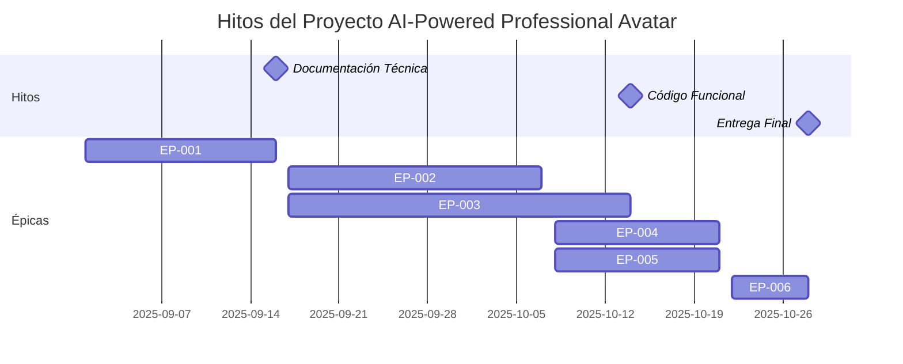
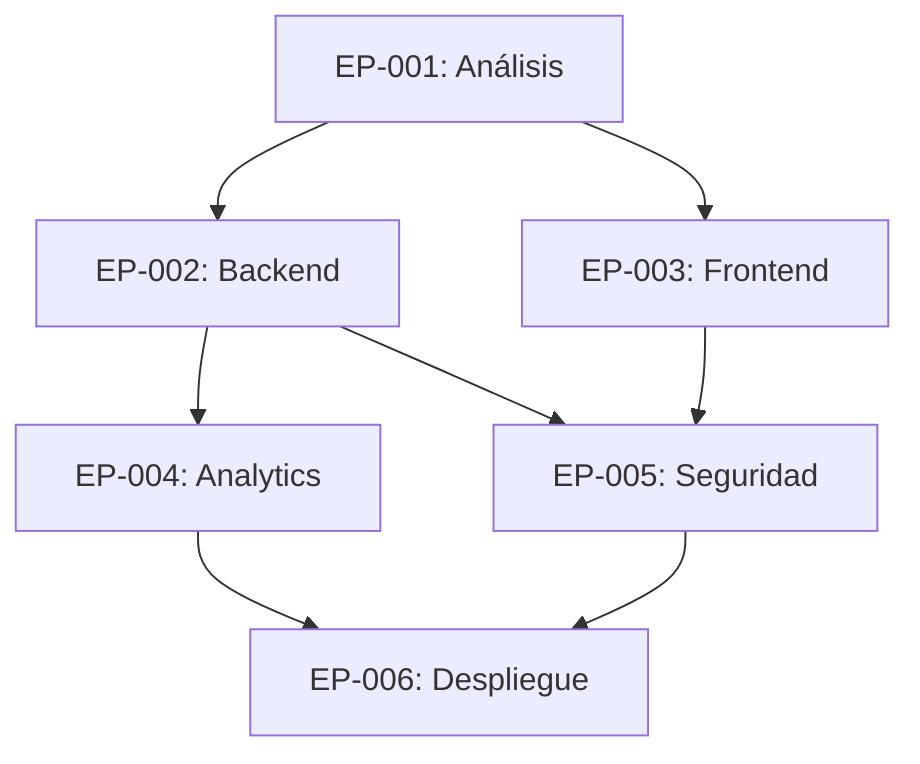

# Historias de Usuario

## Épicas Reorganizadas

### EP-001: Análisis y Planificación del Proyecto
**Descripción:** Actividades de análisis de requerimientos, planificación técnica y definición de arquitectura del sistema.

### EP-002: Desarrollo de Infraestructura y Backend
**Descripción:** Implementación del backend, base de datos, servicios de IA y APIs del sistema.

### EP-003: Desarrollo Frontend e Integración
**Descripción:** Desarrollo del widget de chatbot, integración con el portfolio existente y experiencia de usuario.

### EP-004: Sistema de Analytics y Métricas
**Descripción:** Implementación del sistema de análisis, métricas y feedback para mejora continua.

### EP-005: Seguridad, Testing y Calidad
**Descripción:** Implementación de medidas de seguridad, suite de pruebas y aseguramiento de calidad.

### EP-006: Despliegue, Monitoreo y Operaciones
**Descripción:** Despliegue en producción, configuración de monitoreo y operaciones del sistema.

---

## EP-001: Análisis y Planificación del Proyecto

### HDU-001: Análisis de Requerimientos del Sistema
Como Product Owner,
quiero analizar y documentar todos los requerimientos funcionales y no funcionales del sistema,
para que el equipo de desarrollo tenga una comprensión clara de lo que se debe construir.

**Criterios de Aceptación:**
- Dado que se realiza el análisis de requerimientos, cuando se complete la documentación, entonces debe incluir todos los casos de uso del chatbot.
- Dado que se definen los requerimientos no funcionales, cuando se documenten, entonces deben incluir performance, seguridad y escalabilidad.
- Dado que se identifican las integraciones, cuando se documenten, entonces deben incluir LinkedIn, GitHub, Vertex AI y Atlassian.

**Notas Adicionales:**
- Documentar en Confluence para trazabilidad.

**Tareas:**
- Realizar entrevistas con stakeholders
- Documentar casos de uso principales
- Definir requerimientos no funcionales
- Identificar integraciones necesarias
- Crear documento de requerimientos

---

### HDU-002: Diseño de Arquitectura del Sistema
Como Arquitecto de Software,
quiero diseñar la arquitectura técnica del sistema,
para que cumpla con los requerimientos de escalabilidad, mantenibilidad y rendimiento.

**Criterios de Aceptación:**
- Dado que se diseña la arquitectura, cuando se complete, entonces debe incluir diagramas de componentes y flujos.
- Dado que se definen las tecnologías, cuando se seleccionen, entonces deben estar alineadas con el stack de Google Cloud.
- Dado que se planifica la escalabilidad, cuando se diseñe, entonces debe soportar crecimiento futuro.

**Notas Adicionales:**
- Usar herramientas de diagramación como Mermaid.

**Tareas:**
- Diseñar arquitectura de componentes
- Definir stack tecnológico
- Planificar escalabilidad
- Documentar decisiones técnicas
- Crear diagramas de arquitectura

---

### HDU-003: Planificación de Sprints y Roadmap
Como Scrum Master,
quiero planificar los sprints y crear el roadmap del proyecto,
para que el equipo tenga una hoja de ruta clara y fechas de entrega definidas.

**Criterios de Aceptación:**
- Dado que se planifican los sprints, cuando se definan, entonces deben alinearse con las fechas de entrega del proyecto.
- Dado que se crea el roadmap, cuando se complete, entonces debe incluir hitos y dependencias.
- Dado que se estiman las tareas, cuando se hagan, entonces deben usar puntos de historia.

**Notas Adicionales:**
- Usar JIRA para gestión de sprints.

**Tareas:**
- Definir estructura de sprints
- Crear roadmap del proyecto
- Estimar historias de usuario
- Configurar JIRA con épicas y sprints
- Documentar planificación

---

## EP-002: Desarrollo de Infraestructura y Backend

### HDU-004: Configuración de Infraestructura en GCP
Como DevOps Engineer,
quiero configurar la infraestructura base en Google Cloud Platform,
para que el sistema tenga una base sólida y escalable.

**Criterios de Aceptación:**
- Dado que se configura GCP, cuando esté listo, entonces debe incluir todos los servicios necesarios.
- Dado que se configuran las bases de datos, cuando estén operativas, entonces deben estar conectadas y funcionando.
- Dado que se configuran los servicios de IA, cuando estén listos, entonces deben estar integrados con Vertex AI.

**Notas Adicionales:**
- Usar Terraform para infraestructura como código.

**Tareas:**
- Configurar proyecto GCP
- Configurar Cloud SQL PostgreSQL
- Configurar Vector Search
- Configurar Vertex AI
- Configurar Cloud Run
- Configurar Cloud Storage
- Configurar Cloud Monitoring

---

### HDU-005: Desarrollo del Backend API
Como Backend Developer,
quiero desarrollar la API REST del sistema,
para que el frontend pueda comunicarse con el backend de forma eficiente.

**Criterios de Aceptación:**
- Dado que se desarrolla la API, cuando esté completa, entonces debe incluir todos los endpoints necesarios.
- Dado que se implementa la autenticación, cuando esté funcionando, entonces debe ser segura y escalable.
- Dado que se documenta la API, cuando esté lista, entonces debe seguir estándares OpenAPI.

**Notas Adicionales:**
- Usar FastAPI para desarrollo rápido.

**Tareas:**
- Configurar proyecto FastAPI
- Implementar endpoints de chat
- Implementar endpoints de analytics
- Implementar autenticación JWT
- Implementar rate limiting
- Documentar API con OpenAPI
- Implementar logging y monitoreo

---

### HDU-006: Implementación del Sistema RAG
Como AI Engineer,
quiero implementar el sistema de Retrieval Augmented Generation,
para que el chatbot pueda proporcionar respuestas precisas y contextualizadas.

**Criterios de Aceptación:**
- Dado que se implementa RAG, cuando esté funcionando, entonces debe recuperar información relevante.
- Dado que se integra con Vertex AI, cuando esté conectado, entonces debe usar Gemini para generación.
- Dado que se procesan las fuentes de datos, cuando estén listas, entonces deben incluir LinkedIn y GitHub.

**Notas Adicionales:**
- Optimizar para latencia y precisión.

**Tareas:**
- Configurar Vector Search
- Implementar generación de embeddings
- Integrar con Vertex AI Gemini
- Implementar búsqueda semántica
- Configurar fuentes de datos
- Optimizar prompts y contexto
- Implementar fallback mechanisms

---

### HDU-007: Desarrollo de Base de Datos y Modelos
Como Data Engineer,
quiero diseñar e implementar la base de datos del sistema,
para que los datos se almacenen de forma eficiente y segura.

**Criterios de Aceptación:**
- Dado que se diseña la base de datos, cuando esté completa, entonces debe soportar todas las entidades necesarias.
- Dado que se implementan las migraciones, cuando estén listas, entonces deben ser reversibles y seguras.
- Dado que se configuran los índices, cuando estén optimizados, entonces deben mejorar el rendimiento.

**Notas Adicionales:**
- Usar SQLAlchemy como ORM.

**Tareas:**
- Diseñar esquema de base de datos
- Implementar modelos SQLAlchemy
- Crear migraciones
- Configurar índices
- Implementar seed data
- Configurar backup automático
- Implementar monitoreo de BD

---

## EP-003: Desarrollo Frontend e Integración

### HDU-008: Desarrollo del Widget de Chatbot
Como Frontend Developer,
quiero desarrollar el widget de chatbot para el portfolio,
para que los usuarios puedan interactuar de forma intuitiva.

**Criterios de Aceptación:**
- Dado que se desarrolla el widget, cuando esté completo, entonces debe integrarse perfectamente con el portfolio.
- Dado que se implementa la interfaz, cuando esté lista, entonces debe ser responsive y accesible.
- Dado que se conecta con el backend, cuando esté funcionando, entonces debe usar WebSockets para tiempo real.

**Notas Adicionales:**
- Mantener consistencia visual con el portfolio existente.

**Tareas:**
- Diseñar interfaz del widget
- Implementar componente React
- Integrar WebSockets
- Implementar manejo de estados
- Añadir animaciones y transiciones
- Implementar responsive design
- Configurar accesibilidad

---

### HDU-009: Integración con Portfolio Existente
Como Full Stack Developer,
quiero integrar el widget de chatbot con el portfolio React existente,
para que funcione como una extensión natural del sitio.

**Criterios de Aceptación:**
- Dado que se integra el widget, cuando esté funcionando, entonces debe aparecer en todas las páginas relevantes.
- Dado que se mantiene la consistencia, cuando esté integrado, entonces debe seguir el diseño del portfolio.
- Dado que se optimiza el rendimiento, cuando esté implementado, entonces no debe afectar la velocidad del sitio.

**Notas Adicionales:**
- Usar lazy loading para optimizar rendimiento.

**Tareas:**
- Analizar estructura del portfolio
- Integrar widget en componentes existentes
- Configurar routing y navegación
- Optimizar bundle size
- Implementar lazy loading
- Configurar variables de entorno
- Realizar pruebas de integración

---

### HDU-010: Implementación de Experiencia de Usuario
Como UX/UI Designer,
quiero diseñar e implementar una experiencia de usuario excepcional,
para que los usuarios tengan una interacción fluida y satisfactoria.

**Criterios de Aceptación:**
- Dado que se diseña la UX, cuando esté implementada, entonces debe ser intuitiva y fácil de usar.
- Dado que se implementa la UI, cuando esté lista, entonces debe ser atractiva y profesional.
- Dado que se optimiza la accesibilidad, cuando esté configurada, entonces debe cumplir estándares WCAG.

**Notas Adicionales:**
- Realizar testing de usabilidad con usuarios reales.

**Tareas:**
- Diseñar flujos de usuario
- Crear prototipos interactivos
- Implementar diseño visual
- Configurar accesibilidad
- Realizar testing de usabilidad
- Optimizar para diferentes dispositivos
- Implementar feedback visual

---

## EP-004: Sistema de Analytics y Métricas

### HDU-011: Implementación de Sistema de Analytics
Como Data Analyst,
quiero implementar un sistema de analytics completo,
para que podamos medir el rendimiento y mejorar el sistema continuamente.

**Criterios de Aceptación:**
- Dado que se implementa analytics, cuando esté funcionando, entonces debe recopilar métricas relevantes.
- Dado que se procesan los datos, cuando estén listos, entonces deben generar insights útiles.
- Dado que se visualizan las métricas, cuando estén disponibles, entonces deben ser fáciles de interpretar.

**Notas Adicionales:**
- Usar Google Analytics 4 y métricas personalizadas.

**Tareas:**
- Configurar Google Analytics 4
- Implementar tracking de eventos
- Crear métricas personalizadas
- Configurar dashboards
- Implementar reportes automáticos
- Configurar alertas
- Documentar métricas

---

### HDU-012: Sistema de Feedback y Satisfacción
Como Product Manager,
quiero implementar un sistema de feedback para medir la satisfacción del usuario,
para que podamos mejorar continuamente la calidad del servicio.

**Criterios de Aceptación:**
- Dado que se implementa el feedback, cuando esté funcionando, entonces debe ser fácil de usar.
- Dado que se procesan las respuestas, cuando estén listas, entonces deben generar insights accionables.
- Dado que se integra con analytics, cuando esté conectado, entonces debe enriquecer las métricas.

**Notas Adicionales:**
- Implementar feedback tanto positivo como negativo.

**Tareas:**
- Diseñar sistema de feedback
- Implementar formularios de rating
- Configurar procesamiento de feedback
- Integrar con sistema de analytics
- Implementar alertas de satisfacción baja
- Crear reportes de feedback
- Configurar notificaciones

---

### HDU-013: Análisis de Preguntas Frecuentes
Como Content Strategist,
quiero analizar las preguntas más frecuentes de los usuarios,
para que podamos mejorar la base de conocimiento y las respuestas.

**Criterios de Aceptación:**
- Dado que se analizan las preguntas, cuando esté completo, entonces debe identificar patrones claros.
- Dado que se categorizan las consultas, cuando estén organizadas, entonces deben facilitar mejoras.
- Dado que se generan insights, cuando estén disponibles, entonces deben ser accionables.

**Notas Adicionales:**
- Usar NLP para categorización automática.

**Tareas:**
- Implementar tracking de preguntas
- Configurar categorización automática
- Crear análisis de frecuencia
- Generar reportes de tendencias
- Identificar gaps en conocimiento
- Proponer mejoras de contenido
- Configurar alertas de nuevas preguntas

---

## EP-005: Seguridad, Testing y Calidad

### HDU-014: Implementación de Medidas de Seguridad
Como Security Engineer,
quiero implementar medidas de seguridad robustas,
para que el sistema esté protegido contra amenazas y cumpla con estándares de seguridad.

**Criterios de Aceptación:**
- Dado que se implementa la seguridad, cuando esté configurada, entonces debe cumplir con OWASP Top 10 for LLM.
- Dado que se protegen los datos, cuando estén seguros, entonces deben estar cifrados en reposo y tránsito.
- Dado que se monitorea la seguridad, cuando esté activo, entonces debe detectar amenazas en tiempo real.

**Notas Adicionales:**
- Realizar auditoría de seguridad externa.

**Tareas:**
- Implementar autenticación JWT
- Configurar HTTPS obligatorio
- Implementar rate limiting
- Configurar WAF
- Implementar logging de seguridad
- Configurar alertas de seguridad
- Realizar penetration testing

---

### HDU-015: Suite Completa de Testing
Como QA Engineer,
quiero implementar una suite completa de pruebas,
para que el sistema sea confiable y de alta calidad.

**Criterios de Aceptación:**
- Dado que se implementan las pruebas, cuando estén completas, entonces debe tener cobertura >90%.
- Dado que se automatizan las pruebas, cuando estén configuradas, entonces deben ejecutarse en CI/CD.
- Dado que se validan los casos críticos, cuando estén cubiertos, entonces deben incluir edge cases.

**Notas Adicionales:**
- Implementar testing de performance y carga.

**Tareas:**
- Configurar framework de testing
- Implementar unit tests
- Implementar integration tests
- Implementar e2e tests
- Configurar testing de performance
- Configurar testing de seguridad
- Configurar CI/CD pipeline

---

### HDU-016: Aseguramiento de Calidad
Como QA Lead,
quiero establecer procesos de aseguramiento de calidad,
para que el software entregado cumpla con los estándares de calidad.

**Criterios de Aceptación:**
- Dado que se establecen los procesos, cuando estén implementados, entonces deben ser consistentes.
- Dado que se definen los estándares, cuando estén documentados, entonces deben ser medibles.
- Dado que se monitorea la calidad, cuando esté activo, entonces debe generar métricas claras.

**Notas Adicionales:**
- Implementar code review obligatorio.

**Tareas:**
- Definir estándares de calidad
- Configurar code review
- Implementar linting automático
- Configurar métricas de calidad
- Establecer proceso de release
- Configurar testing de regresión
- Documentar procesos de QA

---

## EP-006: Despliegue, Monitoreo y Operaciones

### HDU-017: Configuración de CI/CD Pipeline
Como DevOps Engineer,
quiero configurar un pipeline de CI/CD robusto,
para que el despliegue sea automatizado, seguro y confiable.

**Criterios de Aceptación:**
- Dado que se configura CI/CD, cuando esté funcionando, entonces debe automatizar todo el proceso.
- Dado que se implementa la seguridad, cuando esté configurada, entonces debe incluir escaneo de vulnerabilidades.
- Dado que se configura el rollback, cuando esté listo, entonces debe permitir reversión rápida.

**Notas Adicionales:**
- Usar GitHub Actions para automatización.

**Tareas:**
- Configurar GitHub Actions
- Implementar build automatizado
- Configurar testing automático
- Implementar security scanning
- Configurar despliegue automático
- Implementar rollback automático
- Configurar notificaciones

---

### HDU-018: Despliegue en Producción
Como Release Manager,
quiero desplegar el sistema en producción de forma segura,
para que esté disponible para los usuarios finales.

**Criterios de Aceptación:**
- Dado que se despliega en producción, cuando esté funcionando, entonces debe estar disponible 24/7.
- Dado que se configura el monitoreo, cuando esté activo, entonces debe detectar problemas proactivamente.
- Dado que se documenta el despliegue, cuando esté completo, entonces debe incluir runbooks.

**Notas Adicionales:**
- Realizar despliegue gradual (blue-green).

**Tareas:**
- Configurar ambiente de producción
- Implementar blue-green deployment
- Configurar load balancer
- Configurar SSL certificates
- Configurar DNS
- Documentar runbooks
- Realizar pruebas de producción

---

### HDU-019: Sistema de Monitoreo y Alertas
Como SRE Engineer,
quiero implementar un sistema de monitoreo completo,
para que podamos detectar y resolver problemas proactivamente.

**Criterios de Aceptación:**
- Dado que se implementa el monitoreo, cuando esté funcionando, entonces debe cubrir todos los componentes.
- Dado que se configuran las alertas, cuando estén activas, entonces deben ser relevantes y accionables.
- Dado que se visualizan las métricas, cuando estén disponibles, entonces deben ser fáciles de interpretar.

**Notas Adicionales:**
- Usar Google Cloud Monitoring y Logging.

**Tareas:**
- Configurar Cloud Monitoring
- Configurar Cloud Logging
- Implementar health checks
- Configurar alertas automáticas
- Crear dashboards de monitoreo
- Configurar log aggregation
- Implementar error tracking

---

### HDU-020: Operaciones y Mantenimiento
Como Operations Engineer,
quiero establecer procesos de operaciones y mantenimiento,
para que el sistema funcione de forma confiable y eficiente.

**Criterios de Aceptación:**
- Dado que se establecen las operaciones, cuando estén implementadas, entonces deben ser eficientes.
- Dado que se configura el mantenimiento, cuando esté programado, entonces debe minimizar el downtime.
- Dado que se documentan los procesos, cuando estén listos, entonces deben ser claros y accesibles.

**Notas Adicionales:**
- Implementar on-call rotation.

**Tareas:**
- Establecer procesos de operaciones
- Configurar mantenimiento programado
- Implementar backup y recovery
- Configurar on-call rotation
- Documentar procedimientos
- Configurar escalamiento
- Implementar post-mortem process

---

## Resumen de Épicas y Hitos

### Hitos del Proyecto

### Distribución de Esfuerzo por Épica
- **EP-001:** 15% (4.5 horas) - Análisis y planificación
- **EP-002:** 35% (10.5 horas) - Desarrollo de backend e infraestructura
- **EP-003:** 25% (7.5 horas) - Desarrollo frontend e integración
- **EP-004:** 10% (3 horas) - Analytics y métricas
- **EP-005:** 10% (3 horas) - Seguridad y testing
- **EP-006:** 5% (1.5 horas) - Despliegue y operaciones

### Dependencias entre Épicas
