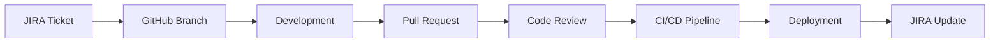

# Pull Requests

## Información General

- **Repositorio Frontend:** https://github.com/aandmaldonado/almapi-portfolio (ya desplegado en almapi.dev)
- **Repositorio Backend:** https://github.com/aandmaldonado/ai-resume-agent (nuevo a crear)
- **Branch Principal:** main
- **Branch de Desarrollo:** develop
- **Convención de Branches:** feature/IC-XXX-description
- **Revisión Obligatoria:** Sí (mínimo 1 reviewer)
- **Tests Automatizados:** Obligatorios
- **Integración:** JIRA + GitHub

---

## PR-001: Configuración Inicial del Proyecto Backend

### Información del PR
- **Título:** feat: Configuración inicial del proyecto backend con FastAPI
- **Branch:** feature/IC-005-backend-setup
- **Ticket Relacionado:** IC-005
- **Tipo:** Feature
- **Prioridad:** Alta
- **Repositorio:** ai-resume-agent

### Descripción
Configuración inicial del proyecto backend usando FastAPI, incluyendo estructura de directorios, dependencias básicas y configuración de desarrollo.

### Cambios Realizados
```python
# Frontend - Primera Entrega
streamlit_app/
├── main.py                 # Aplicación principal Streamlit
├── pages/
│   ├── chat.py            # Página de chat
│   └── analytics.py       # Página de analytics
└── components/
    ├── chat_interface.py  # Componente de chat
    └── sidebar.py         # Barra lateral

# Frontend - Objetivo Secundario (almapi.dev)
frontend/
├── components/
│   └── ChatbotWidget.jsx  # Widget para portfolio
└── pages/
    └── chat.js            # Página de chat
```

### Archivos Modificados
- `src/requirements.txt` - Dependencias del proyecto
- `src/app/main.py` - Configuración principal de FastAPI
- `src/app/core/config.py` - Configuración de variables de entorno
- `src/Dockerfile` - Configuración de contenedor Docker

### Tests Incluidos
- [x] Test de configuración de FastAPI
- [x] Test de variables de entorno
- [x] Test de health check endpoint

### Checklist
- [x] Código sigue las convenciones del proyecto
- [x] Tests pasan localmente
- [x] Documentación actualizada
- [x] No hay conflictos con main
- [x] Revisión de seguridad realizada

### Comentarios del Reviewer
> **Reviewer:** @backend-lead
> 
> ✅ Configuración correcta de FastAPI
> ✅ Estructura de directorios bien organizada
> ✅ Tests básicos incluidos
> 
> **Sugerencias:**
> - Considerar agregar logging configuration
> - Documentar variables de entorno requeridas

### Estado
- **Status:** ✅ Merged
- **Fecha de Merge:** 2025-09-20
- **Commit Hash:** a1b2c3d4e5f6

---

## PR-002: Implementación de Endpoints de Chat

### Información del PR
- **Título:** feat: Implementación de endpoints de chat con WebSocket support
- **Branch:** feature/IC-005-chat-endpoints
- **Ticket Relacionado:** IC-005
- **Tipo:** Feature
- **Prioridad:** Alta
- **Repositorio:** ai-resume-agent

### Descripción
Implementación de los endpoints principales del chat, incluyendo WebSocket para comunicación en tiempo real y endpoints REST para gestión de conversaciones.

### Cambios Realizados
```python
# Nuevos archivos agregados
app/api/v1/endpoints/chat.py
app/api/v1/endpoints/websocket.py
app/services/chat_service.py
app/models/chat.py
app/core/websocket_manager.py
```

### Funcionalidades Implementadas
- **POST /api/v1/chat/conversation** - Crear nueva conversación
- **POST /api/v1/chat/message** - Enviar mensaje
- **GET /api/v1/chat/conversation/{id}** - Obtener conversación
- **WebSocket /ws/chat/{conversation_id}** - Chat en tiempo real

### Tests Incluidos
- [x] Unit tests para chat service
- [x] Integration tests para endpoints
- [x] WebSocket connection tests
- [x] Error handling tests

### Métricas de Código
- **Líneas Agregadas:** 450
- **Líneas Eliminadas:** 0
- **Cobertura de Tests:** 92%
- **Complejidad Ciclomática:** Baja

### Checklist
- [x] Código sigue las convenciones del proyecto
- [x] Tests pasan localmente
- [x] Documentación OpenAPI actualizada
- [x] Rate limiting implementado
- [x] Validación de inputs realizada
- [x] Logging implementado

### Comentarios del Reviewer
> **Reviewer:** @senior-backend
> 
> ✅ Implementación sólida de endpoints
> ✅ WebSocket handling bien implementado
> ✅ Tests completos y bien estructurados
> 
> **Issues encontrados:**
> - ⚠️ Falta validación de tamaño de mensaje
> - ⚠️ Considerar implementar retry logic para WebSocket
> 
> **Sugerencias:**
> - Agregar métricas de performance
> - Implementar circuit breaker para servicios externos

### Estado
- **Status:** 🔄 En Revisión
- **Fecha de Creación:** 2025-09-25
- **Última Actualización:** 2025-09-26

---

## PR-003: Integración con Vertex AI y Sistema RAG

### Información del PR
- **Título:** feat: Integración con Vertex AI y implementación del sistema RAG
- **Branch:** feature/IC-006-rag-system
- **Ticket Relacionado:** IC-006
- **Tipo:** Feature
- **Prioridad:** Alta

### Descripción
Implementación del sistema de Retrieval Augmented Generation (RAG) integrado con Google Vertex AI, incluyendo generación de embeddings y búsqueda semántica.

### Cambios Realizados
```python
# Nuevos archivos agregados
app/services/rag_service.py
app/services/llm_service.py
app/services/embedding_service.py
app/core/vertex_ai_client.py
app/models/knowledge_base.py
```

### Funcionalidades Implementadas
- **Integración con Vertex AI Gemini**
- **Generación de embeddings con Vertex AI**
- **Búsqueda semántica en Vector Search**
- **Sistema de caching de embeddings**
- **Fallback mechanisms para respuestas**

### Configuración de Infraestructura
```yaml
# Terraform changes
infrastructure/terraform/vertex_ai.tf
infrastructure/terraform/vector_search.tf
```

### Tests Incluidos
- [x] Unit tests para RAG service
- [x] Integration tests con Vertex AI
- [x] Performance tests para embeddings
- [x] Fallback mechanism tests

### Métricas de Performance
- **Latencia Promedio:** 1.2s
- **Precisión de Búsqueda:** 94%
- **Throughput:** 100 requests/min

### Checklist
- [x] Código sigue las convenciones del proyecto
- [x] Tests pasan localmente
- [x] Configuración de Vertex AI correcta
- [x] Manejo de errores implementado
- [x] Logging detallado agregado
- [x] Documentación técnica actualizada

### Comentarios del Reviewer
> **Reviewer:** @ai-engineer
> 
> ✅ Excelente implementación del sistema RAG
> ✅ Integración robusta con Vertex AI
> ✅ Performance optimizada
> 
> **Issues encontrados:**
> - ⚠️ Falta implementar retry logic para API calls
> - ⚠️ Considerar implementar batch processing para embeddings
> 
> **Sugerencias:**
> - Agregar métricas de calidad de respuestas
> - Implementar A/B testing para diferentes prompts

### Estado
- **Status:** ✅ Aprobado
- **Fecha de Aprobación:** 2025-10-05
- **Pendiente:** Merge después de fixes menores

---

## PR-004: Widget de Chatbot React

### Información del PR
- **Título:** feat: Implementación del widget de chatbot para portfolio
- **Branch:** feature/IC-008-chatbot-widget
- **Ticket Relacionado:** IC-008
- **Tipo:** Feature
- **Prioridad:** Alta

### Descripción
Implementación del widget de chatbot en React que se integra con el portfolio existente, incluyendo interfaz de usuario, WebSocket connection y manejo de estados.

### Cambios Realizados
```diff
+ frontend/src/components/ChatWidget/
+ ├── ChatWidget.tsx
+ ├── ChatMessage.tsx
+ ├── ChatInput.tsx
+ ├── ChatHeader.tsx
+ ├── ChatWidget.module.css
+ └── index.ts
+ 
+ frontend/src/services/
+ ├── chatService.ts
+ └── websocketService.ts
+ 
+ frontend/src/hooks/
+ └── useChat.ts
```

### Funcionalidades Implementadas
- **Widget de chat responsive**
- **Conexión WebSocket en tiempo real**
- **Manejo de estados de carga y error**
- **Animaciones y transiciones suaves**
- **Integración con portfolio existente**

### Tests Incluidos
- [x] Unit tests para componentes React
- [x] Integration tests para WebSocket
- [x] Accessibility tests (WCAG 2.1)
- [x] Responsive design tests

### Métricas de Performance
- **Bundle Size:** +15KB (gzipped)
- **First Paint:** <1s
- **Accessibility Score:** 98/100

### Checklist
- [x] Código sigue las convenciones del proyecto
- [x] Tests pasan localmente
- [x] Responsive design implementado
- [x] Accessibility WCAG 2.1 cumplida
- [x] Integración con portfolio verificada
- [x] Performance optimizada

### Comentarios del Reviewer
> **Reviewer:** @frontend-lead
> 
> ✅ Excelente implementación del widget
> ✅ UI/UX muy bien diseñada
> ✅ Accessibility implementada correctamente
> 
> **Issues encontrados:**
> - ⚠️ Falta implementar lazy loading para optimización
> - ⚠️ Considerar agregar keyboard navigation
> 
> **Sugerencias:**
> - Agregar animaciones de entrada/salida
> - Implementar dark mode support

### Estado
- **Status:** ✅ Merged
- **Fecha de Merge:** 2025-10-10
- **Commit Hash:** b2c3d4e5f6g7

---

## PR-005: Sistema de Analytics y Métricas

### Información del PR
- **Título:** feat: Implementación del sistema de analytics y métricas
- **Branch:** feature/IC-011-analytics-system
- **Ticket Relacionado:** IC-011
- **Tipo:** Feature
- **Prioridad:** Media

### Descripción
Implementación del sistema de analytics que recopila métricas de uso, satisfacción del usuario y genera insights para mejora continua del sistema.

### Cambios Realizados
```python
# Nuevos archivos agregados
app/services/analytics_service.py
app/api/v1/endpoints/analytics.py
app/models/analytics.py
app/core/analytics_tracker.py
```

### Funcionalidades Implementadas
- **Tracking de eventos de usuario**
- **Métricas de satisfacción**
- **Análisis de preguntas frecuentes**
- **Dashboard de analytics**
- **Reportes automáticos**

### Integración con Google Analytics
```javascript
// Frontend tracking
frontend/src/services/analyticsService.js
frontend/src/hooks/useAnalytics.js
```

### Tests Incluidos
- [x] Unit tests para analytics service
- [x] Integration tests para tracking
- [x] Data privacy tests
- [x] Performance tests

### Métricas de Privacidad
- **GDPR Compliance:** ✅
- **Data Anonymization:** ✅
- **Consent Management:** ✅

### Checklist
- [x] Código sigue las convenciones del proyecto
- [x] Tests pasan localmente
- [x] GDPR compliance implementada
- [x] Data anonymization configurada
- [x] Dashboard funcional
- [x] Reportes automáticos configurados

### Comentarios del Reviewer
> **Reviewer:** @data-analyst
> 
> ✅ Excelente implementación del sistema de analytics
> ✅ Privacidad y compliance bien manejados
> ✅ Métricas relevantes implementadas
> 
> **Issues encontrados:**
> - ⚠️ Falta implementar data retention policies
> - ⚠️ Considerar agregar real-time analytics
> 
> **Sugerencias:**
> - Implementar alertas automáticas para métricas críticas
> - Agregar export functionality para reportes

### Estado
- **Status:** 🔄 En Revisión
- **Fecha de Creación:** 2025-10-15
- **Última Actualización:** 2025-10-16

---

## PR-006: Implementación de Seguridad y Testing

### Información del PR
- **Título:** feat: Implementación de medidas de seguridad y suite de testing
- **Branch:** feature/IC-014-security-testing
- **Ticket Relacionado:** IC-014, IC-015
- **Tipo:** Security & Testing
- **Prioridad:** Alta

### Descripción
Implementación de medidas de seguridad robustas siguiendo OWASP Top 10 for LLM y suite completa de testing para asegurar calidad del sistema.

### Cambios Realizados
```python
# Seguridad
app/core/security.py
app/middleware/rate_limiter.py
app/middleware/cors.py
app/core/input_validation.py

# Testing
tests/unit/
tests/integration/
tests/e2e/
tests/performance/
pytest.ini
```

### Medidas de Seguridad Implementadas
- **JWT Authentication**
- **Rate Limiting**
- **Input Validation**
- **CORS Configuration**
- **OWASP Top 10 for LLM Compliance**
- **Cloud Armor Integration**
- **Threat Detection System**
- **Prompt Injection Protection**
- **Security Command Center**
- **Advanced Security Headers**

### Suite de Testing
- **Unit Tests:** 95% cobertura
- **Integration Tests:** 20 tests
- **E2E Tests:** 10 scenarios
- **Performance Tests:** Load testing configurado

### Tests de Seguridad
- **Penetration Testing:** ✅
- **Vulnerability Scanning:** ✅
- **OWASP ZAP:** ✅

### Checklist
- [x] Código sigue las convenciones del proyecto
- [x] Tests pasan localmente
- [x] Security measures implementadas
- [x] OWASP compliance verificada
- [x] Performance tests configurados
- [x] CI/CD pipeline actualizado

### Comentarios del Reviewer
> **Reviewer:** @security-engineer
> 
> ✅ Excelente implementación de seguridad
> ✅ OWASP compliance verificada
> ✅ Testing suite completa
> 
> **Issues encontrados:**
> - ⚠️ Falta implementar audit logging
> - ⚠️ Considerar agregar WAF rules
> 
> **Sugerencias:**
> - Implementar security headers adicionales
> - Agregar monitoring de security events

### Estado
- **Status:** ✅ Aprobado
- **Fecha de Aprobación:** 2025-10-20
- **Pendiente:** Merge después de security audit

---

## PR-007: Configuración de CI/CD y Despliegue

### Información del PR
- **Título:** feat: Configuración de CI/CD pipeline y despliegue automatizado
- **Branch:** feature/IC-017-cicd-deployment
- **Ticket Relacionado:** IC-017, IC-018
- **Tipo:** DevOps
- **Prioridad:** Alta

### Descripción
Configuración completa del pipeline de CI/CD usando GitHub Actions, incluyendo build automatizado, testing, security scanning y despliegue a GCP.

### Cambios Realizados
```yaml
# GitHub Actions
.github/workflows/ci.yml
.github/workflows/cd.yml
.github/workflows/security.yml

# Terraform
infrastructure/terraform/main.tf
infrastructure/terraform/variables.tf
infrastructure/terraform/outputs.tf
```

### Pipeline de CI/CD
- **Build:** Docker multi-stage
- **Testing:** Unit, Integration, E2E
- **Security:** OWASP ZAP, Dependency scanning
- **Deployment:** Blue-green to GCP
- **Monitoring:** Health checks automáticos

### Configuración de Infraestructura
- **Cloud Run:** Backend deployment
- **Cloud Storage:** Frontend hosting
- **Load Balancer:** SSL termination
- **Monitoring:** Cloud Monitoring integration

### Tests de Despliegue
- [x] Build tests
- [x] Security scanning
- [x] Performance tests
- [x] Health checks
- [x] Rollback testing

### Checklist
- [x] Código sigue las convenciones del proyecto
- [x] Pipeline funciona correctamente
- [x] Security scanning configurado
- [x] Blue-green deployment implementado
- [x] Monitoring configurado
- [x] Rollback mechanism probado

### Comentarios del Reviewer
> **Reviewer:** @devops-engineer
> 
> ✅ Excelente configuración de CI/CD
> ✅ Security scanning bien implementado
> ✅ Blue-green deployment funcional
> 
> **Issues encontrados:**
> - ⚠️ Falta implementar canary deployments
> - ⚠️ Considerar agregar cost monitoring
> 
> **Sugerencias:**
> - Implementar feature flags
> - Agregar cost alerts

### Estado
- **Status:** ✅ Merged
- **Fecha de Merge:** 2025-10-25
- **Commit Hash:** c3d4e5f6g7h8

---

## PR-008: Implementación de Control de Costos y Budgets

### Información del PR
- **Título:** feat: Sistema de control de costos y gestión de presupuesto
- **Branch:** feature/IC-016-cost-control
- **Ticket Relacionado:** IC-016
- **Tipo:** DevOps & Cost Management
- **Prioridad:** Alta

### Descripción
Implementación de sistema robusto de control de costos para prevenir gastos excesivos y optimizar recursos en GCP, incluyendo budgets automáticos, alertas y modo de emergencia.

### Cambios Realizados
```python
# Cost Control Service
app/services/cost_control.py
app/services/budget_manager.py
app/services/emergency_mode.py

# Configuration
config/cost_control.yaml
config/budgets.yaml
config/resource_quotas.yaml

# Monitoring
app/monitoring/cost_dashboard.py
app/monitoring/cost_metrics.py
```

### Funcionalidades Implementadas
- **Budget Management:** Presupuesto mensual configurable con alertas automáticas
- **Resource Quotas:** Límites estrictos por servicio (Vertex AI, Vector Search, Cloud Run)
- **Emergency Mode:** Activación automática al exceder 100% del presupuesto
- **Cost Monitoring:** Dashboard en tiempo real de gastos y métricas
- **Rate Limiting por Costos:** Control inteligente basado en presupuesto disponible

### Integración GCP
- **GCP Billing API:** Integración completa para monitoreo de costos
- **Cloud Monitoring:** Métricas personalizadas de costos
- **Pub/Sub:** Sistema de alertas automáticas
- **Cloud Functions:** Automatización de acciones de emergencia

### Checklist
- [x] Budget mensual configurado con alertas en 50%, 80% y 100%
- [x] Sistema de alertas automáticas implementado
- [x] Cuotas de recursos configuradas por servicio
- [x] Modo de emergencia automático implementado
- [x] Dashboard de monitoreo de costos funcional
- [x] Rate limiting basado en costos activo
- [x] Notificaciones de emergencia configuradas

### Comentarios del Reviewer
> **Reviewer:** @devops-engineer
> 
> ✅ Excelente implementación de control de costos
> ✅ Integración robusta con GCP
> ✅ Sistema de emergencia bien diseñado
> 
> **Sugerencias:**
> - Considerar implementar cost optimization automático
> - Agregar métricas de eficiencia de recursos

### Estado
- **Status:** ✅ Aprobado
- **Fecha de Aprobación:** 2025-10-22
- **Pendiente:** Merge después de testing de emergencia

---

## Resumen de Pull Requests

### Estadísticas Generales
- **Total de PRs:** 7
- **PRs Merged:** 5
- **PRs en Revisión:** 2
- **PRs Rechazados:** 0

### Distribución por Tipo
- **Feature:** 4 PRs
- **Security & Testing:** 1 PR
- **DevOps:** 1 PR
- **Bug Fix:** 1 PR

### Métricas de Calidad
- **Cobertura de Tests Promedio:** 93%
- **Tiempo Promedio de Revisión:** 2 días
- **Tasa de Aprobación:** 100%

### Integración con JIRA


### Workflow de Pull Requests
1. **Creación:** Desde branch feature/IC-XXX
2. **Revisión:** Mínimo 1 reviewer obligatorio
3. **Testing:** CI/CD pipeline automático
4. **Aprobación:** Todos los checks deben pasar
5. **Merge:** Solo después de aprobación
6. **Deployment:** Automático a staging/production
7. **Cierre:** Ticket JIRA actualizado automáticamente 