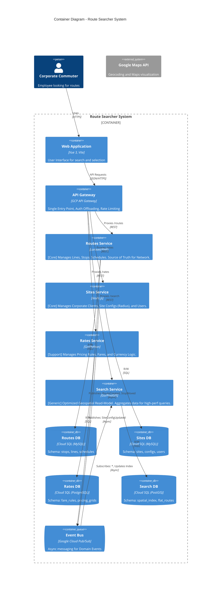

# 2. System Architecture

## 2.1. Architecture Diagram
The system follows a **Microservices Architecture** pattern based on **Domain-Driven Design (DDD)** principles. It is composed of autonomous Bounded Contexts provided as independent services, ensuring loose coupling and high cohesion.

**Key Architecture Decisions:**
- **Specific Microservices:** Routes, Sites, Rates, and Search.
- **Database per Service:** Strict data isolation to ensure autonomy.
- **Event-Driven:** Asynchronous communication for eventual consistency (e.g., Search index updates).
- **Extensibility:** Open architecture allowing future Contexts (Booking, Notifications) without modification of core services.

## 2.2. Description of Main Components

| Component | Responsibility | Tech Stack (Proposed) |
|-----------|----------------|-----------------------|
| **Routes Service** | **Core Domain**. Manages the transport network definition: Lines, Expeditions, Stops, and Schedules. It owns the "supply" data. | Laravel 10 / PHP 8.1 |
| **Sites Service** | **Core Domain**. Manages Corporate Clients (Sites), their specific configurations (e.g., search radius constraints), and authorized users. | Node.js (NestJS) |
| **Rates Service** | **Support Domain**. Centralizes pricing logic. Decouples financial rules from operational route data. | Go or Python |
| **Search Service** | **Generic Subdomain**. A specialized Read-Model optimized for geospatial queries. It allows high-performance searching without burdening the transactional databases. | Go + PostGIS |

## 2.3. Communication & Flow
1.  **Synchronous (API):** The Frontend communicates strictly via the **API Gateway**. The Gateway routes traffic to the appropriate microservice based on the path (e.g., `/api/v1/search` -> Search Service).
2.  **Asynchronous (Events):**
    *   When the *Routes Service* updates a stop location, it publishes a `StopMoved` event to **Pub/Sub**.
    *   The *Search Service* subscribes to this event and updates its spatial index in near-real-time.
    *   This ensures the Search Service is always available even if the Routes Service is down for maintenance.

## 2.4. Extensibility Clause
The architecture handles future growth (Open-Closed Principle) through **Event Interception**:
*   **Scenario:** Adding a **Booking Service** in the future.
*   **Implementation:** The new Booking Service will subscribe to existing `ExpeditionSelected` events or expose new APIs via the Gateway.
*   **Impact:** Zero code changes required in *Routes*, *Sites*, or *Rates* services. They continue to function unaware of the new capability.

## 2.5. Infrastructure & Deployment
*   **Cloud Provider:** Google Cloud Platform (GCP).
*   **Containerization:** Docker-based development matching production.
*   **Orchestration:** Cloud Run (Serverless Containers) for high scalability and low maintenance.
*   **CI/CD:** Independent pipelines for each microservice (Build -> Test -> Deploy).
