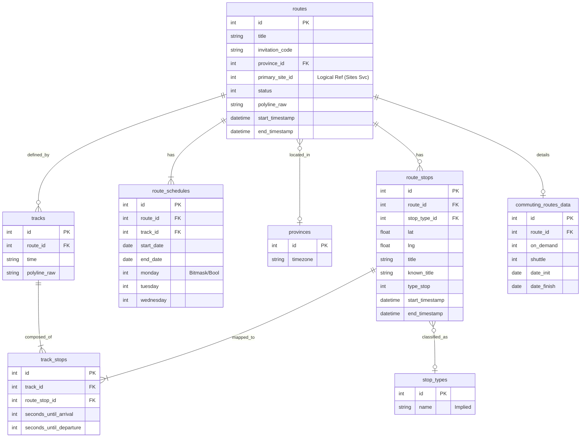
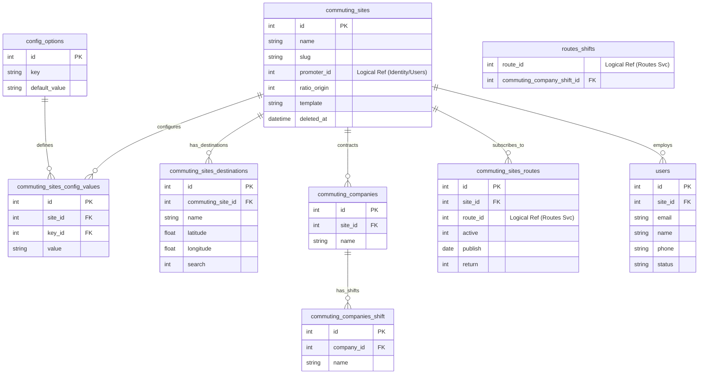
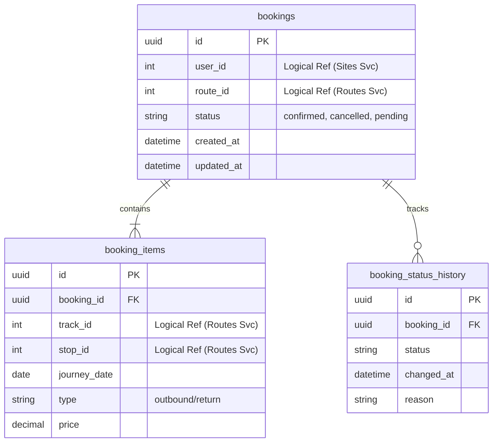
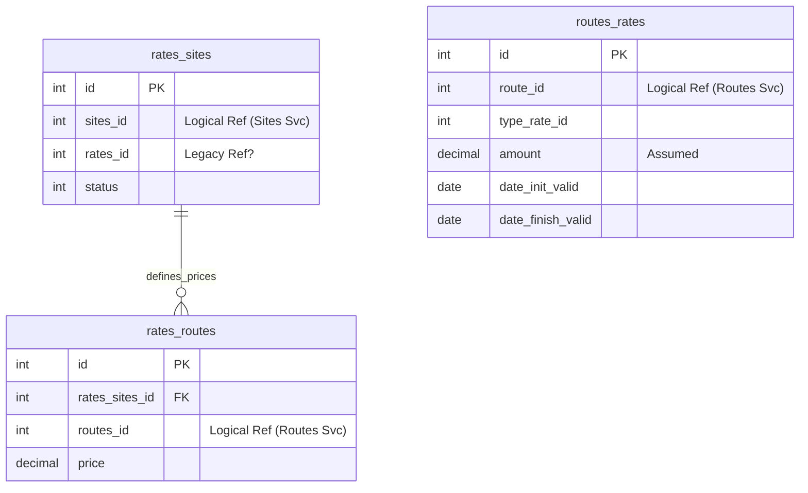
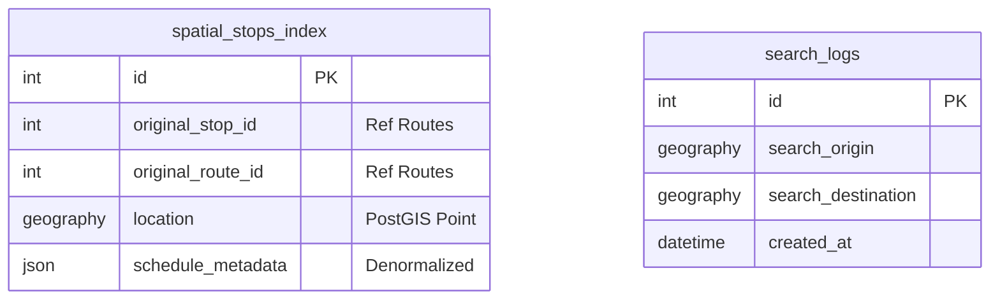

# 3. Data Model

## 3.1. Overview
The Data Model is designed according to the **Database-per-Service** pattern. The monolithic schema has been decomposed into four isolated schemas corresponding to the architectural Bounded Contexts.

- **Data Ownership**: Each service owns its specific tables.
- **Relationships**: Cross-service relationships are handled via **Logical IDs** (Stored as Integer/UUID) and not Database Foreign Keys.
- **Integrity**: Referential integrity across services is maintained eventually via Domain Events (e.g., `RouteDeleted` event cleans up references in `Sites Service`).

---

## 3.2. Service-by-Service Data Model

### 3.2.1. Routes Service (Core Domain)
Responsible for the distinct definition of the transport network (Lines, Stops, Schedules).

#### Entities Description - Routes Service
| Entity | Description | PK | Constraints |
| :--- | :--- | :--- | :--- |
| **routes** | Core entity representing a transport line. | `id` | `province_id` not null. `primary_site_id` is a logical reference to Sites DB. |
| **route_stops** | Physical stops (Lat/Lng) associated with a route. | `id` | `route_id` FK. |
| **route_schedules** | Calendar availability for a route. | `id` | `route_id` FK. |
| **tracks** | Specific path or expedition variants within a route. | `id` | `route_id` FK. |
| **track_stops** | Timing details (arrival/departure) for stops on a specific track. | `id` | `track_id` FK, `route_stop_id` FK. |

---

### 3.2.2. Sites Service (Core Domain)
Responsible for Corporate Clients, Site configurations, and Service subscriptions.

#### Entities Description - Sites Service
| Entity | Description | PK | Constraints |
| :--- | :--- | :--- | :--- |
| **commuting_sites** | Represents a Client Site (Office/Factory). | `id` | `slug` Unique. `promoter_id` Log Ref. |
| **commuting_sites_routes** | **Join Table managed by Sites**. Defines which Routes are active/published for a specific Site. | `id` | `site_id` FK. `route_id` is a Logical Reference to Routes DB. |
| **commuting_companies** | Legal entities or sub-divisions operating within a Site. | `id` | `site_id` FK. |
| **routes_shifts** | Association of Shift times to Routes. Managed here as Shifts belong to Companies. | Composite | `commuting_company_shift_id` FK. `route_id` Logical Ref. |
| **users** | **Passengers/Employees**. The end-users who make bookings. | `id` | `site_id` FK. `email` Unique. |

> **Note:** `sites` table from legacy schema appears redundant with `commuting_sites` or `commuting_companies`. Mapped `commuting_sites` as the primary aggregate root.

---

### 3.2.3. Booking Service (Core Domain)
Responsible for the lifecycle of passenger reservations.

#### Entities Description - Booking Service
| Entity | Description | PK | Constraints |
| :--- | :--- | :--- | :--- |
| **bookings** | Represents a user's reservation for a route. | `id` (UUID) | `user_id` Logical Ref. `route_id` Logical Ref. |
| **booking_items** | Individual trips within a booking (e.g., specific day/expedition). | `id` (UUID) | `booking_id` FK. |
| **booking_status_history** | Audit trail for booking status changes. | `id` (UUID) | `booking_id` FK. |

---

### 3.2.4. Rates Service (Support Domain)
Responsible for Pricing Logic and Fares.

#### Entities Description - Rates Service
| Entity | Description | PK | Constraints |
| :--- | :--- | :--- | :--- |
| **rates_routes** | Defines the specific price for a Route within a Site's context. | `id` | `rates_sites_id` FK. `routes_id` Logical Ref. |
| **routes_rates** | General rate configuration for a route (base price). | `id` | `route_id` Logical Ref. |

---

### 3.2.5. Search Service (Generic Subdomain)
This service maintains a **Read-Model**. It does not own the "System of Record" tables but maintains optimized views populated via events (`RouteCreated`, `StopMoved`).

#### Entities Description - Search Service
| Entity | Description | PK | Constraints |
| :--- | :--- | :--- | :--- |
| **spatial_stops_index** | Denormalized table optimized for `ST_DWithin` queries. Populated by events from Routes Service. | `id` | `location` Spatial Index. |

---

## 3.3. Cross-Service Data Relationships

| Source Entity | Field | Target Service | Relationship Type | Handling |
| :--- | :--- | :--- | :--- | :--- |
| `routes` | `primary_site_id` | **Sites** | Many-to-One | Logical ID. Frontend fetches Site Name via API Gateway composite or separate call. |
| `commuting_sites_routes` | `route_id` | **Routes** | Many-to-Many | Logical ID. Subscriptions. Integrity checked via "RouteDeleted" event. |
| `route_stops` | `external_stop_id` | **External** | Ref | ID Reference to external provider (if applicable). |
| `rates_routes` | `routes_id` | **Routes** | Many-to-One | Logical ID. |
