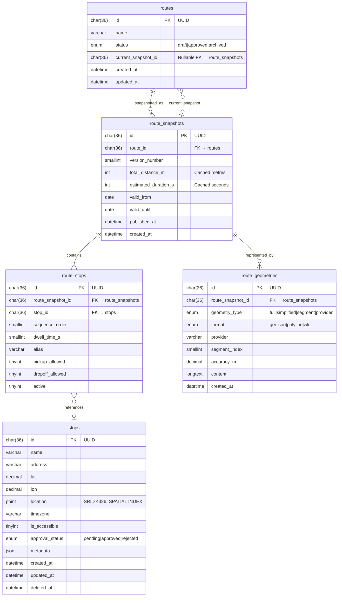
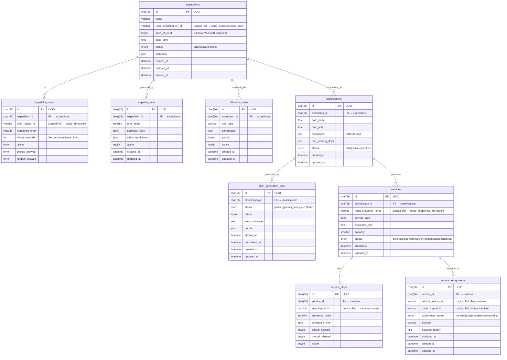

# 3. Data Model

## 3.1. Overview

The Data Model follows the **Database-per-Service** pattern.  Two microservices are in scope: **ms-router** (geographic source of truth) and **ms-planifications** (operational templates and scheduled services).

- **Data Ownership** — Each service owns its own isolated MySQL database (`ms-router` and `ms-planifications`).
- **Logical References** — Cross-service relationships are handled via `VARCHAR(36)` columns containing the foreign entity's UUID.  No database-level foreign keys span service boundaries.
- **Eventual Consistency** — Referential integrity across services is maintained via Domain Events published through the Outbox pattern (e.g. `RoutePublished` consumed by ms-planifications to validate `route_snapshot_ref_id`).
- **Schema Versioning** — Flyway manages each schema independently; each DB has its own `flyway_schema_history` table.
- **MySQL 8.0** — All tables use `ENGINE=InnoDB`, `DEFAULT CHARSET=utf8mb4`, `COLLATE=utf8mb4_unicode_ci`.

---

## 3.2. ms-router — Geographic Source of Truth

**Database:** `ms-router`
**Migration:** `ms-router/src/main/resources/db/migration/V1__init_schema.sql`

### 3.2.1. Entity Relationship Diagram


```mermaid
erDiagram
    routes ||--o{ route_snapshots    : "snapshotted_as"
    routes }o--o| route_snapshots    : "current_snapshot"
    route_snapshots ||--|{ route_stops      : "contains"
    route_snapshots ||--o{ route_geometries : "represented_by"
    route_stops     }o--o| stops            : "references"

    stops {
        char(36)    id               PK  "UUID"
        varchar     name
        varchar     address
        decimal     lat
        decimal     lon
        point       location             "SRID 4326, SPATIAL INDEX"
        varchar     timezone
        tinyint     is_accessible
        enum        approval_status      "pending|approved|rejected"
        json        metadata
        datetime    created_at
        datetime    updated_at
        datetime    deleted_at
    }

    routes {
        char(36)    id                  PK  "UUID"
        varchar     name
        enum        status                  "draft|approved|archived"
        char(36)    current_snapshot_id     "Nullable FK → route_snapshots"
        datetime    created_at
        datetime    updated_at
    }

    route_snapshots {
        char(36)    id               PK  "UUID"
        char(36)    route_id             "FK → routes"
        smallint    version_number
        int         total_distance_m     "Cached metres"
        int         estimated_duration_s "Cached seconds"
        date        valid_from
        date        valid_until
        datetime    published_at
        datetime    created_at
    }

    route_stops {
        char(36)    id                PK  "UUID"
        char(36)    route_snapshot_id     "FK → route_snapshots"
        char(36)    stop_id               "FK → stops"
        smallint    sequence_order
        smallint    dwell_time_s
        varchar     alias
        tinyint     pickup_allowed
        tinyint     dropoff_allowed
        tinyint     active
    }

    route_geometries {
        char(36)    id                PK  "UUID"
        char(36)    route_snapshot_id     "FK → route_snapshots"
        enum        geometry_type         "full|simplified|segment|provider"
        enum        format                "geojson|polyline|wkt"
        varchar     provider
        smallint    segment_index
        decimal     accuracy_m
        longtext    content
        datetime    created_at
    }
```

### 3.2.2. Entity Descriptions

| Entity | Description | PK | Key Constraints |
| :--- | :--- | :--- | :--- |
| **stops** | Unique physical location reusable across routes. Includes a `POINT SRID 4326` column con SPATIAL index para consultas geoespaciales. | `CHAR(36)` UUID | `SPATIAL INDEX` on `location`. Soft-delete via `deleted_at`. |
| **routes** | Objeto lógico persistente que agrupa el historial y la propiedad de una ruta. | `CHAR(36)` UUID | `current_snapshot_id` nullable FK (añadida vía `ALTER TABLE` tras crear `route_snapshots`). |
| **route_snapshots** | Snapshot inmutable de la ruta en un momento concreto (inmutable tras INSERT). Almacena métricas pre-calculadas de distancia y duración. Consumido por ms-planifications via `route_snapshot_ref_id`. | `CHAR(36)` UUID | `UNIQUE (route_id, version_number)`. |
| **route_stops** | Rol y configuración de un stop dentro de un snapshot concreto. | `CHAR(36)` UUID | `UNIQUE (route_snapshot_id, sequence_order)`. FKs a `route_snapshots` y `stops`. |
| **route_geometries** | Múltiples representaciones geométricas de un snapshot para distintos consumidores (UI, proveedores de mapas…). | `CHAR(36)` UUID | `INDEX (route_snapshot_id, geometry_type)`. |
| **outbox_events** | Outbox transaccional para publicación de eventos con garantía at-least-once. | `CHAR(36)` UUID | `INDEX (published, created_at)` para polling eficiente. |

### 3.2.3. Events Published

| Event | Trigger | Key Payload Fields |
| :--- | :--- | :--- |
| `RoutePublished` | A `route_snapshot` is published (`published_at` set) | `route_id`, `snapshot_id`, `version_number` |
| `StopCreated` | A stop is inserted with `approval_status = approved` | `stop_id`, `lat`, `lon` |
| `RouteEstimateUpdated` | Cached metrics (`total_distance_m`, `estimated_duration_s`) are recalculated | `route_snapshot_id`, `total_distance_m`, `estimated_duration_s` |

---

## 3.3. ms-planifications — Operational Templates and Services

**Database:** `ms-planifications`
**Migration:** `ms-planifications/src/main/resources/db/migration/V1__init_schema.sql`

### 3.3.1. Entity Relationship Diagram


```mermaid
erDiagram
    expeditions          ||--o{ expedition_stops    : "has"
    expeditions          ||--o{ capacity_rules      : "governed_by"
    expeditions          ||--o{ allocation_rules    : "assigned_via"
    expeditions          ||--o{ planifications      : "materialised_as"
    planifications       ||--o{ plan_generation_jobs : "generated_by"
    planifications       ||--|{ services            : "produces"
    services             ||--|{ service_stops       : "has"
    services             ||--o| service_assignments : "assigned_to"

    expeditions {
        char(36)    id                   PK  "UUID"
        varchar     name
        varchar     route_snapshot_ref_id    "Logical Ref → route_snapshots (ms-router)"
        tinyint     days_of_week             "Bitmask Mon=bit0..Sun=bit6"
        time        base_time
        enum        status                   "draft|active|archived"
        json        metadata
        datetime    created_at
        datetime    updated_at
        datetime    deleted_at
    }

    expedition_stops {
        char(36)    id               PK  "UUID"
        char(36)    expedition_id        "FK → expeditions"
        varchar     stop_logical_id      "Logical Ref → stops (ms-router)"
        smallint    sequence_order
        int         offset_seconds       "Seconds from base_time"
        tinyint     active
        tinyint     pickup_allowed
        tinyint     dropoff_allowed
    }

    capacity_rules {
        char(36)    id               PK  "UUID"
        char(36)    expedition_id        "FK → expeditions"
        smallint    max_seats
        json        segment_rules
        json        client_restrictions
        tinyint     active
        datetime    created_at
        datetime    updated_at
    }

    allocation_rules {
        char(36)    id               PK  "UUID"
        char(36)    expedition_id        "FK → expeditions"
        varchar     rule_type
        json        parameters
        tinyint     priority
        tinyint     active
        datetime    created_at
        datetime    updated_at
    }

    planifications {
        char(36)    id               PK  "UUID"
        char(36)    expedition_id        "FK → expeditions"
        date        date_from
        date        date_until
        json        exceptions           "Dates to skip"
        json        non_working_days
        enum        status               "draft|active|cancelled"
        datetime    created_at
        datetime    updated_at
    }

    plan_generation_jobs {
        char(36)    id               PK  "UUID"
        char(36)    planification_id     "FK → planifications"
        enum        status               "pending|running|completed|failed"
        tinyint     retries
        text        error_message
        json        results
        datetime    started_at
        datetime    completed_at
        datetime    created_at
        datetime    updated_at
    }

    services {
        char(36)    id                   PK  "UUID"
        char(36)    planification_id         "FK → planifications"
        varchar     route_snapshot_ref_id    "Logical Ref → route_snapshots (ms-router)"
        date        service_date
        time        departure_time
        smallint    capacity
        enum        status                   "scheduled|confirmed|running|completed|cancelled"
        datetime    created_at
        datetime    updated_at
    }

    service_stops {
        char(36)    id               PK  "UUID"
        char(36)    service_id           "FK → services"
        varchar     stop_logical_id      "Logical Ref → stops (ms-router)"
        smallint    sequence_order
        time        scheduled_time
        tinyint     pickup_allowed
        tinyint     dropoff_allowed
        tinyint     active
    }

    service_assignments {
        char(36)    id                 PK  "UUID"
        char(36)    service_id             "FK → services"
        varchar     vehicle_logical_id     "Logical Ref (fleet service)"
        varchar     driver_logical_id      "Logical Ref (drivers service)"
        enum        assignment_status      "pending|assigned|rejected|cancelled"
        varchar     provider
        text        decision_reason
        datetime    assigned_at
        datetime    created_at
        datetime    updated_at
    }
```

### 3.3.2. Entity Descriptions

| Entity | Description | PK | Key Constraints |
| :--- | :--- | :--- | :--- |
| **expeditions** | Operational template derived from an approved route snapshot. Defines the recurring schedule blueprint before materialisation. | `CHAR(36)` UUID | `INDEX (route_snapshot_ref_id)`. |
| **expedition_stops** | Active stops within an expedition, with per-stop timing offsets and pickup/dropoff rules. | `CHAR(36)` UUID | `UNIQUE (expedition_id, sequence_order)`. |
| **capacity_rules** | Capacity policies attached to an expedition (max seats, per-segment overrides, client restrictions). | `CHAR(36)` UUID | `INDEX (expedition_id)`. |
| **allocation_rules** | Rules that drive resource-assignment decisions for an expedition. Ordered by priority. | `CHAR(36)` UUID | `INDEX (expedition_id, priority)`. |
| **planifications** | Intent to materialise an expedition into concrete services for a specific calendar window. | `CHAR(36)` UUID | `INDEX (status, date_from)`. |
| **plan_generation_jobs** | Async job that materialises a planification into `service` rows. Tracks retries and errors. | `CHAR(36)` UUID | `INDEX (status, created_at)`. |
| **services** | Concrete executable service instance for a specific date and time. Generated by a `plan_generation_job`. | `CHAR(36)` UUID | `INDEX (service_date, status)`. |
| **service_stops** | Fixed stop set for a concrete service instance with exact scheduled times. | `CHAR(36)` UUID | `UNIQUE (service_id, sequence_order)`. |
| **service_assignments** | Records the operational resource (vehicle + driver) assigned to a service. | `CHAR(36)` UUID | `INDEX (service_id)`. |
| **planification_history** | Append-only audit log for all state changes. Application user should have no `UPDATE`/`DELETE` privileges (see V2 migration). | `CHAR(36)` UUID | `INDEX (entity_type, entity_id)`. |
| **outbox_events** | Transactional outbox for reliable at-least-once event publishing. | `CHAR(36)` UUID | `INDEX (published, created_at)`. |

### 3.3.3. Events Published

| Event | Trigger | Key Payload Fields |
| :--- | :--- | :--- |
| `ServiceCreated` | A `service` row is inserted by a `plan_generation_job` | `service_id`, `planification_id`, `service_date` |
| `ServiceUpdated` | `service.status` changes | `service_id`, `previous_status`, `new_status` |
| `ServiceCancelled` | Service is cancelled | `service_id`, `reason` |
| `ServiceAssigned` | `service_assignments.assignment_status` transitions to `assigned` | `service_id`, `vehicle_logical_id`, `driver_logical_id` |

---

## 3.4. Cross-Service Logical References

| Source DB | Table | Column | Points To | Handling |
| :--- | :--- | :--- | :--- | :--- |
| `ms-planifications` | `expeditions` | `route_snapshot_ref_id` | `route_snapshots.id` in ms-router | `VARCHAR(36)`. No FK. Validated at application layer on Expedition creation. |
| `ms-planifications` | `expedition_stops` | `stop_logical_id` | `stops.id` in ms-router | `VARCHAR(36)`. No FK. |
| `ms-planifications` | `services` | `route_snapshot_ref_id` | `route_snapshots.id` in ms-router | `VARCHAR(36)`. No FK. Snapshot fixed at materialisation time. |
| `ms-planifications` | `service_stops` | `stop_logical_id` | `stops.id` in ms-router | `VARCHAR(36)`. No FK. |
| `ms-planifications` | `service_assignments` | `vehicle_logical_id` | Fleet service (external) | `VARCHAR(36)`. No FK. |
| `ms-planifications` | `service_assignments` | `driver_logical_id` | Drivers service (external) | `VARCHAR(36)`. No FK. |

---

## 3.5. Migration Strategy

- Flyway manages each schema independently.
- Each database has its own `flyway_schema_history` table — ms-router and ms-planifications are completely isolated.
- Migration naming convention: `V{version}__{description}.sql`

| Microservice | Migration Path |
| :--- | :--- |
| ms-router | `ms-router/src/main/resources/db/migration/V1__init_schema.sql` |
| ms-planifications | `ms-planifications/src/main/resources/db/migration/V1__init_schema.sql` |

To run locally:
```bash
cp .env.example .env  # fill in DB credentials
docker compose up
```

Flyway containers exit with code 0 after a successful migration run and are no-ops on re-runs.
