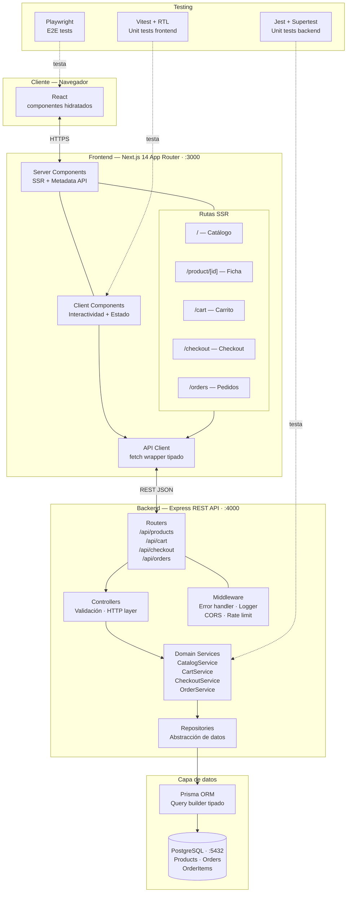
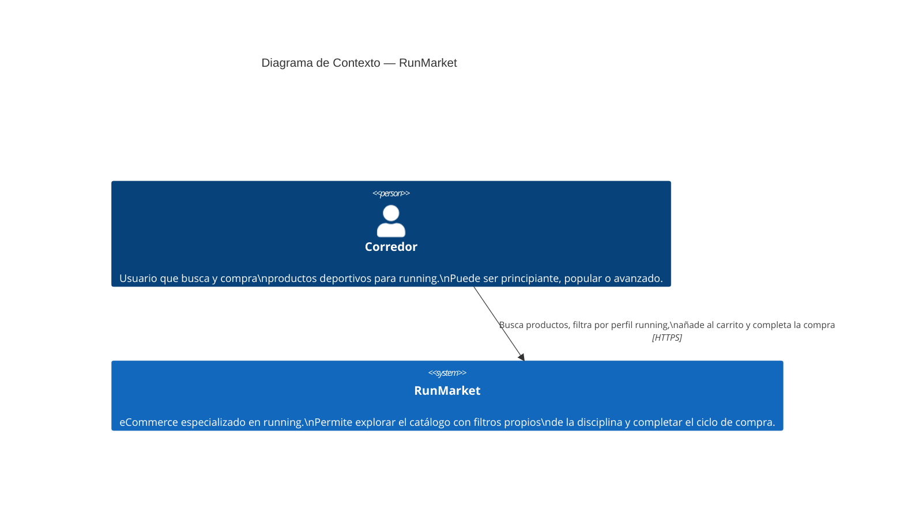
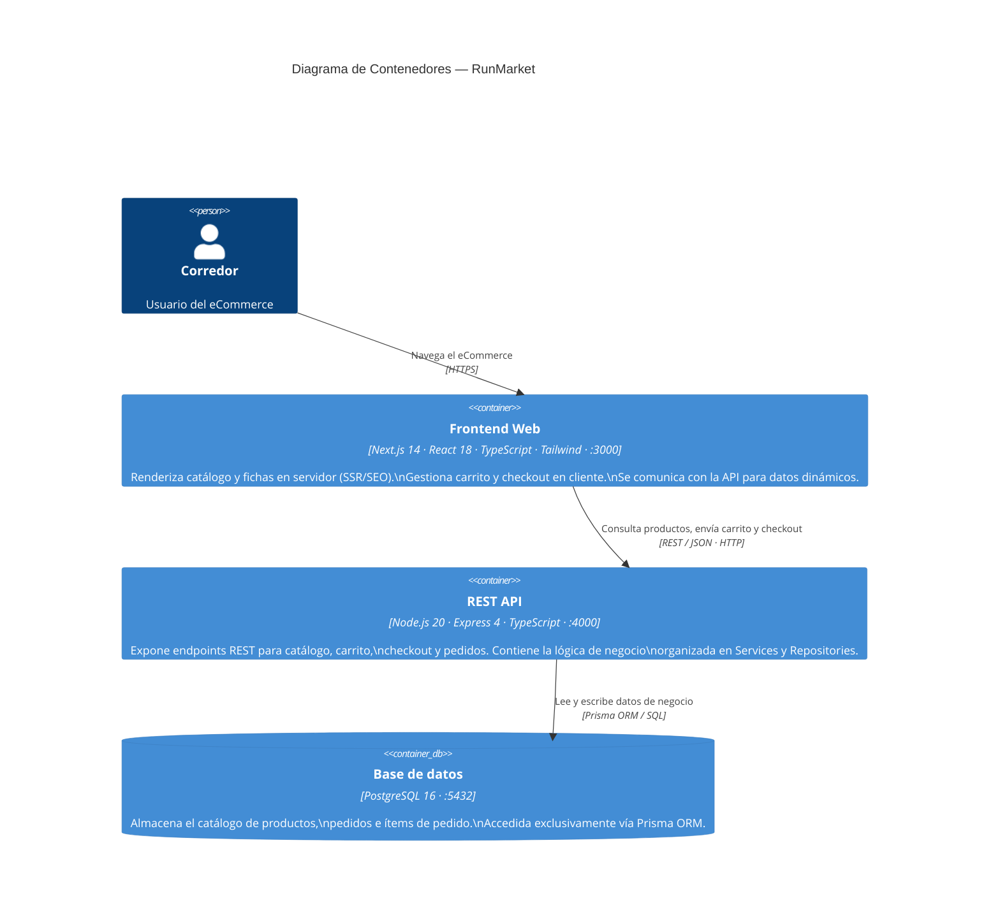
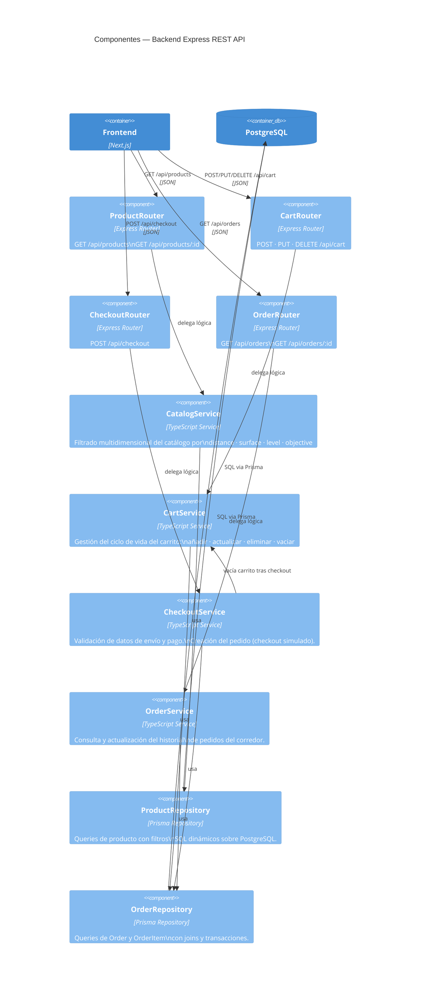
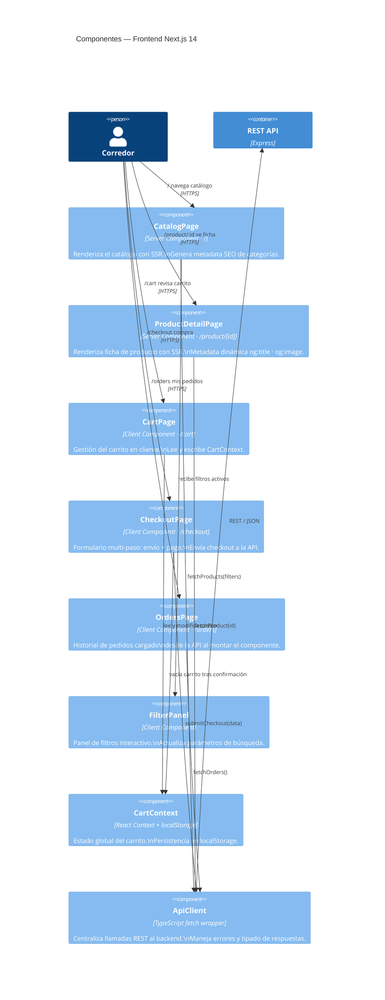
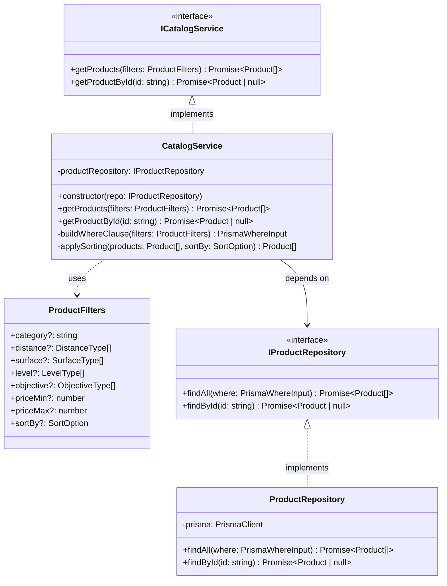
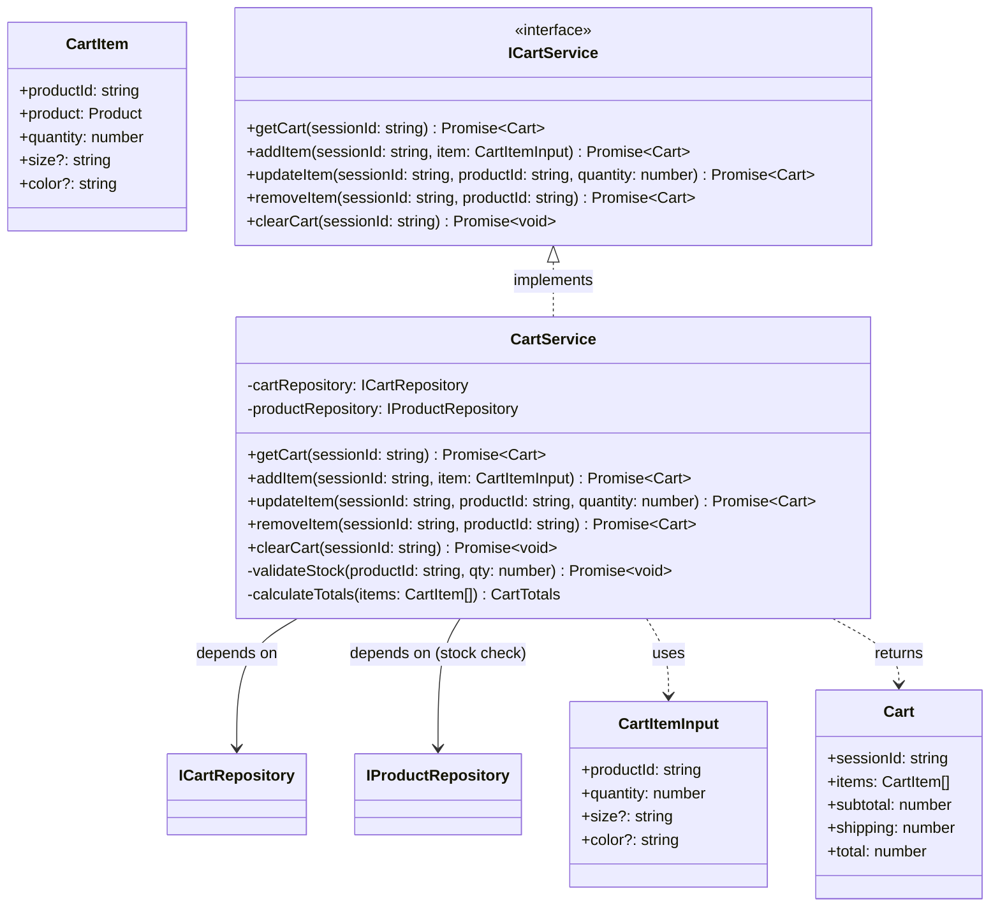
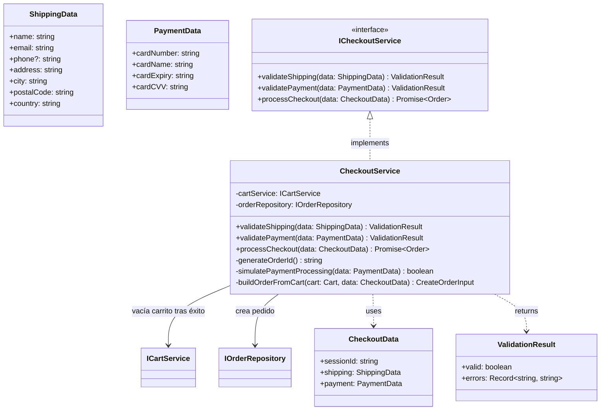
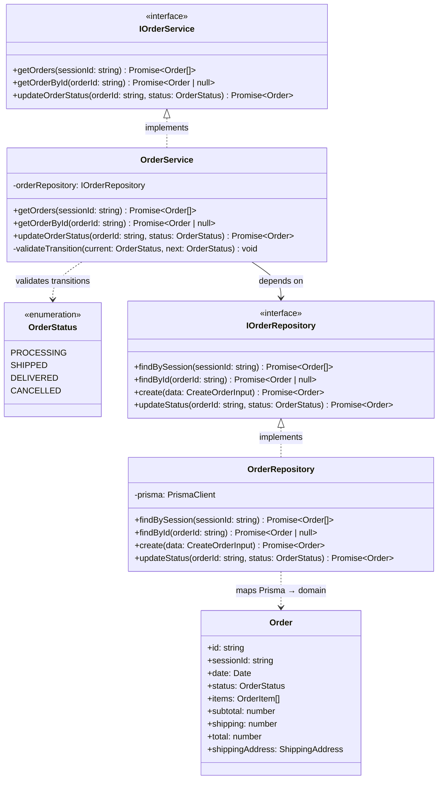

# RunMarket — Arquitectura del sistema

## 1. Evaluación de opciones de arquitectura

Para el MVP de RunMarket se evaluaron tres opciones:

| Opción | SSR | Separación de concerns | Testabilidad | Escalabilidad | Decisión |
|---|---|---|---|---|---|
| **SPA + REST API** | ✗ | ✓ | ✓ | ✓ | Descartada — sin SEO |
| **Next.js full-stack** (API Routes) | ✓ | ✗ | Parcial | Limitada | Descartada — mezcla frontend y backend |
| **Next.js SSR + Express API + PostgreSQL** | ✓ | ✓ | ✓ | ✓ | **Seleccionada** |
| **Microservicios** | ✓ | ✓ | ✓ | ✓✓ | Descartada — sobreingeniería para MVP |

**Justificación de la opción seleccionada:**

La arquitectura de **frontend SSR desacoplado + API REST independiente + base de datos relacional** es la más adecuada para el MVP por tres razones:

1. **SEO real**: Next.js 14 con App Router renderiza en servidor las páginas de catálogo y ficha de producto, que son las páginas de mayor impacto SEO en un eCommerce. Los metadatos (`title`, `description`, `og:*`) se generan server-side con la Metadata API de Next.js.
2. **Separación de responsabilidades testable**: el backend Express puede probarse de forma completamente independiente del frontend mediante Jest + Supertest. El frontend se prueba con Vitest + React Testing Library. Los E2E con Playwright ejercitan el sistema completo.
3. **Evolución natural**: el backend Express puede crecer hacia microservicios en versiones posteriores sin tocar el frontend. La base de datos relacional (PostgreSQL) es la elección correcta para datos transaccionales de eCommerce (pedidos, stock).

**Por qué Next.js 14 y no React Router v7 (Remix) para SSR:**
El prototipo de Figma Make usa React Router v7 en modo SPA. Para la implementación real, Next.js 14 con App Router es la elección más reconocida en la industria para SSR con React, con mejor soporte de Server Components, Image Optimization y Metadata API. La migración del código del prototipo es directa dado que ambos son ecosistemas React + TypeScript.

### 1.2 Patrón de arquitectura del backend

El backend sigue el patrón **Layered Architecture con Repository Pattern y Dependency Inversion**, que se evaluó frente a otras dos alternativas habituales en sistemas web:

| Patrón | Complejidad | Adecuado para | Decisión |
|---|---|---|---|
| **Layered Architecture + Repository Pattern** | Baja-media | MVPs, dominios simples, equipos pequeños | **Seleccionado** |
| **Hexagonal (Ports & Adapters)** | Media-alta | Dominios complejos, múltiples adaptadores de infraestructura | Descartado |
| **Clean Architecture** | Alta | Sistemas grandes, reglas de negocio ricas, equipos grandes | Descartado |

**Por qué no Hexagonal Architecture:**

La arquitectura hexagonal (Ports & Adapters) exige separar explícitamente el dominio de la infraestructura: definir puertos de entrada (casos de uso) y salida (repositorios, servicios externos), e implementar adaptadores para cada uno. Este modelo aporta valor real cuando el dominio es complejo, cuando se necesita intercambiar adaptadores (cambiar PostgreSQL por MongoDB, añadir mensajería asíncrona, etc.) o cuando varios equipos trabajan en paralelo con fronteras claras.

En RunMarket MVP ninguna de estas condiciones se cumple: la lógica de negocio es sencilla (filtrar productos, validar un formulario de checkout, crear un pedido), existe un único adaptador de datos (PostgreSQL via Prisma) que no va a cambiar, y el equipo de desarrollo es de una persona. Aplicar Hexagonal añadiría ficheros y abstracciones innecesarias sin beneficio observable en testabilidad ni mantenibilidad.

**Por qué no Clean Architecture:**

Clean Architecture impone una estructura de capas concéntricas (Entities → Use Cases → Interface Adapters → Frameworks & Drivers) con reglas de dependencia estrictas: las capas internas no pueden conocer las externas. Este nivel de rigor tiene sentido en sistemas con reglas de negocio complejas que deben protegerse de cambios en infraestructura o frameworks.

RunMarket no tiene entidades de dominio ricas ni invariantes de negocio que justifiquen esa separación. El "dominio" del MVP es esencialmente CRUD con filtrado y una simulación de pago. Aplicar Clean Architecture sería añadir complejidad estructural para proteger reglas que no existen.

**Qué sí toma prestado el patrón elegido:**

Aunque no es Hexagonal ni Clean, la arquitectura propuesta incorpora **Dependency Inversion** de forma pragmática: los Services dependen de interfaces (`IProductRepository`, `IOrderRepository`...) y no de implementaciones concretas. Esto permite testear cada Service de forma aislada con mocks de repositorio sin levantar base de datos, que es el beneficio concreto que importa en este contexto.

---

## 2. Arquitectura propuesta

### Diagrama de arquitectura



---

## 3. Componentes principales

### 3.1 Frontend — Next.js 14 (App Router)

**Tecnología:** Next.js 14 · React 18 · TypeScript · Tailwind CSS v4 · shadcn/ui · Lucide React

**Responsabilidad:** renderizado SSR de las páginas públicas del eCommerce, hidratación en cliente para interactividad (carrito, filtros, formularios).

| Módulo | Ruta | Tipo | Descripción |
|---|---|---|---|
| Catálogo | `/` | Server Component | Listado paginado con filtros; renderizado SSR para SEO de categorías |
| Ficha de producto | `/product/[id]` | Server Component | Detalle técnico del producto; metadata dinámica (título, descripción, og:image) |
| Carrito | `/cart` | Client Component | Estado en cliente; sin SSR necesario (no indexable) |
| Checkout | `/checkout` | Client Component | Formulario multi-paso; lógica de validación en cliente |
| Pedidos | `/orders` | Client Component | Historial de pedidos; datos cargados en cliente |

**Decisión de SSR selectivo:** solo las páginas con valor SEO (catálogo y ficha de producto) usan Server Components. Las páginas transaccionales (carrito, checkout, pedidos) son Client Components, lo que simplifica la gestión de estado sin sacrificar SEO.

**API Client:** capa de fetch tipada con TypeScript que centraliza las llamadas al backend. Maneja errores HTTP, serialización y headers comunes.

### 3.2 Backend — Express REST API

**Tecnología:** Node.js 20 LTS · Express 4 · TypeScript · Prisma ORM · Zod (validación)

**Responsabilidad:** servir los datos del catálogo, gestionar el ciclo de pedido (carrito → checkout → confirmación) y persistir los datos en PostgreSQL.

**Arquitectura en capas:**

```
Request → Router → Middleware → Controller → Service → Repository → Prisma → PostgreSQL
```

| Capa | Responsabilidad |
|---|---|
| **Router** | Definición de endpoints REST y binding con controllers |
| **Middleware** | CORS, rate limiting, error handler global, logger (Morgan) |
| **Controller** | Validación de entrada (Zod), transformación HTTP ↔ dominio, respuesta |
| **Service** | Lógica de negocio pura; independiente de HTTP y base de datos |
| **Repository** | Abstracción del acceso a datos; único punto de contacto con Prisma |

**Domain Services:**

| Servicio | Endpoints | Responsabilidad |
|---|---|---|
| `CatalogService` | `GET /api/products`, `GET /api/products/:id` | Filtrado multidimensional por `distance`, `surface`, `level`, `objective` |
| `CartService` | `POST/PUT/DELETE /api/cart` | Gestión de ítems del carrito (sesión server-side en MVP) |
| `CheckoutService` | `POST /api/checkout` | Validación de datos de envío/pago y creación de Order |
| `OrderService` | `GET /api/orders`, `GET /api/orders/:id` | Consulta del historial de pedidos |

### 3.3 Base de datos — PostgreSQL + Prisma

**Tecnología:** PostgreSQL 16 · Prisma ORM 5

**Justificación de PostgreSQL:** los datos de RunMarket son relacionales por naturaleza — productos con stock, pedidos con líneas de detalle, direcciones de envío. PostgreSQL garantiza integridad transaccional (ACID) crítica para el ciclo de compra. Prisma aporta type-safety completo en las queries y gestión de migraciones.

**Entidades principales:** `Product`, `OrderItem`, `Order` (ver modelo de datos completo en `readme.md` § 3).

### 3.4 Testing

| Nivel | Herramienta | Alcance |
|---|---|---|
| **Unit — Frontend** | Vitest + React Testing Library | Componentes React, hooks, API client |
| **Unit — Backend** | Jest + Supertest | Services (lógica de negocio), Controllers (endpoints), Repositories (mockeados con Prisma mock) |
| **E2E** | Playwright | Flujos completos: búsqueda filtrada → ficha → carrito → checkout → confirmación |

**Estrategia de testing backend:** los Services se prueban con mocks de Repository (sin base de datos real). Los Controllers se prueban con Supertest contra una instancia de Express con base de datos de test (PostgreSQL en Docker). Los E2E usan el sistema completo levantado en local.

---

## 4. Stack tecnológico completo

| Capa | Tecnología | Versión | Justificación |
|---|---|---|---|
| Frontend framework | Next.js | 14 | SSR + App Router + Metadata API |
| Frontend UI | React | 18 | Ecosistema estándar, Server Components |
| Lenguaje | TypeScript | 5 | Tipado end-to-end frontend + backend |
| Estilos | Tailwind CSS | 4 | Utility-first, consistente con el prototipo |
| Componentes UI | shadcn/ui | latest | Componentes accesibles sobre Radix UI |
| Backend framework | Express | 4 | Minimalista, conocido, amplio ecosistema |
| Runtime backend | Node.js | 20 LTS | LTS estable, mismo lenguaje que frontend |
| ORM | Prisma | 5 | Type-safe, migraciones, compatibilidad PostgreSQL |
| Base de datos | PostgreSQL | 16 | Relacional, ACID, estándar eCommerce |
| Validación | Zod | 3 | Schema validation tipado, compartible frontend/backend |
| Test unitario FE | Vitest + RTL | latest | Nativo Vite/Next.js, API compatible Jest |
| Test unitario BE | Jest + Supertest | latest | Estándar Node.js, integración Express |
| Test E2E | Playwright | 1.60 | Multi-browser, disponible en el entorno |

---

## 5. Estructura del proyecto (monorepo)

```
runmarket/
├── CLAUDE.md
├── readme.md
├── package.json                  ← npm workspaces
├── docs/
│   ├── ARCHITECTURE.md           ← este documento
│   ├── PRD.md                    ← documentación de producto
│   └── prototypes/               ← capturas de pantalla
│
├── frontend/                     ← Next.js 14 App
│   ├── src/
│   │   ├── app/                  ← App Router
│   │   │   ├── page.tsx          ← / Catálogo (SSR)
│   │   │   ├── product/[id]/
│   │   │   │   └── page.tsx      ← /product/:id Ficha (SSR)
│   │   │   ├── cart/
│   │   │   │   └── page.tsx      ← /cart Carrito (Client)
│   │   │   ├── checkout/
│   │   │   │   └── page.tsx      ← /checkout (Client)
│   │   │   ├── orders/
│   │   │   │   └── page.tsx      ← /orders (Client)
│   │   │   └── layout.tsx        ← Layout global + Header
│   │   ├── components/
│   │   │   ├── ui/               ← shadcn/ui primitivos
│   │   │   ├── catalog/          ← ProductCard, FilterPanel, ProductGrid
│   │   │   ├── product/          ← ProductDetail, SizeSelector, TrustSignals
│   │   │   ├── cart/             ← CartItem, CartSummary
│   │   │   └── checkout/         ← ShippingForm, PaymentForm, StepIndicator
│   │   ├── lib/
│   │   │   ├── api-client.ts     ← fetch wrapper tipado hacia backend
│   │   │   └── utils.ts
│   │   └── types/
│   │       └── index.ts          ← tipos compartidos (Product, Order, CartItem)
│   ├── tests/
│   │   └── unit/                 ← Vitest + React Testing Library
│   ├── next.config.ts
│   ├── tailwind.config.ts
│   └── package.json
│
├── backend/                      ← Express REST API
│   ├── src/
│   │   ├── routes/               ← products.routes.ts, orders.routes.ts...
│   │   ├── controllers/          ← products.controller.ts...
│   │   ├── services/             ← catalog.service.ts, order.service.ts...
│   │   ├── repositories/         ← product.repository.ts...
│   │   ├── middleware/           ← errorHandler.ts, cors.ts, logger.ts
│   │   ├── schemas/              ← Zod schemas de validación
│   │   └── index.ts              ← bootstrap Express
│   ├── prisma/
│   │   ├── schema.prisma         ← definición del modelo de datos
│   │   └── seed.ts               ← datos de prueba
│   ├── tests/
│   │   └── unit/                 ← Jest + Supertest
│   └── package.json
│
└── e2e/                          ← Playwright E2E
    ├── tests/
    │   ├── catalog.spec.ts       ← flujo de búsqueda y filtrado
    │   ├── product.spec.ts       ← ficha de producto
    │   └── purchase.spec.ts      ← carrito → checkout → confirmación
    └── playwright.config.ts
```

---

## 6. Decisiones de diseño relevantes

| Decisión | Alternativa considerada | Justificación |
|---|---|---|
| **Layered Architecture + Repository Pattern** | Hexagonal, Clean Architecture | Dominio simple (CRUD + filtrado + checkout simulado), un solo adaptador de datos, equipo unipersonal. Hexagonal y Clean añaden complejidad estructural sin beneficio medible en este contexto. |
| **Dependency Inversion en repositorios** | Acceso directo a Prisma desde Services | Permite unit testing de Services con mocks sin levantar base de datos, sin el coste de una arquitectura hexagonal completa. |
| Next.js para SSR | React Router v7 framework mode | Mayor reconocimiento industrial, mejor Metadata API, Server Components maduros |
| Prisma como ORM | TypeORM, Drizzle, queries raw | Type-safety nativo, migraciones integradas, compatibilidad perfecta con TypeScript |
| Zod para validación | Joi, Yup, class-validator | Compatible con TypeScript inference, compartible entre frontend y backend |
| Monorepo npm workspaces | Turborepo, Nx | Suficiente para el alcance del MVP sin overhead de herramientas |
| SSR selectivo (no universal) | SSR completo / CSR completo | Solo las páginas con valor SEO usan Server Components; simplifica estado en checkout |

---

## 7. Diagramas C4

### 7.1 Nivel 1 — Context

Muestra RunMarket como caja negra en su contexto: quién lo usa y con qué sistemas externos interactúa. En el MVP no hay integraciones externas reales (el pago es simulado), lo que simplifica el contexto al sistema y sus usuarios.



---

### 7.2 Nivel 2 — Containers

Descompone RunMarket en sus tres contenedores: frontend SSR, API REST y base de datos relacional. Cada contenedor es un proceso desplegable de forma independiente.



---

### 7.3 Nivel 3 — Components

#### Backend — Express REST API

Muestra los componentes internos del contenedor API organizados según el patrón Router → Controller → Service → Repository.



#### Frontend — Next.js 14 App Router

Muestra los componentes internos del contenedor frontend, distinguiendo entre Server Components (SSR) y Client Components.



---

### 7.4 Nivel 4 — Code

Diagramas de clases de los cuatro servicios principales del backend. Cada servicio se diseña contra interfaces (Dependency Inversion) para permitir testing unitario con mocks de repositorio.

#### CatalogService

Servicio central del diferencial de RunMarket: implementa el filtrado multidimensional por atributos propios del running.



#### CartService

Gestiona el ciclo de vida del carrito asociado a una sesión de navegador. Valida stock antes de añadir o actualizar ítems.



#### CheckoutService

Orquesta el proceso de compra: valida datos de envío y pago, crea el pedido y vacía el carrito. El pago es simulado: no hay integración con pasarela real en el MVP.



#### OrderService

Gestiona la consulta y actualización de pedidos. En el MVP los pedidos se asocian a `sessionId`; sin autenticación, el corredor accede a sus pedidos de la sesión activa.


