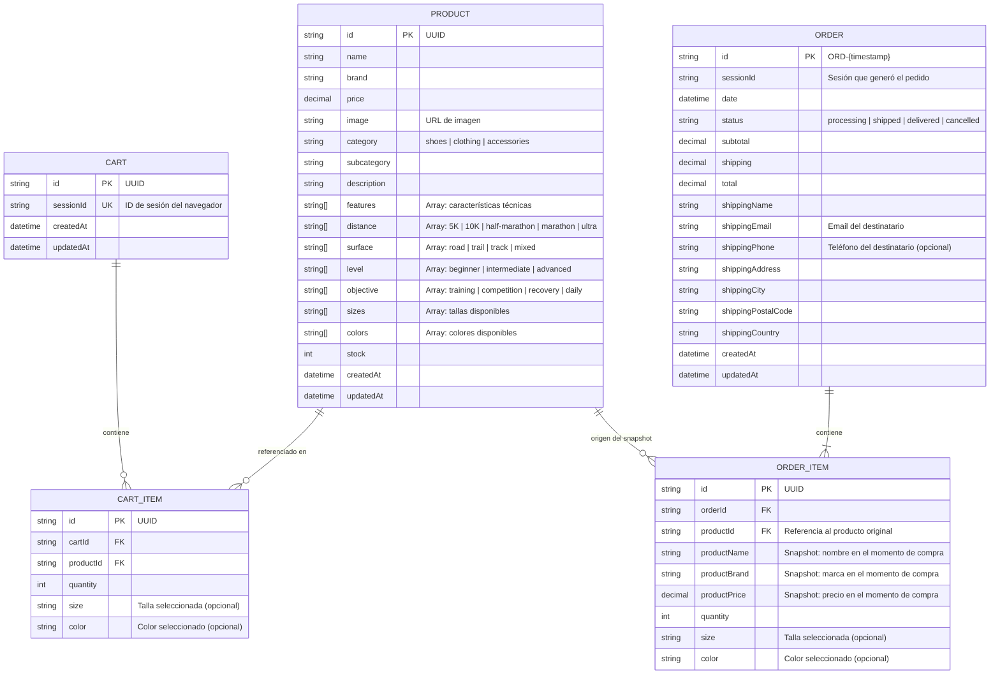

# RunMarket — Modelo de datos

## 1. Fuente de partida

El modelo de datos se deriva de los tipos TypeScript definidos en el prototipo de Figma Make:

- `src/app/types/product.ts` — interfaces `Product`, `CartItem` y `Order`
- `src/app/data/products.ts` — 12 productos reales con atributos de filtrado running

Estos tipos se traducen a entidades PostgreSQL gestionadas con Prisma ORM, adaptando los arrays del prototipo al modelo relacional y añadiendo las entidades necesarias para el backend (Cart persistente, snapshots de producto en OrderItem).

---

## 2. Decisión de modelado — atributos de filtrado running

Los atributos `distance`, `surface`, `level` y `objective` son multi-valor en el prototipo (un producto puede estar asociado a varias distancias, superficies, niveles y objetivos). Se evaluaron tres estrategias de modelado:

| Estrategia | Ventajas | Inconvenientes | Decisión |
|---|---|---|---|
| **Arrays nativos PostgreSQL** (`String[]`) | Sin tablas extra, filtrado eficiente con GIN index, soporte nativo Prisma (`hasSome`, `hasEvery`) | Menos flexible para queries complejas de agregación | **Seleccionada** |
| **Tablas de lookup + junction tables** (`ProductDistance`, `ProductSurface`…) | Máxima normalización, fácil de extender | 4 tablas extra, queries más complejas para un MVP | Descartada |
| **JSONB** | Muy flexible | Sin type-safety, indexación menos predecible | Descartada |

**Justificación de arrays nativos:**

El conjunto de valores es pequeño y cerrado (5 distancias, 4 superficies, 3 niveles, 4 objetivos), lo que hace innecesaria la flexibilidad de las tablas de lookup. PostgreSQL indexa arrays eficientemente con índices GIN, y Prisma expone los operadores `hasSome` y `hasEvery` que cubren exactamente el caso de uso del filtro combinable de RunMarket. Evitar 4 tablas de join simplifica el esquema sin sacrificar funcionalidad ni rendimiento a la escala del MVP.

El mismo criterio aplica a `features`, `sizes` y `colors`: son listas de strings simples sin necesidad de entidad propia.

---

## 3. Diagrama entidad-relación



---

## 4. Descripción de entidades

### PRODUCT

Entidad central del catálogo. Representa un producto deportivo de running con todos sus atributos técnicos y de filtrado. Los atributos multi-valor (`distance`, `surface`, `level`, `objective`, `features`, `sizes`, `colors`) se almacenan como arrays nativos de PostgreSQL.

**Restricciones relevantes:**
- `id`: UUID generado por Prisma (`@default(uuid())`)
- `price`: `Decimal` con 2 decimales (no `Float` para evitar errores de punto flotante en cálculos de totales)
- `stock`: mínimo 0; la aplicación previene añadir al carrito si `stock === 0`
- `category`: enum cerrado (`shoes | clothing | accessories`)

### CART

Representa el carrito de compra de una sesión de navegador. En el MVP sin autenticación, el carrito se asocia a un `sessionId` generado en el primer acceso y almacenado en una cookie. Cuando el corredor completa el checkout, el carrito se vacía (los `CartItem` se eliminan).

**Restricciones relevantes:**
- `sessionId`: unique — un único carrito activo por sesión
- El carrito persiste entre peticiones pero no entre sesiones (MVP)

### CART_ITEM

Línea de ítem dentro de un carrito. Referencia al `Product` para obtener precio y stock actualizados en el momento de renderizar el carrito.

**Nota:** a diferencia de `ORDER_ITEM`, `CART_ITEM` no almacena snapshot del precio — usa siempre el precio actual del producto. El precio se fija en el momento de crear el `Order`.

### ORDER

Pedido generado tras un checkout completado. Almacena la dirección de envío como campos planos (no como entidad separada) dado que en el MVP no hay usuarios autenticados con direcciones guardadas.

**Restricciones relevantes:**
- `id`: formato `ORD-{timestamp}` para legibilidad en la UI (no UUID)
- `sessionId`: permite al corredor recuperar sus pedidos de la sesión activa
- `status`: enum con transiciones válidas: `processing → shipped → delivered` o `processing → cancelled`
- `subtotal + shipping = total` — invariante mantenida por `CheckoutService`

### ORDER_ITEM

Línea de ítem de un pedido. Almacena un **snapshot** de los atributos del producto en el momento de la compra (`productName`, `productBrand`, `productPrice`). Esto garantiza que el historial de pedidos sea inmutable aunque el producto cambie de nombre, precio o sea eliminado del catálogo.

**Justificación del snapshot:** es una práctica estándar en eCommerce transaccional. Sin snapshot, un cambio de precio en `PRODUCT` alteraría retroactivamente el total visible en pedidos pasados.

---

## 5. Entidades fuera del alcance del MVP

Las siguientes entidades son relevantes para versiones posteriores pero se excluyen del MVP por las razones indicadas:

| Entidad | Propósito | Por qué no en MVP |
|---|---|---|
| **USER** | Autenticación, perfil del corredor, historial persistente entre sesiones | El MVP valida el ciclo de compra sin autenticación para reducir fricción y complejidad |
| **ADDRESS** | Direcciones de envío guardadas por usuario | Depende de USER; sin autenticación no hay a quién asociarlas |
| **REVIEW** | Valoraciones y comentarios de productos | Requiere USER; aumenta complejidad sin validar el modelo de compra |
| **WISHLIST** | Lista de productos guardados para compra futura | Requiere USER o sesión persistente |
| **DISCOUNT** | Códigos promocionales y descuentos | Añade lógica de negocio compleja al checkout; fuera de alcance del ciclo básico |
| **CATEGORY** | Jerarquía de categorías y subcategorías | El catálogo del MVP tiene una taxonomía fija; no se necesita gestión dinámica |
| **PAYMENT** | Registro de intentos de pago y métodos | El checkout es simulado; no hay transacciones reales que registrar |

---

## 6. Esquema Prisma (referencia)

```prisma
// schema.prisma

generator client {
  provider = "prisma-client-js"
}

datasource db {
  provider = "postgresql"
  url      = env("DATABASE_URL")
}

enum Category {
  shoes
  clothing
  accessories
}

enum OrderStatus {
  processing
  shipped
  delivered
  cancelled
}

model Product {
  id          String   @id @default(uuid())
  name        String
  brand       String
  price       Decimal  @db.Decimal(10, 2)
  image       String
  category    Category
  subcategory String
  description String
  features    String[]
  distance    String[]
  surface     String[]
  level       String[]
  objective   String[]
  sizes       String[]
  colors      String[]
  stock       Int      @default(0)
  createdAt   DateTime @default(now())
  updatedAt   DateTime @updatedAt

  cartItems   CartItem[]
  orderItems  OrderItem[]

  @@index([category])
  @@index([distance], type: Gin)
  @@index([surface],  type: Gin)
  @@index([level],    type: Gin)
  @@index([objective], type: Gin)
}

model Cart {
  id        String     @id @default(uuid())
  sessionId String     @unique
  createdAt DateTime   @default(now())
  updatedAt DateTime   @updatedAt
  items     CartItem[]
}

model CartItem {
  id        String  @id @default(uuid())
  cartId    String
  productId String
  quantity  Int
  size      String?
  color     String?

  cart      Cart    @relation(fields: [cartId], references: [id], onDelete: Cascade)
  product   Product @relation(fields: [productId], references: [id])

  @@unique([cartId, productId, size, color])
}

model Order {
  id                 String      @id
  sessionId          String
  date               DateTime    @default(now())
  status             OrderStatus @default(processing)
  subtotal           Decimal     @db.Decimal(10, 2)
  shipping           Decimal     @db.Decimal(10, 2)
  total              Decimal     @db.Decimal(10, 2)
  shippingName       String
  shippingEmail      String
  shippingPhone      String?
  shippingAddress    String
  shippingCity       String
  shippingPostalCode String
  shippingCountry    String
  createdAt          DateTime    @default(now())
  updatedAt          DateTime    @updatedAt
  items              OrderItem[]

  @@index([sessionId])
}

model OrderItem {
  id           String  @id @default(uuid())
  orderId      String
  productId    String
  productName  String
  productBrand String
  productPrice Decimal @db.Decimal(10, 2)
  quantity     Int
  size         String?
  color        String?

  order   Order   @relation(fields: [orderId], references: [id], onDelete: Cascade)
  product Product @relation(fields: [productId], references: [id])
}
```

---

## 7. Semilla de datos inicial

El fichero `backend/prisma/seed.ts` carga los datos iniciales necesarios para arrancar el MVP y ejecutar los tests E2E sin necesidad de introducir datos manualmente.

**Fuente de datos:** los 12 productos definidos en `src/app/data/products.ts` del prototipo de Figma Make. Son datos reales y coherentes — nombres de marca, precios, atributos running correctos, tallas y colores — por lo que sirven directamente como dataset de demostración.

**Ficheros implicados:**

| Fichero | Propósito |
|---|---|
| `backend/prisma/seed.ts` | Script que importa los 12 productos y los inserta via Prisma (`upsert` para idempotencia) |
| `backend/prisma/schema.prisma` | Añadir bloque `prisma.seed` apuntando al script |
| `backend/package.json` | Script `"seed": "ts-node prisma/seed.ts"` |

**Ejecución:**

```bash
npx prisma migrate dev   # aplica el esquema
npx prisma db seed       # carga los 12 productos
```

El seed usa `upsert` (no `create`) para ser idempotente: ejecutarlo múltiples veces no duplica datos, lo que lo hace seguro para entornos de desarrollo y CI.
