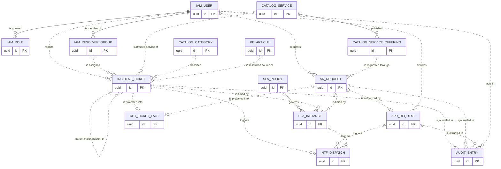
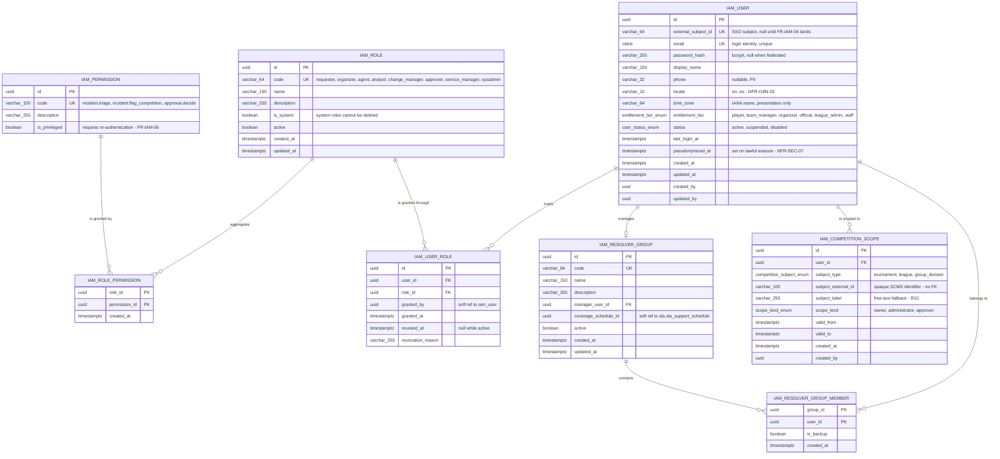
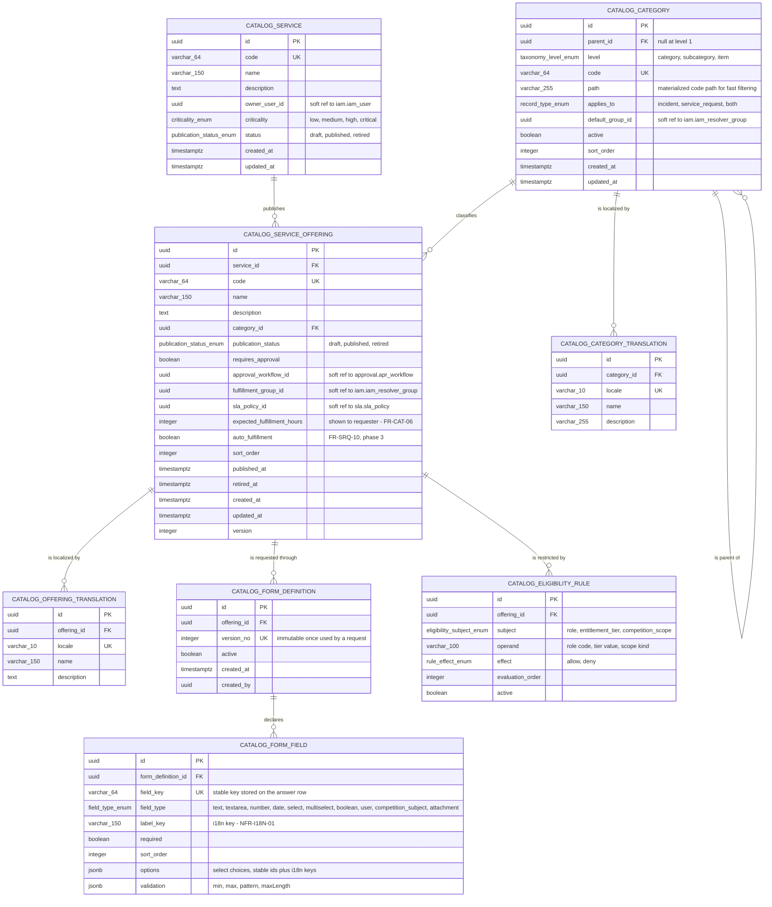
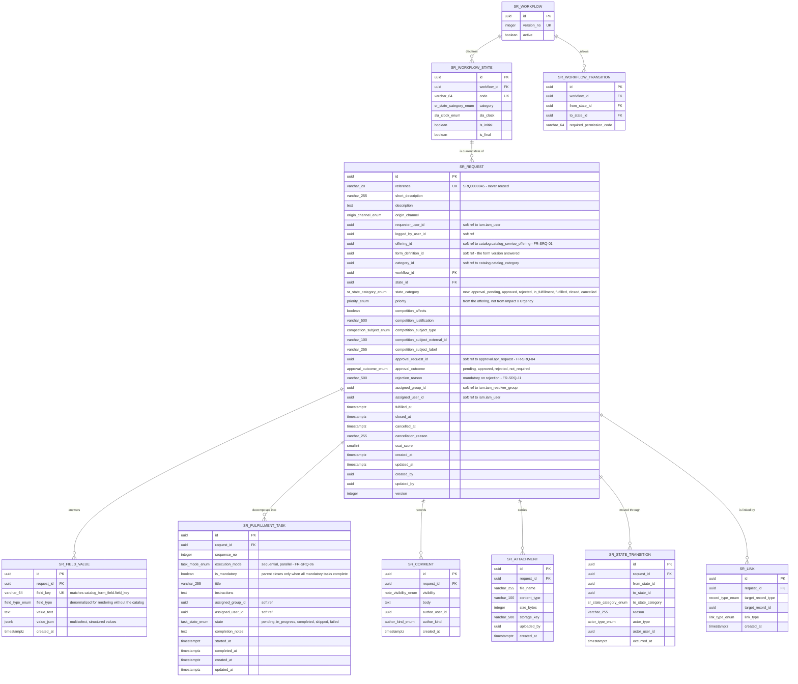
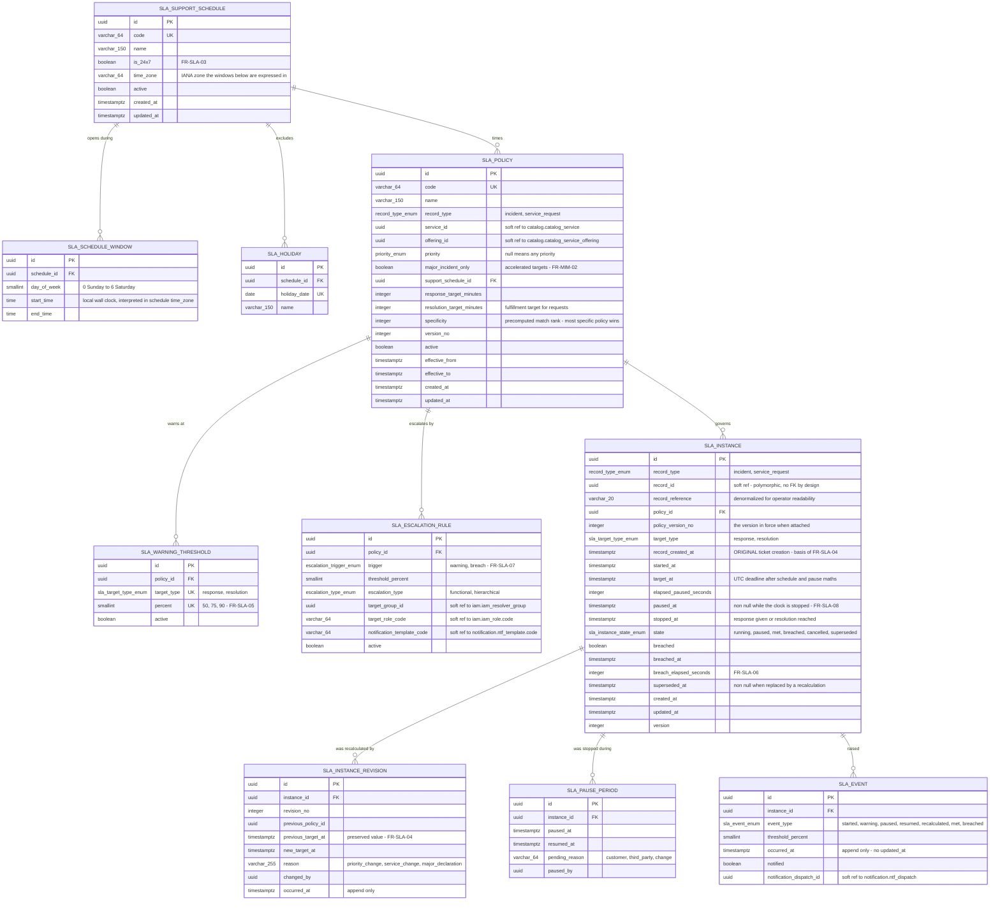
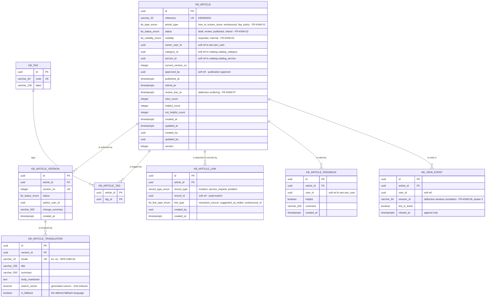
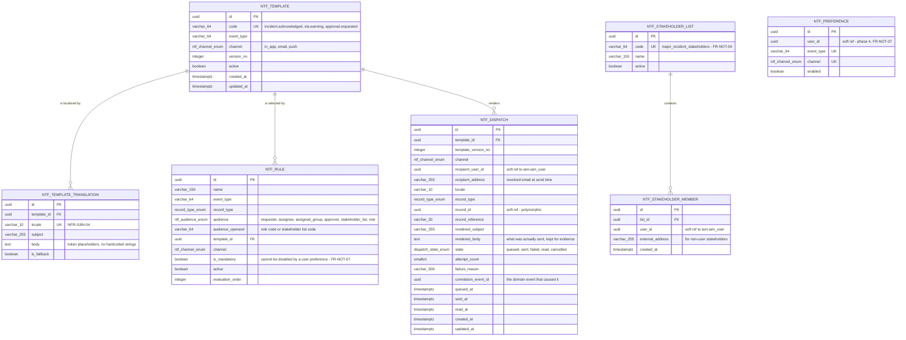
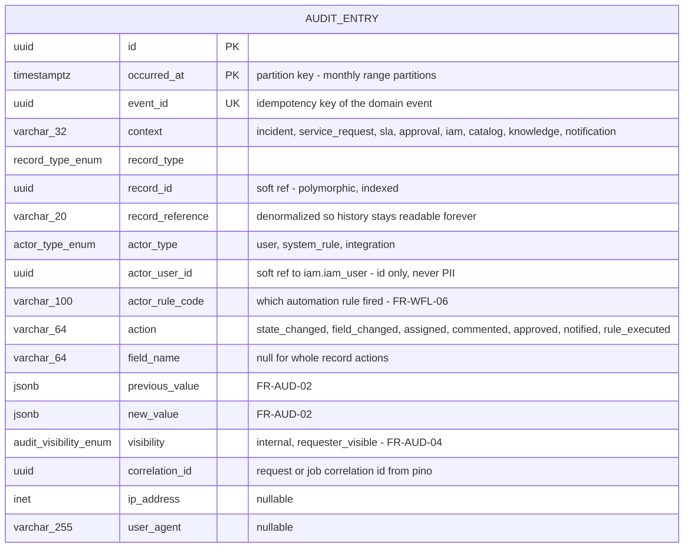
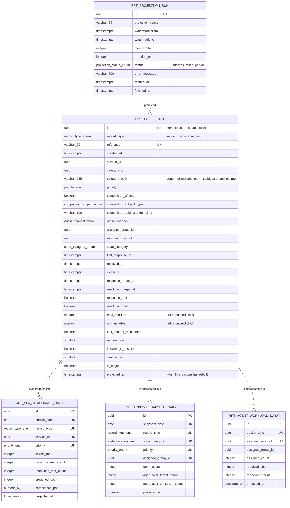

# Sport ITSM — Data Model

> Companion to [`ARCHITECTURE.md`](ARCHITECTURE.md) (bounded contexts §4, tactical model §6.2, **ADR-005**), [`COMPONENTS.md`](COMPONENTS.md) (§5 Persistence), [`PROJECT-STRUCTURE.md`](PROJECT-STRUCTURE.md) (where entities, mappers and migrations live) and section **3. Modelo de Datos** of [`../readme.md`](../readme.md). Behavior — what each field *means* to the business — is owned by [`PRD.md`](PRD.md); every table below traces to a functional requirement ID.

> ## Reading notice — target model, nothing is built yet
>
> **No Nx workspace, no `apps/`, no `libs/`, no `package.json` and no migration file exists in this repository.** This document is the **prescriptive relational schema** that the first TypeORM migrations must produce, not documentation of a database that exists. Statements are written in the present tense for readability; read them as "shall be". No `pnpm typeorm migration:generate` has ever been run, and none of the indexes, constraints or partitions described here has been validated against a live PostgreSQL 16 instance.

---

## Table of Contents

1. [Scope of this model](#1-scope-of-this-model)
2. [Persistence entities are not domain aggregates (ADR-005)](#2-persistence-entities-are-not-domain-aggregates-adr-005)
3. [Schema conventions](#3-schema-conventions)
4. [Referential integrity policy — hard FK vs soft reference](#4-referential-integrity-policy--hard-fk-vs-soft-reference)
5. [Overview — context-level model](#5-overview--context-level-model)
6. [`identity-access` schema `iam`](#6-identity-access--schema-iam)
7. [`service-catalog` schema `catalog`](#7-service-catalog--schema-catalog)
8. [`incident` schema `incident`](#8-incident--schema-incident)
9. [`service-request` schema `service_request`](#9-service-request--schema-service_request)
10. [`sla` schema `sla`](#10-sla--schema-sla)
11. [`knowledge` schema `knowledge`](#11-knowledge--schema-knowledge)
12. [`approval` schema `approval`](#12-approval--schema-approval)
13. [`notification` schema `notification`](#13-notification--schema-notification)
14. [`audit` schema `audit`](#14-audit--schema-audit)
15. [`reporting` read models schema `reporting`](#15-reporting-read-models--schema-reporting)
16. [Indexes and the NFRs they serve](#16-indexes-and-the-nfrs-they-serve)
17. [Phase 2 — outline only, not modelled](#17-phase-2--outline-only-not-modelled)
18. [Modelling decisions taken in the absence of a PRD statement](#18-modelling-decisions-taken-in-the-absence-of-a-prd-statement)

---

## 1. Scope of this model

This document models the **phase-0 and phase-1 contexts that actually persist state** (PRD §14.2, §14.3):

| Context | PostgreSQL schema | Phase | Persists |
|---|---|---|---|
| `identity-access` | `iam` | 0 | Users, roles, permissions, resolver groups, competition-scoped visibility grants |
| `audit` | `audit` | 0 | Append-only activity history for every record type |
| `service-catalog` | `catalog` | 1 | Services, Service Offerings, request forms, eligibility rules, categorization taxonomy |
| `incident` | `incident` | 1 | Incident tickets, work notes, links, escalations, priority matrix, lifecycle configuration |
| `service-request` | `service_request` | 1 | Service Requests, form answers, fulfillment tasks |
| `sla` | `sla` | 1 | SLA policies, support schedules, timer instances, warnings, breaches, escalation rules |
| `knowledge` | `knowledge` | 1 | Knowledge Articles, versions, translations, feedback, ticket links |
| `approval` | `approval` | 1 | Approval workflows, requests, tasks, immutable decisions |
| `notification` | `notification` | 1 | Templates, rules, dispatch records, stakeholder lists |
| `reporting` | `reporting` | 1 | Denormalized read models only — no aggregate, no system of record |

`problem`, `change`, `release` and `asset-config` are **phase 2** (PRD §14.4) and are deliberately **not modelled** here — see §17. The phase-1 schema is nonetheless forward-compatible with them: `incident.incident_link` already carries `problem`, `change`, `release` and `configuration_item` as target record types (FR-INC-10) using opaque identifiers, so introducing those contexts is additive.

Two things this model deliberately does **not** contain, per ADR-006 and PRD §3.3:

- **No competition calendar, no live window, no freeze window.** There is no `competition`, no `event_window` and no `deployment_freeze` table. Competition impact is three columns on the ticket plus a justification.
- **No tenant discriminator.** Single-tenant MVP (constraint K7). Adding one later is a migration plus a repository-level filter confined to `type:infrastructure`.

---

## 2. Persistence entities are not domain aggregates (ADR-005)

**This document describes the relational schema, not the domain model.** The two are separate on purpose:

| | Domain model | Persistence model (this document) |
|---|---|---|
| Lives in | `libs/<context>/domain` — `type:domain` | `libs/<context>/infrastructure/**/persistence/entities` — `type:infrastructure` |
| File suffix | `*.aggregate.ts`, `*.vo.ts`, `*.event.ts` | `*.entity.ts` (the suffix is reserved for ORM artifacts) |
| Shape | `Incident` aggregate root with `Priority`, `CompetitionImpactFlag`, `CompetitionSubject` value objects and behavior | `incident_ticket` row with flat, nullable, indexable columns |
| Knows about | Nothing — pure TypeScript, not even `new Date()` | TypeORM 0.3, `pg`, PostgreSQL types |
| Joined by | — | An explicit `*.mapper.ts`, hand-written, tested |

Consequences that shape every table below:

1. **A table is not an aggregate.** `incident_ticket` plus `incident_work_note`, `incident_attachment`, `incident_assignment_history`, `incident_state_transition` and `incident_link` together persist **one** `Incident` aggregate. The repository loads and saves them as a unit inside a single transaction; nothing outside the `incident` context ever writes them.
2. **Value objects are stored inline as columns, not as tables.** A value object has no identity and no independent lifecycle, so giving it a row and a surrogate key would be a modelling lie. The inlined value objects are:

| Value object | Stored as | Table |
|---|---|---|
| `TicketReference` | `reference varchar(20)` + unique index | `incident_ticket`, `sr_request` |
| `Priority` | `priority`, `priority_overridden`, `priority_override_justification`, `priority_matrix_id` | `incident_ticket` |
| `CompetitionImpactFlag` | `competition_affects`, `competition_justification`, `competition_flag_set_by`, `competition_flag_set_at` | `incident_ticket`, `sr_request` |
| `CompetitionSubject` | `competition_subject_type`, `competition_subject_external_id`, `competition_subject_label` | `incident_ticket`, `sr_request` |
| `OriginChannel` | `origin_channel` (PG enum) | `incident_ticket`, `sr_request` |
| `ResolverAssignment` | `assigned_group_id`, `assigned_user_id`, `assigned_at` (history in `incident_assignment_history`) | `incident_ticket`, `sr_request` |
| `SlaCommitment` | `target_at`, `response_target_at` on `sla_instance` | `sla_instance` |
| `NoteVisibility` | `visibility` (PG enum) | `incident_work_note`, `sr_comment` |
| `DateTimeRange` (schedule window) | `start_time` / `end_time` pair | `sla_schedule_window` |

3. **The ORM never dictates the domain.** No table below exists because TypeORM makes it convenient; where the relational shape and the aggregate shape diverge (for example `incident_state_transition`, which is a projection of the aggregate's lifecycle, not a domain entity), the mapper absorbs the difference.

---

## 3. Schema conventions

### 3.1 Primary keys

| Rule | Decision |
|---|---|
| Type | `uuid` on every table. No serial/bigint surrogate keys, no natural keys as PK. |
| Generation | **UUID v7** (time-ordered), generated by the **repository port**, not by the database — `nextIdentity()` alongside the existing `nextReference()` on `IncidentRepositoryPort` (ARCHITECTURE §6.2). The aggregate is fully constructed and valid in pure domain code before any I/O happens. |
| Database default | `DEFAULT gen_random_uuid()` is declared as a **safety net for migrations and fixtures only**; the application always supplies the value. |
| Why v7 and not v4 | Time-ordered UUIDs keep B-tree index locality on high-insert tables (`audit_entry`, `sla_event`, `ntf_dispatch`), which v4 destroys. |
| Composite keys | Only on pure join tables (`iam_role_permission`, `iam_resolver_group_member`), where the pair *is* the identity. |
| Business keys | Never the PK. `reference`, `code` and `email` are **unique constraints** on a `uuid`-keyed table, so they can be corrected or re-scoped without cascading a key change. |

### 3.2 Reference numbers

`incident_ticket.reference` and `sr_request.reference` are human-readable, unique and **never reused** (FR-INC-02, NFR-DAT-01): `INC0000123`, `SRQ0000045`. Each record type owns a dedicated PostgreSQL `SEQUENCE` (`incident.incident_reference_seq`, `service_request.sr_reference_seq`) read by the repository adapter via `nextval`; sequences do not roll back with a failed transaction, which is exactly the desired "never reused" semantic (gaps are acceptable, reuse is not).

### 3.3 Timestamps and auditing columns

Every table carries:

| Column | Type | Rule |
|---|---|---|
| `created_at` | `timestamptz` | `NOT NULL`, set by the application through `ClockPort` (ADR-009), never `now()` in a trigger |
| `updated_at` | `timestamptz` | `NOT NULL`, refreshed on every write. **Absent** on append-only tables (`audit_entry`, `sla_event`, `apr_decision`, `incident_state_transition`) — the absence of the column is the immutability statement |
| `created_by` | `uuid` | Actor identity, soft reference to `iam.iam_user` |
| `updated_by` | `uuid` | Nullable, soft reference to `iam.iam_user` |
| `version` | `integer` | TypeORM `@VersionColumn` for optimistic locking on aggregate roots only (`incident_ticket`, `sr_request`, `apr_request`, `sla_instance`, `kb_article`) — concurrent triage by two agents must not silently overwrite |

**All instants are `timestamptz` stored in UTC** (ARCHITECTURE §3.2, NFR-I18N-03). The Angular client renders in the user's locale and time zone; the database and the domain only ever see UTC. `date` and `time` are used **only** in `sla_holiday` and `sla_schedule_window`, which are intentionally wall-clock values interpreted in the support schedule's own `time_zone` column — that is the one place where a naive local time is the correct model.

`created_by` / `updated_by` are **denormalized convenience columns**, not the audit trail. The audit trail is `audit.audit_entry` (§14) and it is the only authority for "who changed what" (FR-AUD-01/02).

### 3.4 Naming

| Element | Convention |
|---|---|
| Schema | One PostgreSQL schema per bounded context, named after the context (`incident`, `service_request`, `sla`, `catalog`, `knowledge`, `iam`, `approval`, `notification`, `audit`, `reporting`) |
| Table | `snake_case`, singular, prefixed with the context's short form (`incident_ticket`, `sr_fulfillment_task`, `kb_article`) so that a table name is unambiguous in logs and in `EXPLAIN` output even without its schema |
| Column | `snake_case`; foreign keys end in `_id`; booleans read as assertions (`is_major`, `competition_affects`, `requires_approval`); instants end in `_at`; durations carry their unit (`response_target_minutes`, `elapsed_paused_seconds`) |
| Constraint | `pk_<table>`, `fk_<table>_<column>`, `uq_<table>_<columns>`, `ix_<table>_<columns>`, `ck_<table>_<rule>` |
| Enum type | `<schema>.<name>_enum` (`incident.origin_channel_enum`) |
| Migration | `apps/api/src/migrations/<timestamp>-<PascalCaseName>.ts` (readme §2.3.3) |

The schema-per-context split is not cosmetic: it makes the boundary rule visible in the database, lets `GRANT`/`REVOKE` be scoped per context (used to enforce audit immutability, §14) and makes a future context extraction a schema dump rather than a table-by-table archaeology.

### 3.5 Enums vs lookup tables

The rule is **who is allowed to change the value set**:

| Mechanism | Used when | Examples |
|---|---|---|
| **Native PostgreSQL enum type** | The value set is **closed** and can only change with a code change, because the domain branches on it. Adding a value is a migration *and* a domain change, which is the desired friction. | `origin_channel_enum` (portal, agent_logged, email, in_app, phone), `note_visibility_enum` (public, internal), `impact_enum` / `urgency_enum` (1–5), `priority_enum` (P1–P4), `link_type_enum`, `sla_target_type_enum`, `sla_instance_state_enum`, `approval_decision_enum`, `dispatch_state_enum`, `actor_type_enum`, `record_type_enum` |
| **Lookup table** (`id uuid PK`, `code` UK, `active`, `sort_order`, + `*_translation` child) | The value set is **administratively configurable without a release** (NFR-CFG-01) and/or must be **translatable without changing its stable identifier** (NFR-I18N-05) | `catalog_category`, `incident_resolution_code`, `iam_role`, `iam_permission`, `incident_workflow_state`, `ntf_template`, `sla_support_schedule` |

Two consequences stated honestly:

- **PostgreSQL enum values can be added but not removed or reordered** without a rewrite migration. That is accepted for the closed sets above and is precisely why anything an administrator may retire is a lookup table instead.
- **Historical reporting semantics are protected** (NFR-DAT-03) because records store the lookup **id**, never the label. Renaming "Scoring & Results" changes one row in `catalog_category_translation` and zero historical facts.

Workflow state is the interesting case: `incident_ticket.state_id` references `incident_workflow_state` (a lookup), **not** an enum, because FR-WFL-01 requires the lifecycle to be configurable without code. The ticket also stores `state_category` (a native enum: `open`, `pending`, `resolved`, `closed`, `cancelled`) as a denormalized, non-configurable classification, so that queries and reporting never depend on customer configuration.

### 3.6 Deletes, retention and erasure

| Question | Answer |
|---|---|
| Soft delete (`deleted_at`)? | **No.** Not on any table. A `deleted_at` column would create two truths about whether a record exists and is incompatible with an append-only audit trail (K4, FR-AUD-03). |
| How is something "removed" then? | Through **lifecycle state**: `catalog_service_offering.publication_status = 'retired'`, `kb_article.status = 'retired'`, `iam_user.status = 'disabled'`, `iam_user_role.revoked_at IS NOT NULL`, `catalog_category.active = false`. Retired reference data stays joinable by historical records forever. |
| Hard deletes? | Only for **unsent** rows with no historical meaning: `ntf_dispatch` rows in state `queued` that are cancelled, and expired `iam_refresh_token`-class ephemera (not modelled — the MVP is stateless JWT). Never on tickets, approvals, SLA instances or audit. |
| Retention (NFR-DAT-02) | A scheduled archival job moves records older than the configured retention out of the operational tables; `audit_entry` is **range-partitioned by month** so retention is a `DETACH PARTITION`, not a mass `DELETE`. |
| GDPR erasure (NFR-SEC-07, K9) | **Pseudonymization, never deletion.** An erasure request rewrites the PII columns of `iam_user` (`email`, `display_name`, `phone`) to tombstone values and sets `pseudonymized_at`. Every other table references the user by `uuid` only, so the audit trail stays structurally intact and reconstructable while the personal data is gone. Free-text columns that may contain PII (`description`, `body`) are handled by a redaction append entry, never by an in-place edit of history. |

### 3.7 Schema evolution

**Migrations only.** `synchronize` is `false` in every environment, without exception (CLAUDE.md, COMPONENTS.md §5). The schema changes exclusively through TypeORM migrations generated against `apps/api/src/data-source.ts`, reviewed as code, and applied through the documented commands; migrations auto-run only when `NODE_ENV=development` and go through a controlled deploy step everywhere else, because the API scales horizontally and concurrent startup migrations are a corruption hazard (ADR-004).

No business rule ever lives in a trigger, a stored procedure or a check that encodes a policy decision. `CHECK` constraints are used only for **structural invariants that must hold regardless of application version** (a resolved ticket has a resolution code; an SLA target is positive; a competition subject has either an identifier or a label). Everything else lives in TypeScript, in the domain layer, where it is testable without a database.

---

## 4. Referential integrity policy — hard FK vs soft reference

This is the single most consequential decision in the model, so it is stated explicitly.

| Kind | Rule | Enforced by |
|---|---|---|
| **Hard FK** — a real `FOREIGN KEY` constraint | Used **only between tables in the same schema**, i.e. inside one bounded context, and almost always inside one aggregate | PostgreSQL, `ON DELETE RESTRICT` by default; `ON DELETE CASCADE` only from an aggregate root to a part it exclusively owns (`incident_ticket → incident_work_note`) |
| **Soft reference** — a plain `uuid` column, indexed, no constraint | Used for **every reference that crosses a bounded context**, and for every polymorphic reference | The application layer, at the port boundary, before the write; plus a nightly integrity-check job that reports orphans |

### 4.1 Why cross-context references are not foreign keys

1. **It is the database expression of ADR-003.** `scope:incident` may not import `scope:sla`. If `incident_ticket.sla_instance_id` carried a real FK into `sla.sla_instance`, the two contexts would be coupled in the one place the architecture works hardest to keep them decoupled, and the "extract a context later" property of ADR-004 would be a fiction.
2. **Most of them are polymorphic and therefore cannot be FK-constrained at all.** `sla_instance`, `apr_request`, `ntf_dispatch`, `audit_entry` and `kb_article_link` all point at *a record of some type* via `(record_type, record_id)`. A relational FK cannot express that. Emulating it with one nullable FK column per target type would add a column for every context that ever exists — the classic modelling trap this design refuses.
3. **The reference target may not exist in this database at all.** `competition_subject_external_id` points into SCMS, which is a separate system consumed read-only behind an anti-corruption layer, with free-text fallback (PRD D2, R10). A FK there is impossible by definition.

### 4.2 What this costs, honestly

Referential integrity across contexts is **not** guaranteed by PostgreSQL. A defect in a use case can leave an `sla_instance` pointing at a ticket id that was never committed. Mitigations, in order of effectiveness:

- Nothing is ever hard-deleted (§3.6), so the dominant cause of dangling references — a `DELETE` — does not occur.
- Every cross-context write happens inside the same use case and the same database transaction as the aggregate write, so both commit or neither does.
- A scheduled integrity job (`reporting` context) reports orphaned soft references as an operational metric.
- Acceptance tests assert audit and SLA completeness for the MVP flows (ARCHITECTURE §9).

### 4.3 Reading the diagrams

| Notation | Meaning |
|---|---|
| `A ||--o{ B` **solid** line | Real `FOREIGN KEY` constraint, same schema, same bounded context |
| `A ||..o{ B` **dashed** line | Logical/soft reference: a `uuid` column with an index and **no** database constraint, crossing a context boundary or polymorphic |
| `PK` / `FK` / `UK` | Primary key / foreign key column / participates in a unique constraint |

---

## 5. Overview — context-level model

Aggregate-root tables only, to show how the contexts relate. Solid = real FK (always inside a context); dashed = soft cross-context reference.



Note what the diagram makes visible: **every arrow leaving a ticket context is dashed.** The only solid edges are inside a single context. That is the module-boundary rule of ARCHITECTURE §5.3 rendered in the database.

---

## 6. `identity-access` — schema `iam`

Phase 0 (PRD §14.2). Owns authentication material, the RBAC model, resolver groups and the competition-scoped visibility grants that make FR-IAM-03 and FR-KNW-09 enforceable server-side.



### 6.1 `iam_user`

| Attribute | Type | Null | Unique | Description |
|---|---|---|---|---|
| `id` | `uuid` | no | PK | UUID v7 issued by the repository port |
| `external_subject_id` | `varchar(64)` | yes | yes (partial, where not null) | SSO/OIDC subject once FR-IAM-04 is delivered; null in the MVP local-credential mode |
| `email` | `citext` | no | yes | Login identity and notification address; case-insensitive by column type |
| `password_hash` | `varchar(255)` | yes | no | bcrypt hash. Null when the account is federated. **Never** returned by any query the API layer can reach (excluded at the mapper) |
| `display_name` | `varchar(150)` | no | no | Name shown on tickets and audit entries |
| `phone` | `varchar(32)` | yes | no | Optional contact for phone-logged intake; PII, subject to pseudonymization |
| `locale` | `varchar(10)` | no | no | Drives `Accept-Language` defaults and notification language (NFR-I18N-02/04) |
| `time_zone` | `varchar(64)` | no | no | IANA zone, **presentation only** — SLA maths never uses it (NFR-I18N-03) |
| `entitlement_tier` | enum | no | no | Drives catalog eligibility (FR-SRQ-02, FR-CAT-04) |
| `status` | enum | no | no | `active` / `suspended` / `disabled`; no row is ever deleted |
| `last_login_at` | `timestamptz` | yes | no | Adoption metric input (PRD §9.3) |
| `pseudonymized_at` | `timestamptz` | yes | no | Non-null means PII columns hold tombstones (NFR-SEC-07) |

**Constraints and indexes.** `uq_iam_user_email`; `uq_iam_user_external_subject` partial `WHERE external_subject_id IS NOT NULL`; `ck_iam_user_credential` — `password_hash IS NOT NULL OR external_subject_id IS NOT NULL` (an account must be authenticable somehow); `ix_iam_user_status` partial `WHERE status = 'active'`.

### 6.2 `iam_user_role`

Role grants are **temporal rows, not a deleted association** (FR-IAM-05, FR-AUD-05): revocation sets `revoked_at`, so "who could do what on 3 May" remains answerable.

**Constraints.** `uq_iam_user_role_active` — unique `(user_id, role_id)` **partial** `WHERE revoked_at IS NULL`; `ix_iam_user_role_user` on `(user_id)` `WHERE revoked_at IS NULL` (read on every authorization check).

### 6.3 `iam_competition_scope`

The table that makes "an Organizer sees tickets affecting **their** competitions" a server-side predicate rather than a UI filter. It holds **opaque SCMS identifiers with a free-text label fallback** — the same rule as the ticket's competition subject (§8.3). There is no FK, no import and no calendar.

### 6.4 What is deliberately absent

No `iam_session` and no `iam_refresh_token` table: the MVP uses **stateless JWT** (ARCHITECTURE §3.2), and inactivity timeout (FR-IAM-06) is a token-lifetime concern, not a stored one. Introducing refresh-token rotation later is an additive migration confined to this schema.

---

## 7. `service-catalog` — schema `catalog`

Owns Services, Service Offerings, the dynamic request forms, the eligibility rules — and the **categorization taxonomy** shared by both ticket types.

> **Placement decision (not specified by the PRD).** FR-INC-03 requires a Category → Subcategory → Item taxonomy for Incidents, and FR-SRQ/FR-CAT need categories for browsing offerings; the PRD does not say who owns it. It is placed in `service-catalog` because that is the context whose job is *service reference data*, and because duplicating it in both ticket contexts would break NFR-DAT-03 (one rename, two histories). Ticket contexts reference `category_id` as a **soft** reference. See §18.



### 7.1 `catalog_service_offering`

| Attribute | Type | Null | Unique | Description |
|---|---|---|---|---|
| `id` | `uuid` | no | PK | |
| `service_id` | `uuid` | no | no | **Hard FK** to `catalog_service` — same context |
| `code` | `varchar(64)` | no | yes | Stable identifier used by seeds, tests and the six MVP offerings (FR-SRQ-09) |
| `category_id` | `uuid` | yes | no | Hard FK to `catalog_category` — same context |
| `publication_status` | enum | no | no | Only `published` offerings are requestable (FR-CAT-03) |
| `requires_approval` | `boolean` | no | no | Drives FR-SRQ-04 routing |
| `approval_workflow_id` | `uuid` | yes | no | **Soft** ref into `approval` |
| `fulfillment_group_id` | `uuid` | yes | no | **Soft** ref into `iam` |
| `sla_policy_id` | `uuid` | yes | no | **Soft** ref into `sla`; the fulfillment target (FR-SRQ-07) |
| `expected_fulfillment_hours` | `integer` | yes | no | Displayed to the requester (FR-CAT-06) |
| `auto_fulfillment` | `boolean` | no | no | Phase-3 automated fulfillment (FR-SRQ-10); `false` in the MVP |
| `version` | `integer` | no | no | Optimistic lock |

**Constraints.** `ck_offering_approval` — `requires_approval = false OR approval_workflow_id IS NOT NULL`; `ck_offering_published` — `publication_status <> 'published' OR published_at IS NOT NULL`; `ix_offering_published` on `(publication_status, category_id, sort_order)` for catalog browsing.

**Form versioning.** `catalog_form_definition.version_no` is immutable once a `sr_request` has been submitted against it, and the request stores `form_definition_id`. That is how NFR-CFG-02 holds: editing an offering's form creates a **new** version; in-flight requests keep rendering and validating against the one they were created under.

---

## 8. `incident` — schema `incident`

The core context (C1 + C13). `incident_ticket` is the persistence side of the `Incident` aggregate root; work notes, attachments, assignment history, state transitions and links are parts of the same aggregate and carry **hard FKs with `ON DELETE CASCADE`** — the only cascade in the model, and legitimate because those rows have no meaning without their ticket.

```mermaid
erDiagram
    INCIDENT_TICKET {
        uuid id PK
        varchar_20 reference UK "INC0000123 - never reused, FR-INC-02"
        varchar_255 short_description
        text description
        origin_channel_enum origin_channel "portal, agent_logged, email, in_app, phone - FR-OMN-02"
        uuid reporter_user_id "soft ref to iam.iam_user"
        uuid logged_by_user_id "soft ref - agent who logged it on behalf"
        uuid service_id "soft ref to catalog.catalog_service"
        uuid category_id "soft ref to catalog.catalog_category - required to leave New"
        uuid workflow_id FK
        uuid state_id FK "configurable lifecycle - FR-WFL-01"
        state_category_enum state_category "open, pending, resolved, closed, cancelled"
        pending_reason_enum pending_reason "customer, third_party, change - FR-INC-06"
        uuid priority_matrix_id FK "configuration version in force - NFR-CFG-02"
        impact_enum base_impact "agent assessed, before competition uplift"
        impact_enum assessed_impact "after competition uplift - FR-INC-05"
        urgency_enum urgency
        priority_enum priority "P1 to P4 - derived, never requester chosen"
        boolean priority_overridden "FR-INC-04"
        varchar_500 priority_override_justification "mandatory when overridden"
        boolean competition_affects "agent only, never automatic - FR-INC-05"
        varchar_500 competition_justification "mandatory when flag is true"
        uuid competition_flag_set_by "soft ref to iam.iam_user"
        timestamptz competition_flag_set_at
        competition_subject_enum competition_subject_type "tournament, league, fixture, standings, registration, roster, team, player_account, schedule, result"
        varchar_100 competition_subject_external_id "opaque SCMS id - no FK by design"
        varchar_255 competition_subject_label "free-text fallback - R10"
        uuid assigned_group_id "soft ref to iam.iam_resolver_group"
        uuid assigned_user_id "soft ref to iam.iam_user"
        timestamptz assigned_at
        boolean is_major "FR-MIM-01"
        uuid major_declared_by
        timestamptz major_declared_at
        varchar_500 major_justification
        uuid parent_incident_id FK "child of a Major Incident - FR-MIM-03"
        uuid resolution_code_id FK
        text resolution_notes "mandatory to resolve - FR-INC-07"
        uuid resolution_article_id "soft ref to knowledge.kb_article - FR-KNW-05"
        timestamptz first_response_at "MTTA input"
        timestamptz resolved_at
        timestamptz closed_at
        timestamptz confirmation_due_at "auto-close deadline - FR-INC-09"
        boolean first_contact_resolution "FR-INC-18"
        smallint reopen_count
        smallint csat_score "1 to 5, nullable"
        varchar_500 csat_comment
        timestamptz created_at
        timestamptz updated_at
        uuid created_by
        uuid updated_by
        integer version "optimistic lock"
    }
    INCIDENT_WORK_NOTE {
        uuid id PK
        uuid incident_id FK
        note_visibility_enum visibility "public, internal - NFR-SEC-04"
        text body
        uuid author_user_id "soft ref to iam.iam_user"
        author_kind_enum author_kind "user, system_rule"
        timestamptz created_at
    }
    INCIDENT_ATTACHMENT {
        uuid id PK
        uuid incident_id FK
        varchar_255 file_name
        varchar_100 content_type
        integer size_bytes
        varchar_500 storage_key "object storage key, not the blob"
        note_visibility_enum visibility
        uuid uploaded_by
        timestamptz created_at
    }
    INCIDENT_ASSIGNMENT_HISTORY {
        uuid id PK
        uuid incident_id FK
        uuid from_group_id
        uuid from_user_id
        uuid to_group_id
        uuid to_user_id
        varchar_255 reason
        uuid assigned_by
        timestamptz assigned_at
    }
    INCIDENT_STATE_TRANSITION {
        uuid id PK
        uuid incident_id FK
        uuid from_state_id
        uuid to_state_id
        state_category_enum to_state_category
        varchar_255 reason
        actor_type_enum actor_type "user, system_rule"
        uuid actor_user_id
        varchar_100 actor_rule_code
        timestamptz occurred_at "append only - no updated_at"
    }
    INCIDENT_LINK {
        uuid id PK
        uuid incident_id FK
        record_type_enum target_record_type "incident, service_request, problem, change, release, configuration_item"
        uuid target_record_id "opaque - phase 2 contexts included"
        link_type_enum link_type "duplicate_of, related_to, caused_by, child_of, resolved_by"
        uuid created_by
        timestamptz created_at
    }
    INCIDENT_ESCALATION {
        uuid id PK
        uuid incident_id FK
        escalation_type_enum escalation_type "functional, hierarchical - FR-INC-13"
        escalation_trigger_enum trigger "manual, sla_warning, sla_breach"
        uuid from_group_id
        uuid to_group_id
        uuid to_user_id
        varchar_255 reason
        uuid triggered_by
        timestamptz triggered_at
    }
    INCIDENT_MAJOR_COMMUNICATION {
        uuid id PK
        uuid incident_id FK
        varchar_64 audience_code "stakeholder list code - FR-NOT-04"
        varchar_255 subject
        text body
        uuid sent_by
        timestamptz sent_at
    }
    INCIDENT_RESOLUTION_CODE {
        uuid id PK
        varchar_64 code UK
        boolean requires_article
        boolean active
        integer sort_order
    }
    INCIDENT_RESOLUTION_CODE_TRANSLATION {
        uuid id PK
        uuid resolution_code_id FK
        varchar_10 locale UK
        varchar_150 name
    }
    INCIDENT_WORKFLOW {
        uuid id PK
        integer version_no UK
        boolean active
        timestamptz effective_from
    }
    INCIDENT_WORKFLOW_STATE {
        uuid id PK
        uuid workflow_id FK
        varchar_64 code UK
        state_category_enum category
        sla_clock_enum sla_clock "running, paused - FR-INC-08"
        boolean is_initial
        boolean is_final
        integer sort_order
    }
    INCIDENT_WORKFLOW_TRANSITION {
        uuid id PK
        uuid workflow_id FK
        uuid from_state_id FK
        uuid to_state_id FK
        varchar_64 required_permission_code
        jsonb guard "declarative preconditions"
    }
    INCIDENT_PRIORITY_MATRIX {
        uuid id PK
        integer version_no UK
        smallint competition_impact_step "how much the flag raises Impact - FR-INC-05"
        boolean active
        timestamptz effective_from
    }
    INCIDENT_PRIORITY_MATRIX_CELL {
        uuid id PK
        uuid matrix_id FK
        impact_enum impact UK
        urgency_enum urgency UK
        priority_enum priority
    }
    INCIDENT_ROUTING_RULE {
        uuid id PK
        varchar_150 name
        uuid category_id "soft ref to catalog.catalog_category"
        competition_subject_enum competition_subject_type
        origin_channel_enum origin_channel
        uuid target_group_id "soft ref to iam.iam_resolver_group"
        integer evaluation_order
        boolean active
    }
    INCIDENT_BUSINESS_RULE {
        uuid id PK
        varchar_150 name
        rule_event_enum event "on_create, on_update, on_state_change, scheduled"
        jsonb condition
        jsonb actions "set_field, assign, notify, escalate, create_task"
        integer evaluation_order
        boolean active
        integer version_no
    }

    INCIDENT_TICKET ||--o{ INCIDENT_WORK_NOTE : "records"
    INCIDENT_TICKET ||--o{ INCIDENT_ATTACHMENT : "carries"
    INCIDENT_TICKET ||--o{ INCIDENT_ASSIGNMENT_HISTORY : "was routed through"
    INCIDENT_TICKET ||--o{ INCIDENT_STATE_TRANSITION : "moved through"
    INCIDENT_TICKET ||--o{ INCIDENT_LINK : "is linked by"
    INCIDENT_TICKET ||--o{ INCIDENT_ESCALATION : "was escalated by"
    INCIDENT_TICKET ||--o{ INCIDENT_MAJOR_COMMUNICATION : "communicates through"
    INCIDENT_TICKET ||--o| INCIDENT_TICKET : "is parent major incident of"
    INCIDENT_RESOLUTION_CODE ||--o{ INCIDENT_TICKET : "closes"
    INCIDENT_RESOLUTION_CODE ||--o{ INCIDENT_RESOLUTION_CODE_TRANSLATION : "is localized by"
    INCIDENT_WORKFLOW ||--o{ INCIDENT_WORKFLOW_STATE : "declares"
    INCIDENT_WORKFLOW ||--o{ INCIDENT_WORKFLOW_TRANSITION : "allows"
    INCIDENT_WORKFLOW_STATE ||--o{ INCIDENT_TICKET : "is current state of"
    INCIDENT_WORKFLOW ||--o{ INCIDENT_TICKET : "governs"
    INCIDENT_PRIORITY_MATRIX ||--o{ INCIDENT_PRIORITY_MATRIX_CELL : "is composed of"
    INCIDENT_PRIORITY_MATRIX ||--o{ INCIDENT_TICKET : "derived priority of"
```



### 8.1 `incident_ticket`

| Attribute | Type | Null | Unique | Description |
|---|---|---|---|---|
| `id` | `uuid` | no | PK | UUID v7 from the repository port |
| `reference` | `varchar(20)` | no | yes | `INC` + zero-padded sequence value; immutable, never reused (FR-INC-02, NFR-DAT-01) |
| `short_description` | `varchar(255)` | no | no | Work-list title |
| `description` | `text` | no | no | Full report; may contain requester free text about competition context (FR-INC-01) |
| `origin_channel` | enum | no | no | `portal` and `agent_logged` in the MVP; `email` / `in_app` phase 3 (FR-OMN-01/02) |
| `reporter_user_id` | `uuid` | no | no | **Soft** ref to `iam.iam_user`; anonymous intake is impossible (FR-OMN-04) |
| `logged_by_user_id` | `uuid` | yes | no | Agent who logged on the reporter's behalf (phone/chat) |
| `service_id` | `uuid` | yes | no | **Soft** ref to `catalog.catalog_service`; drives SLA policy resolution |
| `category_id` | `uuid` | yes | no | **Soft** ref to `catalog.catalog_category` (leaf `item` level); required before leaving `New` (FR-INC-03) |
| `workflow_id` / `state_id` | `uuid` | no | no | Hard FKs to the configured lifecycle in force for this ticket (FR-WFL-01, NFR-CFG-02) |
| `state_category` | enum | no | no | Denormalized, non-configurable classification so queries and KPIs never depend on customer configuration |
| `pending_reason` | enum | yes | no | `customer` / `third_party` / `change`; combined with the state's `sla_clock` it drives pause semantics (FR-INC-08) |
| `priority_matrix_id` | `uuid` | no | no | The matrix **version** that produced the priority — in-flight tickets keep it (NFR-CFG-02) |
| `base_impact` | enum | no | no | Agent's impact assessment **before** the competition uplift |
| `assessed_impact` | enum | no | no | `base_impact` raised by `competition_impact_step` when the flag is set (FR-INC-05) |
| `urgency` | enum | no | no | Agent-assessed urgency |
| `priority` | enum | no | no | **Derived** from `(assessed_impact, urgency)` through the matrix; never chosen by a requester (FR-INC-04, R8) |
| `priority_overridden` | `boolean` | no | no | Authorized override marker |
| `priority_override_justification` | `varchar(500)` | yes | no | Mandatory when `priority_overridden` (CHECK) |
| `competition_affects` | `boolean` | no | no | Agent-only flag; the whole of ADR-006 reduces to this column |
| `competition_justification` | `varchar(500)` | yes | no | Mandatory when the flag is true (CHECK) |
| `competition_flag_set_by` / `_at` | `uuid` / `timestamptz` | yes | no | Who set it and when; every change is also an `audit_entry` |
| `competition_subject_type` | enum | yes | no | The **affected subject** — a competition entity is never a ticket (PRD §3.3) |
| `competition_subject_external_id` | `varchar(100)` | yes | no | Opaque SCMS identifier. **No FK into SCMS, ever** — SCMS is a separate system behind an ACL |
| `competition_subject_label` | `varchar(255)` | yes | no | Free-text fallback when the lookup is unavailable (R10) |
| `assigned_group_id` / `assigned_user_id` | `uuid` | yes | no | **Soft** refs into `iam`; full history in `incident_assignment_history` (FR-INC-12) |
| `is_major` + `major_*` | mixed | — | no | Major Incident declaration with declarer, time and justification (FR-MIM-01) |
| `parent_incident_id` | `uuid` | yes | no | Hard FK, self-referencing: child of a Major Incident (FR-MIM-03) |
| `resolution_code_id` | `uuid` | yes | no | Hard FK to the lookup; mandatory to resolve (FR-INC-07) |
| `resolution_notes` | `text` | yes | no | Mandatory to resolve (CHECK) |
| `resolution_article_id` | `uuid` | yes | no | **Soft** ref to `knowledge.kb_article`; feeds knowledge-assisted-resolution KPI (FR-KNW-05) |
| `first_response_at` | `timestamptz` | yes | no | MTTA input |
| `resolved_at` / `closed_at` | `timestamptz` | yes | no | MTTR inputs |
| `confirmation_due_at` | `timestamptz` | yes | no | Auto-close deadline computed at resolution (FR-INC-09) |
| `first_contact_resolution` | `boolean` | no | no | FCR marker set at resolution (FR-INC-18) |
| `reopen_count` | `smallint` | no | no | Reopen Rate input (PRD §9.1) |
| `csat_score` / `csat_comment` | `smallint` / `varchar(500)` | yes | no | Basic capture only in the MVP |
| `version` | `integer` | no | no | Optimistic lock — concurrent triage must not silently overwrite |

**Check constraints (structural invariants only).**

| Constraint | Rule |
|---|---|
| `ck_incident_resolution` | `state_category NOT IN ('resolved','closed') OR (resolution_code_id IS NOT NULL AND resolution_notes IS NOT NULL)` |
| `ck_incident_competition_flag` | `competition_affects = false OR (competition_justification IS NOT NULL AND competition_flag_set_by IS NOT NULL AND competition_flag_set_at IS NOT NULL)` |
| `ck_incident_priority_override` | `priority_overridden = false OR priority_override_justification IS NOT NULL` |
| `ck_incident_subject` | `competition_subject_type IS NULL OR competition_subject_external_id IS NOT NULL OR competition_subject_label IS NOT NULL` |
| `ck_incident_major` | `is_major = false OR (major_declared_by IS NOT NULL AND major_declared_at IS NOT NULL AND major_justification IS NOT NULL)` |
| `ck_incident_csat` | `csat_score IS NULL OR csat_score BETWEEN 1 AND 5` |

These are structural safety nets. The **rules** are enforced in the domain layer; the constraints exist so that a defect cannot persist a record that contradicts the model, and so a DBA reading the schema can see the invariants.

### 8.2 Why the competition subject has no foreign key

Three columns, no constraint, and that is the deliberate design:

- SCMS is an **external system** consumed read-only through an anti-corruption layer (ARCHITECTURE §2, PRD D2). Its identifiers live in a different database; a FK is physically impossible.
- The MVP accepts **free text** for the affected competition instance (R10). A ticket must be loggable when the SCMS lookup is down — NFR-AVL-03 says intake never fails because an optional subsystem is unavailable.
- Sport ITSM must never become a partial replica of the competition model. Storing `(type, external_id, label)` and nothing else is what keeps "a competition entity is the affected subject, never a ticket" (PRD §3.1) structurally true.

`ix_incident_subject` on `(competition_subject_type, competition_subject_external_id)` supports NFR-AUD-04: "list every Incident that affected this competition in a period".

### 8.3 `incident_work_note` and the visibility boundary

`visibility` is a native enum with exactly two values. NFR-SEC-04 — internal notes never reach a requester through any channel — is enforced in the **application layer** query, not in an Angular `@if`. The column exists so that filter is expressible as a `WHERE`, and `ix_incident_note_public` (partial, `WHERE visibility = 'public'`) makes the requester-facing timeline cheap.

### 8.4 Configuration-as-data tables

`incident_workflow*`, `incident_priority_matrix*`, `incident_routing_rule` and `incident_business_rule` are the persistence of NFR-CFG-01 and FR-WFL-01/02/03. Two properties matter:

1. **They are versioned, never edited in place.** Publishing a new matrix inserts a new `incident_priority_matrix` row with a new `version_no`; existing tickets keep pointing at the old one (NFR-CFG-02).
2. **`jsonb` is used only for the rule DSL** (`condition`, `actions`, `guard`, `validation`, `options`). Everything a query filters on is a real column. `jsonb` here is a payload the domain interprets, not a way of avoiding modelling.

---

## 9. `service-request` — schema `service_request`

Structurally a sibling of `incident`: same reference/state/competition-subject shape, different lifecycle (FR-SRQ-05), plus form answers and fulfillment tasks. It carries its own workflow tables (mirroring §8, abbreviated in the diagram) because each context owns its lifecycle — a shared workflow engine was explicitly rejected as a god context (ARCHITECTURE §4.1).



### 9.1 `sr_request`

| Attribute | Type | Null | Unique | Description |
|---|---|---|---|---|
| `reference` | `varchar(20)` | no | yes | `SRQ` + sequence; conversion between record types (FR-INC-14, phase 3) preserves the original reference |
| `offering_id` | `uuid` | no | no | **Soft** ref to `catalog.catalog_service_offering`. A Request exists only for a published offering (FR-SRQ-01, K6) |
| `form_definition_id` | `uuid` | no | no | **Soft** ref; pins the form version answered, so later catalog edits cannot invalidate an in-flight request (NFR-CFG-02) |
| `state_category` | enum | no | no | `new → approval_pending → approved / rejected → in_fulfillment → fulfilled → closed`, plus `cancelled` (FR-SRQ-05) |
| `approval_request_id` | `uuid` | yes | no | **Soft** ref to `approval.apr_request`; fulfillment cannot start before a decision exists (FR-SRQ-04) |
| `rejection_reason` | `varchar(500)` | yes | no | Mandatory when rejected (FR-SRQ-11, CHECK) |
| `competition_*` | mixed | yes | no | Same three-column subject pattern as the Incident, same no-FK rule |

**Constraints.** `ck_sr_rejection` — `state_category <> 'rejected' OR rejection_reason IS NOT NULL`; `ck_sr_fulfillment_gate` — `state_category NOT IN ('in_fulfillment','fulfilled') OR approval_outcome IN ('approved','not_required')`; `ck_sr_cancel` — cancellation requires `cancelled_at` (FR-SRQ-08).

### 9.2 `sr_fulfillment_task`

| Attribute | Type | Null | Unique | Description |
|---|---|---|---|---|
| `request_id` | `uuid` | no | no | **Hard FK**, `ON DELETE CASCADE` — a task has no life outside its request |
| `sequence_no` | `integer` | no | with request | Ordering for sequential tasks |
| `execution_mode` | enum | no | no | `sequential` or `parallel` (FR-SRQ-06) |
| `is_mandatory` | `boolean` | no | no | The parent may close only when every mandatory task is `completed` or `skipped` |
| `state` | enum | no | no | `pending`, `in_progress`, `completed`, `skipped`, `failed` |

**Constraints.** `uq_sr_task_sequence` on `(request_id, sequence_no)`; `ix_sr_task_open` on `(assigned_group_id, state)` partial `WHERE state IN ('pending','in_progress')` for the fulfiller work list.

### 9.3 Form answers: rows, not a blob

`sr_field_value` stores one row per answered field rather than a single `jsonb` document on the request. The reason is reporting and search: FR-RPT-05 requires filtering, and support needs to answer "every organizer-access request for competition X". A `jsonb` document would make that a functional-index exercise on data whose shape changes per offering. `value_json` is retained only for genuinely multi-valued answers.

---

## 10. `sla` — schema `sla`

The most timing-sensitive schema in the system: NFR-AVL-05 (timers survive restarts), NFR-PRF-04 (warning within one minute of the threshold) and FR-SLA-04 (recalculation from the **original** creation time, preserving previous targets) all land here.



### 10.1 `sla_policy`

| Attribute | Type | Null | Unique | Description |
|---|---|---|---|---|
| `record_type` | enum | no | in UK | `incident` or `service_request` — Incident and fulfillment targets are distinct policies (FR-SRQ-07) |
| `service_id` / `offering_id` | `uuid` | yes | in UK | **Soft** refs; `NULL` means "any", which is how a default policy is expressed |
| `priority` | enum | yes | in UK | `NULL` means "any priority" |
| `specificity` | `integer` | no | no | Precomputed rank (offering > service > default, priority-specific > any) so that "attach exactly one applicable policy" (FR-SLA-02) is a deterministic `ORDER BY specificity DESC LIMIT 1`, not an implicit rule |
| `response_target_minutes` / `resolution_target_minutes` | `integer` | no | no | Minutes of **schedule time**, not wall time |
| `effective_from` / `effective_to` | `timestamptz` | — | no | Policies are versioned, never edited in place |

**Constraints.** `uq_sla_policy_scope` on `(record_type, service_id, offering_id, priority, major_incident_only, version_no)`; `ck_sla_targets_positive` — both targets `> 0`; `ck_sla_target_order` — `response_target_minutes <= resolution_target_minutes`.

### 10.2 `sla_instance`

| Attribute | Type | Null | Unique | Description |
|---|---|---|---|---|
| `record_type` + `record_id` | enum + `uuid` | no | in UK | Polymorphic **soft** reference to the ticket. No FK: `sla` must not depend on `incident` (ADR-003) |
| `record_created_at` | `timestamptz` | no | no | The **original** ticket creation instant. FR-SLA-04 recalculates from here, not from the moment the priority changed — this column is why that is possible after a restart |
| `started_at` / `target_at` | `timestamptz` | no | no | UTC. `target_at` already accounts for the support schedule and holidays |
| `paused_at` | `timestamptz` | yes | no | Non-null exactly while the clock is stopped (FR-INC-08, FR-SLA-08) |
| `elapsed_paused_seconds` | `integer` | no | no | Accumulated pause, so remaining time is derivable from stored timestamps alone — never from an in-memory counter (NFR-AVL-05, ADR-009) |
| `state` | enum | no | no | `running`, `paused`, `met`, `breached`, `cancelled`, `superseded` |
| `breached` / `breached_at` / `breach_elapsed_seconds` | mixed | — | no | Written once. **No update path exists** on the repository port, which is how FR-SLA-06 ("no retroactive silent modification") is structural rather than procedural |
| `superseded_at` | `timestamptz` | yes | no | A recalculation supersedes rather than mutates, so the previous commitment stays readable |

**Constraints and indexes.**

- `uq_sla_instance_active` — unique `(record_type, record_id, target_type)` **partial** `WHERE superseded_at IS NULL` — exactly one live commitment per target per ticket (FR-SLA-02).
- `ix_sla_sweep` on `(target_at)` **partial** `WHERE state = 'running'` — this is the index the scheduled sweep job scans every minute; it keeps NFR-PRF-04 achievable regardless of total ticket volume.
- `ix_sla_instance_record` on `(record_type, record_id)` — the ticket view reads remaining time (FR-SLA-10).

### 10.3 Why breaches and revisions are separate append-only tables

`sla_instance_revision` and `sla_event` have `occurred_at` and **no `updated_at`**. Together with `audit_entry` they satisfy NFR-AUD-03 (breach records tamper-evident) and FR-SLA-04 (previous target values preserved). The revision row is the *business* record of a recalculation; the audit entry is the *cross-cutting* journal of it. Both exist deliberately: reporting reads revisions, compliance reads audit.

---

## 11. `knowledge` — schema `knowledge`

Article identity is stable; content is versioned and translated. Full-text search (FR-KNW-04) is native PostgreSQL — no external search engine in the MVP (ARCHITECTURE §11.3, constraint K8).



### 11.1 `kb_article`

| Attribute | Type | Null | Unique | Description |
|---|---|---|---|---|
| `reference` | `varchar(20)` | no | yes | Stable citable identifier (`KB0000031`) |
| `article_type` | enum | no | no | FR-KNW-01 |
| `status` | enum | no | no | `draft → review → published → retired`; publication requires an approver (FR-KNW-02) |
| `visibility` | enum | no | no | `requester` or `internal`. **There is no `public` value** — no article is reachable without authentication (FR-KNW-03, FR-IAM-01) |
| `current_version_no` | `integer` | no | no | Points at the version served to readers |
| `review_due_at` | `timestamptz` | yes | no | Drives the stale-article review queue (FR-KNW-07) |
| `helpful_count` / `not_helpful_count` | `integer` | no | no | Denormalized counters maintained from `kb_article_feedback` |

**Constraints.** `ck_kb_published` — `status <> 'published' OR (published_at IS NOT NULL AND approved_by IS NOT NULL)`; `uq_kb_feedback` on `(article_id, user_id)` — one rating per reader.

### 11.2 Full-text search

`kb_article_translation.search_vector` is a **generated stored column**:

`to_tsvector(<locale regconfig>, coalesce(title,'') || ' ' || coalesce(summary,'') || ' ' || coalesce(body_markdown,''))`

with `ix_kb_search` as a **GIN** index on it, plus a `pg_trgm` GIN index on `title` for typo-tolerant intake suggestions (FR-INC-16). Search always runs against the current version of `published` articles and is **filtered server-side by the reader's visibility entitlement** — the filter is a `WHERE` clause in the repository, never a client-side omission (NFR-SEC-02). Language configuration is selected per row from `locale`, which is why translations are rows rather than columns.

---

## 12. `approval` — schema `approval`

One generic engine serving Service Requests now and Changes/Releases in phase 2 (FR-APR-01/02). The decision row is the most tightly locked table in the model after `audit_entry`.

```mermaid
erDiagram
    APR_WORKFLOW {
        uuid id PK
        varchar_64 code UK
        varchar_150 name
        record_type_enum record_type "service_request, change, release"
        integer version_no
        boolean active
        timestamptz created_at
        timestamptz updated_at
    }
    APR_STAGE {
        uuid id PK
        uuid workflow_id FK
        integer sequence_no UK
        varchar_150 name
        stage_mode_enum mode "sequential, parallel - FR-APR-01"
        quorum_type_enum quorum_type "all, any, majority - FR-APR-06 phase 4"
        smallint quorum_value
        integer due_in_hours "reminder and escalation basis - FR-APR-05"
    }
    APR_APPROVER_RULE {
        uuid id PK
        uuid stage_id FK
        approver_resolver_enum resolver_type "role, group, named_user, competition_owner - FR-APR-02"
        varchar_100 operand "role code, group id, user id, scope kind"
        integer evaluation_order
    }
    APR_REQUEST {
        uuid id PK
        uuid workflow_id FK
        integer workflow_version_no "the version in force when raised"
        record_type_enum record_type
        uuid record_id "soft ref - polymorphic, no FK by design"
        varchar_20 record_reference "denormalized for readability"
        uuid requested_by "soft ref to iam.iam_user"
        timestamptz requested_at
        apr_state_enum state "pending, approved, rejected, cancelled, expired"
        integer current_stage_seq
        timestamptz decided_at
        timestamptz created_at
        timestamptz updated_at
        integer version
    }
    APR_TASK {
        uuid id PK
        uuid request_id FK
        uuid stage_id FK
        uuid approver_user_id "soft ref to iam.iam_user - resolved at creation"
        uuid delegate_user_id "soft ref - FR-APR-04, phase 2"
        apr_task_state_enum state "pending, approved, rejected, delegated, expired"
        timestamptz due_at
        timestamptz reminded_at
        timestamptz created_at
        timestamptz updated_at
    }
    APR_DECISION {
        uuid id PK
        uuid task_id FK UK "one decision per task, forever"
        uuid request_id FK
        approval_decision_enum decision "approved, rejected"
        varchar_1000 comment "mandatory on rejection - FR-APR-03"
        uuid decided_by "soft ref - the actual decider"
        uuid on_behalf_of "soft ref - original approver when delegated"
        timestamptz decided_at "append only - no updated_at, no delete grant"
    }
    APR_DELEGATION {
        uuid id PK
        uuid delegator_user_id "soft ref"
        uuid delegate_user_id "soft ref"
        timestamptz valid_from
        timestamptz valid_to
        varchar_255 reason
        timestamptz created_at
    }

    APR_WORKFLOW ||--o{ APR_STAGE : "is composed of"
    APR_STAGE ||--o{ APR_APPROVER_RULE : "resolves approvers by"
    APR_WORKFLOW ||--o{ APR_REQUEST : "governs"
    APR_REQUEST ||--o{ APR_TASK : "assigns"
    APR_STAGE ||--o{ APR_TASK : "produces"
    APR_TASK ||--|| APR_DECISION : "is closed by"
    APR_REQUEST ||--o{ APR_DECISION : "aggregates"
```

### 12.1 `apr_decision` — immutability by construction

| Attribute | Type | Null | Unique | Description |
|---|---|---|---|---|
| `task_id` | `uuid` | no | **yes** | One decision per approval task. The unique constraint is what makes "a decision cannot be re-taken" a database fact (FR-APR-07) |
| `decision` | enum | no | no | `approved` / `rejected` only |
| `comment` | `varchar(1000)` | yes | no | Mandatory on rejection (`ck_apr_decision_comment`) |
| `decided_by` | `uuid` | no | no | The actor who actually decided |
| `on_behalf_of` | `uuid` | yes | no | The original approver when the decision came from a delegate (FR-APR-04) |
| `decided_at` | `timestamptz` | no | no | Append-only; there is no `updated_at` |

Immutability is enforced on **three** levels, not one: the table has no `updated_at`; the `ApprovalRepositoryPort` exposes no update or delete method for decisions (capability absence, the same technique as `audit`); and the application database role is granted `INSERT, SELECT` only on `approval.apr_decision`. A defect cannot silently rewrite an authorization record.

### 12.2 Fulfillment gate

`sr_request.approval_outcome` is a denormalized projection of `apr_request.state`, updated by the composition-root adapter after the approval context commits. The **gate** — no fulfillment before a recorded decision (FR-SRQ-04) — is a domain rule in `service-request`, backed by `ck_sr_fulfillment_gate` (§9.1) as a structural net.

---

## 13. `notification` — schema `notification`

Every dispatch is recorded against its source record (FR-NOT-08), and dispatch happens **after commit** off the domain-event bus (ADR-008), so a failing gateway can never roll back a ticket (NFR-AVL-03).



### 13.1 `ntf_dispatch`

| Attribute | Type | Null | Unique | Description |
|---|---|---|---|---|
| `record_type` + `record_id` | enum + `uuid` | no | no | **Soft** polymorphic ref to the source record — every notification is recorded against it (FR-NOT-08) |
| `rendered_subject` / `rendered_body` | text | no | no | The exact content sent. Kept because "the requester was told X at time T" is evidence, and re-rendering from a later template version would falsify it |
| `state` | enum | no | no | `queued → sent / failed`, plus `read` for in-app and `cancelled` |
| `attempt_count` / `failure_reason` | mixed | — | no | Retry bookkeeping for the in-process dispatcher |
| `correlation_event_id` | `uuid` | yes | no | The domain event that produced the dispatch — makes the event → notification → audit chain traceable end to end |

**Indexes.** `ix_ntf_outbox` on `(queued_at)` partial `WHERE state = 'queued'` — the send loop; `ix_ntf_inbox` on `(recipient_user_id, state, queued_at DESC)` partial `WHERE channel = 'in_app'` — the in-app notification bell; `ix_ntf_record` on `(record_type, record_id)` — the ticket's communication history.

**Never stored here.** Credentials, tokens or secrets in any form (NFR-SEC-05), and never the body of an internal work note to a requester recipient — the audience resolution happens before rendering.

---

## 14. `audit` — schema `audit`

One table. It is the most important one in the system for compliance (FR-AUD-01→06, NFR-AUD-01/02/03, constraint K4), and its design is deliberately boring: a single, wide, append-only, partitioned journal.



### 14.1 `audit_entry`

| Attribute | Type | Null | Unique | Description |
|---|---|---|---|---|
| `id` | `uuid` | no | PK part | UUID v7 — time-ordered, so inserts stay at the right edge of the index |
| `occurred_at` | `timestamptz` | no | PK part | The instant of the action, from `ClockPort`. Also the **range partition key** |
| `event_id` | `uuid` | no | yes | The domain event identifier. Unique, so a retried dispatch cannot double-write history — idempotency, not deduplication after the fact |
| `context` | `varchar(32)` | no | no | Which bounded context produced the entry |
| `record_type` + `record_id` | enum + `uuid` | no | no | **Soft** polymorphic ref. No FK is possible, and none is wanted: audit must outlive any record and must not depend on any context |
| `record_reference` | `varchar(20)` | yes | no | Denormalized `INC…` / `SRQ…`, so a 2-year-old entry is readable without a join |
| `actor_type` | enum | no | no | `user`, `system_rule` or `integration` — FR-AUD-02 requires the actor even when it is a rule |
| `actor_user_id` | `uuid` | yes | no | Identifier only. **No name, no email** — that is what makes GDPR pseudonymization (§3.6) possible without destroying history (NFR-SEC-07) |
| `actor_rule_code` | `varchar(100)` | yes | no | Which automation rule fired, with what effect (FR-WFL-06) |
| `action` | `varchar(64)` | no | no | Stable action code |
| `field_name` / `previous_value` / `new_value` | mixed | yes | no | `jsonb` so any field type is representable with one column pair (FR-AUD-02) |
| `visibility` | enum | no | no | Separates requester-visible history from internal entries in the same journal (FR-AUD-04, NFR-SEC-04) |
| `correlation_id` | `uuid` | yes | no | Ties the entry to the `nestjs-pino` request log |

### 14.2 What is absent, and why that is the point

**No `updated_at`. No `deleted_at`. No update or delete method on `AuditRepositoryPort`. No `UPDATE`/`DELETE` grant** for the application role on `audit.audit_entry`:

```sql
GRANT INSERT, SELECT ON audit.audit_entry TO sport_itsm_app;
REVOKE UPDATE, DELETE, TRUNCATE ON audit.audit_entry FROM sport_itsm_app;
```

FR-AUD-03 says no role — including System Administrator — may edit or delete history. That is not a policy anyone can forget to apply: the capability does not exist at the port, and the privilege does not exist at the database. Corrections are made by inserting a new entry, never by mutating one (NFR-AUD-02).

### 14.3 Partitioning, retention and indexes

- `PARTITION BY RANGE (occurred_at)`, one partition per month, created ahead of time by a migration-generated maintenance routine. Retention (NFR-DAT-02, FR-AUD-06) is `DETACH PARTITION` + archive, not a mass `DELETE` that would bloat the table and violate the spirit of append-only.
- `ix_audit_record` on `(record_type, record_id, occurred_at DESC)` — the "activity history of this ticket" query, the single most frequent read.
- `ix_audit_actor` on `(actor_user_id, occurred_at DESC)` — "what did this user do".
- `ix_audit_context_action` on `(context, action, occurred_at DESC)` — configuration-change review (FR-AUD-05) and compliance extracts.

Administrative configuration changes (catalog, SLA policy, workflow, role assignment — FR-AUD-05) are **the same table** with `record_type = 'configuration'`. One journal, one query path, one immutability guarantee.

---

## 15. `reporting` read models — schema `reporting`

`reporting` owns **projections only**. It is never a system of record, and it never joins into another context's tables at will (ARCHITECTURE §4.3): projections are written from domain events and, for aggregates, refreshed by a scheduled job. That is what makes FR-RPT-07 (same filters, same period, same numbers) achievable.



### 15.1 `rpt_ticket_fact`

| Attribute | Type | Null | Unique | Description |
|---|---|---|---|---|
| `id` | `uuid` | no | PK | **The same id as the source ticket** — the projection is a 1:1 mirror, so a rebuild is an idempotent upsert |
| `category_path` | `varchar(255)` | yes | no | Denormalized at projection time so that renaming a category later cannot retroactively change a historical report (NFR-DAT-03) |
| `mtta_minutes` / `mttr_minutes` | `integer` | yes | no | Computed **net of clock-stopping pending states** (PRD §9.1 definition), from `sla_instance` and `sla_pause_period` |
| `response_met` / `resolution_met` | `boolean` | yes | no | SLA Compliance Rate inputs |
| `knowledge_assisted` | `boolean` | no | no | True when a `kb_article_link` of type `resolution_source` exists (FR-KNW-05) |
| `projected_at` | `timestamptz` | no | no | Rebuild watermark |

The union of both ticket types in a single fact table is deliberate: every management KPI in FR-RPT-02 is asked across "tickets", and a union view over two tables would be re-derived on every query.

### 15.2 Reproducibility

`rpt_projection_run` records the watermark, row count, duration and outcome of every projection pass. A reported figure is therefore attributable to a specific projection run — which is the operational meaning of FR-RPT-07. Dashboards read `reporting` only; they never query `incident` or `sla` directly, so a heavy report cannot degrade ticket intake (NFR-PRF-02, NFR-AVL-03).

---

## 16. Indexes and the NFRs they serve

| Index | Table | Definition | Serves |
|---|---|---|---|
| `uq_incident_reference` | `incident_ticket` | unique `(reference)` | FR-INC-02, NFR-DAT-01 |
| `ix_incident_worklist` | `incident_ticket` | `(priority, created_at)` **partial** `WHERE state_category IN ('open','pending')` | **NFR-PRF-02** — agent work list under 2 s at match-day volume (FR-QUE-02) |
| `ix_incident_group_queue` | `incident_ticket` | `(assigned_group_id, state_category, priority)` partial on open states | FR-QUE-02/03 queue depth and self-assignment |
| `ix_incident_mine` | `incident_ticket` | `(assigned_user_id, state_category, priority)` partial on open states | "My work list" |
| `ix_incident_reporter` | `incident_ticket` | `(reporter_user_id, created_at DESC)` | FR-IAM-03 — a requester sees only their own tickets |
| `ix_incident_subject` | `incident_ticket` | `(competition_subject_type, competition_subject_external_id)` | **NFR-AUD-04** — every Incident affecting a competition in a period |
| `ix_incident_competition_flag` | `incident_ticket` | `(created_at DESC)` **partial** `WHERE competition_affects` | PRD §9.2 domain KPIs on the flagged subset |
| `ix_incident_confirmation` | `incident_ticket` | `(confirmation_due_at)` partial `WHERE state_category = 'resolved'` | FR-INC-09 auto-close sweep |
| `ix_incident_note_public` | `incident_work_note` | `(incident_id, created_at)` partial `WHERE visibility = 'public'` | NFR-SEC-04 requester timeline |
| `ix_sla_sweep` | `sla_instance` | `(target_at)` **partial** `WHERE state = 'running'` | **NFR-PRF-04** — warning/breach raised within one minute, independent of total volume |
| `uq_sla_instance_active` | `sla_instance` | unique `(record_type, record_id, target_type)` partial `WHERE superseded_at IS NULL` | FR-SLA-02 — exactly one live commitment |
| `ix_sla_instance_record` | `sla_instance` | `(record_type, record_id)` | FR-SLA-10 remaining time on the ticket view |
| `ix_kb_search` | `kb_article_translation` | **GIN** on `search_vector` | **FR-KNW-04** full-text search |
| `ix_kb_title_trgm` | `kb_article_translation` | GIN `gin_trgm_ops` on `title` | FR-INC-16 intake suggestions, typo tolerance |
| `ix_apr_task_pending` | `apr_task` | `(approver_user_id, due_at)` partial `WHERE state = 'pending'` | FR-APR-05 approver inbox and reminders |
| `ix_ntf_outbox` | `ntf_dispatch` | `(queued_at)` partial `WHERE state = 'queued'` | ADR-008 post-commit dispatch loop |
| `ix_ntf_inbox` | `ntf_dispatch` | `(recipient_user_id, state, queued_at DESC)` partial `WHERE channel = 'in_app'` | FR-NOT-06 in-app notifications |
| `ix_audit_record` | `audit_entry` | `(record_type, record_id, occurred_at DESC)` | FR-AUD-04 activity history |
| `ix_audit_actor` | `audit_entry` | `(actor_user_id, occurred_at DESC)` | FR-AUD-05 administrative review |
| `ix_iam_user_role_active` | `iam_user_role` | `(user_id)` partial `WHERE revoked_at IS NULL` | Read on **every** authorization check (NFR-SEC-02) |
| `ix_offering_published` | `catalog_service_offering` | `(publication_status, category_id, sort_order)` | FR-CAT-03/05 catalog browsing |

Two deliberate omissions: **no index is created speculatively**, and `EXPLAIN (ANALYZE, BUFFERS)` evidence for each of the above is a scaffolding task, not a claim this document is entitled to make.

---

## 17. Phase 2 — outline only, not modelled

`problem`, `change`, `release` and `asset-config` are phase 2 (PRD §14.4) and are **not scaffolded, not migrated and not modelled** here. The PRD specifies their behavior (FR-PRB, FR-CHG, FR-REL, FR-CMD) but the schema is left to the phase-2 design so that it is shaped by real phase-1 experience rather than speculation. The intended table families, for orientation only:

| Context | Expected tables (indicative, non-binding) |
|---|---|
| `problem` | `prb_problem`, `prb_rca` (symptom, investigation, root cause, corrective/preventive action), `prb_known_error`, `prb_link` |
| `change` | `chg_change`, `chg_risk_assessment`, `chg_affected_ci`, `chg_schedule_entry`, `chg_pir` (post-implementation review), `chg_standard_template` |
| `release` | `rel_release`, `rel_change_link`, `rel_deployment` (per environment, who/when/outcome), `rel_rollback`, `rel_verification` |
| `asset-config` | `cmdb_ci`, `cmdb_ci_relationship` (typed and directed), `cmdb_ci_version_history` |

**What phase 1 already guarantees for them.** `incident.incident_link` and `service_request.sr_link` carry `problem`, `change`, `release` and `configuration_item` in `record_type_enum` today, holding opaque `uuid`s with no FK. `approval.apr_workflow.record_type` already accepts `change` and `release`. Adding the phase-2 schemas is therefore **additive**: new schemas, new tables, and enum values that already exist. No phase-1 table is restructured.

---

## 18. Modelling decisions taken in the absence of a PRD statement

Recorded honestly, because a reader should know which parts are traceable and which are the architect's judgment. Each of these is a candidate ADR when scaffolding starts.

| # | Decision | Why | Reversibility |
|---|---|---|---|
| M1 | **One PostgreSQL schema per bounded context** | Makes the boundary visible in the database, enables per-context `GRANT`/`REVOKE` (used for audit and approval immutability), and turns a future context extraction into a schema dump | High — a rename migration |
| M2 | **UUID v7 generated by the repository port, not the database** | Aggregates must be fully constructed in pure domain code before I/O (ADR-005, §6.2); v7 keeps index locality on append-heavy tables | Medium — changing the generator is a code change, existing keys stay valid |
| M3 | **The categorization taxonomy lives in `service-catalog`** | The PRD requires it (FR-INC-03, FR-CAT-01) but assigns no owner. `service-catalog` is the service-reference-data context; duplicating it per ticket context would break NFR-DAT-03 | Medium — moving it later is a schema move plus soft-reference updates |
| M4 | **`base_impact` and `assessed_impact` are two columns** | FR-INC-05 says the flag *raises* assessed Impact by a configurable amount. Storing only the result would make the agent's original assessment unrecoverable and the calibration KPI (R8) unmeasurable | High — additive |
| M5 | **`incident_state_transition` exists even though `audit_entry` records the same facts** | Reporting needs per-state durations (MTTA/MTTR net of pauses) as a first-class, indexable in-context read; querying `jsonb` in a partitioned cross-context journal for every KPI is the wrong access path | High — droppable if reporting proves it unnecessary |
| M6 | **SLA recalculation supersedes rather than mutates (`superseded_at` + `sla_instance_revision`)** | FR-SLA-04 requires previous target values preserved; an in-place `UPDATE` would destroy them | High — additive |
| M7 | **`sla_policy.specificity` is a stored precomputed rank** | FR-SLA-02 requires *exactly one* applicable policy; an implicit resolution order encoded only in code is untestable at the data level and unexplainable to a Service Manager | High |
| M8 | **Form answers are rows (`sr_field_value`), not a `jsonb` document** | FR-RPT-05 filtering and operational search across offering-specific fields | Medium |
| M9 | **`audit_entry` is range-partitioned monthly** | NFR-DAT-02 retention must not be a mass `DELETE` against an append-only table | Medium — repartitioning is an offline migration |
| M10 | **A single `rpt_ticket_fact` for both Incidents and Service Requests** | Every management KPI in FR-RPT-02 is asked across "tickets"; a union view would be re-derived on every query | High — projections are rebuildable by definition |
| M11 | **No `iam_session` / refresh-token table** | Stateless JWT in the MVP (ARCHITECTURE §3.2); FR-IAM-06 inactivity is a token-lifetime concern | High — additive, confined to `iam` |
| M12 | **Attachments store an object-storage key, not the bytes** | Keeping binaries out of PostgreSQL protects backup/restore times and the SLA sweep's working set. The storage adapter itself is not designed here | Medium — the column is a key either way |
| M13 | **`csat_score` on the ticket instead of a `csat_survey` table** | The MVP explicitly limits CSAT to *basic capture* (PRD §14.3); a survey aggregate would be speculative | High — extractable later |

---

## 19. Verification status

**Nothing in this document has been executed.** There is no workspace, no `data-source.ts`, no migration, no database. The concrete next steps, in order:

1. Scaffold the Nx workspace and the `libs/<context>/infrastructure` libraries (ARCHITECTURE §5.5).
2. Write the TypeORM persistence entities and mappers for `iam`, `audit` and `incident` first (phase 0 → phase 1 order).
3. `pnpm typeorm migration:generate -d apps/api/src/data-source.ts src/migrations/CreateFoundationTables`, review the generated SQL by hand — generated migrations are a draft, not an authority.
4. Verify the check constraints, partial indexes, partitions and `GRANT`/`REVOKE` statements that TypeORM does **not** generate; they are written as explicit migration steps.
5. Prove NFR-PRF-02 and NFR-PRF-04 with `EXPLAIN (ANALYZE, BUFFERS)` against a seeded volume before claiming either.
