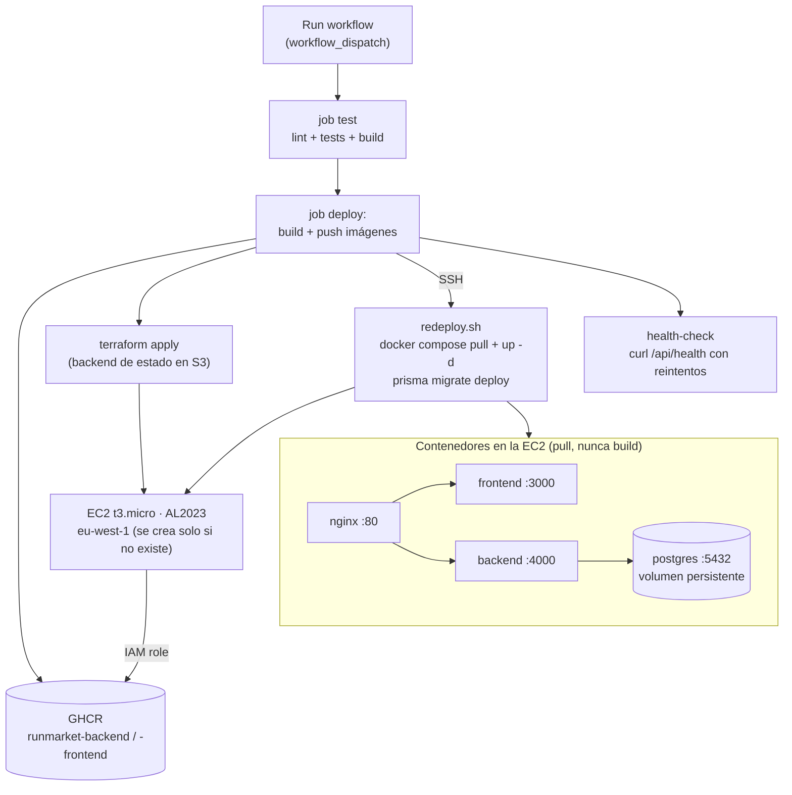

# RunMarket — Estrategia de despliegue (MVP académico)

Fecha de referencia: 2026-07-05.

Implementa la **Opción A** de [`docs/INFRASTRUCTURE.md`](INFRASTRUCTURE.md): una sola EC2
t3.micro en AWS donde corren cuatro contenedores Docker (postgres, backend, frontend, nginx)
orquestados con Docker Compose. Terraform provisiona la instancia y un pipeline de GitHub
Actions (`ci-cd.yml`) construye las imágenes de backend y frontend, las publica en un
registro de contenedores (GHCR) y despliega bajo demanda contra la EC2 existente.

Se construye en dos fases: **contenerización + infraestructura** (Dockerfiles,
`docker-compose.prod.yml`, Terraform — deja el sistema desplegable a mano) y
**automatización de CI/CD** (el pipeline de GitHub Actions que automatiza ese
despliegue, depende de que la primera fase esté completa).

---

## Por qué GHCR y no S3 para distribuir las imágenes

Alternativa considerada y descartada: en vez de publicar en un registro de
contenedores, `docker save | gzip` cada imagen, subir el tarball al bucket S3 de
artefactos que la EC2 ya lee (mismo rol IAM que usa para `app.zip`) y sustituir
`docker compose pull` por `aws s3 cp` + `docker load` en `user_data.sh.tpl`/`redeploy.sh`.
Es técnicamente viable — el rol IAM y el bucket ya existen — pero reinventa peor
varias cosas que un registro de contenedores da gratis:

- **Pull incremental por capas.** `docker pull` solo transfiere las capas que
  cambiaron respecto a lo que ya hay en la instancia. Un tarball de `docker save`
  es la imagen completa cada vez (cientos de MB), aunque el cambio real sea una
  línea de código — cada deploy sería más lento y consumiría más ancho de banda
  en un t3.micro.
- **Deduplicación de capas base.** GHCR almacena una sola vez la capa base
  (`node:20-slim`, dependencias de `node_modules`) y la comparte entre versiones
  de la imagen. Con tarballs en S3, cada versión subida duplica esas capas
  compartidas — más coste de almacenamiento sin ningún beneficio.
- **Versionado y tags nativos.** `:latest`, un tag por commit, rollback a una
  versión anterior — todo eso ya lo gestiona el registro. Con S3 habría que
  inventar un esquema propio de naming (p.ej. incluir el hash del commit en la
  key del objeto) solo para no servir una imagen obsoleta cacheada.
- **Integración directa con las herramientas.** `docker/build-push-action`
  (pipeline automatizado) y `docker push`/`pull` (flujo manual) ya hablan el
  protocolo de registro sin pasos intermedios. La ruta S3 añade un
  `docker save`/`load` y una compresión/descompresión extra en cada publicación
  y cada despliegue.

El único inconveniente real de GHCR frente a S3 es la visibilidad pública del
paquete (paso manual, ver pre-requisitos más abajo) — un coste único y pequeño
comparado con reimplementar a mano gran parte de lo que un registro ya resuelve.

---

## Flujo de despliegue



> Las imágenes de backend y frontend **se construyen en el runner de GitHub Actions**, nunca
> en la EC2. La instancia solo hace `docker compose pull`, lo que evita el build de Next.js
> en un t3.micro de 1 GB de RAM (y con ello, la necesidad de swap para ese build).

> **Por qué el disparador es manual (`workflow_dispatch`) y no automático en cada
> push/PR:** este proyecto es un ejercicio académico (TFM) con el código funcional ya
> completo y sin evolución prevista más allá de correcciones puntuales — no hay un
> flujo continuo de nuevas user stories que justifique desplegar en cada cambio. Un
> disparo manual es suficiente y evita despliegues no deseados mientras se itera en
> la documentación o en ramas de trabajo. En un desarrollo futuro con evolución
> continua del producto, el criterio natural sería disparar `deploy` automáticamente
> al fusionar la Pull Request de cada nueva user story (`on: push` a la rama
> principal, o `on: pull_request` con `types: [closed]` y comprobando que se mergeó).

---

## Ficheros a crear

```
├── frontend/next.config.mjs        ← output standalone
├── backend/Dockerfile              ← node:20-slim + openssl (ver nota), no alpine
├── frontend/Dockerfile
├── nginx/nginx.conf
├── docker-compose.prod.yml         ← backend/frontend por image: (GHCR), no build: local
├── .dockerignore                   ← contexto de build = raíz del monorepo (workspaces npm)
├── .github/
│   └── workflows/
│       └── ci-cd.yml               ← job test + job deploy, ambos disparados solo por workflow_dispatch
└── infra/
    ├── main.tf / provider.tf (backend "s3") / variables.tf
    ├── security_groups.tf / iam.tf / s3.tf (artefactos) / s3_backend.tf (estado) / ec2.tf / outputs.tf
    ├── artifacts.tf                ← null_resource: empaqueta y sube el zip a S3 en cada apply
    ├── oidc.tf                     ← proveedor OIDC + rol IAM restringido a la rama finalproject-XVB, sin access keys estáticas
    ├── terraform.tfvars.example
    ├── .gitignore
    └── scripts/
        ├── generar-zip.sh          ← solo docker-compose.prod.yml + nginx/ + redeploy.sh
        ├── user_data.sh.tpl        ← primer arranque: pull + up -d (sin swap de build)
        └── redeploy.sh             ← deploys posteriores: pull + up -d + migrate
```

> **Nota:** `node:20-alpine` no es compatible con el motor nativo de Prisma (falla con
> `Error loading shared library libssl.so.1.1`, musl no soporta el binario). El
> Dockerfile del backend usa `node:20-slim` (Debian) con `apt-get install openssl` en
> ambas stages — Debian slim tampoco trae `libssl` por defecto.
>
> **Nota:** dado que las imágenes se construyen fuera de la EC2, `generar-zip.sh` **no
> empaqueta el código fuente** — solo `docker-compose.prod.yml`, `nginx/nginx.conf` y
> `redeploy.sh`. Un diseño que empaquetara todo el monorepo quedaría superado por la
> decisión de imágenes pre-construidas.

---

## Pasos para construir la infraestructura

Mapa de alto nivel, en el orden en que se construyen las piezas:

**Fase 1 — Contenerizar y desplegar RunMarket en AWS** (deja el sistema desplegable a mano)

| # | Paso | Construye |
|---|---|---|
| 1 | Dockerfile del backend | `backend/Dockerfile` (build multi-stage, arranca en :4000, `ts-node` disponible para el seed) |
| 2 | Dockerfile del frontend | `frontend/Dockerfile` (Next.js standalone, arranca en :3000, URL de API como build arg) |
| 3 | Nginx como reverse proxy | `nginx/nginx.conf` (`/api` → backend, `/` → frontend, marcador para Certbot) |
| 4 | Docker Compose de producción | `docker-compose.prod.yml` (backend/frontend por `image:` de GHCR, solo nginx expone puertos) |
| 5 | Infraestructura Terraform | `infra/*.tf` (EC2, Security Group 22/80/443, S3 de artefactos, IAM) |
| 6 | Scripts de empaquetado, arranque y redeploy | `generar-zip.sh`, `user_data.sh.tpl` (sin swap de build), `redeploy.sh` (pull + up -d + migrate, ejecutado a mano) |
| 7 | Backend remoto de Terraform | Bloque `backend "s3"` + bucket de estado privado y cifrado |

**Fase 2 — Automatizar CI/CD con GitHub Actions** (depende de que la Fase 1 esté completa)

| # | Paso | Construye |
|---|---|---|
| 8 | Pipeline de CI/CD — job `test` | `.github/workflows/ci-cd.yml`, disparado manualmente (`workflow_dispatch`) |
| 9 | Infraestructura OIDC | `infra/oidc.tf` (proveedor OIDC + rol IAM restringido a la rama `finalproject-XVB`, sin access keys estáticas) |
| 10 | Pipeline de CI/CD — job `deploy` | Build + push a GHCR, autenticación OIDC, `terraform apply` idempotente, SSH a `redeploy.sh`, health-check |
| 11 | Configuración de GitHub Secrets/variables | 3 secrets + variable `AWS_ACCOUNT_ID` consumidos por el job `deploy` |

---

## Lanzar la infraestructura

Hay dos caminos hacia el mismo resultado (EC2 desplegada, contenedores corriendo).
Comparten la infraestructura de fondo (mismo backend de Terraform, mismos buckets),
pero **sus prerrequisitos no son los mismos** — el manual necesita herramientas
instaladas en tu portátil; el de GitHub Actions necesita configuración previa en el
repositorio (secrets, rol OIDC) pero nada instalado en local.

### Opción recomendada — pipeline de GitHub Actions

**Pre-requisitos** (todo vive en el repositorio/GitHub, nada se instala en tu portátil
para este camino en sí — salvo el bootstrap único de la siguiente sección):

- El proveedor OIDC + rol IAM de `infra/oidc.tf` ya aplicado (bootstrap único, ver
  "Alternativa — Terraform manual" más abajo)
- El backend de estado remoto S3 ya migrado (mismo bootstrap único)
- Los paquetes `runmarket-backend`/`runmarket-frontend` marcados como **públicos** en
  GHCR (GitHub → perfil → Packages → Package settings → Change visibility) — paso
  manual único, la primera vez que el pipeline (o un `docker push` manual) crea cada
  paquete; el job `deploy` automatiza el build+push pero no la visibilidad, y sin
  ella `redeploy.sh` falla el `docker compose pull` en la EC2
- Los secrets y variables configurados en GitHub (Settings → Secrets and variables → Actions):

| Nombre | Tipo | Uso |
|---|---|---|
| `TF_VAR_DB_PASSWORD` / `TF_VAR_SESSION_SECRET` | Secret | Variables sensibles de Terraform, nunca en el repo |
| `EC2_SSH_PRIVATE_KEY` | Secret | Conexión SSH al paso de redeploy |
| `AWS_ACCOUNT_ID` | Variable (no sensible) | Construye el ARN del rol IAM a asumir vía OIDC |

> La autenticación AWS del runner usa **OIDC** (rol IAM con token temporal), no
> access keys estáticas — no hace falta ningún `AWS_ACCESS_KEY_ID`/`AWS_SECRET_ACCESS_KEY`
> en GitHub Secrets. Con OIDC no existe ninguna credencial de larga duración que pueda
> filtrarse.
>
> **Por qué OIDC es la práctica recomendada frente a access keys estáticas:** con
> access keys, la credencial vive indefinidamente en GitHub Secrets — si se filtra
> (log mal configurado, secret expuesto por error, repo comprometido), sigue siendo
> válida hasta que alguien la rote manualmente. Con OIDC, GitHub emite un token
> firmado y de un solo uso por cada ejecución del workflow; AWS lo cambia por
> credenciales temporales (minutos de validez) solo si la `Condition` de la trust
> policy coincide exactamente con el repositorio y la rama esperados. No hay ninguna
> credencial permanente que robar ni que rotar — es el mismo principio de menor
> privilegio aplicado a la autenticación, no solo a los permisos.

**Pasos:**

1. Pestaña **Actions** del repositorio → workflow `CI/CD` → **Run workflow**.
2. El job `test` corre primero (lint + tests + build); si pasa, se encadena `deploy`.
3. `deploy` construye y publica las imágenes en GHCR, aplica Terraform (crea la EC2 solo
   si no existe todavía), y por SSH ejecuta `redeploy.sh` en la instancia.
4. El health-check final confirma que `GET /api/health` responde; si falla, el job queda
   en rojo con el detalle en los logs de Actions.

### Alternativa — Terraform manual desde el portátil (bootstrap inicial y pruebas)

Necesaria para el bootstrap único de la infraestructura (rol OIDC, backend de estado
remoto — prerrequisitos de la opción anterior) y útil para depurar sin pasar por CI.

**Pre-requisitos** (instalados en tu máquina; ninguno de ellos hace falta en el
runner de GitHub Actions):

- AWS CLI instalado y configurado (`aws configure`) con un usuario con permisos EC2 + S3 + IAM
- Terraform instalado (`brew install terraform` o [terraform.io](https://terraform.io))
- Docker instalado (build + push manual de imágenes a GHCR, antes de que exista el pipeline)
- Key pair creado en AWS EC2 (consola → EC2 → Key Pairs → Create) y descargado en local

**Pasos** — hasta que el pipeline automatice el build y el despliegue, el flujo manual es:

**1. Publicar las imágenes en GHCR (una vez, a mano):**
```bash
docker build -f backend/Dockerfile -t ghcr.io/<owner>/runmarket-backend:latest .
docker build -f frontend/Dockerfile --build-arg NEXT_PUBLIC_API_URL=http://<ip> \
  -t ghcr.io/<owner>/runmarket-frontend:latest .
docker login ghcr.io
docker push ghcr.io/<owner>/runmarket-backend:latest
docker push ghcr.io/<owner>/runmarket-frontend:latest
```
Después, marca ambos paquetes como **públicos** (GitHub → tu perfil → Packages →
paquete → Package settings → Change visibility). Sin esto, `docker compose pull` en la
EC2 falla por falta de credenciales de registro en la instancia — el pipeline
automatizado sustituye este paso manual por login automático con `GITHUB_TOKEN`.

**2. Bootstrap del backend de estado remoto (una sola vez):**
```bash
cd infra
cp terraform.tfvars.example terraform.tfvars
# Editar con los valores reales: key_name, db_password, session_secret, cors_origin,
# github_repository_owner

# a) Comentar el bloque `backend "s3"` en provider.tf (backend local por defecto)
terraform init
terraform apply    # crea EC2, SG, IAM, bucket de artefactos, bucket de estado, y
                   # empaqueta + sube infra/app.zip a S3 automáticamente
                   # (null_resource.upload_artifacts, infra/artifacts.tf)

# b) Descomentar el bloque `backend "s3"` en provider.tf
terraform init -migrate-state   # migra el .tfstate local (bucket incluido) al backend remoto
```
`-migrate-state` sí hace falta aquí: el `.tfstate` local del paso (a) ya existe (incluye
el propio bucket de estado recién creado), así que hay que migrarlo — no es un backend
que arranca vacío.

**3. Aplicar (una vez migrado el backend, en cualquier apply posterior):**
```bash
terraform plan     # revisar qué va a crear/cambiar
terraform apply    # confirmar con "yes"
```

Con las imágenes ya publicadas en GHCR, `user_data.sh.tpl` solo hace `docker compose
pull` — el bootstrap ya no depende del build de Next.js y tarda bastante menos que si
tuviera que compilar en la instancia.

> **Estado actual del repositorio:** ninguno de los ficheros de esta estrategia existe
> todavía en el árbol de trabajo — **los Dockerfiles (`backend/Dockerfile`,
> `frontend/Dockerfile`) también deben generarse**, junto con `nginx/nginx.conf`,
> `docker-compose.prod.yml` y todo `infra/*.tf`, antes de poder ejecutar el paso 1
> ("Publicar las imágenes en GHCR") o el pipeline de CI/CD. Este documento describe el
> diseño completo; su implementación (y verificación real contra AWS) está pendiente.

**Verificar:**
```bash
terraform output app_url   # devuelve http://<ip-pública>
curl http://<ip>/api/health
```

Abrir `http://<ip>` en el browser — el catálogo de RunMarket debe cargar con los 13 productos.

**Seguimiento del bootstrap (opcional):**
```bash
ssh -i <key>.pem ec2-user@<ip>
tail -f /var/log/user-data.log     # primer arranque
tail -f /var/log/redeploy.log      # deploys posteriores
```

### Destruir la infraestructura
```bash
terraform destroy   # elimina EC2, S3 y SG — los datos de PostgreSQL se pierden
```

---

## Extensiones opcionales

| Extensión | Cuándo | Cómo |
|---|---|---|
| **TLS / HTTPS** | Cuando haya dominio disponible | `sudo certbot --nginx -d <dominio>` en la instancia; actualizar `CORS_ORIGIN` en `.env` |

> **Aviso de seguridad:** hasta que se aplique esta extensión TLS, la app solo sirve
> por HTTP (puerto 80). Con `NODE_ENV=production` la cookie `sessionId` ya incluye
> correctamente el atributo `Secure` (fix de una revisión de seguridad anterior,
> [`US-017`](backlog/archive/US-017.md)) — los navegadores **descartan** cookies
> `Secure` recibidas por HTTP, así que el carrito/sesión no persistirá entre
> peticiones en este primer despliegue. Este es el comportamiento *seguro por
> defecto* (evita transmitir el `sessionId` en claro por una red no cifrada) y
> **no debe "arreglarse"** quitando `Secure` o forzando `NODE_ENV=development` en
> producción — eso reabriría la vulnerabilidad de secuestro de sesión que ese flag
> corrige. La solución correcta es priorizar esta fila (TLS) antes de exponer la URL
> a usuarios reales.
| **Backups S3** | Si los datos de demo importan | Añadir `infra/s3_backup.tf` con bucket + IAM `s3:PutObject` y `infra/scripts/pg_backup.sh` con cron diario |
| **Datadog** | Si se quiere observabilidad avanzada | Provider datadog en Terraform + agente como contenedor en `docker-compose.prod.yml` |

---

## Referencias

- [`docs/INFRASTRUCTURE.md`](INFRASTRUCTURE.md) — diseño completo de la Opción A
