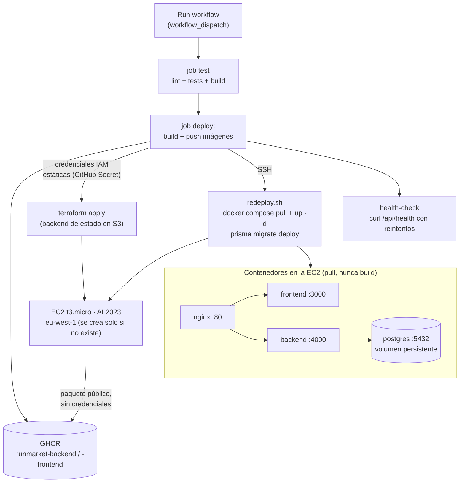

# RunMarket — Estrategia de despliegue (MVP académico)

Fecha de referencia: 2026-07-05.

Implementa la **Opción A** de [`docs/INFRASTRUCTURE.md`](INFRASTRUCTURE.md): una sola EC2
t3.micro en AWS donde corren cuatro contenedores Docker (postgres, backend, frontend, nginx)
orquestados con Docker Compose. Terraform provisiona la instancia y un pipeline de GitHub
Actions (`ci-cd.yml`) construye las imágenes de backend y frontend, las publica en un
registro de contenedores (GHCR) y despliega bajo demanda contra la EC2 existente.

Se construye en dos fases: **contenerización + infraestructura** (Dockerfiles,
`docker-compose.prod.yml`, Terraform — deja el sistema desplegable a mano) y
**automatización de CI/CD** (el pipeline de GitHub Actions que automatiza ese
despliegue, depende de que la primera fase esté completa).

---

## Por qué GHCR y no S3 para distribuir las imágenes

Alternativa considerada y descartada: en vez de publicar en un registro de
contenedores, `docker save | gzip` cada imagen, subir el tarball al bucket S3 de
artefactos que la EC2 ya lee (mismo rol IAM que usa para `app.zip`) y sustituir
`docker compose pull` por `aws s3 cp` + `docker load` en `user_data.sh.tpl`/`redeploy.sh`.
Es técnicamente viable — el rol IAM y el bucket ya existen — pero reinventa peor
varias cosas que un registro de contenedores da gratis:

- **Pull incremental por capas.** `docker pull` solo transfiere las capas que
  cambiaron respecto a lo que ya hay en la instancia. Un tarball de `docker save`
  es la imagen completa cada vez (cientos de MB), aunque el cambio real sea una
  línea de código — cada deploy sería más lento y consumiría más ancho de banda
  en un t3.micro.
- **Deduplicación de capas base.** GHCR almacena una sola vez la capa base
  (`node:20-slim`, dependencias de `node_modules`) y la comparte entre versiones
  de la imagen. Con tarballs en S3, cada versión subida duplica esas capas
  compartidas — más coste de almacenamiento sin ningún beneficio.
- **Versionado y tags nativos.** `:latest`, un tag por commit, rollback a una
  versión anterior — todo eso ya lo gestiona el registro. Con S3 habría que
  inventar un esquema propio de naming (p.ej. incluir el hash del commit en la
  key del objeto) solo para no servir una imagen obsoleta cacheada.
- **Integración directa con las herramientas.** `docker/build-push-action`
  (pipeline automatizado) y `docker push`/`pull` (flujo manual) ya hablan el
  protocolo de registro sin pasos intermedios. La ruta S3 añade un
  `docker save`/`load` y una compresión/descompresión extra en cada publicación
  y cada despliegue.

El único inconveniente real de GHCR frente a S3 es la visibilidad pública del
paquete (paso manual, ver pre-requisitos más abajo) — un coste único y pequeño
comparado con reimplementar a mano gran parte de lo que un registro ya resuelve.

---

## Por qué credenciales IAM estáticas y no OIDC

Alternativa evaluada y descartada: autenticar el pipeline contra AWS con un
proveedor OIDC + rol IAM asumido por `sts:AssumeRoleWithWebIdentity` (token
temporal por ejecución, sin ninguna credencial de larga duración en GitHub
Secrets). Es la práctica recomendada por AWS para GitHub Actions, y tiene una
ventaja de seguridad real: si un secret se filtra, con OIDC no hay nada
permanente que robar.

Se descartó para este proyecto por el coste de complejidad frente al beneficio
real a esta escala: OIDC introduce un problema de arranque genuino — el rol
que el pipeline necesita para autenticarse lo crea Terraform, pero Terraform
necesita autenticarse para crear el rol. Resolverlo exige un bootstrap inicial
con alguna credencial fuera del pipeline de todas formas (ver discusión
completa en `docs/backlog/US-018.md`, histórico de la tarea de infraestructura
OIDC), más un proveedor OIDC, una trust policy condicionada a rama y
repositorio exactos, y una política IAM separada para el rol — varias piezas
más que mantener y depurar.

Para un proyecto de **un solo desarrollador y un solo repositorio**, ese
beneficio marginal (protegerse de un secret que solo tú puedes filtrar, en un
repo que solo tú operas) no compensa la complejidad añadida. La alternativa
elegida: un usuario IAM dedicado, creado a mano una vez, con una política
acotada a los recursos `runmarket-*` (no `AdministratorAccess`), cuya access
key vive como `AWS_ACCESS_KEY_ID`/`AWS_SECRET_ACCESS_KEY` en GitHub Secrets
(cifrados en reposo, nunca visibles en logs). El riesgo residual —una
credencial de larga duración que rotar manualmente si se sospecha
compromiso— se considera aceptable a esta escala.

---

## Flujo de despliegue



> Las imágenes de backend y frontend **se construyen en el runner de GitHub Actions**, nunca
> en la EC2. La instancia solo hace `docker compose pull`, lo que evita el build de Next.js
> en un t3.micro de 1 GB de RAM (y con ello, la necesidad de swap para ese build).

> **Por qué el disparador es manual (`workflow_dispatch`) y no automático en cada
> push/PR:** este proyecto es un ejercicio académico (TFM) con el código funcional ya
> completo y sin evolución prevista más allá de correcciones puntuales — no hay un
> flujo continuo de nuevas user stories que justifique desplegar en cada cambio. Un
> disparo manual es suficiente y evita despliegues no deseados mientras se itera en
> la documentación o en ramas de trabajo. En un desarrollo futuro con evolución
> continua del producto, el criterio natural sería disparar `deploy` automáticamente
> al fusionar la Pull Request de cada nueva user story (`on: push` a la rama
> principal, o `on: pull_request` con `types: [closed]` y comprobando que se mergeó).

---

## Ficheros a crear

```
├── frontend/next.config.mjs        ← output standalone
├── backend/Dockerfile              ← node:20-slim + openssl (ver nota), no alpine
├── frontend/Dockerfile
├── nginx/nginx.conf
├── docker-compose.prod.yml         ← backend/frontend por image: (GHCR), no build: local
├── .dockerignore                   ← contexto de build = raíz del monorepo (workspaces npm)
├── .github/
│   └── workflows/
│       └── ci-cd.yml               ← job test + job deploy, ambos disparados solo por workflow_dispatch
└── infra/
    ├── main.tf / provider.tf (backend "s3", activo desde el principio) / variables.tf
    ├── security_groups.tf / iam.tf / s3.tf (artefactos) / ec2.tf / outputs.tf
    ├── artifacts.tf                ← data "archive_file" (provider archive): empaqueta y sube el zip a S3 en cada apply
    ├── terraform.tfvars.example
    ├── .gitignore
    └── scripts/
        ├── generar-zip.sh          ← solo docker-compose.prod.yml + nginx/ + redeploy.sh
        ├── user_data.sh.tpl        ← primer arranque: pull + up -d (sin swap de build)
        └── redeploy.sh             ← deploys posteriores: pull + up -d + migrate
```

> **Nota:** el bucket de estado remoto de Terraform (`runmarket-terraform-state-<account-id>`)
> **no** es un recurso de `infra/*.tf` — es el único elemento de esta infraestructura que
> vive fuera de Terraform, creado una vez a mano (ver "Autenticación y estado — configuración
> de cuenta" más abajo). Un backend no puede crear el sitio donde va a guardar su propio
> estado, así que gestionarlo con el propio Terraform introduciría el mismo problema de
> arranque que ya se evitó no usando OIDC (ver siguiente sección).

> **Nota:** `node:20-alpine` no es compatible con el motor nativo de Prisma (falla con
> `Error loading shared library libssl.so.1.1`, musl no soporta el binario). El
> Dockerfile del backend usa `node:20-slim` (Debian) con `apt-get install openssl` en
> ambas stages — Debian slim tampoco trae `libssl` por defecto.
>
> **Nota:** dado que las imágenes se construyen fuera de la EC2, `generar-zip.sh` **no
> empaqueta el código fuente** — solo `docker-compose.prod.yml`, `nginx/nginx.conf` y
> `redeploy.sh`. Un diseño que empaquetara todo el monorepo quedaría superado por la
> decisión de imágenes pre-construidas.

---

## Pasos para construir la infraestructura

Mapa de alto nivel, en el orden en que se construyen las piezas:

**Fase 1 — Contenerizar y desplegar RunMarket en AWS** (deja el sistema desplegable a mano)

| # | Paso | Construye |
|---|---|---|
| 1 | Dockerfile del backend | `backend/Dockerfile` (build multi-stage, arranca en :4000, `ts-node` disponible para el seed) |
| 2 | Dockerfile del frontend | `frontend/Dockerfile` (Next.js standalone, arranca en :3000, URL de API como build arg) |
| 3 | Nginx como reverse proxy | `nginx/nginx.conf` (`/api` → backend, `/` → frontend, marcador para Certbot) |
| 4 | Docker Compose de producción | `docker-compose.prod.yml` (backend/frontend por `image:` de GHCR, solo nginx expone puertos) |
| 5 | Infraestructura Terraform | `infra/*.tf` (EC2, Security Group 22/80/443, S3 de artefactos, IAM) |
| 6 | Scripts de empaquetado, arranque y redeploy | `generar-zip.sh`, `user_data.sh.tpl` (sin swap de build), `redeploy.sh` (pull + up -d + migrate, ejecutado por SSH) |
| 7 | Backend de estado de Terraform | Bloque `backend "s3"` activo desde el principio (bucket creado a mano, fuera de Terraform — ver "Autenticación y estado") |

**Fase 2 — Automatizar CI/CD con GitHub Actions** (depende de que la Fase 1 esté completa)

| # | Paso | Construye |
|---|---|---|
| 8 | Pipeline de CI/CD — job `test` | `.github/workflows/ci-cd.yml`, disparado manualmente (`workflow_dispatch`) |
| 9 | Pipeline de CI/CD — job `deploy` | Build + push a GHCR, autenticación AWS con IAM estático, `terraform apply` idempotente, SSH a `redeploy.sh`, health-check |
| 10 | Configuración de GitHub Secrets/variables | 4 secrets consumidos por el job `deploy` (ver tabla más abajo) |

---

## Lanzar la infraestructura

Un único camino: **todo despliegue pasa por el pipeline de GitHub Actions**,
incluida la primerísima vez que se crea la EC2. No hay una fase separada de
"bootstrap manual desde el portátil" que preceda al pipeline — eso solo era
necesario con OIDC (el rol tenía que existir antes de que el pipeline pudiera
autenticarse). Con credenciales IAM estáticas, la credencial existe desde el
principio, independiente de cualquier `apply`, así que el pipeline puede
hacer el primer `apply` igual que el número cien.

Lo único que queda fuera del pipeline es **configuración de cuenta, no un
despliegue** — se hace una vez, con la consola de AWS/GitHub o un puñado de
comandos, antes de disparar el workflow por primera vez.

### Autenticación y estado — configuración de cuenta (una vez)

1. **Usuario IAM para el pipeline.** Crear un usuario IAM dedicado (consola
   AWS → IAM → Users → Create user), sin acceso a la consola, con una policy
   acotada a los recursos `runmarket-*` (EC2, S3, IAM sobre roles/perfiles
   `runmarket-*`, ver política completa en `docs/DEPLOYMENT-RUNBOOK.md`) —
   nunca `AdministratorAccess`. Generar una access key para ese usuario.
2. **Bucket de estado de Terraform.** Crear a mano un bucket S3 privado,
   versionado y cifrado (`aws s3api create-bucket` + `put-bucket-versioning`
   + `put-bucket-encryption` + `put-public-access-block`, o los mismos pasos
   desde la consola). Es el único recurso de esta infraestructura que no
   gestiona Terraform — ver nota en "Ficheros a crear" más arriba. Editar
   `infra/provider.tf` sustituyendo `<ACCOUNT_ID>` por el Account ID real en
   el nombre del bucket, y commitear ese cambio (el nombre del bucket no es
   secreto).
3. **Key pair EC2** (consola AWS → EC2 → Key Pairs → Create) — necesario para
   que el pipeline pueda conectar por SSH y ejecutar `redeploy.sh`.
4. **Secrets en GitHub** (Settings → Secrets and variables → Actions):

| Nombre | Tipo | Uso |
|---|---|---|
| `AWS_ACCESS_KEY_ID` / `AWS_SECRET_ACCESS_KEY` | Secret | Credenciales del usuario IAM del paso 1 |
| `TF_VAR_DB_PASSWORD` | Secret | Variable sensible de Terraform, nunca en el repo |
| `EC2_SSH_PRIVATE_KEY` | Secret | Contenido del `.pem` del key pair del paso 3 |

5. **Publicar las imágenes en GHCR por primera vez y marcarlas públicas.** El
   propio job `deploy` construye y publica las imágenes — pero GHCR crea el
   paquete como privado la primera vez, y el `GITHUB_TOKEN` del workflow no
   tiene permiso para cambiar su visibilidad. Tras la primera ejecución del
   pipeline (que probablemente falle en el health-check por este motivo),
   marca ambos paquetes como públicos a mano (GitHub → tu perfil → Packages
   → paquete → Package settings → Change visibility) y vuelve a ejecutar el
   workflow — a partir de ahí, cada push a un paquete ya existente conserva
   su visibilidad, así que no hay que repetirlo.

### Lanzar el pipeline

1. Pestaña **Actions** del repositorio → workflow `CI/CD` → **Run workflow**.
2. El job `test` corre primero (lint + tests + build); si pasa, se encadena `deploy`.
3. `deploy` construye y publica las imágenes en GHCR, aplica Terraform (crea la EC2 solo
   si no existe todavía), y por SSH ejecuta `redeploy.sh` en la instancia.
4. El health-check final confirma que `GET /api/health` responde; si falla, el job queda
   en rojo con el detalle en los logs de Actions.

Los redeploys posteriores son exactamente el mismo paso 1 — no hay un camino
"primera vez" distinto del camino "enésima vez".

### Alternativa — Terraform manual desde el portátil (depuración)

Sigue disponible para depurar sin pasar por CI, pero deja de ser un requisito
previo al pipeline. Con AWS CLI configurado (`aws configure`, usando las
mismas credenciales del usuario IAM del paso 1 o cualquier otra con permisos
suficientes) y Terraform instalado:

```bash
cd infra
cp terraform.tfvars.example terraform.tfvars
# Editar con los valores reales: key_name, db_password, github_repository_owner
terraform init
terraform plan
terraform apply
```

**Verificar:**
```bash
terraform output app_url   # devuelve http://<ip-pública>
curl http://<ip>/api/health
```

Abrir `http://<ip>` en el navegador — el catálogo de RunMarket debe cargar con los 13 productos.

**Seguimiento (opcional):**
```bash
ssh -i <key>.pem ec2-user@<ip>
tail -f /var/log/user-data.log     # primer arranque
tail -f /var/log/redeploy.log      # deploys posteriores
```

### Destruir la infraestructura
```bash
terraform destroy   # elimina EC2, S3 y SG — los datos de PostgreSQL se pierden
```

---

## Extensiones opcionales

| Extensión | Cuándo | Cómo |
|---|---|---|
| **TLS / HTTPS** | Cuando haya dominio disponible | `sudo certbot --nginx -d <dominio>` en la instancia; actualizar `CORS_ORIGIN` en `.env` |

> **Aviso de seguridad:** hasta que se aplique esta extensión TLS, la app solo sirve
> por HTTP (puerto 80). Con `NODE_ENV=production` la cookie `sessionId` ya incluye
> correctamente el atributo `Secure` (fix de una revisión de seguridad anterior,
> [`US-017`](backlog/archive/US-017.md)) — los navegadores **descartan** cookies
> `Secure` recibidas por HTTP, así que el carrito/sesión no persistirá entre
> peticiones en este primer despliegue. Este es el comportamiento *seguro por
> defecto* (evita transmitir el `sessionId` en claro por una red no cifrada) y
> **no debe "arreglarse"** quitando `Secure` o forzando `NODE_ENV=development` en
> producción — eso reabriría la vulnerabilidad de secuestro de sesión que ese flag
> corrige. La solución correcta es priorizar esta fila (TLS) antes de exponer la URL
> a usuarios reales.
| **Backups S3** | Si los datos de demo importan | Añadir `infra/s3_backup.tf` con bucket + IAM `s3:PutObject` y `infra/scripts/pg_backup.sh` con cron diario |
| **Datadog** | Si se quiere observabilidad avanzada | Provider datadog en Terraform + agente como contenedor en `docker-compose.prod.yml` |

---

## Referencias

- [`docs/INFRASTRUCTURE.md`](INFRASTRUCTURE.md) — diseño completo de la Opción A
