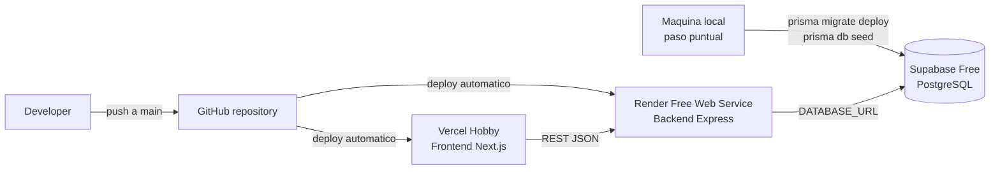

# RunMarket - Pipeline de despliegue del MVP

Este documento describe el flujo de despliegue del **MVP academico** de RunMarket. El objetivo es publicar la aplicacion con coste 0 EUR/mes, manteniendo una operacion sencilla y suficiente para que los profesores puedan consultar y probar el Trabajo Final.

La pipeline del MVP no requiere una solucion CI/CD compleja. Vercel y Render despliegan automaticamente desde GitHub al vincular el repositorio. Supabase aloja la base de datos PostgreSQL y se prepara aparte mediante migraciones y seed de Prisma.

---

## 1. Servicios utilizados

| Capa | Servicio | Plan | Funcion |
|---|---|---|---|
| Frontend | Vercel | Hobby | Despliegue de Next.js 14 con SSR y assets publicos |
| Backend | Render | Free Web Service | Despliegue de la API Express |
| Base de datos | Supabase | Free PostgreSQL | Base de datos PostgreSQL gestionada |
| Repositorio | GitHub | Free | Fuente de codigo y disparador de despliegues |

---

## 2. Flujo de despliegue



El flujo normal es:

1. Se hace push del codigo a GitHub.
2. Vercel detecta cambios y despliega el frontend.
3. Render detecta cambios y despliega el backend.
4. Supabase no despliega codigo; se prepara ejecutando migraciones y seed de Prisma.

---

## 3. Despliegue del frontend en Vercel

Vercel se conecta al repositorio GitHub y despliega el workspace del frontend.

Configuracion recomendada:

```text
Service: Vercel Project
Plan: Hobby
Root directory: frontend
Build command: npm run build --workspace frontend
```

Variables de entorno:

```text
NEXT_PUBLIC_API_URL=https://<backend>.onrender.com
ASSETS_BASE_URL=/images
```

Notas:

- `NEXT_PUBLIC_API_URL` apunta a la URL publica del backend en Render.
- `ASSETS_BASE_URL=/images` resuelve las imagenes del MVP desde `frontend/public/images`.
- Vercel proporciona una URL publica estable del tipo `https://<project>.vercel.app`.

---

## 4. Despliegue del backend en Render

Render se conecta al mismo repositorio GitHub y despliega el workspace del backend como servicio web Node.js.

Configuracion recomendada:

```text
Service: Render Web Service
Plan: Free
Root directory: backend
Build command: npm install && npm run build --workspace backend
Start command: npm run start --workspace backend
```

Variables de entorno:

```text
NODE_ENV=production
DATABASE_URL=<supabase-postgres-connection-string>
CORS_ORIGIN=https://<frontend>.vercel.app
```

Notas:

- `DATABASE_URL` debe ser una cadena de conexion PostgreSQL de Supabase.
- `CORS_ORIGIN` debe coincidir con la URL publica del frontend en Vercel.
- Render proporciona una URL publica estable del tipo `https://<service>.onrender.com`.
- En el plan Free, el servicio puede entrar en reposo tras inactividad y tardar mas en responder la primera peticion.

---

## 5. Preparacion de la base de datos en Supabase

Supabase aloja PostgreSQL, pero no despliega codigo desde GitHub en esta version del MVP. La base de datos se prepara ejecutando Prisma desde local.

Pasos:

```bash
cd backend
npx prisma migrate deploy
npx prisma db seed
```

Requisitos:

- La variable `DATABASE_URL` debe apuntar a Supabase.
- Las migraciones de Prisma deben estar disponibles en el repositorio.
- El seed debe cargar los productos iniciales del catalogo.

El comando `prisma migrate deploy` crea o actualiza las tablas. El comando `prisma db seed` carga datos iniciales, como productos, precios, stock y rutas de imagen.

El seed no se ejecuta automaticamente en cada despliegue para evitar duplicados o cambios no deseados en los datos. Debe ejecutarse de forma puntual, normalmente:

- al crear la base de datos por primera vez;
- despues de resetear la base de datos;
- cuando se quiera recargar el dataset de demostracion.

---

## 6. Imagenes del MVP

En el MVP, las imagenes de producto se almacenan en:

```text
frontend/public/images/products/...
```

Next.js sirve automaticamente estos assets como:

```text
/images/products/...
```

La tabla `Product` almacena solo la ruta relativa, por ejemplo:

```text
products/nike-pegasus-41.jpg
```

La URL final se construye con:

```text
ASSETS_BASE_URL=/images
```

Ejemplo:

```text
/images/products/nike-pegasus-41.jpg
```

---

## 7. Checklist post-despliegue

Antes de compartir la URL con profesores, verificar:

- El frontend carga correctamente en Vercel.
- El backend responde en Render.
- El endpoint de salud responde, por ejemplo `/health`.
- `GET /api/products` devuelve productos.
- El catalogo del frontend muestra productos.
- Las imagenes de producto cargan correctamente.
- La ficha de producto funciona.
- El carrito permite añadir y eliminar productos.
- El checkout simulado crea un pedido.
- La pagina de pedidos muestra la informacion esperada.
- Los logs de Vercel y Render no muestran errores criticos.

---

## 8. Limitaciones conocidas del MVP

- Render Free Web Service puede dormirse tras inactividad.
- La primera peticion al backend puede tardar mas si el servicio estaba dormido.
- Supabase Free puede pausar el proyecto tras inactividad.
- No hay backups profesionales en la base gratuita.
- No hay SLA de produccion.
- La preparacion de base de datos es manual o semi-manual.
- Esta pipeline es adecuada para entrega academica, no para produccion real.

---

## 9. Recomendacion operativa para la entrega

El dia de la entrega o antes de compartir el enlace:

1. Abrir la URL del backend para despertar Render.
2. Abrir la URL del frontend en Vercel.
3. Probar el flujo completo: catalogo -> ficha -> carrito -> checkout -> pedido.
4. Confirmar que Supabase no esta pausado.
5. Revisar rapidamente logs de Vercel y Render.

Con este flujo, el MVP queda publicado mediante una pipeline sencilla: despliegue automatico de frontend/backend desde GitHub y preparacion puntual de la base de datos con Prisma.
