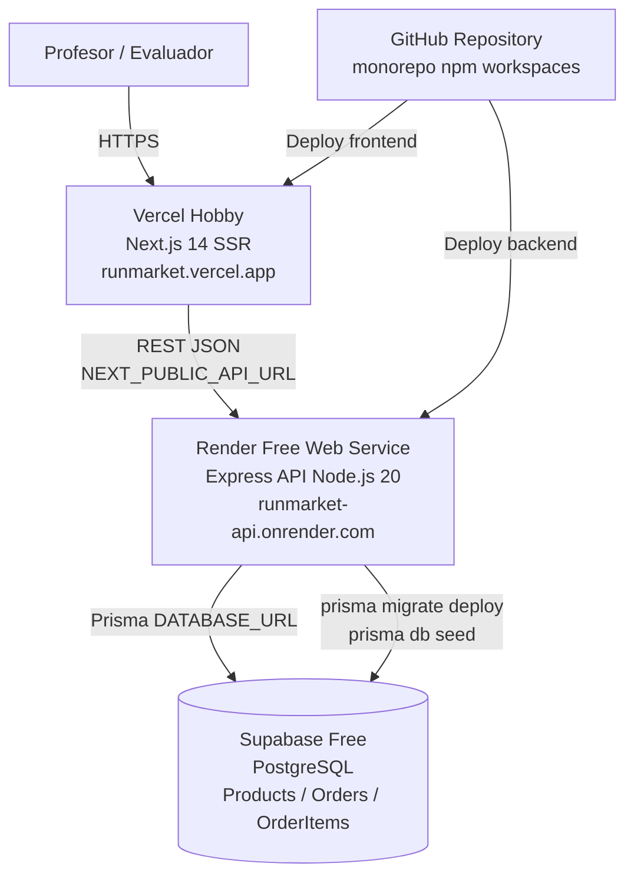
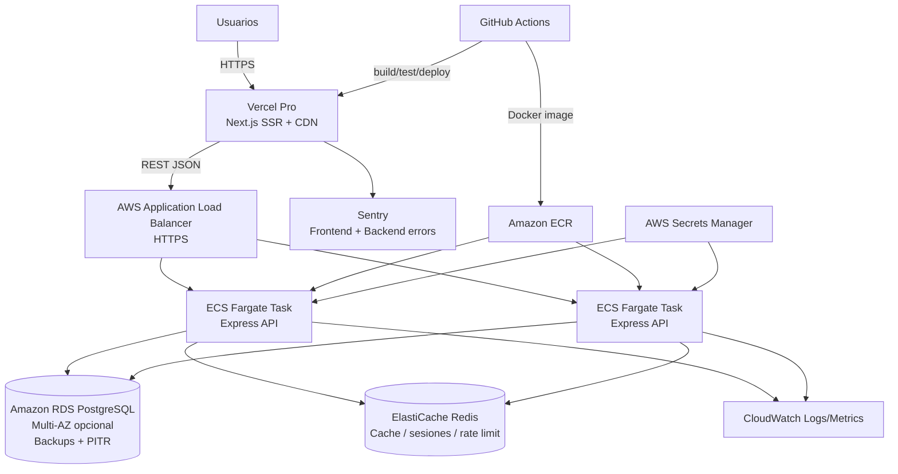

# RunMarket - Propuesta de infraestructura

Fecha de referencia: 2026-06-03.

Este documento propone dos estrategias de infraestructura para RunMarket, alineadas con la arquitectura definida en `docs/ARCHITECTURE.md`: frontend SSR desacoplado con Next.js 14, backend REST independiente con Express y base de datos PostgreSQL gestionada mediante Prisma.

La propuesta distingue entre una infraestructura minima para la entrega academica del MVP y una infraestructura profesional evolutiva. El objetivo es evitar sobreingenieria en el corto plazo, pero mantener un camino claro hacia una plataforma operable en produccion.

> Nota sobre costes: los importes son orientativos y deben revisarse antes del despliegue final. Los proveedores modifican periodicamente sus planes gratuitos, limites de uso y precios. Las referencias consultadas son las paginas oficiales de Vercel, Render, Supabase, Fly.io y AWS.

---

## 1. Resumen ejecutivo

Para la entrega academica del MVP se recomienda desplegar:

- **Frontend Next.js en Vercel Hobby**.
- **Backend Express en Render Free Web Service**.
- **PostgreSQL en Supabase Free**.
- **CI/CD automatico desde GitHub** con despliegues por push.

Esta combinacion permite publicar RunMarket con coste 0 EUR/mes, mantiene la separacion frontend/backend definida en la arquitectura, no requiere administrar servidores y es suficientemente estable para una evaluacion academica. La principal limitacion es que el backend gratuito de Render puede entrar en reposo tras inactividad, generando una primera peticion lenta.

Para una evolucion profesional se recomienda avanzar hacia:

- **Frontend en Vercel Pro** para SSR, CDN global, previews y observabilidad frontend.
- **Backend containerizado en AWS ECS Fargate** o, como paso intermedio, Render/Fly.io de pago.
- **PostgreSQL gestionado en AWS RDS o Aurora PostgreSQL**.
- **Redis gestionado** cuando el trafico o la gestion de sesiones/cache lo justifiquen.
- **Observabilidad con Sentry + OpenTelemetry/CloudWatch**.
- **CI/CD con GitHub Actions** y entornos `dev`, `staging` y `production`.

No se recomienda Kubernetes ni microservicios para el MVP ni para los primeros cientos o miles de usuarios. La arquitectura actual puede escalar de forma natural manteniendo el backend Express como servicio unico, con escalado horizontal, cache y base de datos gestionada.

---

## 2. Tabla comparativa

| Dimension | Opcion 1 - MVP academico | Opcion 2 - Infraestructura profesional |
|---|---|---|
| Objetivo | Entrega del Trabajo Final y demo evaluable | Produccion real con crecimiento progresivo |
| Coste estimado | 0 EUR/mes, maximo 10 EUR/mes si se evita cold start | Desde 80-250 EUR/mes iniciales; escala segun uso |
| Frontend | Vercel Hobby | Vercel Pro o plataforma cloud con CDN |
| Backend | Render Free Web Service | AWS ECS Fargate, Render Pro o Fly.io |
| Base de datos | Supabase Free o Neon Free | AWS RDS PostgreSQL / Aurora PostgreSQL |
| CDN | Incluido en Vercel | Vercel CDN + CloudFront opcional |
| CI/CD | GitHub + despliegues automaticos | GitHub Actions con pipelines por entorno |
| Observabilidad | Logs basicos de proveedor | Sentry, CloudWatch, OpenTelemetry, alertas |
| Backups | Limitados por free tier | Backups automaticos, PITR y politicas de retencion |
| Seguridad | HTTPS, variables de entorno, CORS, rate limit | IAM, Secrets Manager, WAF, VPC, gestion de roles |
| Escalado | Manual y limitado | Horizontal en API, vertical/horizontal en DB, cache |
| Complejidad operativa | Muy baja | Media, asumible para produccion |
| Riesgo principal | Cold starts y limites de free tier | Coste y mayor disciplina operativa |

---

## 3. Opcion 1: infraestructura basica para entrega academica

### 3.1 Recomendacion concreta

La opcion recomendada para el Trabajo Final es:

| Componente | Proveedor recomendado | Plan | Coste estimado |
|---|---|---|---|
| Frontend Next.js | Vercel | Hobby | 0 EUR/mes |
| Backend Express | Render | Free Web Service | 0 EUR/mes |
| PostgreSQL | Supabase | Free | 0 EUR/mes |
| Dominio | Subdominios gratuitos de proveedor | `vercel.app`, `onrender.com`, `supabase.co` | 0 EUR/mes |
| CI/CD | GitHub + Vercel/Render | Incluido | 0 EUR/mes |

Coste total estimado: **0 EUR/mes**.

Si se quiere mejorar la experiencia de la demo evitando que la API se duerma, la mejora minima razonable es pasar el backend a un servicio de pago basico en Render, Fly.io o Railway, normalmente dentro de un rango aproximado de **5-10 EUR/mes** segun proveedor, region y uso.

### 3.2 Diagrama de infraestructura



### 3.3 Componentes por capa

#### Frontend

**Proveedor recomendado:** Vercel Hobby.

Vercel es la opcion mas natural para el frontend porque RunMarket usa Next.js 14 con App Router, SSR selectivo, Metadata API e Image Optimization. Permite desplegar el frontend sin adaptar la arquitectura y ofrece CDN, HTTPS, previews y CI/CD automatico desde GitHub.

Configuracion recomendada:

- Proyecto Vercel apuntando al workspace `frontend`.
- Build command: `npm run build --workspace frontend`.
- Output: gestionado por Next.js/Vercel.
- Variable publica: `NEXT_PUBLIC_API_URL=https://<backend>.onrender.com`.
- Entornos: `preview` para ramas/PRs y `production` para `main`.

#### Backend

**Proveedor recomendado:** Render Free Web Service.

Render permite desplegar una API Express en Node.js sin contenedores obligatorios y con HTTPS publico. Encaja bien con el backend independiente definido en la arquitectura.

Configuracion recomendada:

- Servicio Web Node.js apuntando al workspace `backend`.
- Build command: `npm install && npm run build --workspace backend`.
- Start command: `npm run start --workspace backend`.
- Variable `PORT` gestionada por Render.
- Variables privadas:
  - `DATABASE_URL`
  - `DIRECT_URL` si Prisma necesita conexion directa para migraciones.
  - `CORS_ORIGIN=https://<frontend>.vercel.app`
  - `NODE_ENV=production`

Limitacion importante: los servicios gratuitos de Render pueden entrar en reposo tras inactividad, por lo que la primera peticion puede tardar mas. Para una demo academica es aceptable si se avisa y se prueba antes de la entrega.

#### Base de datos

**Proveedor recomendado:** Supabase Free.

Supabase ofrece PostgreSQL gestionado, panel de administracion, editor SQL y cadena de conexion compatible con Prisma. Para un catalogo semilla, pedidos simulados y bajo trafico academico, el plan gratuito es suficiente.

Para el Trabajo Final no se considera problematico que la base de datos este en un proveedor distinto al backend. La prioridad de esta fase es disponer de una aplicacion publica, estable durante la evaluacion y de coste 0 EUR/mes. El volumen de datos y trafico esperado es muy bajo, por lo que la latencia adicional entre Render y Supabase no deberia afectar de forma apreciable a la experiencia de los profesores. Ademas, el acceso a la base de datos no se expone al frontend: la cadena `DATABASE_URL` vive exclusivamente en el backend desplegado en Render.

Se ha descartado usar **Render Postgres Free** como base de datos principal de la entrega porque, aunque permitiria mantener backend y base de datos dentro del mismo proveedor, las bases gratuitas de Render expiran a los 30 dias. Esto no encaja bien con una entrega que debe permanecer consultable durante uno o dos meses sin intervencion frecuente. Supabase Free o Neon Free son alternativas mas adecuadas para conservar la base de datos academica durante ese periodo, siempre revisando sus limites de inactividad.

Configuracion recomendada:

- Proyecto Supabase en region europea si esta disponible.
- Base de datos PostgreSQL.
- `DATABASE_URL` de conexion pooled para runtime.
- Conexion directa para migraciones si el proveedor la expone.
- Ejecutar:
  - `npx prisma migrate deploy`
  - `npx prisma db seed`

Alternativa valida: **Neon Free**. Neon es especialmente atractivo para PostgreSQL serverless y proyectos con trafico discontinuo. Puede ser preferible si se quiere una experiencia centrada exclusivamente en Postgres sin las funcionalidades adicionales de Supabase.

#### CI/CD

La opcion basica no necesita un pipeline complejo:

- Vercel despliega frontend al hacer push.
- Render despliega backend al hacer push.
- Las migraciones de Prisma pueden ejecutarse manualmente desde local antes de la demo o incluirse en el build/deploy del backend.

Para reducir riesgo, se recomienda ejecutar las migraciones de forma explicita y controlada, no automaticamente en cada arranque de la API.

#### Observabilidad

Observabilidad minima:

- Logs de Vercel para SSR/builds.
- Logs de Render para API.
- Logs/panel de Supabase para base de datos.

No es necesario introducir Datadog, Grafana o ELK en el MVP academico.

#### Seguridad

Controles minimos:

- HTTPS gestionado por proveedores.
- Variables de entorno privadas en Vercel y Render.
- CORS restringido al dominio de Vercel.
- Rate limiting en Express, ya previsto en la arquitectura.
- No exponer credenciales de Supabase en frontend.
- No usar claves de servicio de Supabase en cliente.
- Seed con datos ficticios, sin datos personales reales.

### 3.4 Comparativa de proveedores para el MVP

| Proveedor | Uso recomendado | Ventaja | Limitacion |
|---|---|---|---|
| Vercel | Frontend Next.js | Mejor soporte para Next.js SSR y previews | Backend Express persistente no encaja tan directamente |
| Render | Backend Express | Muy sencillo para Node.js API | Free tier con cold start |
| Render Postgres | Base de datos junto al backend | Mismo proveedor que la API y menor latencia potencial | La base gratuita expira a los 30 dias; no es adecuada para una entrega consultable durante varios meses |
| Supabase | PostgreSQL | Postgres gestionado + panel + free tier | Free tier limitado y pausa por inactividad en algunos casos |
| Neon | PostgreSQL | Muy buen Postgres serverless | Menos funcionalidades integradas que Supabase |
| Railway | Backend + DB | Developer experience muy simple | El modelo de precios puede dejar de ser coste 0 rapidamente |
| Fly.io | Backend containerizado | Buen rendimiento global y despliegue cercano al usuario | Requiere mas conocimiento de contenedores/red |

### 3.5 Pros

- Coste 0 EUR/mes.
- Despliegue rapido y comprensible.
- Mantiene la separacion frontend/backend/base de datos.
- Permite que los profesores accedan a una URL publica.
- No requiere administrar servidores.
- Encaja con el monorepo y los workspaces.

### 3.6 Contras

- Cold start del backend si se usa Render Free.
- Base de datos y backend en proveedores distintos, aceptable para el MVP academico pero no ideal para produccion.
- Limites de trafico, CPU, memoria y almacenamiento de free tiers.
- Backups limitados o no adecuados para produccion real.
- Observabilidad basica.
- No hay SLA profesional.
- La base de datos gratuita no debe considerarse produccion.

### 3.7 Riesgos tecnicos

| Riesgo | Impacto | Mitigacion |
|---|---|---|
| API dormida antes de la evaluacion | Primera carga lenta | Abrir la app 5-10 minutos antes de la demo |
| Error de CORS | Frontend no puede llamar a API | Configurar `CORS_ORIGIN` con dominio exacto de Vercel |
| Migraciones no aplicadas | API falla al consultar tablas | Ejecutar `prisma migrate deploy` antes de publicar |
| Seed ausente | Catalogo vacio | Ejecutar `prisma db seed` y verificar datos |
| Variables mal configuradas | Fallo de despliegue o runtime | Checklist de variables por entorno |
| Limites del free tier | Servicio interrumpido | Mantener trafico bajo y preparar alternativa de pago basica |

---

## 4. Opcion 2: infraestructura profesional futura

### 4.1 Recomendacion concreta

Para una primera version profesional con cientos o miles de usuarios, se recomienda:

| Componente | Proveedor recomendado | Justificacion |
|---|---|---|
| Frontend | Vercel Pro | Plataforma especializada en Next.js, SSR, CDN, previews y despliegue rapido |
| Backend | AWS ECS Fargate | Ejecuta Express como contenedor escalable sin gestionar servidores |
| Base de datos | AWS RDS PostgreSQL | PostgreSQL gestionado con backups, replicas, Multi-AZ y operacion madura |
| Cache | Amazon ElastiCache Redis | Cache de catalogo, sesiones/carrito server-side y rate limiting distribuido |
| Secretos | AWS Secrets Manager / Parameter Store | Gestion segura de credenciales |
| Logs y metricas | CloudWatch + Sentry | Observabilidad backend/frontend y alertas |
| CI/CD | GitHub Actions | Pipeline controlado para test, build, migraciones y despliegue |
| CDN/WAF | Vercel CDN + AWS WAF opcional | Proteccion progresiva segun exposicion |

Coste inicial orientativo: **80-250 EUR/mes**, dependiendo de tamano de RDS, numero de tareas Fargate, transferencia, observabilidad y backups.

> **Nota sobre la eleccion de AWS:** La recomendacion de AWS como plataforma cloud para la infraestructura profesional responde a dos factores que conviene hacer explicitos. El primero es tecnico: los servicios gestionados de AWS (ECS Fargate, RDS, ElastiCache, Secrets Manager, CloudWatch) son maduros, estan ampliamente documentados y tienen una integracion nativa entre si que simplifica la operacion a largo plazo. El segundo es una decision personal basada en experiencia de uso amplia con la plataforma: operar infraestructura en solitario sobre una plataforma conocida reduce el riesgo operativo de forma significativa respecto a aprender una nueva. Alternativas equivalentes como **GCP Cloud Run + Cloud SQL** o **Azure Container Apps + Azure Database for PostgreSQL** cubririan los mismos requisitos funcionales con modelos de pricing comparables; la eleccion de AWS sobre ellas no es de superioridad tecnica sino de familiaridad y reduccion de friccion operativa.

### 4.2 Diagrama de infraestructura profesional



### 4.3 Componentes por capa

#### Frontend

**Recomendacion:** Vercel Pro.

El frontend de RunMarket obtiene valor directo de Vercel porque usa Next.js 14 con SSR selectivo. Las paginas de catalogo y ficha de producto son SEO-sensibles, por lo que interesa mantener renderizado server-side, CDN, previews de despliegue y medicion de rendimiento.

Practicas recomendadas:

- Entornos separados: `preview`, `staging`, `production`.
- Variables por entorno.
- Cache HTTP para catalogo cuando los datos no cambien en tiempo real.
- ISR o revalidacion selectiva si se incorporan paginas de categoria.
- Web Analytics o herramienta equivalente para medir conversion y navegacion.

#### Backend

**Recomendacion:** AWS ECS Fargate.

El backend Express actual puede empaquetarse como contenedor Docker sin cambiar su arquitectura interna. ECS Fargate permite escalar horizontalmente aumentando el numero de tareas, colocar un Application Load Balancer delante y mantener despliegues rolling.

Practicas recomendadas:

- Dockerfile especifico para `backend`.
- Imagen publicada en Amazon ECR.
- Minimo 2 tareas en produccion para alta disponibilidad basica.
- Auto Scaling por CPU, memoria y numero de peticiones.
- Health check `/health`.
- Logs estructurados JSON.
- Timeouts y limites de payload.

Alternativas profesionales:

- **Render Pro:** menor complejidad operativa que AWS, buena opcion para primeros usuarios reales.
- **Fly.io:** interesante si se quiere proximidad geografica y despliegue containerizado ligero.
- **Railway:** buena experiencia de desarrollo, pero menos recomendable como plataforma principal si se busca disciplina empresarial a largo plazo.

#### Base de datos

**Recomendacion:** AWS RDS PostgreSQL.

RunMarket maneja datos relacionales: productos, stock, pedidos e items de pedido. PostgreSQL sigue siendo la decision correcta. RDS aporta backups automaticos, mantenimiento gestionado, metricas, replicas y opciones Multi-AZ.

Practicas recomendadas:

- RDS PostgreSQL en region europea.
- Instancia pequena al inicio, escalable verticalmente.
- Backups automaticos con retencion minima de 7 dias.
- Cifrado en reposo.
- Acceso solo desde la VPC del backend.
- Migraciones Prisma ejecutadas desde CI/CD, no desde cada arranque.
- Separar `DATABASE_URL` runtime y conexion administrativa/migraciones.

#### CI/CD

Pipeline recomendado con GitHub Actions:

1. Instalar dependencias del monorepo.
2. Ejecutar lint y typecheck.
3. Ejecutar tests unitarios frontend/backend.
4. Ejecutar build frontend/backend.
5. Ejecutar E2E contra entorno de staging.
6. Construir imagen Docker del backend.
7. Publicar imagen en ECR.
8. Ejecutar `prisma migrate deploy` contra staging/production.
9. Desplegar backend en ECS.
10. Desplegar frontend en Vercel.

Separacion de entornos:

- `dev`: local o servicios efimeros.
- `staging`: replica reducida de produccion.
- `production`: usuarios reales.

#### Observabilidad

Nivel minimo profesional:

- Sentry para errores frontend y backend.
- CloudWatch Logs para API.
- CloudWatch Metrics para ECS, ALB y RDS.
- Alarmas por:
  - API 5xx.
  - latencia alta.
  - CPU/memoria sostenida.
  - conexiones de base de datos.
  - almacenamiento RDS.
  - errores de migracion.

Nivel avanzado:

- OpenTelemetry para trazas distribuidas.
- Grafana/Prometheus si se necesita mayor control.
- Log drain centralizado si Vercel/Render/Fly.io participan.

#### Seguridad

Controles recomendados:

- HTTPS end-to-end.
- CORS restringido por entorno.
- Rate limiting en backend.
- WAF cuando haya trafico publico real o riesgo de abuso.
- Secretos en AWS Secrets Manager o Parameter Store.
- RDS en subred privada.
- Security groups restrictivos.
- IAM con privilegio minimo.
- Backups cifrados.
- Logs sin datos sensibles.
- Dependabot o herramienta equivalente para dependencias.

### 4.4 Coste estimado mensual

| Fase profesional | Coste orientativo | Comentario |
|---|---:|---|
| Primeros usuarios reales | 50-120 EUR/mes | Vercel Pro + backend pequeno + Postgres gestionado |
| Cientos/miles de usuarios | 150-500 EUR/mes | 2+ instancias API, RDS mayor, backups, observabilidad |
| Escala alta | 500-3.000+ EUR/mes | Redis, replicas, WAF, CDN avanzado, mas tareas |
| Escala masiva | Variable | Arquitectura por dominios, multi-region, optimizacion de costes |

Estos costes no incluyen equipo humano, soporte enterprise, dominios, impuestos ni herramientas premium de analitica/producto.

### 4.5 Pros

- Escala sin reescribir la aplicacion.
- Mantiene la arquitectura por contenedores: frontend, API y base de datos.
- Aumenta disponibilidad y capacidad operativa.
- Permite separar entornos y automatizar despliegues.
- Mejora seguridad, backups y observabilidad.
- Facilita evolucion gradual hacia colas, cache y servicios especializados.

### 4.6 Contras

- Mayor coste mensual.
- Mayor complejidad de configuracion.
- Requiere disciplina de CI/CD, IAM, redes y monitorizacion.
- AWS puede ser excesivo si aun no hay usuarios reales.
- RDS y Fargate requieren mas conocimientos que Vercel/Render/Supabase.

---

## 5. Cuando introducir componentes avanzados

| Componente | Introducir cuando | No introducir aun si |
|---|---|---|
| Redis | Hay muchas lecturas repetidas de catalogo, sesiones server-side, rate limiting distribuido o carritos persistentes | El trafico es academico o bajo |
| Cola de mensajes | Procesos asincronos: emails, pagos reales, facturas, sincronizacion de stock, integraciones externas | El checkout sigue siendo simulado |
| Object storage | Se suben imagenes de producto, facturas, avatares o documentos | Las imagenes son estaticas o externas |
| Kubernetes | Hay multiples equipos, muchos servicios, necesidad multi-cloud o complejidad operacional alta | Solo existe una API Express y un frontend |
| Microservicios | Dominios independientes con escalado/equipos distintos: catalogo, pagos, pedidos, inventario | El dominio sigue siendo CRUD + checkout simple |
| Read replicas | Las lecturas saturan la base de datos primaria | El cuello de botella esta en API, cache o consultas mal indexadas |
| WAF | Hay usuarios reales, bots, intentos de abuso o exposicion comercial | Solo se usa en evaluacion academica |

---

## 6. Camino evolutivo por fases

### Fase 1 - MVP academico

Infraestructura recomendada:

- Vercel Hobby.
- Render Free.
- Supabase Free.
- Seed de datos ficticios.
- Logs basicos.

Objetivo: que los profesores puedan consultar la aplicacion y validar la arquitectura funcional.

### Fase 2 - Primeros usuarios reales

Cambios recomendados:

- Pasar backend a plan de pago basico para eliminar cold starts.
- Pasar base de datos a plan Pro o proveedor gestionado con backups.
- Incorporar Sentry.
- Crear entorno `staging`.
- Automatizar migraciones desde CI/CD.

Objetivo: operar con fiabilidad razonable sin saltar todavia a infraestructura compleja.

### Fase 3 - Cientos o miles de usuarios

Cambios recomendados:

- Backend containerizado con 2+ replicas.
- Load balancer.
- RDS PostgreSQL con backups y monitorizacion.
- Redis para cache de catalogo y rate limiting distribuido.
- Alertas operativas.
- Politicas de rollback.

Objetivo: escalar horizontalmente la API y proteger la base de datos.

### Fase 4 - Escala alta

Cambios recomendados:

- Read replicas para consultas intensivas.
- CDN/cache mas agresiva en catalogo.
- Cola de mensajes para tareas asincronas.
- Object storage para imagenes y documentos.
- WAF y proteccion anti-bot.
- Trazas distribuidas.

Objetivo: desacoplar trabajo sincrono del checkout y mejorar rendimiento global.

### Fase 5 - Escala masiva

Cambios posibles:

- Separacion por dominios: catalogo, pedidos, pagos, inventario.
- Arquitectura orientada a eventos.
- Multi-region para frontend y servicios criticos.
- Base de datos con particionado, replicas y estrategias de consistencia.
- Kubernetes o plataforma equivalente si la complejidad operacional lo justifica.

Objetivo: escalar organizacion, trafico y resiliencia, no solo infraestructura.

---

## 7. Recomendacion final para el Trabajo Final

Para la entrega academica, la mejor opcion es:

```text
Frontend: Vercel Hobby
Backend: Render Free Web Service
Database: Supabase Free PostgreSQL
CI/CD: GitHub integrado con Vercel y Render
Coste: 0 EUR/mes
```

Esta opcion es coherente con la arquitectura definida en `ARCHITECTURE.md`: mantiene Next.js y Express como procesos desplegables separados, conserva PostgreSQL como base relacional y evita introducir infraestructura que no aporta valor a la evaluacion del MVP.

La decision de alojar PostgreSQL en Supabase mientras el backend se aloja en Render es una concesion deliberada de la fase academica: reduce coste y evita la caducidad de 30 dias de Render Postgres Free. En produccion, la recomendacion cambia: backend y base de datos deberian estar en el mismo proveedor o, al menos, en la misma region y red privada siempre que sea posible, para reducir latencia, evitar exposicion publica innecesaria de la conexion a base de datos y simplificar seguridad operativa.

La unica mejora de pago que merece considerarse antes de la entrega es contratar un backend basico sin reposo si se quiere una demo mas fluida. Si no, basta con despertar la API antes de la presentacion.

---

## 8. Recomendacion final para evolucion profesional

Para produccion real, RunMarket deberia evolucionar gradualmente hacia:

```text
Frontend: Vercel Pro
Backend: AWS ECS Fargate
Database: AWS RDS PostgreSQL
Cache: Redis gestionado cuando haya trafico real
Observabilidad: Sentry + CloudWatch
CI/CD: GitHub Actions
Security: Secrets Manager, VPC, IAM, WAF progresivo
```

Esta evolucion no exige reescribir la aplicacion. El backend Express puede desplegarse como contenedor, Prisma sigue siendo valido sobre RDS PostgreSQL y el frontend Next.js mantiene sus ventajas SEO sobre Vercel.

En un entorno profesional, la base de datos deberia ubicarse junto al backend dentro del mismo proveedor cloud o plataforma gestionada. Por ejemplo, AWS ECS Fargate con AWS RDS PostgreSQL, Render Web Service de pago con Render Postgres de pago, o Fly.io con una solucion PostgreSQL gestionada compatible. Esta co-ubicacion permite usar redes privadas, reducir latencia, controlar mejor reglas de firewall, evitar que la conexion de base de datos dependa de internet publico y mejorar la observabilidad de extremo a extremo.

Kubernetes, microservicios y multi-region deben tratarse como decisiones de escala avanzada, no como requisitos iniciales.

---

## 9. Checklist para desplegar la opcion basica

### Preparacion del repositorio

- Verificar que el monorepo instala correctamente dependencias con `npm install`.
- Verificar que existen scripts de build para `frontend` y `backend`.
- Verificar que Prisma tiene `schema.prisma`, migraciones y seed.
- Confirmar que el backend expone un endpoint de salud, por ejemplo `/health`.
- Confirmar que CORS se configura por variable de entorno.

### Base de datos Supabase

- Crear proyecto Supabase.
- Copiar la cadena `DATABASE_URL`.
- Configurar region preferentemente europea.
- Ejecutar migraciones:

```bash
npx prisma migrate deploy
```

- Ejecutar seed:

```bash
npx prisma db seed
```

- Verificar que existen productos en la tabla `Product`.

### Backend Render

- Crear Web Service en Render conectado al repositorio GitHub.
- Configurar root/workspace del backend.
- Configurar build command:

```bash
npm install && npm run build --workspace backend
```

- Configurar start command:

```bash
npm run start --workspace backend
```

- Configurar variables:

```text
NODE_ENV=production
DATABASE_URL=<connection-string>
CORS_ORIGIN=https://<frontend>.vercel.app
```

- Desplegar y probar:

```text
GET https://<backend>.onrender.com/health
GET https://<backend>.onrender.com/api/products
```

### Frontend Vercel

- Crear proyecto Vercel conectado al repositorio GitHub.
- Configurar root/workspace `frontend`.
- Configurar build command:

```bash
npm run build --workspace frontend
```

- Configurar variable:

```text
NEXT_PUBLIC_API_URL=https://<backend>.onrender.com
```

- Desplegar y validar:
  - Catalogo `/`.
  - Ficha `/product/[id]`.
  - Carrito `/cart`.
  - Checkout `/checkout`.
  - Pedidos `/orders`.

### Validacion final

- Abrir la URL publica de Vercel.
- Verificar que el catalogo carga datos reales desde PostgreSQL.
- Verificar que una ficha de producto tiene metadata SSR.
- Realizar un flujo completo: catalogo -> ficha -> carrito -> checkout -> confirmacion.
- Revisar logs de Vercel y Render.
- Despertar la API antes de compartir la URL con profesores.

---

## 10. Fuentes consultadas

- Vercel Pricing: https://vercel.com/pricing
- Render Pricing: https://render.com/pricing
- Render Free Deploys: https://render.com/free
- Supabase Pricing: https://supabase.com/docs/pricing
- Supabase Database Overview: https://supabase.com/docs/guides/database/overview
- Fly.io Pricing: https://fly.io/docs/about/pricing/
- AWS Fargate Pricing: https://aws.amazon.com/fargate/pricing/
- Amazon RDS for PostgreSQL Pricing: https://aws.amazon.com/rds/postgresql/pricing/
