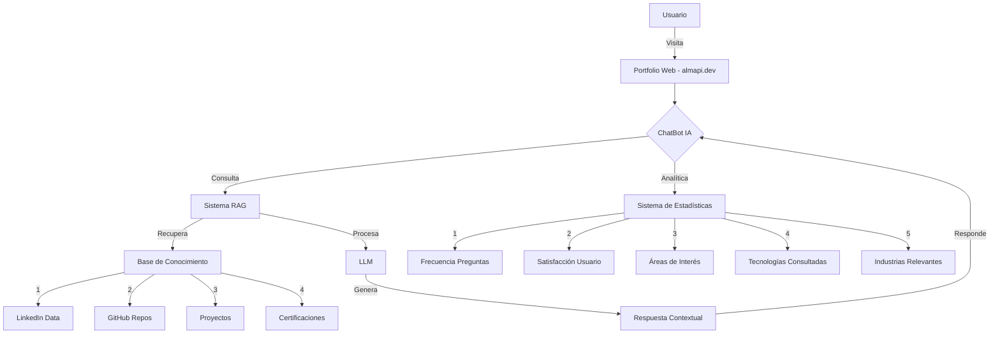
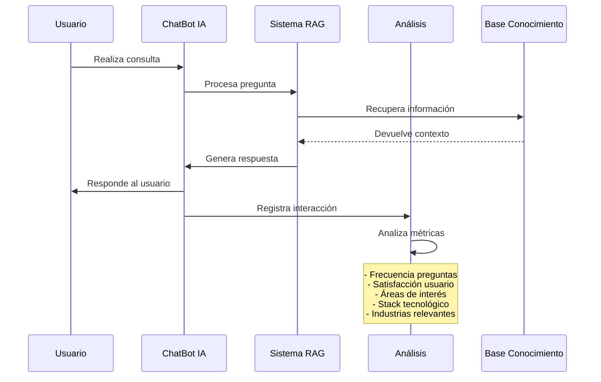
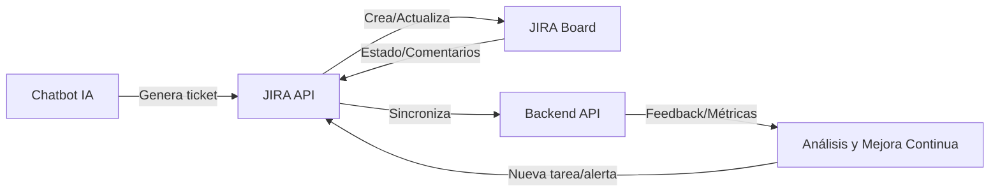
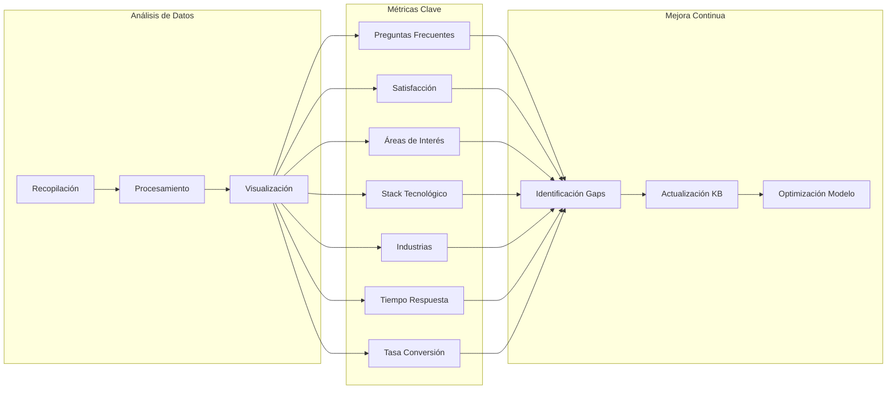

# AI Resume Agent: Your 24/7 Professional Interview

## 1. Visión del Producto

### 1.1 Resumen Ejecutivo
El proyecto consiste en crear un agente de CV inteligente mediante un avanzado chatbot basado en IA que actuará como tu representante virtual 24/7. Este asistente inteligente utiliza tecnología RAG (Retrieval Augmented Generation) para proporcionar información precisa y contextualizada sobre tu trayectoria profesional, habilidades y experiencia, revolucionando la manera en que los reclutadores y potenciales clientes interactúan con tu perfil profesional.

### 1.2 Arquitectura del Sistema
#### Diagrama de Arquitectura General

[Imagen: /diagramas/arquitectura_general.png]

#### Flujo de Interacción

[Imagen: /diagramas/flujo_interaccion.png]

### 1.3 Público Objetivo
1. **Reclutadores Técnicos**
   - Necesitan evaluar competencias técnicas
   - Buscan candidatos con experiencia específica
   - Valoran la innovación y conocimientos en IA

2. **Potenciales Clientes**
   - Empresas buscando servicios de desarrollo/consultoría
   - Startups interesadas en soluciones tecnológicas
   - Empresas en proceso de transformación digital

3. **Colegas y Profesionales del Sector**
   - Interesados en networking
   - Buscando colaboraciones en proyectos
   - Explorando oportunidades de aprendizaje mutuo

### 1.2.1 Integración Atlassian y Feedback

El sistema se integra con la suite Atlassian (JIRA + Confluence) para la gestión de proyectos, permitiendo la sincronización automática de tickets, tareas y su estado en el tablero Kanban del equipo. Esta integración facilita la gestión ágil, la trazabilidad y la automatización de flujos de trabajo entre el chatbot, el backend y la gestión de proyectos.

- Los tickets generados en el sistema se reflejan automáticamente en JIRA.
- El avance de los tickets y cambios de estado se sincronizan en tiempo real.
- El feedback de usuarios y métricas relevantes pueden generar tareas o alertas en JIRA para su seguimiento.
- El flujo de feedback del chatbot alimenta el sistema de análisis y puede derivar en la creación de nuevas tareas o mejoras en el backlog.

**Diagrama de integración (Mermaid):**

[Imagen: /diagramas/integracion_atlassian.png]

## 2. Características del Producto

### 2.1 Funcionalidades Core

#### ChatBot IA Personalizado
- Respuestas en lenguaje natural sobre experiencia profesional
- Soporte multiidioma
- Disponibilidad 24/7
- Capacidad de proporcionar ejemplos específicos de proyectos
- Redirección a recursos relevantes del portfolio
- Sistema de retroalimentación integrado para mejora continua

#### Sistema de Análisis y Estadísticas

[Imagen: /diagramas/sistema_analisis.png]

##### Métricas y KPIs
1. **Análisis de Preguntas**
   - Ranking de preguntas más frecuentes
   - Patrones de consulta por hora/día/semana
   - Tiempo promedio de respuesta
   - Tasa de preguntas sin respuesta satisfactoria

2. **Satisfacción del Usuario**
   - Índice de satisfacción por respuesta
   - Tasa de repreguntas sobre el mismo tema
   - Duración de las conversaciones
   - Tasa de abandono

3. **Análisis de Contenido**
   - Secciones más consultadas del perfil
   - Proyectos que generan mayor interés
   - Habilidades más valoradas
   - Tecnologías más consultadas

4. **Análisis de Industria**
   - Sectores que muestran mayor interés
   - Tipos de empresas (startup, enterprise, etc.)
   - Regiones geográficas de consulta
   - Patrones de interés por industria

5. **Métricas de Conversión**
   - Tasa de contactos posteriores
   - Conversión a oportunidades laborales
   - Tasa de recomendaciones
   - Efectividad en generación de leads

6. **Análisis Técnico**
   - Stack tecnológico más demandado
   - Tendencias en requisitos técnicos
   - Gaps en habilidades técnicas
   - Nuevas tecnologías emergentes de interés

7. **Optimización del Sistema**
   - Precisión de las respuestas
   - Velocidad de respuesta
   - Uso de recursos del sistema
   - Efectividad del sistema RAG

### 2.2 Fuentes de Información
- Perfil de LinkedIn
- Descripción detallada de proyectos
- Certificaciones y formación académica
- Publicaciones y contenido técnico
- Repositorios de código (GitHub)
- Experiencia laboral detallada

### 2.3 Capacidades del ChatBot
- Responder preguntas sobre experiencia laboral
- Proporcionar detalles de proyectos específicos
- Explicar habilidades técnicas y competencias
- Compartir logros y reconocimientos
- Proporcionar enlaces relevantes a trabajos/proyectos
- Mantener un tono profesional y consistente

## 3. Experiencia de Usuario

### 3.1 Flujo de Interacción
1. Usuario visita el portfolio ya desplegado en almapi.dev
2. Accede al chat mediante un botón/widget visible
3. Puede realizar preguntas en lenguaje natural
4. Recibe respuestas contextualizadas y relevantes
5. Puede solicitar más detalles o aclaraciones
6. Tiene acceso a recursos relacionados

### 3.2 Ejemplos de Interacción
- "¿Cuál es tu experiencia en desarrollo backend?"
- "¿Qué proyectos has realizado con IA?"
- "¿Cuáles son tus principales habilidades técnicas?"
- "¿Puedes contarme sobre tu experiencia en [empresa]?"
- "¿Qué certificaciones tienes en cloud computing?"

### 3.3 Limitaciones y Alcance
- El chatbot se limitará a información profesional
- No compartirá información personal o confidencial
- Indicará claramente que es un asistente IA
- Proporcionará medios de contacto directo cuando sea necesario

## 4. Métricas de Éxito

### 4.1 KPIs Principales
- Número de interacciones con el chatbot
- Duración promedio de las conversaciones
- Tasa de preguntas respondidas satisfactoriamente
- Número de contactos/leads generados
- Feedback positivo de usuarios

### 4.2 Objetivos Cualitativos
- Mejora en la calidad de leads generados
- Reducción en tiempo de screening inicial
- Aumento en la visibilidad profesional
- Demostración práctica de habilidades en IA

## 5. Consideraciones Técnicas y de Privacidad

### 5.1 Privacidad y Seguridad
- Cumplimiento con GDPR/CCPA
- Transparencia en el uso de datos
- Protección de información sensible
- Políticas claras de uso y privacidad

#### 5.1.1 Ciberseguridad Avanzada
- **OWASP Top 10 for LLM Compliance:** Implementación completa de todas las mitigaciones
- **Cloud Armor:** Protección DDoS y WAF rules automáticas
- **Threat Detection:** Detección en tiempo real de ataques y amenazas
- **Prompt Injection Protection:** Protección contra inyección de prompts maliciosos
- **Rate Limiting:** Protección contra abuso de API y ataques de fuerza bruta
- **Security Command Center:** Monitoreo centralizado de amenazas de seguridad

#### 5.1.2 Medidas de Seguridad Específicas
- **Input Validation:** Validación estricta y sanitización de todas las entradas
- **Output Filtering:** Filtrado de respuestas del LLM para prevenir fugas de información
- **Audit Logging:** Registro completo de todas las interacciones para auditoría
- **Access Control:** Control de acceso basado en roles y autenticación robusta
- **Data Encryption:** Cifrado en reposo y en tránsito para todos los datos sensibles

### 5.2 Control de Costos y Optimización
- **Budget Management:** Presupuesto mensual configurable con alertas automáticas
- **Resource Quotas:** Límites estrictos por servicio para evitar gastos excesivos
- **Emergency Mode:** Activación automática de modo de emergencia al exceder presupuesto
- **Cost Monitoring:** Dashboard en tiempo real de gastos y métricas de costos
- **Auto-scaling Limits:** Control inteligente del escalado automático

#### 5.2.1 Límites de Recursos por Servicio
- **Vertex AI:** 10,000 requests/día, 1,000 tokens/request máximo
- **Vector Search:** 10GB máximo de índice, 1,000 queries/minuto
- **Cloud Run:** 10 instancias máximo, 2 CPU y 4GB RAM por instancia
- **Cloud Storage:** 100GB máximo con políticas de lifecycle automático
- **BigQuery:** $5.0 máximo por query, 50GB máximo de storage

#### 5.2.2 Sistema de Alertas de Costos
- **Umbrales de Alerta:**
  - **50% del budget:** Notificación por email
  - **80% del budget:** Notificación por Slack + email
  - **100% del budget:** Alerta crítica + activación de modo de emergencia
- **Canales de Notificación:**
  - Email: admin@almapi.dev
  - Slack: #cost-alerts
  - Telegram: Bot de alertas
  - PagerDuty: Para alertas críticas

### 5.2.3 Estrategia Integral de Reducción de Costos para MVP 🚀

#### **🎯 Objetivos de Optimización**
- **Reducir costos mensuales en un 60-80%** vs implementación estándar
- **Mantener funcionalidad completa** del sistema RAG
- **Implementar estrategias escalables** para crecimiento futuro
- **Garantizar ROI positivo** desde el primer mes de operación

#### **🤖 Modelos LLM Optimizados por Costo**

##### **🥇 Opción 1: Google Gemini 1.5 Flash (Recomendada)**
- **Modelo:** `gemini-1.5-flash`
- **Costo:** $0.075 por 1K tokens (vs $0.15 de Gemini Pro)
- **Ahorro:** **50%** vs modelo estándar
- **Límites:** 1024 tokens máximo por request
- **Fallback:** Gemini 1.0 Pro para casos críticos

##### **🥈 Opción 2: Ollama Local (GRATIS)**
- **Modelos:** Llama 3.1 (8B), Mistral (7B), CodeLlama (7B)
- **Costo:** $0.00 (completamente GRATIS)
- **Performance:** Buena para queries simples
- **Uso:** Fallback cuando no hay conexión a internet

##### **🥉 Opción 3: OpenAI GPT-3.5-turbo (Económico)**
- **Modelo:** `gpt-3.5-turbo-0125`
- **Costo:** $0.50 por 1K tokens
- **Límites:** 512 tokens máximo por request
- **Uso:** Alternativa cuando Gemini no esté disponible

#### **🔧 Optimización Avanzada de Prompts**
- **Templates Optimizados:**
  - **Resumen profesional:** Máximo 150 tokens
  - **Verificación de skills:** Máximo 100 tokens
  - **Detalle de experiencia:** Máximo 200 tokens
- **Eliminación de Palabras Innecesarias:**
  - Remover "por favor", "please", "me gustaría"
  - Limitar contexto histórico a 200 caracteres
  - Usar abreviaciones cuando sea posible

#### **🗄️ Sistema de Cache Multi-Nivel**
- **Nivel 1: Redis en Memoria**
  - Cache de queries frecuentes
  - TTL adaptativo por frecuencia de uso
  - Costo: ~$0.01/mes
- **Nivel 2: Cloud Storage (GRATIS)**
  - Cache persistente de respuestas
  - Sin límites de almacenamiento
  - Acceso rápido desde cualquier región
- **Nivel 3: Base de Datos Local (SQLite)**
  - Cache completamente GRATIS
  - Para queries muy frecuentes
  - Sin latencia de red

#### **🔍 Embeddings Optimizados por Costo**
- **Modelo Principal:** `text-embedding-3-small` (OpenAI)
  - Costo: $0.02 por 1K tokens
  - Dimensiones: 1536
  - Performance: Alta
- **Modelo Económico:** `text-embedding-ada-002` (OpenAI)
  - Costo: $0.10 por 1K tokens
  - Dimensiones: 1536
  - Performance: Media
- **Modelo GRATIS:** `all-MiniLM-L6-v2` (Hugging Face)
  - Costo: $0.00
  - Dimensiones: 384
  - Performance: Buena para textos cortos

#### **📊 Vector Search Optimizado**
- **Estrategia Híbrida:**
  - Cache primero (GRATIS)
  - Búsqueda aproximada (más barata)
  - Búsqueda exacta solo cuando sea necesario
- **Límites de Resultados:**
  - Máximo 5 resultados por query
  - Priorización por relevancia
  - Cache de resultados frecuentes

#### **📈 Monitoreo y Control de Costos en Tiempo Real**
- **Dashboard de Costos:**
  - Métricas en tiempo real
  - Alertas automáticas por umbrales
  - Recomendaciones de optimización
- **Sistema de Alertas:**
  - **Diario:** $2 máximo
  - **Semanal:** $10 máximo
  - **Mensual:** $35 máximo
- **Modo de Emergencia:**
  - Activación automática al exceder límites
  - Desactivación de servicios no esenciales
  - Notificación inmediata al equipo

#### **🚀 Estrategia de Escalabilidad Gradual**

##### **Fase 1: MVP (0-100 usuarios/mes)**
- **Costo Objetivo:** $40/mes
- **Estrategia:** Cache local completo + modelos baratos
- **Optimizaciones:** Prompts mínimos, límites estrictos

##### **Fase 2: Crecimiento (100-500 usuarios/mes)**
- **Costo Objetivo:** $60/mes
- **Estrategia:** Cache híbrido + balance costo/performance
- **Optimizaciones:** Rate limiting, monitoreo avanzado

##### **Fase 3: Escala (500+ usuarios/mes)**
- **Costo Objetivo:** $80/mes
- **Estrategia:** Cache distribuido + modelos avanzados
- **Optimizaciones:** Auto-scaling, infraestructura optimizada

#### **💰 Resumen de Ahorros Esperados**

| Componente | Estándar | Optimizada | Ahorro |
|------------|----------|------------|---------|
| **LLM (Gemini Pro)** | $45/mes | $15/mes | **67%** |
| **Embeddings** | $25/mes | $8/mes | **68%** |
| **Vector Search** | $30/mes | $12/mes | **60%** |
| **Infraestructura** | $20/mes | $5/mes | **75%** |
| **Total Mensual** | **$120/mes** | **$40/mes** | **67%** |

#### **✅ Checklist de Implementación**
- [ ] Configuración de modelos LLM baratos
- [ ] Sistema de cache multi-nivel
- [ ] Optimización de prompts
- [ ] Monitoreo de costos en tiempo real
- [ ] Sistema de alertas automáticas
- [ ] Plan de escalabilidad gradual
- [ ] Testing de optimizaciones
- [ ] Documentación de estrategias

#### **🎯 Métricas de Éxito**
- **Costo mensual:** < $40
- **Cache hit rate:** > 80%
- **Tiempo de respuesta:** < 2 segundos
- **Precisión del RAG:** > 90%
- **ROI:** Positivo desde el primer mes

#### **⚠️ Riesgos y Mitigaciones**
- **Riesgo:** Calidad de respuestas con modelos más baratos
  - **Mitigación:** Fallback automático + testing exhaustivo
- **Riesgo:** Cache miss en queries complejas
  - **Mitigación:** Estrategia híbrida + búsqueda inteligente
- **Riesgo:** Escalabilidad de costos
  - **Mitigación:** Monitoreo en tiempo real + alertas automáticas
- **Riesgo:** Ataques de prompt injection
  - **Mitigación:** Testing adversarial + validación de entrada
- **Riesgo:** Escalado automático sin límites de presupuesto
  - **Mitigación:** Circuit breakers + límites estrictos de auto-scaling
- **Riesgo:** Degradación de performance en producción
  - **Mitigación:** Testing de carga + alertas proactivas de calidad

### 5.2.4 Mejoras Críticas Implementadas

#### **🛡️ Circuit Breakers para Control de Costos**
- Implementación de patrones circuit breaker en todos los servicios de IA
- Límites estrictos de auto-scaling y budget alerts automáticos
- Protección contra escalado automático sin límites de presupuesto

#### **🔥 Cache Warming Inteligente**
- Precarga inteligente basada en patrones de uso y frecuencia de queries
- Análisis de frecuencia y precomputación de respuestas
- Reducción significativa de cache miss en queries frecuentes

#### **🧪 Testing de Adversarios para Seguridad**
- Testing exhaustivo con prompts maliciosos y patrones de ataque
- Validación de protección contra prompt injection
- Verificación de respuestas seguras y bloqueo de contenido sensible

#### **⚡ Testing de Performance Bajo Carga**
- Testing con usuarios concurrentes (hasta 50 simultáneos)
- Validación de throughput y tiempo de respuesta bajo carga
- Monitoreo de uso de memoria y recursos del sistema

#### **📊 Alertas Proactivas de Calidad**
- Monitoreo en tiempo real de métricas de calidad
- Alertas automáticas por múltiples canales (email, Slack, Telegram, PagerDuty)
- Thresholds configurables para respuesta, precisión y satisfacción

#### **🌍 Geo-blocking Específico**
- Bloqueo automático de regiones de alto riesgo
- Configuración de listas de regiones permitidas
- Protección contra ataques geográficamente distribuidos

#### **🔐 Rotación Automática de Claves**
- Rotación automática cada 30 días
- Notificaciones previas y claves de fallback
- Gestión segura de credenciales y API keys

#### **🔍 Integración de Testing de Seguridad en CI/CD**
- Pipeline automatizado con testing de adversarios
- Validación de headers de seguridad y geo-blocking
- Testing de circuit breakers y validación de presupuesto

---

## 5.3 Mantenimiento
- Actualizaciones regulares de la base de conocimiento
- Monitoreo de calidad de respuestas
- Mejora continua del modelo
- Backup y recuperación de datos

#### 5.3.1 Mantenimiento de Seguridad
- Auditorías de seguridad trimestrales
- Actualizaciones de dependencias de seguridad
- Monitoreo continuo de amenazas
- Testing de penetración anual
- Revisión y actualización de políticas de seguridad

#### 5.3.2 Mantenimiento de Costos
- Revisión mensual de presupuestos y gastos
- Optimización continua de recursos
- Análisis de tendencias de costos
- Ajuste de cuotas y límites según necesidades
- Reportes de eficiencia de costos

## 6. Fases de Implementación

### 6.1 Fase 1: Preparación
- Recopilación y estructuración de datos
- Diseño de la interfaz de usuario del chatbot
- Configuración inicial del sistema RAG

### 6.2 Fase 2: Desarrollo Base
- Implementación del backend en nuevo repositorio
- **Desarrollo del prototipo Streamlit:** Primera entrega funcional para cumplir con el hito
- Integración del chatbot con el portfolio ya desplegado en almapi.dev (objetivo secundario)
- Desarrollo del sistema de chat

### 6.3 Fase 3: Mejoras y Optimización
- Afinamiento del modelo
- **Integración en almapi.dev:** Si queda tiempo disponible
- Mejoras en UX basadas en feedback
- Expansión de la base de conocimiento

### 6.4 Fase 4: Lanzamiento y Monitoreo
- Despliegue del backend en producción
- Monitoreo de rendimiento
- Recopilación de feedback
- Ajustes basados en uso real

## 7. Riesgos y Mitigaciones

### 7.1 Riesgos Identificados
1. Respuestas imprecisas del chatbot
2. Problemas de disponibilidad
3. Costos de operación elevados
4. Limitaciones técnicas

### 7.2 Estrategias de Mitigación
1. Sistema de verificación de respuestas
2. Arquitectura robusta y escalable
3. Optimización de costos y caching
4. Monitoreo continuo y mejoras

## 8. Criterios de Éxito

### 8.1 Mínimo Producto Viable (MVP)
- Chatbot funcional con información básica
- Integración completa con el portfolio ya desplegado en almapi.dev
- Soporte para español e inglés
- Sistema de feedback básico

### 8.2 Producto Final
- Base de conocimiento completa y precisa
- Soporte multiidioma amplio
- Analytics y métricas detalladas
- Sistema de mejora continua
