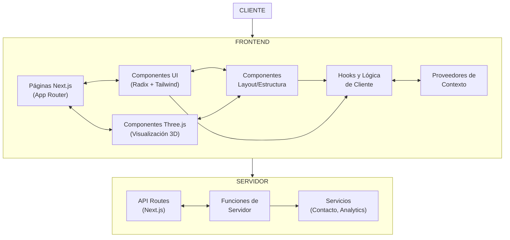

# PRD: Portfolio Iterativo con AI Playground e Internacionalización Dinámica

## Nota Importante sobre el Alcance del Proyecto para el Máster

Este PRD define el alcance completo de un portfolio web iterativo, pero **el entregable para el máster incluye únicamente las versiones hasta la 1.0.0** (MVP Fundacional hasta Release Público Inicial). Las versiones posteriores (1.1.0 en adelante) se incluyen como parte de la visión a futuro del proyecto, pero no forman parte del entregable para la evaluación del máster.

## 1. Introducción y Objetivos

### 1.1 Propósito del documento

Este documento de requisitos de producto (PRD) define la visión, arquitectura y plan de implementación para un portfolio web iterativo que demuestra activamente las capacidades de un desarrollador de software aumentado por IA. El proyecto establece un proceso de crecimiento continuo que sirve como demostración viva de la filosofía de desarrollo iterativo, compuesto y con visión a largo plazo.

### 1.2 Visión del producto

Crear un portfolio digital dinámico que evolucione constantemente, utilizando un enfoque de desarrollo incremental que prioriza:

1. La demostración práctica de las capacidades técnicas a través de experiencias interactivas con IA
2. La implementación de un proceso meta-documentado donde el propio desarrollo es parte del showcasing
3. Un crecimiento sostenible y compuesto, donde cada iteración agrega valor tangible sin sobrecarga técnica
4. La transparencia total en el proceso de desarrollo como parte del valor demostrativo
5. La capacidad de adaptación a audiencias globales mediante internacionalización impulsada por IA

### 1.3 Objetivos principales

- **Demostrar el proceso iterativo**: Exhibir cómo el desarrollo incremental puede producir resultados valiosos en cada etapa sin comprometer la visión a largo plazo
- **Servir como caso de estudio**: Documentar activamente cómo el uso de IA potencia cada fase del desarrollo
- **Crear valor compuesto**: Mostrar cómo cada iteración construye sobre las anteriores de forma exponencial
- **Ofrecer utilidad real**: Proporcionar experiencias interactivas valiosas para visitantes en cada fase del desarrollo
- **Meta-narrar el desarrollo**: Convertir el propio proceso de desarrollo en contenido para el blog

### 1.4 Filosofía del producto

El portfolio no es simplemente un contenedor de proyectos, sino una demostración viva del enfoque de desarrollo del creador. Sigue el principio de "show, don't tell" - en lugar de afirmar capacidades, las demuestra a través del propio portfolio, que es en sí mismo un proyecto en constante evolución. El desarrollo es infinito e iterativo, sin un estado final definido, reflejando cómo funcionan los productos reales en el mercado actual.

## 2. Características y Funcionalidades

### 2.1 Core Portfolio (Entregable para el Máster)

#### Versión 0.1.0 - 0.2.0 (MVP Fundacional)
- Página de inicio minimalista con presentación clara
- Navegación intuitiva entre secciones principales
- Información profesional básica
- Modo claro/oscuro
- Adaptabilidad completa a dispositivos móviles

#### Versión 1.0.0 (Release Público Inicial - Entrega Final para el Máster)
- Integración básica de Three.js para experiencias visuales
- Showcase de proyectos con visualizaciones interactivas
- Información de contacto integrada creativamente
- Transiciones y microinteracciones refinadas
- Sistema de diseño cohesivo con componentes reutilizables

### 2.2 Características Planificadas para Futuras Versiones (Post-Máster)

Las siguientes características representan la visión a largo plazo del proyecto y se desarrollarán después de la entrega del máster:

#### AI Playground (Futuro)
- Demostraciones de IA integradas en el portfolio
- Infraestructura para interacciones avanzadas
- Experiencias inmersivas con tecnologías 3D

#### Blog Técnico (Futuro)
- Estructura para compartir conocimientos y experiencias
- Sistema de comentarios y componentes interactivos
- Meta-documentación del desarrollo

#### Internacionalización dinámica con LLMs (Futuro)
- Sistema para traducción automática bajo demanda
- Soporte para múltiples idiomas
- Preservación de contexto cultural

## 3. Componentes Principales y Sitemaps

### 3.1 Arquitectura de Alto Nivel



El portfolio implementa una arquitectura basada en componentes que aprovecha el modelo de App Router de Next.js 14. Esta arquitectura está especialmente optimizada para aplicaciones web modernas con experiencias interactivas y visualizaciones 3D.

**Patrón arquitectónico**: Sigue un patrón de componentes con clara separación entre la capa de presentación (frontend) y servicios (servidor), potenciando el renderizado server-side para optimizar rendimiento y SEO.

**Justificación**: Esta arquitectura fue seleccionada por su alineación perfecta con el enfoque de desarrollo iterativo del portfolio, permitiendo implementar funcionalidades de forma incremental mientras se mantiene una base sólida. Maximiza los beneficios del stack tecnológico elegido (Next.js, React, Three.js) mientras facilita la clara separación de responsabilidades.

**Beneficios principales**:
- Rendimiento optimizado mediante Server Components que reducen el JavaScript enviado al cliente
- Desarrollo modular que facilita las iteraciones incrementales (versiones 0.1.0 a 1.0.0)
- Mejora del SEO gracias al renderizado en servidor
- Experiencia de desarrollo intuitiva con clara separación de responsabilidades

**Sacrificios/consideraciones**:
- Acoplamiento al ecosistema Next.js, creando cierta dependencia del framework
- Complejidad inicial al trabajar con el modelo mental de App Router y la separación de componentes cliente/servidor
- Mayor uso de recursos de servidor comparado con aplicaciones puramente client-side

### 3.2 Descripción de componentes principales:

1. **Páginas Next.js (App Router)**
   - **Tecnología**: Next.js 14+ con App Router
   - **Propósito**: Implementar las rutas principales de la aplicación (/home, /about, /projects, /contact)
   - **Características**: Aprovecha los Server Components y Client Components de React para optimizar el renderizado inicial
   - **Interacciones**: Se comunica con los componentes UI y visualizaciones Three.js

2. **Componentes UI**
   - **Tecnología**: React 18+, Radix UI, Tailwind CSS
   - **Propósito**: Proporcionar una biblioteca de elementos de interfaz consistentes y accesibles
   - **Características**: Implementación del modo claro/oscuro, animaciones con Framer Motion, componentes interactivos
   - **Interacciones**: Utilizados por las páginas y componentes de layout

3. **Componentes Three.js**
   - **Tecnología**: Three.js, React Three Fiber
   - **Propósito**: Gestionar las visualizaciones 3D interactivas que presentan los proyectos
   - **Características**: Escenas optimizadas, gestión de modelos 3D, interacciones con el mouse/touch
   - **Interacciones**: Integración con la UI mediante componentes contenedores

4. **Componentes de Layout**
   - **Tecnología**: React 18+, Tailwind CSS
   - **Propósito**: Estructurar la aplicación y gestionar la disposición de elementos
   - **Características**: Navegación, cabeceras, pies de página, contenedores principales
   - **Interacciones**: Consumen hooks y servicios para funcionalidades como cambio de tema

5. **Hooks y Lógica de Cliente**
   - **Tecnología**: React Hooks, TypeScript
   - **Propósito**: Encapsular lógica reutilizable para componentes cliente
   - **Características**: Gestión de estado local, lógica de interacción, validaciones
   - **Interacciones**: Utilizados por componentes cliente para compartir comportamientos

6. **Proveedores de Contexto**
   - **Tecnología**: React Context API
   - **Propósito**: Gestionar el estado global de la aplicación
   - **Características**: Tema actual, preferencias de usuario, configuraciones compartidas
   - **Interacciones**: Consumidos por componentes que requieren acceso al estado global

7. **API Routes**
   - **Tecnología**: Next.js API Routes
   - **Propósito**: Implementar endpoints serverless para operaciones de servidor
   - **Características**: Manejo de formularios de contacto, analítica, configuraciones dinámicas
   - **Interacciones**: Invocadas desde componentes cliente mediante fetch/axios

8. **Servicios**
   - **Tecnología**: JavaScript/TypeScript modular
   - **Propósito**: Encapsular lógica de interacción con sistemas externos
   - **Características**: Envío de correos, registro de analytics, obtención de datos
   - **Interacciones**: Consumidos por API Routes y funciones de servidor

### 3.3 Descripción de alto nivel del proyecto y estructura de ficheros

El portfolio sigue una estructura de carpetas organizada que refleja la arquitectura basada en componentes, facilitando el desarrollo iterativo y la clara separación de responsabilidades:

```
/
├── app/                      # Next.js App Router (páginas y rutas)
│   ├── page.tsx              # Página principal (Home)
│   ├── about/                # Sección "Acerca de"
│   │   └── page.tsx          # Página Acerca de
│   ├── projects/             # Sección de proyectos
│   │   ├── page.tsx          # Listado de proyectos
│   │   └── [slug]/           # Página de proyecto individual
│   │       └── page.tsx
│   ├── contact/              # Sección de contacto
│   │   └── page.tsx          # Página de contacto
│   ├── api/                  # API Routes (Next.js)
│   │   ├── contact/          # Endpoint para formulario de contacto
│   │   │   └── route.ts
│   │   └── analytics/        # Endpoint para analytics
│   │       └── route.ts
│   └── layout.tsx            # Layout principal de la aplicación
│
├── components/               # Componentes React reutilizables
│   ├── ui/                   # Componentes de interfaz de usuario
│   │   ├── button.tsx        # Botones y controles
│   │   ├── card.tsx          # Tarjetas y contenedores
│   │   ├── navigation.tsx    # Componentes de navegación
│   │   └── theme-toggle.tsx  # Selector de tema claro/oscuro
│   │
│   ├── three/                # Componentes de visualización 3D
│   │   ├── scene.tsx         # Escena base Three.js
│   │   ├── project-viewer.tsx # Visor de proyectos 3D
│   │   ├── models/           # Componentes de modelos específicos
│   │   └── effects/          # Efectos visuales y shaders
│   │
│   └── layout/               # Componentes estructurales
│       ├── header.tsx        # Cabecera de la aplicación
│       ├── footer.tsx        # Pie de página
│       └── container.tsx     # Contenedores y layouts
│
├── hooks/                    # Custom React Hooks
│   ├── use-theme.ts          # Hook para gestión de tema
│   ├── use-scroll.ts         # Hook para efectos de scroll
│   └── use-form.ts           # Hook para gestión de formularios
│
├── context/                  # Proveedores de contexto
│   ├── theme-context.tsx     # Contexto para tema claro/oscuro
│   └── app-context.tsx       # Contexto global de la aplicación
│
├── lib/                      # Utilidades y helpers
│   ├── three/                # Utilidades para Three.js
│   │   ├── loaders.ts        # Cargadores de modelos y texturas
│   │   └── helpers.ts        # Funciones auxiliares Three.js
│   │
│   └── utils/                # Utilidades generales
│       ├── animations.ts     # Helpers para animaciones
│       └── validation.ts     # Validaciones de formularios
│
├── services/                 # Servicios para interacciones externas
│   ├── email-service.ts      # Servicio de envío de emails
│   └── analytics-service.ts  # Servicio de analytics
│
├── public/                   # Assets estáticos
│   ├── models/               # Modelos 3D en formato glTF/GLB
│   ├── images/               # Imágenes estáticas
│   └── fonts/                # Fuentes web
│
├── styles/                   # Configuración de estilos
│   ├── globals.css           # Estilos globales
│   └── theme.ts              # Configuración de temas
│
├── types/                    # Definiciones de TypeScript
│   └── index.ts              # Tipos y interfaces compartidos
│
├── next.config.js            # Configuración de Next.js
├── tailwind.config.js        # Configuración de Tailwind CSS
├── tsconfig.json             # Configuración de TypeScript
└── package.json              # Dependencias y scripts
```

Esta estructura proporciona varios beneficios clave:

1. **Organización intuitiva**: La estructura de carpetas refleja la arquitectura de la aplicación, facilitando la localización de código.

2. **Desarrollo paralelo**: Múltiples desarrolladores pueden trabajar simultáneamente en diferentes componentes sin conflictos.

3. **Escalabilidad**: Preparada para las futuras expansiones (AI Playground, internacionalización) en versiones post-1.0.0.

4. **Mantenibilidad**: Clara separación de responsabilidades que facilita las actualizaciones y correcciones.

5. **Patrón Feature-First**: Los componentes, lógica y estilos relacionados permanecen cercanos, siguiendo el principio de cohesión.

La estructura sigue las mejores prácticas recomendadas para aplicaciones Next.js modernas, aprovechando al máximo el App Router mientras mantiene una organización clara que facilita el desarrollo iterativo del portfolio.


## 4. UI/UX Design

### 4.1 Principios de Diseño

- **Minimalismo funcional**: Cada elemento tiene un propósito claro
- **Jerarquía visual**: Guiar al usuario a través del contenido de forma intuitiva
- **Consistencia**: Sistema de diseño coherente en todas las secciones
- **Accesibilidad**: Cumplimiento WCAG 2.1 AA en cada iteración
- **Transparencia de proceso**: El diseño debe comunicar claramente el estado de desarrollo

### 4.2 Sistema de Diseño para Versión 1.0.0

- Paleta de colores completa con soporte para modo claro/oscuro
- Tipografía principal y secundaria optimizada para legibilidad
- Componentes UI fundamentales con estados y variantes
- Animaciones y transiciones coherentes
- Visualizaciones 3D básicas integradas con UI 2D

### 4.3 User Journey Map (Versión 1.0.0)

1. Llegada a homepage → Exploración visual → Navegación a sección de proyectos → Interacción con visualizaciones → Contacto

## 5. Requisitos Técnicos

### 5.1 Stack Tecnológico para Versión 1.0.0

| Tecnología | Versión | Propósito |
|------------|---------|-----------|
| Next.js | 14+ | Framework React con App Router |
| TypeScript | 5.x | Tipado estático |
| React | 18.x | Biblioteca UI |
| Tailwind CSS | 3.x | Framework CSS |
| Framer Motion | 10.x | Animaciones |
| Three.js | Latest | Visualizaciones 3D |

### 5.2 Requisitos No Funcionales

#### Rendimiento
- Tiempo de carga inicial < 3s en conexión 4G
- First Contentful Paint < 1.5s
- Time to Interactive < 3.5s
- Optimización para dispositivos móviles

#### Seguridad
- Implementación de CSP
- Sanitización de inputs
- Protección contra XSS

#### Accesibilidad
- WCAG 2.1 nivel AA
- Navegación por teclado
- Textos alternativos para contenido visual
- Soporte para lectores de pantalla

## 6. Planificación del Proyecto

### 6.1 Enfoque de Semantic Versioning

El proyecto sigue SemVer adaptado a sus necesidades:
- **MAJOR (X.0.0)**: Cambios sustanciales en la arquitectura o experiencia del usuario
- **MINOR (0.X.0)**: Nuevas funcionalidades que mantienen compatibilidad
- **PATCH (0.0.X)**: Correcciones y mejoras incrementales

### 6.2 Roadmap para Entrega del Máster (MoSCoW)

#### Versión 0.1.0 (MVP Fundacional)
- **MUST HAVE:**
  - Estructura Next.js con TypeScript
  - Componentes UI core con Tailwind
  - Homepage con presentación
  - Página "Acerca de"
  - Configuración inicial de analytics

#### Versión 0.2.0 (Showcase Técnico Básico)
- **MUST HAVE:**
  - Integración básica de Three.js
  - Primeros proyectos
  - Sistema de contacto
  - Optimizaciones iniciales
  - Adaptación responsive

#### Versión 1.0.0 (Release Público Inicial - Entrega Final para el Máster)
- **MUST HAVE:**
  - Diseño pulido
  - Experiencia fluida
  - Optimización de rendimiento
  - Proyectos destacados
  - Seguridad básica

### 6.3 Metodología de Desarrollo

El desarrollo seguirá un ciclo de:
1. **Planificación**: Definir objetivos claros para la versión
2. **Implementación**: Desarrollo con enfoque en entregables incrementales
3. **Evaluación**: Testing y retroalimentación
4. **Documentación**: Narrar el proceso como parte del producto
5. **Publicación**: Lanzar con changelog y actualizar roadmap

### 6.4 Estimación de Tiempo para Versión 1.0.0

| Versión | Duración Estimada | Dedicación Semanal | Total Semanas |
|---------|-------------------|-------------------|---------------|
| 0.1.0   | 5-7h | 3-5h | 1-2 |
| 0.2.0   | 6-8h | 3-5h | 2 |
| 1.0.0   | A-10h | 3-5h | 2-3 |

## 7. Stakeholders

### 7.1 Principales Stakeholders

- **Desarrollador/Propietario**: Principal interesado y ejecutor del proyecto
- **Evaluadores del Máster**: Evalúan el proyecto como entrega final
- **Potenciales Clientes**: Buscan evidencia de habilidades técnicas
- **Reclutadores Técnicos**: Evalúan capacidades y enfoque de trabajo

### 7.2 Mapa de Expectativas

| Stakeholder | Expectativas | Criterios de Éxito |
|-------------|--------------|-------------------|
| Desarrollador | Demostración efectiva de habilidades, aprobación del máster | Feedback positivo, evaluación favorable |
| Evaluadores | Cumplimiento de requisitos, demostración de competencias | Implementación correcta, documentación clara |
| Potenciales Clientes | Evidencia concreta de capacidades | Claridad en implementaciones, demostraciones convincentes |
| Reclutadores | Portfolio que destaque entre competidores | Tiempo en sitio, contactos recibidos |

## 8. Historias de Usuario con Criterio de Aceptación

### 8.1 Plantilla de Historia de Usuario

```
Como [tipo de usuario],
quiero [acción/funcionalidad],
para [beneficio/valor].

Criterios de aceptación:
1. Dado [contexto inicial],
   cuando [evento/acción],
   entonces [resultado esperado].
2. Dado [contexto alternativo],
   cuando [evento/acción],
   entonces [resultado esperado].
```

### 8.2 Ejemplos de Historias para Versión 1.0.0

```
Como reclutador técnico,
quiero ver rápidamente información profesional relevante del desarrollador,
para evaluar si sus habilidades coinciden con mis necesidades.

Criterios de aceptación:
1. Dado que estoy en la página de inicio,
   cuando la página termine de cargar,
   entonces debo ver un resumen claro de las habilidades principales en menos de 5 segundos.
2. Dado que estoy interesado en más detalles,
   cuando navegue a la sección "Acerca de",
   entonces debo encontrar información detallada sobre experiencia y especialización.
```

```
Como visitante del portfolio,
quiero ver demostraciones visuales interactivas de proyectos,
para entender mejor las capacidades técnicas del desarrollador.

Criterios de aceptación:
1. Dado que estoy en la sección de proyectos,
   cuando seleccione un proyecto específico,
   entonces debe mostrarse una visualización interactiva relacionada con ese proyecto.
2. Dado que estoy viendo una visualización,
   cuando interactúo con ella (hover, click, etc.),
   entonces debe responder de manera fluida y proporcionar información adicional.
```

## 9. Criterios de Éxito para Versión 1.0.0

### 9.1 Métricas Cuantitativas

| Métrica | Objetivo Base | Objetivo Ambicioso |
|---------|---------------|-------------------|
| Tiempo en sitio | > 2 min | > 4 min |
| Lighthouse Performance | > 85 | > 95 |
| Conversiones (contacto) | > 1.5% | > 3% |

### 9.2 Indicadores Cualitativos

- Calidad y relevancia del feedback recibido
- Evaluación positiva como entrega final del máster
- Percepción del portfolio en la comunidad técnica

### 9.3 Meta-éxito del Proceso

El verdadero éxito del portfolio se mide por:
- La consistencia del desarrollo iterativo
- La claridad en la comunicación del proceso
- La capacidad de adaptar el roadmap basado en retroalimentación
- El valor compuesto generado a lo largo del tiempo
- La demostración efectiva de la filosofía "show, don't tell"

## 10. Apéndice y Recursos Adicionales

### 10.1 Glosario de Términos

- **Desarrollo iterativo**: Enfoque que divide el proyecto en incrementos pequeños y manejables, cada uno construyendo sobre el anterior.
- **Valor compuesto**: Beneficio que se acumula exponencialmente cuando cada iteración se basa en las anteriores.
- **AI Augmented Development**: Proceso de desarrollo donde la IA potencia y acelera el trabajo del desarrollador humano.
- **Meta-documentación**: Documentación que registra y explica el propio proceso de desarrollo.
- **MoSCoW**: Técnica de priorización (Must have, Should have, Could have, Won't have).
- **Semantic Versioning**: Sistema de numeración (MAJOR.MINOR.PATCH) que comunica la naturaleza de los cambios.

### 10.2 Recursos de Referencia

- [Principios de Desarrollo Iterativo](https://www.agilealliance.org/glossary/iterative-development/)
- [Semantic Versioning 2.0.0](https://semver.org/)
- [Método MoSCoW](https://www.productplan.com/glossary/moscow-prioritization/)
- [WCAG 2.1 Checklist](https://www.w3.org/WAI/WCAG21/quickref/)
- [Three.js Documentation](https://threejs.org/docs/)

---

Este PRD establece el marco para el desarrollo del portfolio hasta la versión 1.0.0 como entrega para el máster, mientras presenta la visión a largo plazo del proyecto. Las funcionalidades hasta la versión 1.0.0 constituyen el entregable completo para la evaluación, mientras que las características posteriores representan el camino de evolución futura del proyecto. 