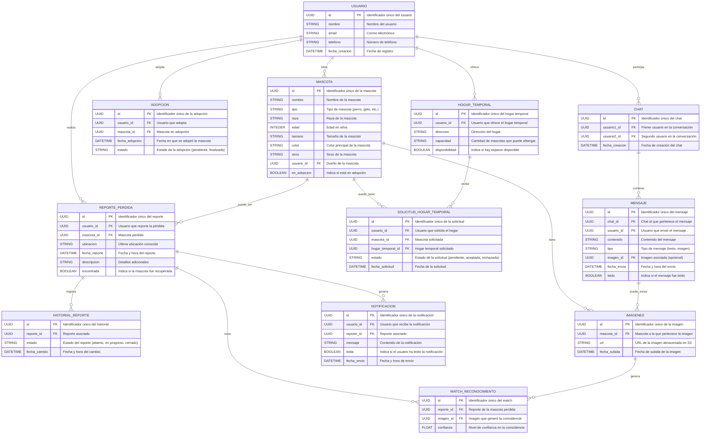

## **0. Ficha del proyecto**

### **0.1 Tu nombre completo:**

Paola Morales Castellanos

### **0.2 Nombre del Proyecto:**

**GuardianPaws**

### **0.3 Descripción Breve del Proyecto:**

**GuardianPaws** es mucho más que una plataforma: es una red de esperanza y acción para animales de compañía. Conectamos dueños responsables, rescatistas, voluntarios y refugios en una comunidad unida por el mismo propósito: brindar protección, amor y segundas oportunidades.

Desde reportar animales perdidos hasta gestionar adopciones y ofrecer hogares de paso, **GuardianPaws** hace que ayudar sea más fácil y efectivo. Además, facilitamos el intercambio, venta y donación de productos esenciales para su bienestar.

En esta primera fase (MVP), potenciamos el rescate con herramientas clave: un **chat en vivo** para coordinar acciones en tiempo real, **búsqueda inteligente con IA** para encontrar animales perdidos más rápido y una **red de apoyo sólida** para quienes luchan cada día por su bienestar.

---

## **1. Descripción General del Producto**

### **1.1 Objetivo**

**Propósito del Producto:**
GuardianPaws tiene como objetivo principal **facilitar la reunificación de animales de compañía perdidas con sus dueños y fortalecer la comunidad de rescate animal**, permitiendo la interacción en tiempo real entre rescatistas, dueños y voluntarios.

**¿Qué valor aporta?**

- Reduce el tiempo de búsqueda de animales de compañía perdidas mediante reportes con imágenes y coincidencias con IA.
- Permite la conexión instantánea entre dueños y rescatistas con un chat en vivo.
- Facilita la creación de una red de apoyo donde los usuarios pueden ofrecer ayuda temporal mediante hogares de paso.

**¿Qué problema soluciona?**

- La dificultad de encontrar animales de compañía perdidas de forma rápida y efectiva.
- La falta de comunicación inmediata entre rescatistas, voluntarios y dueños.
- La necesidad de un sistema de hogares de paso para rescates temporales.

**¿Para quién está dirigido?**

- Dueños de animales de compañía que buscan ayuda para encontrar a sus animales perdidos.
- Rescatistas independientes y refugios de animales.
- Voluntarios dispuestos a ofrecer hogares de paso y ayuda en la comunidad.

---

### **1.2 Características y Funcionalidades Principales**

✅ **Reporte y Búsqueda de Animales de Compañía Perdidas**

- Permite a los usuarios **reportar una mascota perdida**, subiendo una imagen y proporcionando detalles clave.
- Utiliza **AWS Rekognition** para analizar imágenes y buscar coincidencias con otras animales de compañía reportadas.
- Almacena imágenes en **AWS S3** para una gestión eficiente.
- Los reportes son visibles en un **listado accesible** dentro de la plataforma.

✅ **Comunidad y Red de Apoyo**

- Los usuarios pueden registrarse como **hogares de paso o voluntarios** y ofrecer su ayuda.
- Se muestra un listado de personas y hogares dispuestos a ayudar en la recuperación de animales de compañía.
- Se facilita la interacción entre dueños y rescatistas para coordinar esfuerzos de búsqueda y rescate.

✅ **Chat en Vivo**

- **Mensajería en tiempo real** entre usuarios mediante **WebSockets**.
- Canales de chat público y privado para facilitar la comunicación efectiva.
- Integración con **Redis** para almacenamiento temporal de mensajes en caso de desconexión.

📌 **Exclusiones del MVP (Para futuras iteraciones)**
❌ **Autenticación de usuarios** (El chat y la comunidad estarán abiertos sin registro).
❌ **Trueque y venta de productos para animales de compañía**.
❌ **Notificaciones push avanzadas (se usará solo chat en vivo)**.
❌ **Mensajería persistente con historial de chats almacenado**.

---

## **2. Arquitectura del Sistema**

### **2.1. Diagrama de Arquitectura**

La arquitectura de **GuardianPaws** sigue un modelo monolítico con un backend centralizado y un frontend desacoplado. Se ha elegido esta arquitectura por su **simplicidad, rapidez de implementación y facilidad de mantenimiento** en la fase de MVP. La comunicación entre los componentes se realiza a través de **APIs REST y WebSockets**.

**Beneficios de esta arquitectura:**

- **Despliegue rápido** utilizando **Vercel** para el frontend y **Railway** para el backend.
- **Escalabilidad futura** con la posibilidad de dividir en microservicios si el tráfico crece.
- **Integración eficiente** con AWS para almacenamiento y reconocimiento de imágenes.

**Sacrificios:**

- **No permite alta escalabilidad desde el inicio**, pero se prioriza la velocidad de desarrollo.
- **El chat en vivo depende de WebSockets**, lo que puede generar limitaciones si la cantidad de usuarios crece considerablemente.

Ayudame a generar en Python el Diagrama de arquitectura, que se pueda usar en GoogleColab, 
muestralo en modo horizontal.

```python
from graphviz import Digraph

def generate_architecture_diagram():
    dot = Digraph("GuardianPaws Architecture", format="png")
    dot.attr(rankdir='LR')  # Configurar disposición horizontal
    
    # Agrupar los componentes en secciones
    with dot.subgraph(name='cluster_frontend') as frontend:
        frontend.attr(label='Frontend')
        frontend.node("Frontend", "Next.js (Vercel)", shape="box", style="filled", fillcolor="lightblue")
    
    with dot.subgraph(name='cluster_backend') as backend:
        backend.attr(label='Backend')
        backend.node("Backend", "NestJS (Railway)", shape="box", style="filled", fillcolor="lightgray")
        backend.node("GraphQL", "GraphQL API", shape="box", style="filled", fillcolor="lightcyan")
    
    with dot.subgraph(name='cluster_db') as database:
        database.attr(label='Database')
        database.node("DB", "PostgreSQL (AWS RDS Free Tier)", shape="cylinder", style="filled", fillcolor="lightyellow")
    
    with dot.subgraph(name='cluster_aws') as aws:
        aws.attr(label='AWS Services', style='dashed')
        aws.node("S3", "AWS S3 (Almacenamiento de imágenes)", shape="box", style="filled", fillcolor="lightgreen")
        aws.node("Rekognition", "AWS Rekognition (Búsqueda de imágenes)", shape="box", style="filled", fillcolor="lightpink")
        aws.node("SES", "AWS SES (Notificaciones Email)", shape="box", style="filled", fillcolor="lightgray")
    
    dot.node("User", "Usuario", shape="ellipse", style="filled", fillcolor="white")
    
    # Definir las conexiones
    dot.edge("User", "Frontend", label="Interacción UI")
    dot.edge("Frontend", "Backend", label="API REST")
    dot.edge("Backend", "GraphQL", label="Consultas GraphQL")
    dot.edge("Backend", "DB", label="CRUD Mascotas & Usuarios")
    dot.edge("Backend", "S3", label="Subida de imágenes")
    dot.edge("Backend", "Rekognition", label="Búsqueda de imágenes")
    dot.edge("Backend", "SES", label="Envio de Notificaciones")
    
    return dot

# Generar y visualizar el diagrama
diagram = generate_architecture_diagram()
diagram.render("guardianpaws_architecture", format="png", cleanup=False)

diagram

```


### **2.2. Descripción de Componentes Principales**

| **Componente** | **Descripción** |
| --- | --- |
| **Frontend (Next.js en Vercel)** | Proporciona la interfaz de usuario para reportes, adopciones, red de apoyo y chat en vivo. |
| **Backend (NestJS en Railway)** | Procesa la lógica del negocio, conexiones a la base de datos, autenticación y WebSockets. |
| **Base de Datos (PostgreSQL en AWS RDS Free Tier)** | Almacena la información de reportes, adopciones, usuarios y hogares de paso. |
| **Chat en Vivo (WebSockets + Redis en Railway)** | Facilita la mensajería en tiempo real con almacenamiento temporal de mensajes. |
| **Almacenamiento de Imágenes (AWS S3)** | Guarda imágenes de animales de compañía reportados o en adopción. |
| **Reconocimiento de Imágenes (AWS Rekognition)** | Compara imágenes reportadas para identificar coincidencias. |

### **2.3. Descripción de Alto Nivel del Proyecto y Estructura de Ficheros**

La estructura del código sigue un enfoque **modular**, optimizado para escalar en futuras versiones.

📂 **guardianpaws/**

├── 📂 **frontend/** *(Next.js - UI)*

│   ├── 📂 **components/** *(Componentes reutilizables)*

│   ├── 📂 **pages/** *(Rutas principales)*

│   ├── 📂 **services/** *(Conexión con APIs)*

│   └── 📂 **utils/** *(Funciones auxiliares)*

├── 📂 **backend/** *(NestJS - API)*

│   ├── 📂 **modules/** *(Módulos de reportes, adopciones y chat)*

│   ├── 📂 **services/** *(Lógica de negocio)*

│   ├── 📂 **controllers/** *(Endpoints y WebSockets)*

│   ├── 📂 **database/** *(Modelos y conexión a PostgreSQL)*

│   └── 📂 **config/** *(Configuraciones de entorno)*

├── 📂 **infraestructura/** *(Despliegue y scripts)*

│   ├── **Dockerfile** *(Contenedor para backend)*

│   ├── **docker-compose.yml** *(Configuración local)*

│   ├── **terraform/** *(Infraestructura como código para AWS)*

│   └── **ci-cd/** *(Automatización de despliegue)*

### **2.4. Infraestructura y Despliegue**

El MVP se despliega usando plataformas **serverless y cloud** para minimizar costos y tiempos de implementación:

- **Frontend (Next.js) en Vercel** → Hosting optimizado y gratuito en Free Tier.
- **Backend (NestJS) en Railway** → Plataforma gratuita para despliegue rápido.
- **Base de datos (PostgreSQL en AWS RDS Free Tier)** → Persiste datos sin costo inicial.
- **Almacenamiento de imágenes en AWS S3**.
- **Mensajería en tiempo real con WebSockets (Railway + Redis Free Tier)**.

**Proceso de despliegue:**
1️⃣ **Frontend:** Cada cambio en `main` se despliega automáticamente en **Vercel**.

2️⃣ **Backend:** Cada cambio en `main` se despliega automáticamente en **Railway** con Docker.

3️⃣ **Base de Datos y Almacenamiento:** AWS gestiona RDS y S3 sin necesidad de despliegues adicionales.

### **2.5. Seguridad**

Para garantizar la seguridad en GuardianPaws, se implementan las siguientes medidas:
✅ **Protección contra inyección SQL y XSS** → NestJS con validación de datos y PostgreSQL parametrizado.

✅ **CORS y restricciones de origen** → Solo el frontend oficial puede acceder a la API.

✅ **Almacenamiento seguro en AWS S3** → Imágenes privadas con permisos firmados.

✅ **Mensajería encriptada en WebSockets** → Cifrado en tránsito con HTTPS y WSS.

## **3. Modelo de Datos**

### **3.1. Diagrama del modelo de datos:**




**3.2. Descripción de entidades principales:**

### **🟢 USUARIO**

Representa a una persona registrada en la plataforma, que puede reportar mascotas perdidas, adoptar, enviar mensajes en el chat y solicitar hogares temporales.

- **id** (`UUID`, `PK`): Identificador único del usuario.
- **nombre** (`STRING`): Nombre completo del usuario.
- **email** (`STRING`): Correo electrónico del usuario, utilizado para notificaciones y autenticación.
- **telefono** (`STRING`): Número de contacto del usuario.
- **fecha_creacion** (`DATETIME`): Fecha y hora en que el usuario se registró en la plataforma.

---

### **🟢 MASCOTA**

Entidad que representa una mascota registrada en la plataforma, ya sea adoptada, en adopción o perdida.

- **id** (`UUID`, `PK`): Identificador único de la mascota.
- **nombre** (`STRING`): Nombre de la mascota.
- **tipo** (`STRING`): Tipo de mascota (perro, gato, etc.).
- **raza** (`STRING`): Raza de la mascota, si aplica.
- **edad** (`INTEGER`): Edad aproximada de la mascota en años.
- **tamano** (`STRING`): Tamaño de la mascota (pequeño, mediano, grande).
- **color** (`STRING`): Color principal de la mascota.
- **sexo** (`STRING`): Género de la mascota (macho, hembra).
- **usuario_id** (`UUID`, `FK`): Usuario propietario de la mascota.
- **en_adopcion** (`BOOLEAN`): Indica si la mascota está en adopción.

---

### **🟢 REPORTE_PERDIDA**

Registro de una mascota extraviada, con detalles sobre el evento y su ubicación.

- **id** (`UUID`, `PK`): Identificador único del reporte.
- **usuario_id** (`UUID`, `FK`): Usuario que reporta la pérdida.
- **mascota_id** (`UUID`, `FK`): Mascota perdida.
- **ubicacion** (`STRING`): Última ubicación conocida de la mascota.
- **fecha_reporte** (`DATETIME`): Fecha y hora en que se reportó la pérdida.
- **descripcion** (`STRING`): Información adicional sobre la pérdida.
- **encontrada** (`BOOLEAN`): Indica si la mascota fue recuperada.

---

### **🟢 HISTORIAL_REPORTE**

Registra los cambios de estado en un **reporte de pérdida**.

- **id** (`UUID`, `PK`): Identificador único del historial.
- **reporte_id** (`UUID`, `FK`): Reporte de pérdida asociado.
- **estado** (`STRING`): Estado del reporte (`abierto`, `en progreso`, `cerrado`).
- **fecha_cambio** (`DATETIME`): Fecha y hora del cambio de estado.

---

### **🟢 ADOPCION**

Entidad que almacena los registros de adopción de mascotas.

- **id** (`UUID`, `PK`): Identificador único de la adopción.
- **usuario_id** (`UUID`, `FK`): Usuario que adopta la mascota.
- **mascota_id** (`UUID`, `FK`): Mascota adoptada.
- **fecha_adopcion** (`DATETIME`): Fecha en que la mascota fue adoptada.
- **estado** (`STRING`): Estado de la adopción (`pendiente`, `finalizada`).

---

### **🟢 IMAGENES**

Almacena imágenes de mascotas y reportes en AWS S3.

- **id** (`UUID`, `PK`): Identificador único de la imagen.
- **mascota_id** (`UUID`, `FK`): Mascota asociada a la imagen.
- **url** (`STRING`): URL de la imagen almacenada en AWS S3.
- **fecha_subida** (`DATETIME`): Fecha y hora en que se subió la imagen.

---

### **🟢 NOTIFICACION**

Gestiona las notificaciones enviadas a los usuarios.

- **id** (`UUID`, `PK`): Identificador único de la notificación.
- **usuario_id** (`UUID`, `FK`): Usuario que recibe la notificación.
- **reporte_id** (`UUID`, `FK`): Reporte asociado (si aplica).
- **mensaje** (`STRING`): Contenido de la notificación.
- **leida** (`BOOLEAN`): Indica si el usuario ha leído la notificación.
- **fecha_envio** (`DATETIME`): Fecha y hora en que se envió la notificación.

---

### **🟢 HOGAR_TEMPORAL**

Entidad que representa un hogar dispuesto a albergar temporalmente a una mascota.

- **id** (`UUID`, `PK`): Identificador único del hogar.
- **usuario_id** (`UUID`, `FK`): Usuario que ofrece el hogar temporal.
- **direccion** (`STRING`): Dirección del hogar temporal.
- **capacidad** (`STRING`): Número máximo de mascotas que puede albergar.
- **disponibilidad** (`BOOLEAN`): Indica si hay espacio disponible.

---

### **🟢 SOLICITUD_HOGAR_TEMPORAL**

Registra solicitudes de hogares temporales para mascotas.

- **id** (`UUID`, `PK`): Identificador único de la solicitud.
- **usuario_id** (`UUID`, `FK`): Usuario que solicita el hogar.
- **mascota_id** (`UUID`, `FK`): Mascota para la que se solicita el hogar.
- **hogar_temporal_id** (`UUID`, `FK`): Hogar temporal solicitado.
- **estado** (`STRING`): Estado de la solicitud (`pendiente`, `aceptada`, `rechazada`).
- **fecha_solicitud** (`DATETIME`): Fecha en que se realizó la solicitud.

---

### **🟢 MATCH_RECONOCIMIENTO**

Registra coincidencias detectadas por AWS Rekognition para encontrar mascotas perdidas.

- **id** (`UUID`, `PK`): Identificador único del match.
- **reporte_id** (`UUID`, `FK`): Reporte de la mascota perdida.
- **imagen_id** (`UUID`, `FK`): Imagen que generó la coincidencia.
- **confianza** (`FLOAT`): Nivel de confianza en la coincidencia.

---

### **🟢 CHAT**

Entidad que maneja las conversaciones entre usuarios.

- **id** (`UUID`, `PK`): Identificador único del chat.
- **usuario1_id** (`UUID`, `FK`): Primer usuario en la conversación.
- **usuario2_id** (`UUID`, `FK`): Segundo usuario en la conversación.
- **fecha_creacion** (`DATETIME`): Fecha y hora en que se creó el chat.

---

### **🟢 MENSAJE**

Registra los mensajes enviados en un chat.

- **id** (`UUID`, `PK`): Identificador único del mensaje.
- **chat_id** (`UUID`, `FK`): Chat al que pertenece el mensaje.
- **usuario_id** (`UUID`, `FK`): Usuario que envió el mensaje.
- **contenido** (`STRING`): Texto del mensaje.
- **tipo** (`STRING`): Tipo de mensaje (`texto`, `imagen`).
- **imagen_id** (`UUID`, `FK`, `Opcional`): Imagen asociada si el mensaje es una foto.
- **fecha_envio** (`DATETIME`): Fecha y hora en que se envió el mensaje.
- **leido** (`BOOLEAN`): Indica si el mensaje ha sido leído.

---

## **4. Especificación de la API**

1️⃣**POST `/reportes-perdida`**

→ Reportar una mascota perdida.

2️⃣**POST `/adopciones`**

→ Registrar una adopción.

3️⃣**GET `/chats/{chat_id}/mensajes`**

→ Obtener mensajes de un chat.

```yaml
openapi: 3.0.3
info:
  title: GuardianPaws API
  description: API para reportar mascotas perdidas, gestionar adopciones y enviar mensajes en el chat.
  version: 1.0.0

paths:
  /reportes-perdida:
    post:
      summary: Reportar una mascota perdida
      description: Permite a un usuario reportar la pérdida de su mascota, almacenando detalles y ubicación.
      operationId: reportarMascotaPerdida
      requestBody:
        required: true
        content:
          application/json:
            schema:
              type: object
              properties:
                usuario_id:
                  type: string
                  format: uuid
                  description: ID del usuario que reporta la mascota perdida.
                mascota_id:
                  type: string
                  format: uuid
                  description: ID de la mascota perdida.
                ubicacion:
                  type: string
                  description: Última ubicación conocida de la mascota.
                descripcion:
                  type: string
                  description: Información adicional sobre la pérdida.
      responses:
        '201':
          description: Reporte creado exitosamente
          content:
            application/json:
              schema:
                type: object
                properties:
                  id:
                    type: string
                    format: uuid
                    description: ID del reporte generado.
                  mensaje:
                    type: string
                    example: "Reporte creado exitosamente."
        '400':
          description: Error en la solicitud

  /adopciones:
    post:
      summary: Registrar una adopción
      description: Permite a un usuario adoptar una mascota y registrar la adopción en el sistema.
      operationId: registrarAdopcion
      requestBody:
        required: true
        content:
          application/json:
            schema:
              type: object
              properties:
                usuario_id:
                  type: string
                  format: uuid
                  description: ID del usuario que adopta.
                mascota_id:
                  type: string
                  format: uuid
                  description: ID de la mascota adoptada.
      responses:
        '201':
          description: Adopción registrada exitosamente
          content:
            application/json:
              schema:
                type: object
                properties:
                  id:
                    type: string
                    format: uuid
                    description: ID de la adopción creada.
                  mensaje:
                    type: string
                    example: "Adopción registrada exitosamente."
        '400':
          description: Error en la solicitud

  /chats/{chat_id}/mensajes:
    get:
      summary: Obtener mensajes de un chat
      description: Devuelve la lista de mensajes de un chat específico.
      operationId: obtenerMensajesChat
      parameters:
        - name: chat_id
          in: path
          required: true
          schema:
            type: string
            format: uuid
          description: ID del chat.
      responses:
        '200':
          description: Lista de mensajes del chat
          content:
            application/json:
              schema:
                type: array
                items:
                  type: object
                  properties:
                    id:
                      type: string
                      format: uuid
                      description: ID del mensaje.
                    usuario_id:
                      type: string
                      format: uuid
                      description: ID del usuario que envió el mensaje.
                    contenido:
                      type: string
                      description: Contenido del mensaje.
                    fecha_envio:
                      type: string
                      format: date-time
                      description: Fecha y hora del mensaje.
        '404':
          description: Chat no encontrado

```

## **5. Historias de Usuario**

**HU001 - Reportar una mascota perdida**

**Formato estándar:**

> Como usuario, quiero reportar la pérdida de mi mascota ingresando detalles e imágenes, para aumentar las probabilidades de encontrarla.
> 

**Descripción:**
Esta funcionalidad permite a los usuarios reportar mascotas perdidas proporcionando información clave como nombre, ubicación y descripción, junto con una imagen de la mascota. Los reportes serán visibles en la plataforma.

**Criterios de Aceptación:**

- **Dado que** un usuario accede a la plataforma, **cuando** selecciona la opción de reportar una mascota perdida e ingresa la información requerida, **entonces** el sistema debe almacenar y mostrar el reporte en la lista de mascotas perdidas.
- **Dado que** un usuario olvida llenar un campo obligatorio, **cuando** intente enviar el reporte, **entonces** el sistema debe mostrar un mensaje de error.
- **Dado que** un usuario sube una imagen, **cuando** se completa el proceso, **entonces** la imagen debe almacenarse correctamente en la nube (AWS S3 o equivalente).

**Notas Adicionales:**

- La imagen subida debe cumplir con restricciones de tamaño y formato.
- Se debe considerar una futura integración con reconocimiento de imágenes.

**Tareas:**

- [ ]  Diseñar la interfaz de usuario para el formulario de reporte.
- [ ]  Implementar la API para recibir y almacenar reportes en la base de datos.
- [ ]  Conectar la subida de imágenes a AWS S3 o almacenamiento equivalente.
- [ ]  Implementar validaciones de campos requeridos y formato de imagen.
- [ ]  Mostrar la lista de reportes en la plataforma.

---

### **HU008 - Subida de imágenes de mascotas**

**Formato estándar:**

> Como usuario, quiero subir imágenes de mi mascota al reportarla o darla en adopción, para que otros puedan reconocerla fácilmente.
> 

**Descripción:**
Permite a los usuarios adjuntar imágenes en los reportes de pérdida o publicaciones de adopción, mejorando la identificación de las mascotas en la plataforma.

**Criterios de Aceptación:**

- **Dado que** un usuario está creando un reporte, **cuando** selecciona una imagen y la sube, **entonces** esta debe almacenarse correctamente en la nube y mostrarse en la interfaz de usuario.
- **Dado que** un usuario sube una imagen con un formato incorrecto, **cuando** intente enviarla, **entonces** el sistema debe mostrar un mensaje de error indicando los formatos aceptados.
- **Dado que** un usuario no adjunta ninguna imagen, **cuando** complete el reporte, **entonces** el sistema debe permitir el envío, pero mostrando una advertencia recomendando subir una imagen.

**Notas Adicionales:**

- La integración con AWS S3 debe permitir la generación de URLs firmadas para mejorar la seguridad.
- En el futuro, se podrá integrar reconocimiento de imágenes con AI.

**Tareas:**

- [ ]  Implementar la interfaz para la selección y carga de imágenes.
- [ ]  Configurar el backend para recibir imágenes y generar URLs de almacenamiento.
- [ ]  Implementar la conexión con AWS S3 o almacenamiento alternativo.
- [ ]  Agregar validaciones de formato y tamaño de imagen.
- [ ]  Mostrar la imagen cargada en la interfaz del usuario.

---

### **HU007 - Notificación de coincidencias en búsqueda**

**Formato estándar:**

> Como usuario, quiero recibir una notificación cuando una mascota con características similares a la mía sea reportada, para aumentar las probabilidades de encontrarla.
> 

**Descripción:**
El sistema notificará a los usuarios cuando haya coincidencias entre una mascota reportada como perdida y otra recientemente encontrada. La notificación podrá enviarse por correo electrónico o mostrarse en la plataforma.

**Criterios de Aceptación:**

- **Dado que** un usuario ha reportado una mascota como perdida, **cuando** otro usuario cree un nuevo reporte con características similares, **entonces** el primer usuario debe recibir una notificación.
- **Dado que** un usuario ha recibido una notificación, **cuando** acceda al sistema, **entonces** podrá ver el detalle de la coincidencia en una sección de notificaciones.
- **Dado que** el sistema detecta una coincidencia, **cuando** se envía la notificación, **entonces** debe registrarse un historial de notificaciones enviadas.

**Notas Adicionales:**

- Las notificaciones en esta fase serán simples (solo texto), sin integración avanzada con AI.
- En una futura iteración, se pueden agregar filtros avanzados para mejorar la precisión de coincidencias.

**Tareas:**

- [ ]  Implementar la lógica de detección de coincidencias (basada en tipo, ubicación y color de la mascota).
- [ ]  Crear el sistema de notificaciones dentro de la plataforma.
- [ ]  Configurar el envío de correos electrónicos con AWS SES o un servicio similar.
- [ ]  Agregar una sección de notificaciones en la interfaz del usuario.
- [ ]  Registrar historial de notificaciones enviadas para consulta futura.

---

## **6. Tickets de Trabajo**

### **Frontend:**

### **Título:** Implementar formulario de reporte de mascota perdida

**Descripción:** Diseñar e implementar la UI para que los usuarios puedan reportar mascotas perdidas de manera intuitiva y eficiente. Debe incluir campos obligatorios y validaciones en tiempo real.

**Criterios de Aceptación:**

- El formulario permite ingresar todos los datos requeridos: nombre de la mascota, descripción, ubicación, imagen.
- Validaciones en tiempo real para verificar campos obligatorios y formato de datos.
- Diseño responsivo y compatible con dispositivos móviles.
- Confirmación visual después de enviar un reporte exitosamente.

**Prioridad:** Alta

**Estimación:** 5 puntos de historia

**Asignado a:** Equipo de Frontend

**Etiquetas:** UI, Frontend, Sprint 1

**Comentarios:** Asegurar que la UI sea intuitiva y accesible en dispositivos móviles.

**Enlaces:** Referencia de UI en Figma

**Historial de Cambios:** Creación inicial del ticket

---

### **Backend y Base de Datos:**

### **Título:** Implementar API y base de datos para reportar mascotas perdidas


#### **Descripción:**  
Se debe desarrollar el **módulo de reportes de pérdida** en el backend, permitiendo a los usuarios **crear, visualizar, actualizar y eliminar reportes de mascotas perdidas**. Además, los reportes deben permitir la **subida de imágenes**, almacenándolas en **AWS S3** y asociándolas al reporte.  

**En esta fase NO se implementarán:**  
🚫 **Reconocimiento de imágenes con AWS Rekognition.**  
🚫 **Notificaciones automáticas de coincidencias.**  

---

### **Criterios de Aceptación:**  

#### **Base de Datos:**  
- Crear las siguientes tablas en **PostgreSQL**:  
  ✔ **`REPORTE_PERDIDA`** → Información principal del reporte.  
  ✔ **`HISTORIAL_REPORTE`** → Para registrar cambios de estado del reporte.  
  ✔ **`IMAGENES`** → Para almacenar imágenes de los reportes en **AWS S3**.  

#### **Endpoints REST:**  
- `POST /reportes-perdida` → Crear un reporte de pérdida.  
- `GET /reportes-perdida` → Listar reportes de pérdida.  
- `GET /reportes-perdida/{id}` → Obtener detalles de un reporte.  
- `PUT /reportes-perdida/{id}` → Actualizar estado del reporte.  
- `DELETE /reportes-perdida/{id}` → Eliminar un reporte.  
- `POST /reportes-perdida/{id}/imagenes` → Subir imagen del reporte a AWS S3.  

#### **Reglas de Negocio:**  
- Un usuario **no puede crear reportes duplicados** para la misma mascota en menos de **24 horas**.  
- Un usuario **solo puede editar o eliminar sus propios reportes**.  
- La imagen subida **debe almacenarse en AWS S3** y asociarse al reporte.  
- Si un usuario elimina un reporte, **también deben eliminarse sus imágenes en S3**.  

#### **Integraciones:**  
- **AWS S3** → Para almacenar imágenes de mascotas perdidas.  

---

### **Estimación:**  
8 puntos de historia

### **Prioridad:**  
Alta

### **Asignado a:**  
Equipo de Backend y DBA

### **Etiquetas:**  
`API`, `Backend`, `Database`, `Sprint 1`  

### **Comentarios:**  
- Asegurar validaciones de datos antes de insertar en la base de datos.
- Verificar eliminación de imágenes en AWS S3 al eliminar un reporte.
- La estructura debe ser escalable para futuras funcionalidades.

---

**Enlaces:**  
📑 **Documentación de API y Esquema de Base de Datos en Diagrama ERD**  

---

### **Historial de Cambios:**  
Versión 1.0 - Creación del ticket con ajustes en la base de datos y API. 

---

### **Despliegue:**

### **Título:** Configurar entorno de producción para reportes de mascotas

**Descripción:** Configurar la infraestructura necesaria para que los reportes de mascotas se almacenen y sean accesibles desde producción.

**Criterios de Aceptación:**

- Configuración de base de datos en AWS RDS.
- Configuración de servidor backend en Railway.
- Configuración de almacenamiento de imágenes en AWS S3.
- Validación de conexión entre los diferentes servicios.

**Prioridad:** Alta

**Estimación:** 5 puntos de historia

**Asignado a:** Equipo de DevOps

**Etiquetas:** Infraestructura, Deploy, Sprint 1

**Comentarios:** Asegurar seguridad en conexiones entre servicios y accesos a la base de datos.

**Enlaces:** Documentación de Infraestructura

**Historial de Cambios:** Creación inicial del ticket