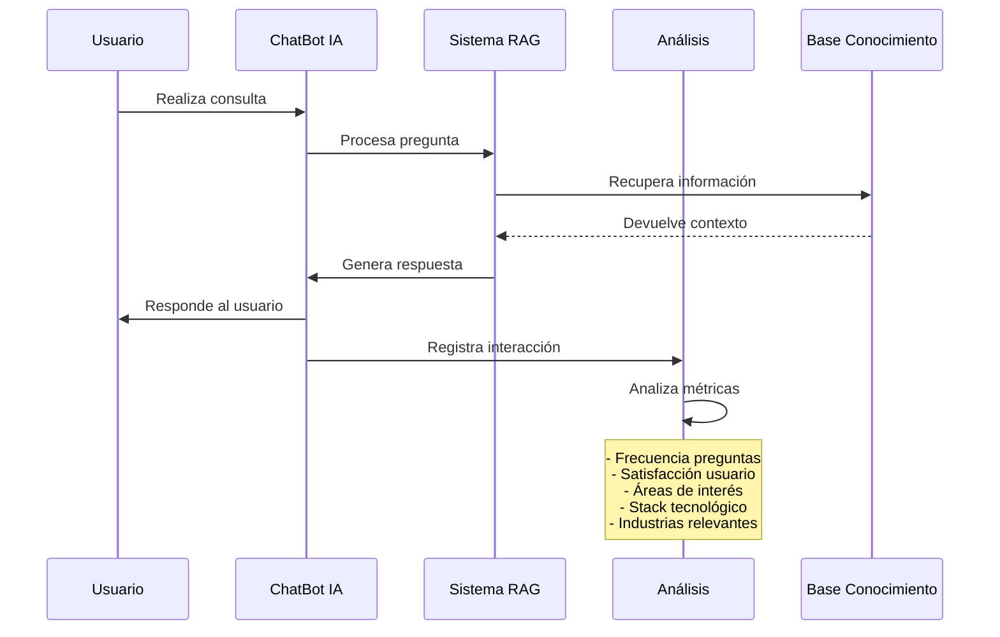
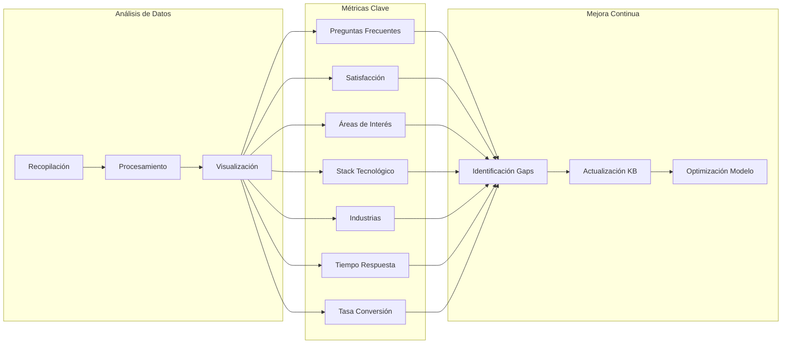

# AI-Powered Professional Avatar: Tu Gemelo Digital Profesional 🤖

## 1. Visión del Producto

### 1.1 Resumen Ejecutivo
El proyecto consiste en crear un gemelo digital profesional mediante un avanzado chatbot basado en IA que actuará como tu representante virtual 24/7. Este asistente inteligente utiliza tecnología RAG (Retrieval Augmented Generation) para proporcionar información precisa y contextualizada sobre tu trayectoria profesional, habilidades y experiencia, revolucionando la manera en que los reclutadores y potenciales clientes interactúan con tu perfil profesional.

### 1.2 Arquitectura del Sistema
#### Diagrama de Arquitectura General

[Imagen: /diagramas/arquitectura_general.png]

#### Flujo de Interacción

[Imagen: /diagramas/flujo_interaccion.png]

### 1.3 Público Objetivo
1. **Reclutadores Técnicos**
   - Necesitan evaluar competencias técnicas
   - Buscan candidatos con experiencia específica
   - Valoran la innovación y conocimientos en IA

2. **Potenciales Clientes**
   - Empresas buscando servicios de desarrollo/consultoría
   - Startups interesadas en soluciones tecnológicas
   - Empresas en proceso de transformación digital

3. **Colegas y Profesionales del Sector**
   - Interesados en networking
   - Buscando colaboraciones en proyectos
   - Explorando oportunidades de aprendizaje mutuo

## 2. Características del Producto

### 2.1 Funcionalidades Core

#### ChatBot IA Personalizado
- Respuestas en lenguaje natural sobre experiencia profesional
- Soporte multiidioma
- Disponibilidad 24/7
- Capacidad de proporcionar ejemplos específicos de proyectos
- Redirección a recursos relevantes del portfolio
- Sistema de retroalimentación integrado para mejora continua

#### Sistema de Análisis y Estadísticas

[Imagen: /diagramas/sistema_analisis.png]

##### Métricas y KPIs
1. **Análisis de Preguntas**
   - Ranking de preguntas más frecuentes
   - Patrones de consulta por hora/día/semana
   - Tiempo promedio de respuesta
   - Tasa de preguntas sin respuesta satisfactoria

2. **Satisfacción del Usuario**
   - Índice de satisfacción por respuesta
   - Tasa de repreguntas sobre el mismo tema
   - Duración de las conversaciones
   - Tasa de abandono

3. **Análisis de Contenido**
   - Secciones más consultadas del perfil
   - Proyectos que generan mayor interés
   - Habilidades más valoradas
   - Tecnologías más consultadas

4. **Análisis de Industria**
   - Sectores que muestran mayor interés
   - Tipos de empresas (startup, enterprise, etc.)
   - Regiones geográficas de consulta
   - Patrones de interés por industria

5. **Métricas de Conversión**
   - Tasa de contactos posteriores
   - Conversión a oportunidades laborales
   - Tasa de recomendaciones
   - Efectividad en generación de leads

6. **Análisis Técnico**
   - Stack tecnológico más demandado
   - Tendencias en requisitos técnicos
   - Gaps en habilidades técnicas
   - Nuevas tecnologías emergentes de interés

7. **Optimización del Sistema**
   - Precisión de las respuestas
   - Velocidad de respuesta
   - Uso de recursos del sistema
   - Efectividad del sistema RAG

### 2.2 Fuentes de Información
- Perfil de LinkedIn
- Descripción detallada de proyectos
- Certificaciones y formación académica
- Publicaciones y contenido técnico
- Repositorios de código (GitHub)
- Experiencia laboral detallada

### 2.3 Capacidades del ChatBot
- Responder preguntas sobre experiencia laboral
- Proporcionar detalles de proyectos específicos
- Explicar habilidades técnicas y competencias
- Compartir logros y reconocimientos
- Proporcionar enlaces relevantes a trabajos/proyectos
- Mantener un tono profesional y consistente

## 3. Experiencia de Usuario

### 3.1 Flujo de Interacción
1. Usuario visita el portfolio
2. Accede al chat mediante un botón/widget visible
3. Puede realizar preguntas en lenguaje natural
4. Recibe respuestas contextualizadas y relevantes
5. Puede solicitar más detalles o aclaraciones
6. Tiene acceso a recursos relacionados

### 3.2 Ejemplos de Interacción
- "¿Cuál es tu experiencia en desarrollo backend?"
- "¿Qué proyectos has realizado con IA?"
- "¿Cuáles son tus principales habilidades técnicas?"
- "¿Puedes contarme sobre tu experiencia en [empresa]?"
- "¿Qué certificaciones tienes en cloud computing?"

### 3.3 Limitaciones y Alcance
- El chatbot se limitará a información profesional
- No compartirá información personal o confidencial
- Indicará claramente que es un asistente IA
- Proporcionará medios de contacto directo cuando sea necesario

## 4. Métricas de Éxito

### 4.1 KPIs Principales
- Número de interacciones con el chatbot
- Duración promedio de las conversaciones
- Tasa de preguntas respondidas satisfactoriamente
- Número de contactos/leads generados
- Feedback positivo de usuarios

### 4.2 Objetivos Cualitativos
- Mejora en la calidad de leads generados
- Reducción en tiempo de screening inicial
- Aumento en la visibilidad profesional
- Demostración práctica de habilidades en IA

## 5. Consideraciones Técnicas y de Privacidad

### 5.1 Privacidad y Seguridad
- Cumplimiento con GDPR/CCPA
- Transparencia en el uso de datos
- Protección de información sensible
- Políticas claras de uso y privacidad

### 5.2 Mantenimiento
- Actualizaciones regulares de la base de conocimiento
- Monitoreo de calidad de respuestas
- Mejora continua del modelo
- Backup y recuperación de datos

## 6. Fases de Implementación

### 6.1 Fase 1: Preparación
- Recopilación y estructuración de datos
- Diseño de la interfaz de usuario
- Configuración inicial del sistema RAG

### 6.2 Fase 2: Desarrollo Base
- Implementación del backend
- Integración con el portfolio existente
- Desarrollo del sistema de chat

### 6.3 Fase 3: Mejoras y Optimización
- Afinamiento del modelo
- Mejoras en UX basadas en feedback
- Expansión de la base de conocimiento

### 6.4 Fase 4: Lanzamiento y Monitoreo
- Despliegue en producción
- Monitoreo de rendimiento
- Recopilación de feedback
- Ajustes basados en uso real

## 7. Riesgos y Mitigaciones

### 7.1 Riesgos Identificados
1. Respuestas imprecisas del chatbot
2. Problemas de disponibilidad
3. Costos de operación elevados
4. Limitaciones técnicas

### 7.2 Estrategias de Mitigación
1. Sistema de verificación de respuestas
2. Arquitectura robusta y escalable
3. Optimización de costos y caching
4. Monitoreo continuo y mejoras

## 8. Criterios de Éxito

### 8.1 Mínimo Producto Viable (MVP)
- Chatbot funcional con información básica
- Integración completa con el portfolio
- Soporte para español e inglés
- Sistema de feedback básico

### 8.2 Producto Final
- Base de conocimiento completa y precisa
- Soporte multiidioma amplio
- Analytics y métricas detalladas
- Sistema de mejora continua
