# PRD — Sistema de Certificados Electrónicos CCB

**Producto:** Certificados Electrónicos — Cámara de Comercio de Bogotá  
**Versión:** 2.3 (Modernización)  
**Fecha:** Junio 2026  
**Estado:** Draft  
**Product Manager:** [Por definir]  
**Stakeholders:** Dirección de Tecnología CCB, Gerencia de Registros Públicos, Equipo de Desarrollo

---

## 1. Resumen Ejecutivo

### 1.1 Visión del producto

Proveer a personas naturales, jurídicas y terceros interesados una plataforma digital que permita solicitar, pagar, obtener y verificar certificados mercantiles electrónicos de la Cámara de Comercio de Bogotá, con una experiencia de usuario moderna, segura y de alta disponibilidad.

### 1.2 Problema que resuelve

Los usuarios de la CCB necesitan obtener certificados mercantiles (existencia, representación legal, negativos, textuales, depósitos financieros, costumbres mercantiles) de forma inmediata y digital, sin desplazarse a sedes físicas. Adicionalmente, terceros que reciben estos certificados necesitan validar su autenticidad de forma pública y confiable.

### 1.3 Métricas del negocio


| Métrica                                  | Valor                                  |
| ---------------------------------------- | -------------------------------------- |
| Certificados emitidos por día (promedio) | ~12,000                                |
| Certificados emitidos por año            | ~4,000,000                             |
| Picos en temporada alta                  | ~20,000-25,000/día                     |
| Tiempo máximo aceptable de liquidación   | < 10 segundos                          |
| Disponibilidad requerida                 | 99.5% (horario extendido 6am-10pm L-S) |


---


## 2. Actores del Sistema


| Actor                                | Descripción                                                                                       | Autenticación                              |
| ------------------------------------ | ------------------------------------------------------------------------------------------------- | ------------------------------------------ |
| **Solicitante público**              | Persona que busca inscritos y solicita certificados estándar, especiales o costumbres mercantiles | Sin autenticación (datos en formulario)    |
| **Afiliado CCB**                     | Asociado al Círculo de Afiliados con beneficio de certificados gratuitos dentro de su cuota       | MAUC SSO obligatorio                       |
| **Solicitante de depósitos**         | Usuario registrado que solicita certificados de estados financieros depositados                   | OAuth (login propio con documento + clave) |
| **Tercero verificador**              | Cualquier persona que recibe un certificado y desea comprobar su autenticidad                     | Sin autenticación (portal público)         |
| **Backoffice / Motor de generación** | Sistema interno que produce los PDFs de certificados y notifica su disponibilidad                 | API con credenciales internas              |
| **App móvil CCB**                    | Aplicación móvil institucional que permite solicitar certificados                                 | API dedicada                               |
| **Pasarela de pagos**                | Plataforma de cobro electrónico de la CCB                                                         | Integración por redirect                   |
| **PUP (Pagos Unificados)**           | Plataforma interna de liquidación y gestión de órdenes de pago                                    | WCF/SOAP                                   |
| **TiendaWS**                         | Servicio de catálogo mercantil: tipos de certificado, precios, saldo afiliado                     | WCF/SOAP                                   |
| **SHD**                              | Servicio de consulta de propietario/matrícula principal de establecimientos                       | WCF/SOAP                                   |
| **MAUC**                             | Módulo de Autenticación Unificada de la CCB (SSO)                                                 | JWT                                        |


---


## 3. Casos de Uso


### 3.1 Diagrama de Casos de Uso

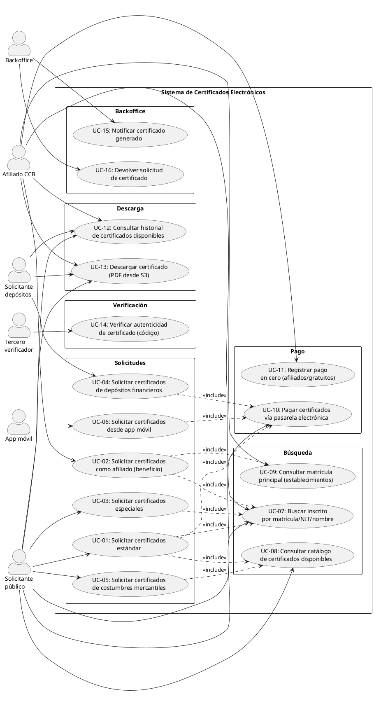


### 3.2 Diagrama de Flujo Principal (Actividades)

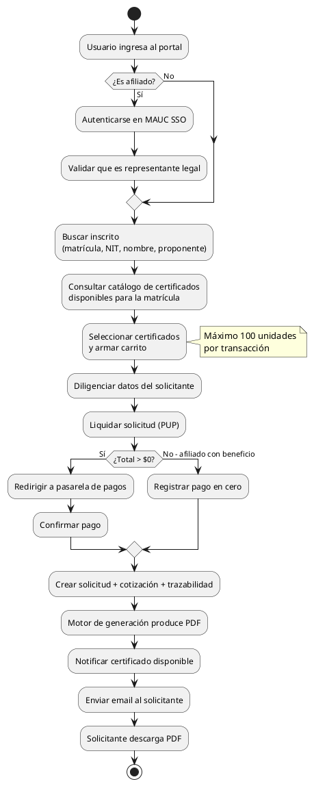


### 3.3 Diagrama de Secuencia — Liquidación Estándar

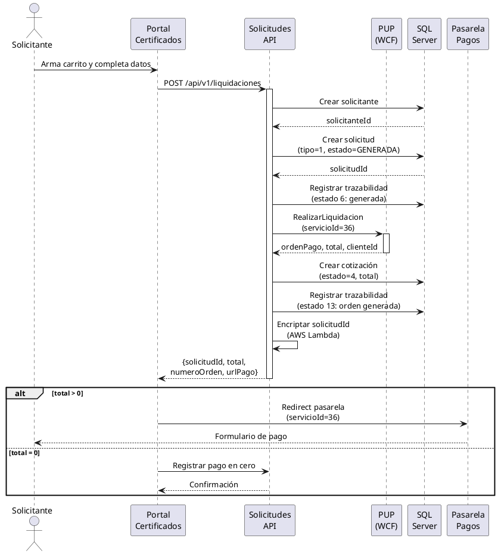


### 3.4 Diagrama de Secuencia — Verificación Pública

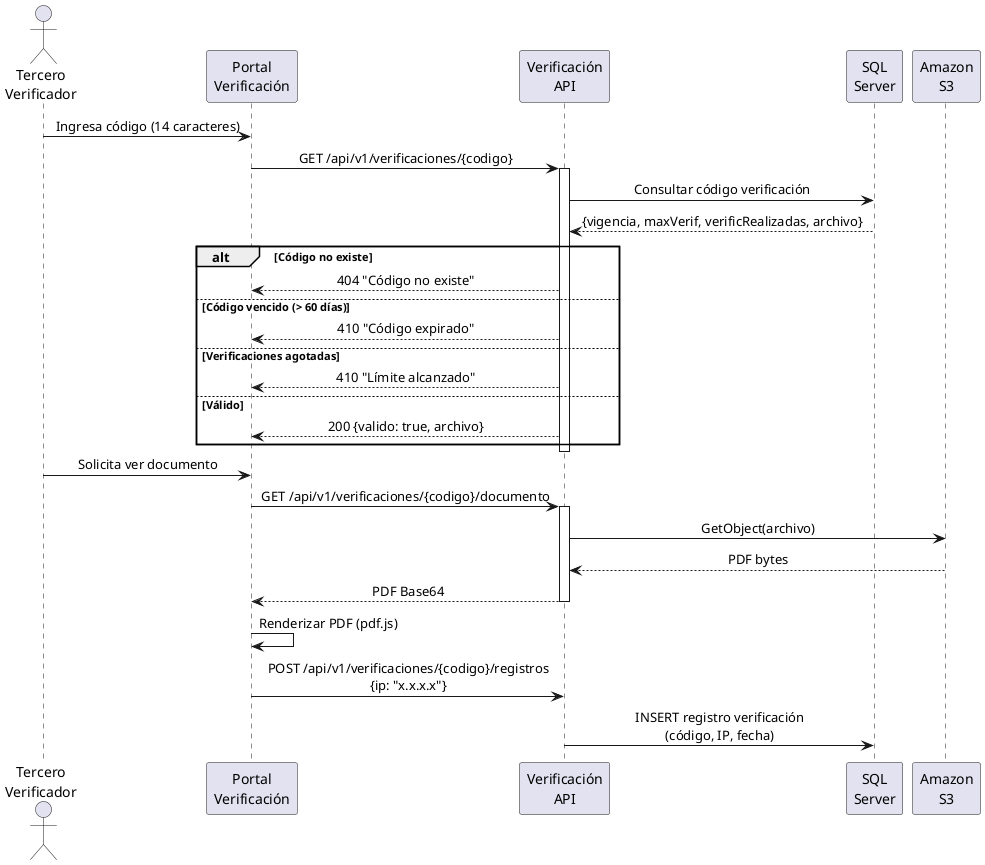


### 3.5 Diagrama de Estados — Solicitud

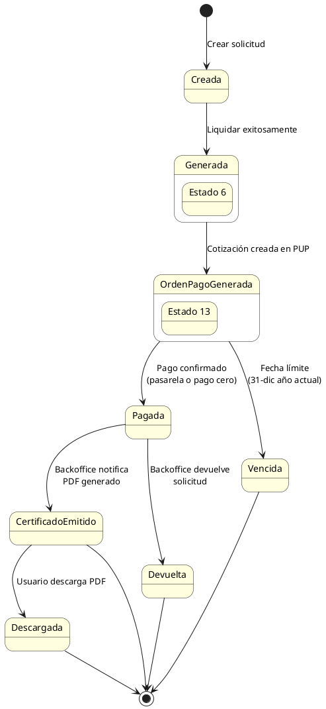

---


## 4. Casos de Uso Detallados


### UC-01: Solicitar certificados estándar


| Campo                 | Descripción                                                                                                                                                                                                                                                                    |
| --------------------- | ------------------------------------------------------------------------------------------------------------------------------------------------------------------------------------------------------------------------------------------------------------------------------ |
| **Actor principal**   | Solicitante público                                                                                                                                                                                                                                                            |
| **Precondiciones**    | Matrícula/proponente existe en el registro mercantil                                                                                                                                                                                                                           |
| **Trigger**           | Usuario busca una matrícula y selecciona certificados                                                                                                                                                                                                                          |
| **Flujo principal**   | 1. Buscar inscrito (matrícula, NIT, nombre, proponente) → 2. Seleccionar certificados del catálogo → 3. Agregar al carrito (máx. 100) → 4. Diligenciar datos solicitante → 5. Liquidar en PUP (servicioId=36) → 6. Pagar vía pasarela o pago en cero → 7. Recibir confirmación |
| **Flujo alternativo** | Si total = 0 → pago en cero automático                                                                                                                                                                                                                                         |
| **Postcondiciones**   | Solicitud creada (estado 6→13), orden en PUP, redirect a pasarela                                                                                                                                                                                                              |
| **Reglas de negocio** | Fecha límite de pago: 31-dic del año en curso. Certificados excluidos del catálogo web: IDs 8, 13, 14, 19-28. Si proponente en estado 2800/2802, excluir certificado ID 7                                                                                                      |


### UC-02: Solicitar certificados como afiliado


| Campo                 | Descripción                                                                                                                                                                                                                                                                                                      |
| --------------------- | ---------------------------------------------------------------------------------------------------------------------------------------------------------------------------------------------------------------------------------------------------------------------------------------------------------------- |
| **Actor principal**   | Afiliado CCB                                                                                                                                                                                                                                                                                                     |
| **Precondiciones**    | Matrícula con `esAfiliado=1`. Usuario autenticado en MAUC. Solicitante es representante legal de la matrícula                                                                                                                                                                                                    |
| **Trigger**           | Usuario accede al flujo de afiliados (token MAUC)                                                                                                                                                                                                                                                                |
| **Flujo principal**   | 1. Buscar matrícula → 2. Verificar afiliación → 3. Autenticar en MAUC SSO → 4. Validar representante legal → 5. Clasificar certificados: gratuitos (IDs 1,2,3,4,11,13,17,32) vs. con costo → 6. Liquidar gratuitos contra cuota de afiliación (servicioLiquidar=4) → 7. Liquidar con costo vía pasarela estándar |
| **Flujo alternativo** | Si matrícula es establecimiento → consultar matrícula principal (SHD) para verificar afiliación de la sociedad                                                                                                                                                                                                   |
| **Postcondiciones**   | Certificados gratuitos descuentan saldo de afiliación. Con costo generan orden de pago                                                                                                                                                                                                                           |
| **Reglas de negocio** | Solo representante legal puede usar beneficio. Tipos certificado gratuitos: 1,2,3,4,11,13,17,32. Saldo consultado vía TiendaWS                                                                                                                                                                                   |


### UC-03: Solicitar certificados especiales


| Campo                 | Descripción                                                                                                                               |
| --------------------- | ----------------------------------------------------------------------------------------------------------------------------------------- |
| **Actor principal**   | Solicitante público                                                                                                                       |
| **Precondiciones**    | Según tipo: textual (matrícula requerida), negativo (puede ser sin matrícula), histórico (matrícula requerida)                            |
| **Trigger**           | Usuario selecciona tipo especial (textual=1, negativo=2, histórico=3)                                                                     |
| **Flujo principal**   | 1. Buscar inscrito → 2. Liquidar especial (servicioNegocioVirtualId=19, servicioLiquidarId=34) → 3. Generar carta de solicitud → 4. Pagar |
| **Flujo alternativo** | Negativo sin matrícula activa → flujo "no matriculado" con formulario de datos manuales                                                   |
| **Postcondiciones**   | Solicitud tipo 2 con carta adjunta para procesamiento manual                                                                              |


### UC-04: Solicitar certificados de depósitos financieros


| Campo                 | Descripción                                                                                                                                                                                                                             |
| --------------------- | --------------------------------------------------------------------------------------------------------------------------------------------------------------------------------------------------------------------------------------- |
| **Actor principal**   | Solicitante de depósitos                                                                                                                                                                                                                |
| **Precondiciones**    | Usuario registrado en sistema de depósitos. Login OAuth exitoso                                                                                                                                                                         |
| **Trigger**           | Usuario accede al módulo de depósitos e ingresa credenciales                                                                                                                                                                            |
| **Flujo principal**   | 1. Login OAuth → 2. Consultar matrículas vinculadas → 3. Seleccionar matrícula → 4. Armar carrito con estados financieros (fecha balance, folios, anexos) → 5. Liquidar (servicioNegocioVirtualId=20, servicioLiquidarId=35) → 6. Pagar |
| **Postcondiciones**   | Solicitud tipo 3 con documentos de depósito referenciados                                                                                                                                                                               |
| **Reglas de negocio** | Requiere autenticación OAuth. Matrícula pad-left 8 dígitos                                                                                                                                                                              |


### UC-05: Solicitar certificados de costumbre mercantil


| Campo               | Descripción                                                                                                                           |
| ------------------- | ------------------------------------------------------------------------------------------------------------------------------------- |
| **Actor principal** | Solicitante público                                                                                                                   |
| **Precondiciones**  | Sector de costumbre disponible en catálogo                                                                                            |
| **Trigger**         | Usuario accede al módulo de costumbres mercantiles                                                                                    |
| **Flujo principal** | 1. Consultar sectores disponibles (TiendaWS tipo 506) → 2. Seleccionar certificados → 3. Liquidar estándar (servicioId=36) → 4. Pagar |
| **Postcondiciones** | Solicitud estándar con certificados de costumbres                                                                                     |


### UC-14: Verificar autenticidad de certificado


| Campo                 | Descripción                                                                                                                                                                              |
| --------------------- | ---------------------------------------------------------------------------------------------------------------------------------------------------------------------------------------- |
| **Actor principal**   | Tercero verificador                                                                                                                                                                      |
| **Precondiciones**    | Posee código de verificación de 14 caracteres                                                                                                                                            |
| **Trigger**           | Ingresa código en portal público de verificación                                                                                                                                         |
| **Flujo principal**   | 1. Ingresar código → 2. Sistema valida: a) código existe, b) vigencia ≤ 60 días, c) verificaciones disponibles → 3. Mostrar PDF del certificado → 4. Registrar verificación (IP + fecha) |
| **Flujo alternativo** | Código inválido o no encontrado → mensaje de error al usuario                                                                                                                            |
| **Postcondiciones**   | Verificación registrada. Contador incrementado                                                                                                                                           |
| **Reglas de negocio** | Vigencia: 60 días calendario desde expedición. Verificaciones: según campo `cnt_verificaciones` asignado en generación                                                                   |


### UC-15: Notificar certificado generado


| Campo               | Descripción                                                                                                                                                                             |
| ------------------- | --------------------------------------------------------------------------------------------------------------------------------------------------------------------------------------- |
| **Actor principal** | Backoffice / Motor de generación                                                                                                                                                        |
| **Precondiciones**  | Solicitud pagada. PDF generado y almacenado en S3                                                                                                                                       |
| **Trigger**         | Motor de generación completa la producción del PDF                                                                                                                                      |
| **Flujo principal** | 1. Invocar PUT con archivo, orden y códigos de verificación → 2. Registrar estado de certificado → 3. Insertar códigos de verificación → 4. Enviar email de notificación al solicitante |
| **Postcondiciones** | Certificado disponible para descarga. Códigos de verificación activos por 60 días                                                                                                       |


---


## 5. Requisitos Funcionales


### 5.1 Módulo de Solicitudes


| ID    | Requisito                                                                                                                | Prioridad |
| ----- | ------------------------------------------------------------------------------------------------------------------------ | --------- |
| RF-01 | El sistema debe permitir buscar inscritos por matrícula, NIT, razón social, palabra clave y proponente                   | Alta      |
| RF-02 | El sistema debe consultar el catálogo de tipos de certificado disponibles para cada matrícula vía TiendaWS               | Alta      |
| RF-03 | El sistema debe permitir agregar hasta 100 certificados al carrito por transacción                                       | Alta      |
| RF-04 | El sistema debe liquidar la solicitud contra PUP (servicioId=36) y obtener el total a pagar                              | Alta      |
| RF-05 | El sistema debe crear la solicitud, solicitante, cotización y trazabilidad en una transacción atómica                    | Alta      |
| RF-06 | El sistema debe redirigir al usuario a la pasarela de pagos cuando el total > 0                                          | Alta      |
| RF-07 | El sistema debe registrar pago en cero automáticamente cuando el total = 0 (afiliados con beneficio)                     | Alta      |
| RF-08 | El sistema debe excluir del catálogo web los certificados IDs: 8, 13, 14, 19-28                                          | Media     |
| RF-09 | El sistema debe soportar liquidación de certificados especiales (textual, negativo, histórico) con servicioLiquidarId=34 | Alta      |
| RF-10 | El sistema debe soportar liquidación de depósitos financieros con servicioLiquidarId=35 y autenticación OAuth            | Alta      |
| RF-11 | El sistema debe soportar liquidación de costumbres mercantiles vía TiendaWS tipo 506                                     | Media     |
| RF-12 | El sistema debe soportar liquidación de afiliados con servicioLiquidarId=4 y validación de representante legal           | Alta      |
| RF-13 | El sistema debe consultar matrícula principal vía SHD cuando la matrícula es un establecimiento                          | Alta      |
| RF-14 | El sistema debe asignar fecha límite de pago al 31 de diciembre del año en curso                                         | Media     |
| RF-15 | El sistema debe soportar solicitudes desde app móvil (tipoSolicitud=4) via API dedicada                                  | Media     |


### 5.2 Módulo de Autenticación


| ID    | Requisito                                                                                        | Prioridad |
| ----- | ------------------------------------------------------------------------------------------------ | --------- |
| RF-16 | El sistema debe integrar MAUC SSO como mecanismo de autenticación para afiliados                 | Alta      |
| RF-17 | El sistema debe validar que el token MAUC corresponda al número de documento del solicitante     | Alta      |
| RF-18 | El sistema debe soportar login OAuth propio para módulo de depósitos (documento + clave + email) | Alta      |
| RF-19 | El sistema debe verificar que el solicitante afiliado sea representante legal de la matrícula    | Alta      |
| RF-20 | El sistema debe consultar saldo de afiliación vía TiendaWS antes de liquidar beneficio gratuito  | Alta      |


### 5.3 Módulo de Descargas


| ID    | Requisito                                                                                                                                                                                       | Prioridad |
| ----- | ----------------------------------------------------------------------------------------------------------------------------------------------------------------------------------------------- | --------- |
| RF-21 | El sistema debe permitir consultar certificados disponibles para descarga por tipo y número de documento, limitando el historial al último año calendario (365 días desde la fecha de consulta) | Alta      |
| RF-22 | El sistema debe permitir descargar el PDF del certificado desde Amazon S3                                                                                                                       | Alta      |
| RF-23 | El sistema debe generar URLs pre-firmadas de S3 con expiración de 15 minutos                                                                                                                    | Alta      |
| RF-24 | El sistema debe mostrar el estado de cada solicitud (generada, pagada, certificado emitido, descargada)                                                                                         | Media     |


### 5.4 Módulo de Verificación


| ID    | Requisito                                                                                       | Prioridad |
| ----- | ----------------------------------------------------------------------------------------------- | --------- |
| RF-25 | El sistema debe permitir validar un código de verificación de 14 caracteres sin autenticación   | Alta      |
| RF-26 | El sistema debe verificar que el código no haya expirado (vigencia: 60 días calendario)         | Alta      |
| RF-27 | El sistema debe verificar que el código no haya superado el máximo de verificaciones permitidas | Alta      |
| RF-28 | El sistema debe mostrar el PDF del certificado verificado usando un visor integrado (pdf.js)    | Alta      |
| RF-29 | El sistema debe registrar cada verificación con la IP del verificador y fecha/hora              | Alta      |
| RF-30 | El sistema debe mostrar un mensaje de error cuando el código de verificación no sea válido      | Alta      |


### 5.5 Módulo de Backoffice


| ID    | Requisito                                                                                         | Prioridad |
| ----- | ------------------------------------------------------------------------------------------------- | --------- |
| RF-31 | El sistema debe exponer un endpoint para que el motor de generación notifique certificados listos | Alta      |
| RF-32 | El sistema debe insertar códigos de verificación al recibir notificación de certificado generado  | Alta      |
| RF-33 | El sistema debe enviar email de notificación al solicitante cuando su certificado está disponible | Alta      |
| RF-34 | El sistema debe permitir la devolución de solicitudes por el backoffice                           | Media     |


### 5.6 Catálogos


| ID    | Requisito                                                                                                                                    | Prioridad |
| ----- | -------------------------------------------------------------------------------------------------------------------------------------------- | --------- |
| RF-35 | El sistema debe proveer catálogos de: tipos de documento, municipios, sedes, formas de pago, opciones de búsqueda                            | Alta      |
| RF-36 | Los catálogos deben ser cacheables con TTL configurable                                                                                      | Media     |
| RF-37 | El sistema debe rechazar consultas de historial que superen el último año calendario, retornando HTTP 400 con mensaje orientativo al usuario | Alta      |


---


## 6. Requisitos No Funcionales


### 6.1 Rendimiento


| ID     | Requisito                                            | Métrica                              |
| ------ | ---------------------------------------------------- | ------------------------------------ |
| RNF-01 | Tiempo de respuesta de búsqueda de inscritos         | P95 < 2 segundos                     |
| RNF-02 | Tiempo de respuesta de liquidación (incluye WCF PUP) | P95 < 10 segundos                    |
| RNF-03 | Tiempo de respuesta de verificación de código        | P95 < 500 milisegundos               |
| RNF-04 | Tiempo de descarga de PDF                            | P95 < 3 segundos (archivo < 5MB)     |
| RNF-05 | Throughput mínimo en hora pico                       | 20 transacciones/segundo             |
| RNF-06 | Throughput de verificación pública                   | 100 requests/segundo sin degradación |


### 6.2 Disponibilidad y Resiliencia


| ID     | Requisito                                                               | Métrica                          |
| ------ | ----------------------------------------------------------------------- | -------------------------------- |
| RNF-07 | Disponibilidad del servicio                                             | 99.5% (horario 6am-10pm L-S)     |
| RNF-08 | Recovery Time Objective (RTO)                                           | < 30 minutos                     |
| RNF-09 | Recovery Point Objective (RPO)                                          | < 5 minutos (pérdida de datos)   |
| RNF-10 | El sistema debe tolerar la caída de un servidor sin pérdida de servicio | Mínimo 2 instancias por servicio |
| RNF-11 | El sistema debe implementar circuit breaker para integraciones WCF      | Timeout: 10s, fallback graceful  |


### 6.3 Seguridad


| ID     | Requisito                                                                                      |
| ------ | ---------------------------------------------------------------------------------------------- |
| RNF-12 | Todo el tráfico debe ser HTTPS (TLS 1.3). HTTP debe redirigir a HTTPS                          |
| RNF-13 | Las credenciales y secrets no deben almacenarse en archivos de configuración en texto claro    |
| RNF-14 | CORS debe restringirse exclusivamente a dominios `*.ccb.org.co`                                |
| RNF-15 | El portal de verificación (público) debe implementar rate limiting (100 req/s por IP)          |
| RNF-16 | Todos los inputs deben validarse contra inyección SQL, XSS y path traversal                    |
| RNF-17 | Los tokens JWT deben tener expiración máxima de 8 horas                                        |
| RNF-18 | La API de backoffice debe autenticarse con credenciales de servicio (no expuesta públicamente) |
| RNF-19 | Los PDFs en S3 deben ser accesibles únicamente via URLs pre-firmadas (no públicos)             |
| RNF-20 | El sistema debe registrar un audit trail de todas las operaciones de escritura                 |


### 6.4 Escalabilidad


| ID     | Requisito                                                                          |
| ------ | ---------------------------------------------------------------------------------- |
| RNF-21 | El sistema debe escalar horizontalmente de 5 a 8+ instancias sin cambios de código |
| RNF-22 | El servicio de verificación debe escalar independientemente del de solicitudes     |
| RNF-23 | La base de datos debe soportar crecimiento de ~4M registros/año sin degradación    |
| RNF-24 | El storage (S3) debe soportar ~4M PDFs/año sin gestión manual de capacidad         |


### 6.5 Mantenibilidad


| ID     | Requisito                                                                                    |
| ------ | -------------------------------------------------------------------------------------------- |
| RNF-25 | El código debe alcanzar mínimo 80% de cobertura en tests unitarios para la capa de dominio   |
| RNF-26 | La lógica de negocio debe residir exclusivamente en la capa de aplicación/dominio (no en BD) |
| RNF-27 | El sistema debe tener observabilidad: logs estructurados, métricas y health checks           |
| RNF-28 | Los deployments deben ser automatizados via CI/CD sin intervención manual                    |
| RNF-29 | El sistema debe soportar deployment sin downtime (rolling deployment o blue-green)           |
| RNF-30 | La documentación de API debe generarse automáticamente (OpenAPI/Swagger)                     |


### 6.6 Compatibilidad y UX


| ID     | Requisito                                                                                         |
| ------ | ------------------------------------------------------------------------------------------------- |
| RNF-31 | Los portales deben ser responsive (mobile-first) y compatibles con Chrome, Edge, Firefox y Safari |
| RNF-32 | El portal de verificación debe cargar en < 3 segundos en conexión 3G                              |
| RNF-33 | La interfaz debe cumplir WCAG 2.1 nivel AA (accesibilidad)                                        |
| RNF-34 | El sistema debe soportar internacionalización (español inicialmente, con capacidad de extensión)  |


---


## 7. Reglas de Negocio


| ID    | Regla                                        | Detalle                                                                                                                                                                                                                                                                                                                |
| ----- | -------------------------------------------- | ---------------------------------------------------------------------------------------------------------------------------------------------------------------------------------------------------------------------------------------------------------------------------------------------------------------------- |
| RN-01 | Vigencia de código de verificación           | 60 días calendario desde la fecha de expedición                                                                                                                                                                                                                                                                        |
| RN-02 | Máximo de ítems por transacción              | 100 certificados en un solo carrito                                                                                                                                                                                                                                                                                    |
| RN-03 | Fecha límite de pago                         | 31 de diciembre del año en curso                                                                                                                                                                                                                                                                                       |
| RN-04 | Certificados gratuitos para afiliados        | Solo tipos: 1, 2, 3, 4, 11, 13, 17, 32                                                                                                                                                                                                                                                                                 |
| RN-05 | Condición de beneficio afiliado              | Solicitante debe ser representante legal autenticado en MAUC                                                                                                                                                                                                                                                           |
| RN-06 | Establecimiento → sociedad                   | Si la matrícula es un establecimiento, se consulta la matrícula principal para determinar afiliación                                                                                                                                                                                                                   |
| RN-07 | Código verificación nuevo                    | 14 caracteres alfanuméricos                                                                                                                                                                                                                                                                                            |
| RN-09 | Certificados excluidos del catálogo web      | IDs: 8, 13, 14, 19, 20, 21, 22, 23, 24, 25, 26, 27, 28                                                                                                                                                                                                                                                                 |
| RN-10 | Proponente en estado 2800/2802               | Se excluye adicionalmente certificado ID 7                                                                                                                                                                                                                                                                             |
| RN-11 | Cámara de Comercio                           | Código CCB: 0204                                                                                                                                                                                                                                                                                                       |
| RN-12 | Matrícula                                    | Se formatea con pad-left a 8 dígitos                                                                                                                                                                                                                                                                                   |
| RN-13 | NIT                                          | Se formatea con pad-left a 15 dígitos                                                                                                                                                                                                                                                                                  |
| RN-14 | Pago en cero                                 | Se aplica cuando total de liquidación = $0 (beneficio afiliación o descuentos completos)                                                                                                                                                                                                                               |
| RN-15 | Email de notificación                        | Se envía automáticamente cuando el backoffice marca un certificado como generado                                                                                                                                                                                                                                       |
| RN-16 | Período de consulta del historial de órdenes | La consulta de historial de solicitudes devuelve únicamente los registros de los últimos 365 días contados desde la fecha de consulta. Solicitudes anteriores a ese período se excluyen de los resultados para evitar bloqueos por volumen excesivo cuando un cliente acumula un número elevado de órdenes históricas. |


---


## 8. Integraciones Externas


### Diagrama de Contexto

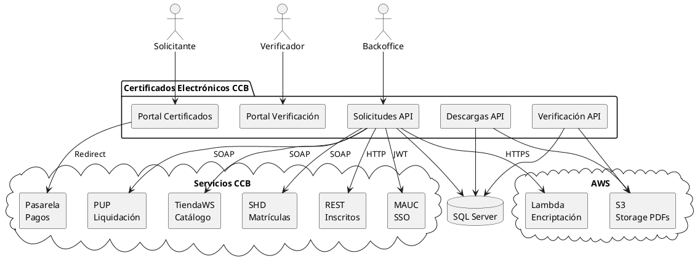


### Tabla de Integraciones


| Sistema               | Protocolo     | Propósito                                        | SLA requerido        |
| --------------------- | ------------- | ------------------------------------------------ | -------------------- |
| **PUP**               | WCF/SOAP      | Liquidación, cotización, datos de cliente        | < 10s timeout        |
| **TiendaWS**          | WCF/SOAP      | Catálogo certificados, precios, saldo afiliado   | < 8s timeout         |
| **SHD**               | WCF/SOAP      | Consulta matrícula principal de establecimientos | < 8s timeout         |
| **REST Inscritos**    | HTTP POST     | Búsqueda de inscritos en registro mercantil      | < 5s timeout         |
| **MAUC SSO**          | JWT/OIDC      | Autenticación unificada para afiliados           | 99.9% disponibilidad |
| **Pasarela de pagos** | Redirect HTTP | Cobro electrónico (servicioId=36)                | Gestionada por CCB   |
| **Amazon S3**         | AWS SDK       | Almacenamiento y descarga de PDFs                | 99.99% (SLA AWS)     |
| **AWS Lambda**        | HTTPS         | Encriptación de solicitudId para pasarela        | < 2s timeout         |
| **SMTP CCB**          | SMTP          | Envío de emails de notificación                  | Best effort          |


---


## 9. Restricciones y Supuestos


### Restricciones


| #   | Restricción                                                                                                                            |
| --- | -------------------------------------------------------------------------------------------------------------------------------------- |
| 1   | Los servicios WCF legacy (PUP, TiendaWS, SHD) no se modificarán en el corto plazo; el sistema debe adaptarse a sus interfaces actuales |
| 2   | La pasarela de pagos es un sistema externo que no se puede modificar; la integración es por redirect con servicioId=36                 |
| 3   | Amazon S3 es el storage definitivo de PDFs (ya en producción)                                                                          |
| 4   | MAUC SSO es el estándar institucional de autenticación y no es negociable                                                              |
| 5   | El motor de generación de PDFs es un sistema externo separado; este sistema solo almacena, distribuye y verifica                       |
| 6   | SQL Server es la base de datos institucional                                                                                           |


### Supuestos


| #   | Supuesto                                                                                                   |
| --- | ---------------------------------------------------------------------------------------------------------- |
| 1   | El volumen se mantendrá en el rango de 12K-25K certificados/día en los próximos 3 años                     |
| 2   | Los WSDLs de PUP, TiendaWS y SHD se mantendrán estables o con cambios backward-compatible                  |
| 3   | MAUC soportará los flujos de autenticación requeridos para todos los tipos de usuario                      |
| 4   | La CCB mantendrá la infraestructura de red actual entre los servidores de aplicación y los servicios WCF   |
| 5   | El equipo de desarrollo tendrá acceso a ambientes de QA de PUP, TiendaWS y SHD para pruebas de integración |


---


## 10. Criterios de Éxito


### 10.1 Indicadores de negocio (KPIs)


| #   | KPI                                                         | Meta            | Medición                                                  |
| --- | ----------------------------------------------------------- | --------------- | --------------------------------------------------------- |
| 1   | **Tasa de conversión** (visitantes que completan la compra) | = 70%           | Solicitudes pagadas / solicitudes iniciadas               |
| 2   | **Tiempo promedio de compra** (desde búsqueda hasta pago)   | < 3 minutos     | Timestamp inicio sesión vs. timestamp redirect a pasarela |
| 3   | **Certificados descargados dentro de 24h**                  | = 90%           | Descargas realizadas en < 24h post-notificación           |
| 4   | **Verificaciones exitosas**                                 | = 95%           | Verificaciones válidas / total intentos                   |
| 5   | **Reducción de solicitudes en ventanilla**                  | = 10% año a año | Comparativa canal digital vs. presencial                  |
| 6   | **NPS del canal digital**                                   | = 40            | Encuesta post-descarga                                    |


### 10.2 Indicadores técnicos (SLIs/SLOs)


| #   | SLI                                    | SLO                |
| --- | -------------------------------------- | ------------------ |
| 1   | Disponibilidad del portal (uptime)     | = 99.5% mensual    |
| 2   | Latencia de liquidación (P95)          | < 10 segundos      |
| 3   | Latencia de verificación (P95)         | < 500 milisegundos |
| 4   | Latencia de descarga (P95)             | < 3 segundos       |
| 5   | Tasa de error HTTP 5xx                 | < 0.5% de requests |
| 6   | Tiempo de deploy (CI/CD pipeline)      | < 15 minutos       |
| 7   | MTTR (tiempo medio de recuperación)    | < 30 minutos       |
| 8   | Cobertura de tests unitarios (dominio) | = 80%              |


### 10.3 Criterios de aceptación del proyecto


| #   | Criterio                                                                                                         | Validación                                        |
| --- | ---------------------------------------------------------------------------------------------------------------- | ------------------------------------------------- |
| 1   | Todos los flujos de compra activos funcionan end-to-end (estándar, afiliados, especiales, depósitos, costumbres) | Test E2E en ambiente QA contra PUP staging        |
| 2   | La verificación pública funciona para códigos nuevos (14 chars)                                                  | Test con código real generado en QA               |
| 3   | La descarga de PDFs desde S3 funciona con URLs pre-firmadas                                                      | Test de descarga con archivo > 1MB                |
| 4   | El sistema soporta 25K certificados/día sin degradación                                                          | Load test con Gatling/k6 simulando pico           |
| 5   | Las vulnerabilidades críticas del sistema actual están resueltas                                                 | Penetration test + checklist de seguridad         |
| 6   | El tiempo de liquidación no supera 10s en P95                                                                    | Monitoreo en producción durante 1 semana          |
| 7   | Zero downtime deployment                                                                                         | Verificación durante 3 deployments consecutivos   |
| 8   | Observabilidad funcional: logs, métricas, alertas, health checks                                                 | Simulación de falla y tiempo de detección < 5 min |


---


## 11. Fuera de Alcance (v2.0)


| #   | Funcionalidad                                | Razón                                                                          |
| --- | -------------------------------------------- | ------------------------------------------------------------------------------ |
| 1   | Generación de PDFs (SSRS o alternativa)      | Los PDFs son generados por el motor de backoffice externo                      |
| 2   | Firma digital X.509 / PKI                    | No implementada actualmente; la autenticidad se basa en código de verificación |
| 3   | Gestión de usuarios internos (backoffice UI) | El backoffice opera via API sin frontend propio                                |
| 4   | App móvil (frontend)                         | Solo se proveen los endpoints API; la app es un proyecto separado              |
| 5   | Compatibilidad con códigos legado (10 chars) | No se implementa redirección al sistema antiguo; formato no soportado          |
| 6   | Reportería BI / dashboards operativos        | Pueden construirse sobre la BD con herramientas externas                       |
| 7   | Notificaciones push / SMS                    | Email es el canal actual; push se evaluará en v3.0                             |


---


## 12. Riesgos


| #   | Riesgo                                                                     | Impacto | Probabilidad | Mitigación                                                                      |
| --- | -------------------------------------------------------------------------- | ------- | ------------ | ------------------------------------------------------------------------------- |
| 1   | Servicios WCF legacy (PUP) con alta latencia o caídas                      | Alto    | Media        | Circuit breaker + retry + fallback con mensaje al usuario                       |
| 2   | Cambios en WSDLs de PUP/TiendaWS sin previo aviso                          | Alto    | Baja         | Versionado de WSDLs en repo + contract tests                                    |
| 3   | Volumen superior al proyectado en temporada alta                           | Medio   | Media        | Auto-scaling + load testing previo                                              |
| 4   | Inconsistencia entre mensaje "ilimitado" y límite numérico en verificación | Medio   | Alta         | Definir regla unificada con producto y comunicar al usuario                     |
| 5   | Migración de datos desde MySQL (tabla certificados) con posible pérdida    | Alto    | Baja         | Script de migración + validación cruzada + rollback plan                        |
| 6   | Dependencia de MAUC para afiliados (single point of failure)               | Alto    | Baja         | Monitoreo de MAUC + graceful degradation (permitir flujo de pago sin beneficio) |


---


## 13. Glosario


| Término                             | Definición                                                                                 |
| ----------------------------------- | ------------------------------------------------------------------------------------------ |
| **Matrícula mercantil**             | Número de registro de una persona natural o jurídica ante la CCB (8 dígitos)               |
| **Proponente**                      | Número de inscripción/establecimiento                                                      |
| **PUP**                             | Plataforma Unificada de Pagos — sistema de liquidación y órdenes de pago de la CCB         |
| **MAUC**                            | Módulo de Autenticación Unificada de la CCB — SSO institucional                            |
| **SHD**                             | Servicio de matrícula principal (relaciona establecimiento con sociedad propietaria)       |
| **TiendaWS**                        | Web Service de catálogo mercantil de la CCB (precios, tipos, consultas)                    |
| **Certificado electrónico**         | Documento PDF emitido digitalmente con código de verificación alfanumérico                 |
| **Código de verificación**          | Identificador único de 14 caracteres que permite autenticar un certificado durante 60 días |
| **Liquidación**                     | Proceso de calcular el valor a pagar por un conjunto de certificados solicitados           |
| **Cotización**                      | Orden de pago generada tras la liquidación exitosa                                         |
| **Trazabilidad**                    | Registro de cambios de estado de una solicitud                                             |
| **Afiliado CCB**                    | Miembro del Círculo de Afiliados con beneficio de certificados gratuitos                   |
| **Depósito de estados financieros** | Estados financieros depositados por una empresa ante la CCB                                |
| **Costumbre mercantil**             | Práctica comercial certificada por la CCB en un sector económico                           |


---


## 14. Arquitectura Técnica


### 14.1 Visión General

La solución propuesta se basa en un backend **Java 25 LTS con Spring Boot 4.1**, distribuido en **3 microservicios** (Solicitudes, Descargas, Verificación) y **2 frontends Angular 22** (Portal Certificados y Portal Verificación). Esta decisión se fundamenta en la experiencia del equipo CCB en Java, la unificación del stack técnico institucional y la madurez del ecosistema Spring para integraciones SOAP/WCF legacy.

A continuación se presentan los diagramas de arquitectura siguiendo el modelo C4 (Context, Container, Component).

### 14.2 Diagrama de Contexto del Sistema (C4 — Nivel 1)

Muestra el sistema de certificados electrónicos y su relación con los actores y sistemas externos.

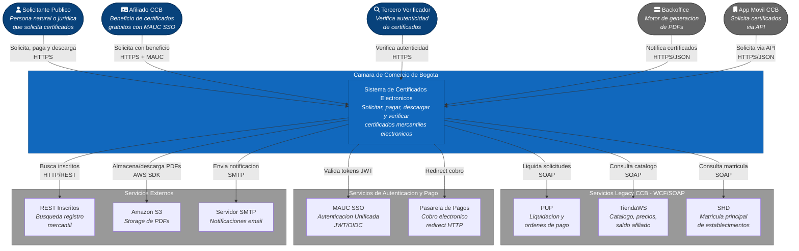


### 14.3 Diagrama de Contenedores (C4 — Nivel 2)

Descompone el sistema en sus contenedores: aplicaciones frontend, servicios backend, bases de datos y storage.

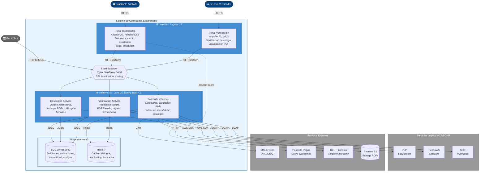


### 14.4 Diagrama de Componentes — Solicitudes Service (C4 — Nivel 3)

El servicio más complejo del sistema. Orquesta la creación de solicitudes, liquidación contra PUP, gestión de afiliados y notificación de backoffice.

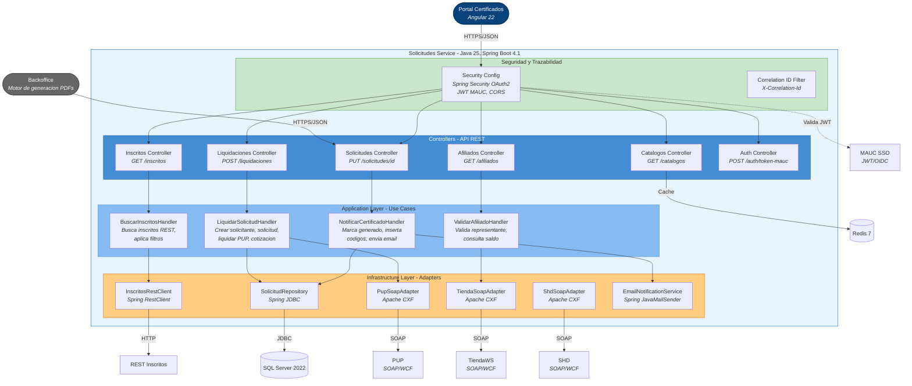


### 14.5 Diagrama de Componentes — Descargas Service (C4 — Nivel 3)

Servicio dedicado a la consulta y descarga de certificados emitidos desde Amazon S3.

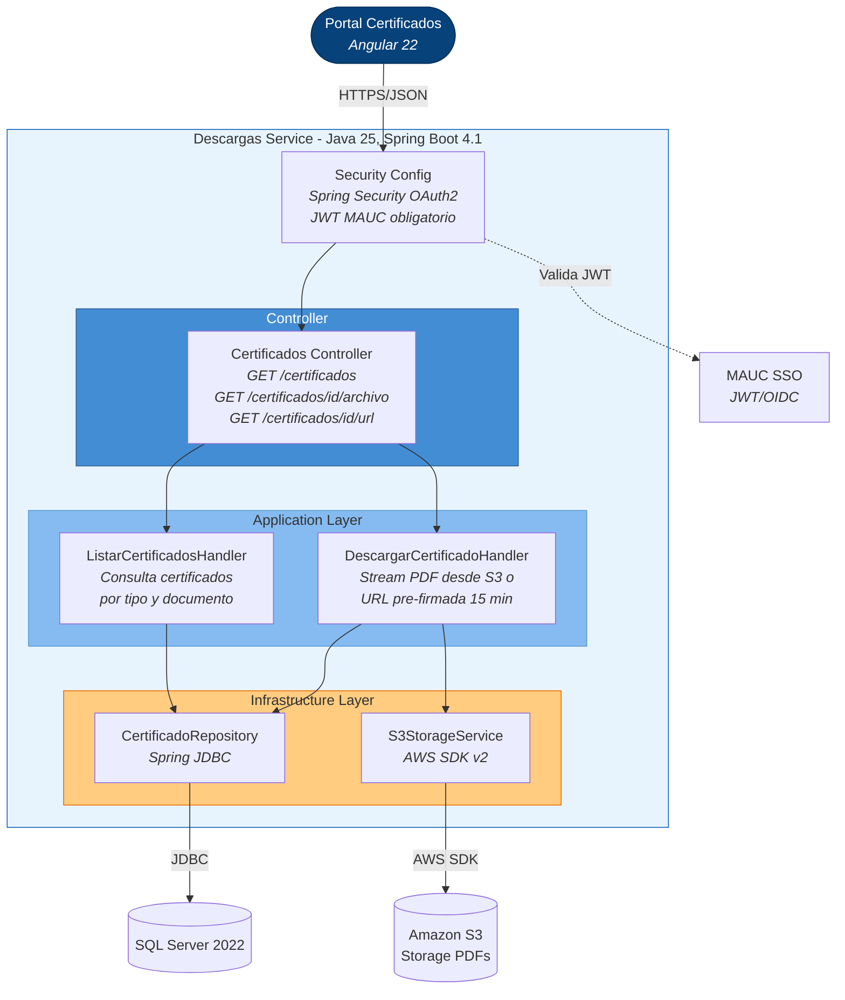


### 14.6 Diagrama de Componentes — Verificación Service (C4 — Nivel 3)

Servicio público (sin autenticación) para validar la autenticidad de certificados mediante código de verificación.

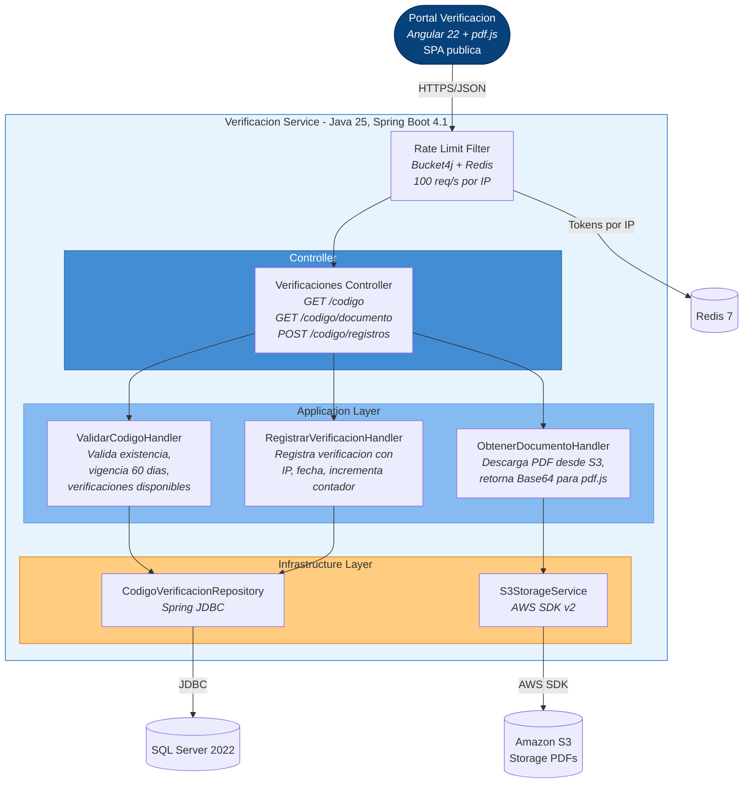


### 14.7 Diagrama de Despliegue (C4 — Vista de Infraestructura)

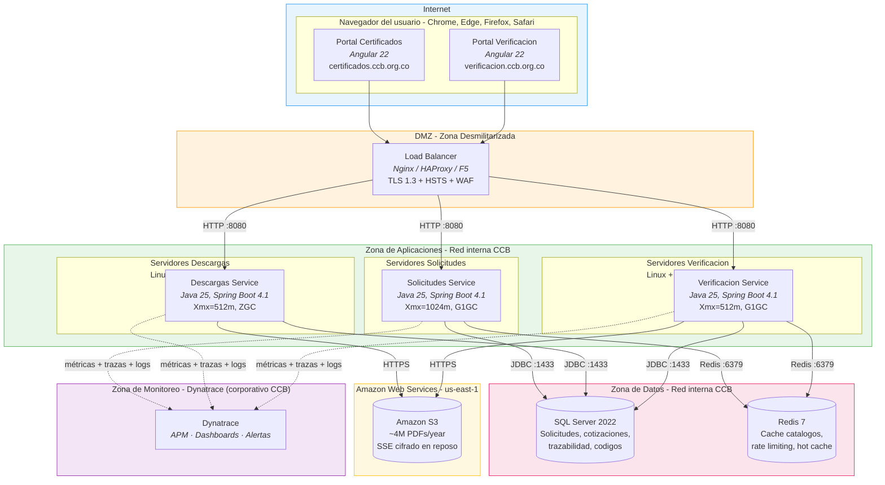


---


## 15. Stack Tecnológico


### 15.1 Backend


| Capa              | Tecnología                                   | Versión   | Justificación                                                                               |
| ----------------- | -------------------------------------------- | --------- | ------------------------------------------------------------------------------------------- |
| Runtime           | Java (Eclipse Temurin)                       | 25 LTS    | Soporte hasta sep. 2033, Virtual Threads, records, pattern matching, Structured Concurrency |
| Framework         | Spring Boot                                  | 4.1.x     | Ecosistema maduro, Spring Framework 7.x, Spring Security, integración CXF                   |
| Arquitectura      | Clean Architecture + CQRS                    | -         | Dominio puro sin dependencias de framework                                                  |
| Web               | Spring MVC (Servlet)                         | 7.x       | Mayor familiaridad del equipo, buen rendimiento                                             |
| Validación        | Jakarta Validation (Hibernate Validator)     | 3.x       | Estándar Jakarta EE                                                                         |
| Acceso a datos    | Spring JDBC + NamedParameterJdbcTemplate     | Built-in  | Control total sobre SQL, alto rendimiento, sin overhead ORM                                 |
| Migraciones BD    | Liquibase                                    | 4.x       | Migraciones versionadas y auditables                                                        |
| Autenticación     | Spring Security + OAuth2 Resource Server     | 7.x       | JWT MAUC nativo                                                                             |
| Clientes SOAP     | Apache CXF (JAX-WS) + wsdl2java              | 4.x       | Cliente SOAP más maduro en Java, genera clientes tipados                                    |
| Clientes HTTP     | Spring RestClient (blocking)                 | Built-in  | Cliente HTTP declarativo                                                                    |
| Storage           | AWS SDK for Java v2 (S3)                     | 2.x       | Acceso a S3 desde Java                                                                      |
| Cache             | Spring Cache + Redis (Lettuce)               | Built-in  | Cache distribuido para catálogos                                                            |
| Rate limiting     | Bucket4j + Redis                             | 8.x       | Protección del endpoint público de verificación                                             |
| Logging           | SLF4J + Logback (JSON)                       | 2.x / 1.x | Logs estructurados con MDC, ingestión automática vía Dynatrace OneAgent                     |
| Observabilidad    | Micrometer + OpenTelemetry + Dynatrace Agent | 1.x       | Métricas, traces y logs enviados a Dynatrace (plataforma corporativa CCB)                   |
| Documentación API | SpringDoc OpenAPI (Swagger UI)               | 2.x       | OpenAPI 3.0 auto-generado                                                                   |
| Tests             | JUnit 5 + Mockito + AssertJ + Testcontainers | Latest    | Pirámide de tests completa                                                                  |
| Build             | Gradle (Kotlin DSL)                          | 9.x       | Build cache, multi-módulo eficiente, soporte nativo Java 25                                 |


### 15.2 Frontend (2 aplicaciones Angular)


| Capa        | Tecnología                         | Versión     |
| ----------- | ---------------------------------- | ----------- |
| Framework   | Angular                            | 22 (Active) |
| Build       | Angular CLI (esbuild)              | 22.x        |
| UI          | Tailwind CSS                       | 4.x         |
| Componentes | PrimeNG o Angular Material         | Latest      |
| State       | Angular Signals + NgRx SignalStore | Built-in    |
| HTTP        | HttpClient + interceptors          | Built-in    |
| PDF viewer  | pdf.js                             | 4.x         |


| Aplicación              | Dominio                   | Autenticación          | Alcance                                                    |
| ----------------------- | ------------------------- | ---------------------- | ---------------------------------------------------------- |
| **Portal Certificados** | `certificados.ccb.org.co` | JWT MAUC (obligatorio) | Búsqueda, carrito, liquidación, pago, historial, descargas |
| **Portal Verificación** | `verificacion.ccb.org.co` | Ninguna (público)      | Verificación de código, visor PDF, registro                |


### 15.3 Infraestructura


| Componente               | Tecnología                              |
| ------------------------ | --------------------------------------- |
| Servidor de aplicaciones | Embedded Tomcat (Spring Boot)           |
| Despliegue               | Docker + Docker Compose                 |
| Load Balancer            | Nginx / HAProxy / F5 / ALB              |
| Base de datos            | SQL Server 2022 (driver `mssql-jdbc`)   |
| Cache                    | Redis 7                                 |
| Storage                  | Amazon S3                               |
| Secrets                  | HashiCorp Vault o AWS Secrets Manager   |
| CI/CD                    | Jenkins / GitHub Actions / Azure DevOps |
| IaC                      | Terraform o Ansible                     |
| Observabilidad           | Dynatrace (APM corporativo CCB)         |
| Logs centralizados       | Dynatrace Log Management (vía OneAgent) |


---


## 16. Estructura del Proyecto


### 16.1 Multi-módulo Gradle

```
certificados-electronicos/
├── build.gradle.kts                        ← Root build (plugins, versions catalog)
├── settings.gradle.kts                     ← Incluye todos los módulos
├── gradle/
│   └── libs.versions.toml                  ← Version catalog centralizado
│
├── solicitudes/
│   ├── solicitudes-api/                    ← Spring Boot app, controllers, config
│   ├── solicitudes-application/            ← Use cases, commands, queries, ports
│   ├── solicitudes-domain/                 ← Entidades, value objects, reglas de negocio
│   └── solicitudes-infrastructure/         ← Repos JDBC, SOAP clients (CXF), S3, email
│
├── descargas/
│   ├── descargas-api/                      ← Spring Boot app, controllers
│   ├── descargas-application/              ← Use cases, ports
│   └── descargas-infrastructure/           ← Repos JDBC, S3 service
│
├── verificacion/
│   ├── verificacion-api/                   ← Spring Boot app, controllers
│   ├── verificacion-application/           ← Use cases, ports
│   └── verificacion-infrastructure/        ← Repos JDBC, S3, rate limiting
│
├── shared/
│   ├── shared-kernel/                      ← Result, DomainException, Entity base
│   ├── shared-auth/                        ← JWT filter, SecurityConfig (MAUC)
│   └── shared-contracts/                   ← DTOs compartidos, interfaces S3
│
├── frontend/
│   ├── portal-certificados/                ← Angular 22 (solicitudes + descargas)
│   └── portal-verificacion/                ← Angular 22 (público, sin auth)
│
└── deploy/
    ├── docker/                             ← Dockerfiles + docker-compose.yml
    └── scripts/                            ← Scripts de despliegue
```


### 16.2 Dependencias entre módulos (Clean Architecture)

```
solicitudes-api  →  solicitudes-application  →  solicitudes-domain  (Java puro, sin framework)
                                             →  shared-kernel
                 →  solicitudes-infrastructure →  solicitudes-domain
                                              →  shared-contracts
                 →  shared-auth
```

El módulo `domain` no tiene dependencias externas (solo Java puro). La capa de infraestructura implementa los ports (interfaces) definidos en la capa de aplicación (inversión de dependencias).

---


## 17. Distribución de Endpoints (API REST)


### 17.1 Solicitudes Service


| Método | Ruta                                           | Función                                     |
| ------ | ---------------------------------------------- | ------------------------------------------- |
| POST   | `/api/v1/auth/token-mauc`                      | Validar sesión MAUC                         |
| GET    | `/api/v1/inscritos`                            | Buscar inscritos (matrícula, NIT, nombre)   |
| GET    | `/api/v1/inscritos/{matricula}/principal`      | Matrícula principal (SHD)                   |
| GET    | `/api/v1/inscritos/{matricula}/certificados`   | Tipos de certificado disponibles            |
| POST   | `/api/v1/liquidaciones`                        | Liquidar solicitud estándar                 |
| POST   | `/api/v1/liquidaciones/depositos`              | Liquidar depósitos financieros              |
| POST   | `/api/v1/liquidaciones/especiales`             | Liquidar certificados especiales            |
| POST   | `/api/v1/liquidaciones/afiliados`              | Liquidar con beneficio de afiliación        |
| PUT    | `/api/v1/solicitudes/{id}/estado`              | Notificar certificado generado (backoffice) |
| PUT    | `/api/v1/solicitudes/{id}/devolucion`          | Devolver solicitud (backoffice)             |
| GET    | `/api/v1/catalogos/{tipo}`                     | Catálogos (cacheable)                       |
| GET    | `/api/v1/afiliados/saldo`                      | Saldo de afiliación                         |
| GET    | `/api/v1/afiliados/kardex`                     | Kardex mercantil                            |
| GET    | `/api/v1/afiliados/representantes/{matricula}` | Representantes legales                      |


### 17.2 Descargas Service


| Método | Ruta                                   | Función                          |
| ------ | -------------------------------------- | -------------------------------- |
| GET    | `/api/v1/certificados`                 | Listar certificados descargables |
| GET    | `/api/v1/certificados/{id}/archivo`    | Stream descarga directa S3       |
| GET    | `/api/v1/certificados/{id}/url`        | URL pre-firmada S3 (15 min)      |
| GET    | `/api/v1/certificados/{codigo}/base64` | PDF en Base64                    |


### 17.3 Verificación Service (público)


| Método | Ruta                                        | Función                             |
| ------ | ------------------------------------------- | ----------------------------------- |
| GET    | `/api/v1/verificaciones/{codigo}`           | Validar código de verificación      |
| GET    | `/api/v1/verificaciones/{codigo}/documento` | PDF en Base64 para visor pdf.js     |
| POST   | `/api/v1/verificaciones/{codigo}/registros` | Registrar verificación (IP + fecha) |


---


## 18. Seguridad


### 18.1 Capas de protección


| Capa              | Mecanismo                  | Implementación                                    |
| ----------------- | -------------------------- | ------------------------------------------------- |
| Perímetro         | WAF                        | AWS WAF o ModSecurity en Nginx                    |
| Transporte        | TLS 1.3 + HSTS             | Terminación SSL en Load Balancer                  |
| Rate limiting     | Bucket4j + Redis           | 100 req/s por IP (verificación pública)           |
| Autenticación     | OAuth2 Resource Server     | JWT MAUC validado por Spring Security             |
| Autorización      | Claims-based               | `@PreAuthorize` con claims de MAUC                |
| Validación        | Jakarta Validation         | `@Valid`, `@NotNull`, `@Size` en DTOs             |
| Secrets           | Vault / Secrets Manager    | Credenciales inyectadas como variables de entorno |
| Cifrado en reposo | TDE + SSE                  | SQL Server TDE + S3 Server-Side Encryption        |
| Red               | VPC + Security Groups      | Aislamiento de servicios por zona de red          |
| Auditoría         | MDC + logging estructurado | Correlation ID propagado en cada request          |
| CORS              | Whitelist                  | Solo dominios `*.ccb.org.co`                      |


### 18.2 Configuración Spring Security

La verificación pública (`/api/v1/verificaciones/**`) no requiere autenticación. Todos los demás endpoints requieren JWT MAUC válido. El servicio de backoffice usa credenciales de servicio dedicadas.

---


## 19. Observabilidad y Despliegue


### 19.1 Observabilidad


| Aspecto             | Herramienta                                  | Detalle                                                                                          |
| ------------------- | -------------------------------------------- | ------------------------------------------------------------------------------------------------ |
| Logs estructurados  | Logback (JSON) + Dynatrace OneAgent          | Correlation ID vía MDC, ingestión automática en Dynatrace Log Management                         |
| Métricas            | Micrometer + `micrometer-registry-dynatrace` | Métricas de negocio personalizadas exportadas directamente a Dynatrace                           |
| Trazas distribuidas | OpenTelemetry + Dynatrace OneAgent           | Trazabilidad end-to-end entre microservicios y dependencias externas (PUP, SAP)                  |
| Dashboards          | Dynatrace Dashboards                         | Latencia PUP, throughput, errores 5xx, tasa de verificaciones — autodiscovery                    |
| Health checks       | Spring Boot Actuator                         | `/health` (liveness), `/health/readiness` (BD + Redis + S3), monitoreado por Dynatrace Synthetic |
| Alertas SLO         | Dynatrace Davis AI Alerting                  | SLO violations: latencia P95, error rate, disponibilidad — con root cause automático             |


### 19.2 Escalado por servicio


| Servicio     | Instancias min | Instancias max | Trigger de escalado         | JVM Heap | GC   |
| ------------ | -------------- | -------------- | --------------------------- | -------- | ---- |
| Solicitudes  | 2              | 8              | CPU > 65% o P95 > 800ms     | 1024m    | G1GC |
| Descargas    | 2              | 6              | Requests concurrentes > 200 | 512m     | ZGC  |
| Verificación | 2              | 6              | Requests/seg > 50           | 512m     | G1GC |


### 19.3 Despliegue con Docker

El sistema se despliega mediante **Docker Compose** con réplicas por servicio. Cada microservicio cuenta con su propio `Dockerfile` y el orquestador define las réplicas, variables de entorno y red interna.


| Mecanismo                            | Notas                                                                    |
| ------------------------------------ | ------------------------------------------------------------------------ |
| Docker Compose con `deploy.replicas` | Réplicas configurables por servicio, red interna, variables por ambiente |


---


## 20. Plan de Migración


| Fase                        | Duración      | Alcance                                                                                                     |
| --------------------------- | ------------- | ----------------------------------------------------------------------------------------------------------- |
| **0 — Fundación**           | 4-6 semanas   | Proyecto multi-módulo Gradle, CI/CD, estructura Clean Architecture, generación de clientes SOAP desde WSDLs |
| **1 — Verificación**        | 6-8 semanas   | Servicio Verificación completo (menor riesgo, alto impacto visible)                                         |
| **2 — Descargas**           | 4-6 semanas   | Servicio Descargas con S3, consolidar MySQL → SQL Server                                                    |
| **3 — Solicitudes core**    | 10-12 semanas | Flujo principal: búsqueda → liquidación ? pago (integración SOAP PUP)                                       |
| **4 — Módulos especiales**  | 6-8 semanas   | Depósitos, afiliados, costumbres, especiales                                                                |
| **5 — Frontend Angular 22** | 8-10 semanas  | 2 SPAs: Portal Certificados + Portal Verificación (en paralelo desde Fase 1)                                |
| **6 — Hardening**           | 4-6 semanas   | Load testing (Gatling/k6), penetration testing, cutover                                                     |


**Duración total estimada: 9-11 meses** con un equipo de 4-5 desarrolladores Java.

---


## 21. Historial de Versiones


| Versión | Fecha      | Autor                    | Cambios                                                                                                                                                                                                                                                           |
| ------- | ---------- | ------------------------ | ----------------------------------------------------------------------------------------------------------------------------------------------------------------------------------------------------------------------------------------------------------------- |
| 1.0     | Junio 2026 | [Product Manager]        | Versión inicial del PRD basada en análisis del sistema existente                                                                                                                                                                                                  |
| 2.0     | Junio 2026 | [Arquitecto de Software] | Incorporación de arquitectura técnica Java/Spring Boot, diagramas C4 en Mermaid (Contexto, Contenedores, Componentes × 3 servicios, Despliegue), stack tecnológico, estructura del proyecto, distribución de endpoints, modelo de datos, ADRs y plan de migración |
| 2.1     | Junio 2026 | [Arquitecto de Software] | Actualización del stack: Java 25 LTS, Spring Boot 4.1.x, Spring Framework 7.x, Gradle 9.x, Flyway 12.x                                                                                                                                                            |
| 2.2     | Junio 2026 | [Arquitecto de Software] | Reemplazo de Flyway por Liquibase 4.x como herramienta de migraciones de base de datos, alineando con el estándar de la CCB                                                                                                                                       |
| 2.3     | Junio 2026 | [Product Manager]        | Nueva regla de negocio RN-16: la consulta del historial de órdenes devuelve únicamente el último año calendario (365 días) para prevenir bloqueos por volumen excesivo. Actualización de RF-21 y adición de RF-37 en el módulo de Descargas.                      |


