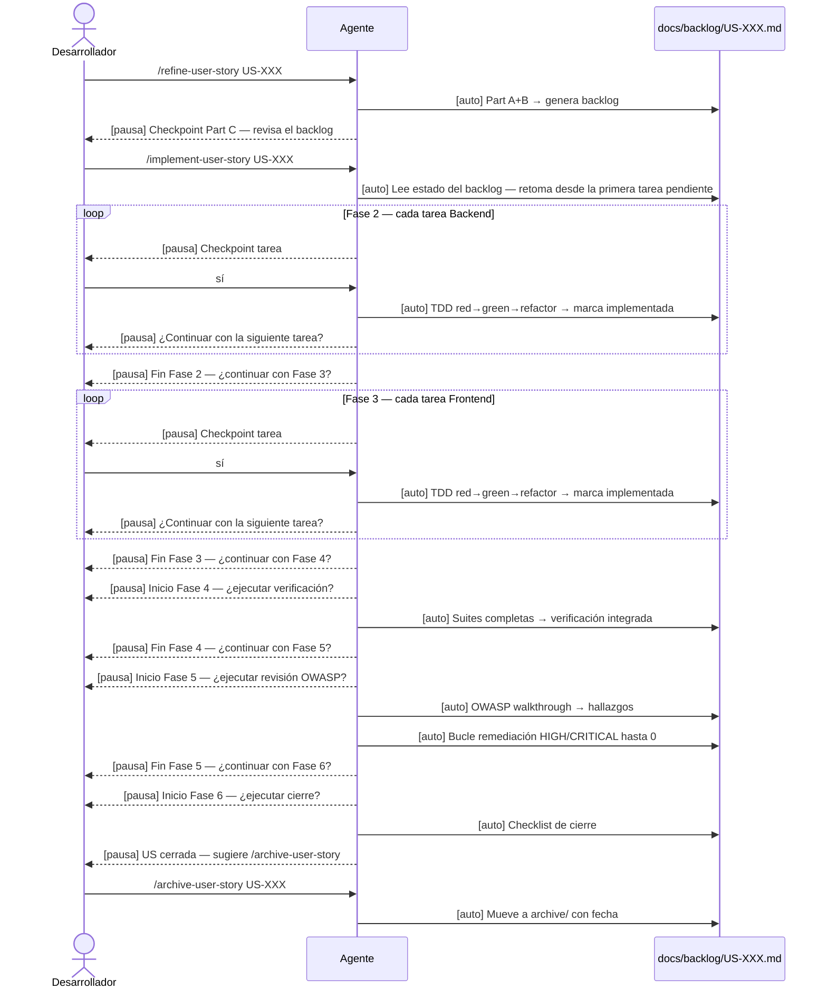

# Specification-Driven Development (SDD) — Workflow de RunMarket

## Qué es SDD

SDD es el proceso de trabajo AI-asistido de RunMarket para implementar user stories de forma reproducible. Combina tres disciplinas en un flujo ordenado:

- **Refinamiento** — convertir una US en un backlog técnico preciso antes de escribir código.
- **TDD** — toda implementación sigue el ciclo red → green → refactor. Obligatorio en fases 2, 3 y fixes de seguridad.
- **Revisión OWASP** — ninguna US se cierra sin pasar el Top 10. Los hallazgos HIGH/CRITICAL se corrigen y se re-revisan hasta quedar limpios.

---

## Convención de lectura de este documento

| Etiqueta | Significado |
|---|---|
| **[tú]** | Acción manual: escribes un comando o respondes a una pregunta |
| **[auto]** | El agente trabaja sin intervención tuya |
| **[pausa]** | El agente se detiene y espera tu respuesta antes de continuar |

---

## Artefactos del sistema

```
docs/USER-STORIES.md               ← fuente de producto (no se modifica nunca)
docs/backlog/US-XXX.md             ← backlog técnico activo (generado en fase 1)
docs/backlog/archive/US-XXX.md     ← backlog archivado tras el cierre

.claude/agents/                    ← roles: product-owner, backend-developer,
                                      frontend-developer, security
.claude/skills/                    ← comportamiento de cada paso del workflow
  conventional-commit/SKILL.md    ← formato de commits (Conventional Commits)
.claude/commands/                  ← los comandos que tú invocas
.githooks/commit-msg               ← hook git que valida el formato de commit
                                      (activado con: git config core.hooksPath .githooks)
```

---

## Comportamiento de `/implement-user-story`

El comando tiene un único comportamiento, sin modos:

- Si `docs/backlog/US-XXX.md` **no existe** → ejecuta la fase 1 (refine) y hace una pausa.
- Si `docs/backlog/US-XXX.md` **existe** → lee el estado del backlog y retoma desde la primera fase o tarea pendiente.
- **Siempre pausa entre fases** antes de continuar a la siguiente.
- **Siempre hace checkpoint antes de cada tarea** en fases 2-3. Ninguna tarea se implementa sin tu confirmación explícita.

---

## Flujo estándar (2 comandos)

```
/refine-user-story US-XXX    ← genera el backlog y para
/implement-user-story US-XXX ← implementa fase a fase desde el backlog
```

Si interrumpes el workflow a la mitad, el mismo segundo comando retoma donde lo dejaste:

```
/implement-user-story US-XXX ← retoma desde la primera tarea/fase pendiente
```

---

## Fase 1 — Refinamiento

### **[tú]** Ejecutas

```
/refine-user-story US-XXX
```

### **[auto]** El agente `product-owner` trabaja sin intervención

1. Lee `docs/USER-STORIES.md` (bloque de la US solicitada).
2. Cruza con `docs/PRD.md`, `docs/ARCHITECTURE.md`, `docs/DATA-MODEL.md` y las reglas de seguridad de `CLAUDE.md`.
3. **Part A** — Resuelve ambigüedades e identifica el contrato técnico:
   - US con backend: contrato de API (método, ruta, request/response, códigos de error, consideraciones OWASP).
   - US solo frontend: contrato de componente (ruta, props/estado, endpoint existente consumido, estados UX).
   - US full-stack: ambos contratos.
4. **Part B** — Genera la tabla de tareas con IDs (`US-XXX-TASK-NN`), capa (`Backend` | `Frontend`), dependencias y test concreto en la columna `Verificacion`. Genera el detalle de cada tarea con criterios de done y los tests TDD.
5. Escribe `docs/backlog/US-XXX.md` con: estado del workflow, US refinada, tabla de tareas, detalle por tarea, sección de verificación integrada y sección de seguridad OWASP vacía.

### **[pausa]** Checkpoint Part C

El agente muestra el resumen del backlog y se detiene:

```
## Backlog generado — US-XXX
Tareas: N (Backend: x · Frontend: y)
Criterios de aceptación cubiertos: A/B
Bloqueos: ninguno
Siguiente: /implement-user-story US-XXX
```

> Este es el momento para revisar y corregir `docs/backlog/US-XXX.md` antes de implementar.

---

## Fase 2 — Backend (TDD obligatorio)

### **[tú]** Ejecutas

```
/implement-user-story US-XXX
```

### **[auto]** El agente lee el backlog, marca Fase 1 completada y activa `backend-developer`

### **[pausa]** Checkpoint antes de cada tarea Backend

```
## Checkpoint — Tarea US-XXX-TASK-01
Capa: Backend
Tarea: GET /api/products (controller + ruta)
Tests previstos: Supertest GET /api/products → 200 + schema
¿Implementar? sí | no | saltar | revisar
```

Respuestas posibles:

| Respuesta | Efecto |
|---|---|
| `sí` | El agente implementa la tarea con TDD |
| `no` | El agente para. La tarea queda sin implementar |
| `saltar` | La tarea queda sin implementar; avanza a la siguiente |
| `revisar` | Muestra el detalle completo de la tarea y vuelve a preguntar |

### **[auto]** Tras responder `sí`

1. Verifica que las dependencias (`Depende de`) están implementadas; si no, para y reporta.
2. **Red** — escribe el test nombrado en `Verificacion`. Lo ejecuta y confirma que falla.
3. **Green** — código mínimo para pasar, respetando `Controller → Service → Repository → Prisma`.
4. **Refactor** — mejora nombres y estructura con la suite en verde.
5. Ejecuta la suite completa; pega el resultado en "Verificación ejecutada" de la tarea.
6. Aplica el checklist de `code-review` (capas, seguridad, tests).
7. Marca `- [x] Implementado` en el backlog.

### **[pausa]** Tras cada tarea

```
Tarea US-XXX-TASK-01 implementada. ¿Continuar con la siguiente tarea?
```

### **[pausa]** Fin de Fase 2

```
Fase 2 completada. Backend tasks: N/N implementadas. Suite verde.
¿Continuar con Fase 3 (Frontend)?
```

---

## Fase 3 — Frontend (TDD obligatorio)

### **[auto]** El agente activa `frontend-developer`

El comportamiento es idéntico al de Fase 2, con estas particularidades:

- El test en `Verificacion` es RTL o Playwright.
- Cada componente cubre los tres estados UX: **loading**, **empty**, **error** (no bloqueante) además del happy path.
- Reglas de seguridad de cliente: sin datos de tarjeta en estado/localStorage, sin `dangerouslySetInnerHTML`, params de URL validados contra enums de dominio.

### **[pausa]** Checkpoint antes de cada tarea Frontend — mismo formato que en Fase 2

### **[auto]** Tras responder `sí` — ciclo TDD idéntico a Fase 2

### **[pausa]** Tras cada tarea y al final de Fase 3

```
Fase 3 completada. Frontend tasks: N/N implementadas. Suite verde.
¿Continuar con Fase 4 (Verificación)?
```

---

## Fase 4 — Verificación

### **[pausa]** El agente pregunta antes de arrancar

### **[auto]** El agente ejecuta las suites completas

- Suite backend (Jest + Supertest).
- Suite frontend (Vitest + RTL).
- E2E con Playwright si la US tiene tareas de ese tipo.
- Pega los resultados en "Verificación integrada" del backlog.
- Si algún test falla: **para y reporta** antes de continuar. No avanza a Fase 5 con tests en rojo.

### **[pausa]** Fin de Fase 4

```
Fase 4 completada. Suites en verde.
¿Continuar con Fase 5 (Seguridad)?
```

---

## Fase 5 — Revisión de seguridad OWASP

### **[pausa]** El agente pregunta antes de arrancar

### **[auto]** El agente `security` ejecuta la revisión OWASP Top 10

Revisa los cambios de la US frente a:

1. Control de acceso / IDOR sobre `sessionId`
2. Injection (Prisma tagged templates, Zod strict)
3. XSS (sin `dangerouslySetInnerHTML`, params validados)
4. CSRF y postura CORS
5. Configuración segura (sin wildcard en producción, rate limiting)
6. Exposición de secretos (sin datos de tarjeta en cliente)
7. Logging (sin PII, cuerpo de checkout excluido de Morgan)
8. Dependencias (`npm audit`)
9. Integridad de reglas de negocio (precio server-side, stock en transacción)

Registra cada hallazgo en "Seguridad OWASP" del backlog:

```
| ID     | Severidad | Componente | Vector / Exploit | Fix | Estado  |
|--------|-----------|------------|------------------|-----|---------|
| SEC-01 | HIGH      | ...        | ...              | ... | abierto |
```

### **[auto]** Bucle de remediación — se repite hasta cero HIGH/CRITICAL

1. Escribe un test de regresión que reproduce el problema (TDD).
2. Aplica el fix mínimo; test pasa.
3. Re-ejecuta la revisión OWASP sobre los cambios.
4. Actualiza el estado del hallazgo en el backlog (`corregido`).
5. Si quedan HIGH/CRITICAL abiertos, repite desde el paso 1.

Cuando no hay HIGH/CRITICAL abiertos, marca `Revisión de seguridad aprobada` en el backlog.

### **[pausa]** Fin de Fase 5

```
Fase 5 completada. 0 HIGH/CRITICAL abiertos. Revisión de seguridad aprobada.
¿Continuar con Fase 6 (Cierre)?
```

---

## Fase 6 — Cierre

### **[pausa]** El agente pregunta antes de arrancar

### **[auto]** El agente verifica el checklist de cierre

```
## Cierre — US-XXX
- [ ] Todas las tareas del backlog marcadas implementadas
- [ ] Cada criterio de aceptación mapeado y verificado
- [ ] Suite completa en verde (backend + frontend, E2E si aplica)
- [ ] Revisión clean-architecture pasada
- [ ] Revisión de seguridad aprobada (sin HIGH/CRITICAL abiertos)
- [ ] Reglas de seguridad de CLAUDE.md verificadas
- [ ] Estado del workflow: fases 1-5 marcadas
- [ ] Sin scope fuera de la US
```

Si algún ítem falla, el agente lo reporta y bloquea el cierre hasta resolverlo.

Cuando todos los ítems están marcados, el agente sugiere:

```
US-XXX cerrada. Para archivar: /archive-user-story US-XXX
```

---

## Archivar (opcional, tras Fase 6)

### **[tú]** Ejecutas

```
/archive-user-story US-XXX
```

### **[auto]** El agente comprueba el estado del workflow

Si alguna fase no está cerrada:

### **[pausa]**

```
⚠️ US-XXX no está cerrada (fase N pendiente). ¿Archivar igualmente? sí | no
```

### **[auto]** Si el workflow está cerrado (o confirmas con `sí`)

1. Añade la cabecera `> Archivado: YYYY-MM-DD` al fichero.
2. Mueve `docs/backlog/US-XXX.md` → `docs/backlog/archive/US-XXX.md` (con `git mv`).
3. No modifica `docs/USER-STORIES.md`.
4. Reporta la ruta final y la fecha de archivo.

---

## Resumen visual del flujo



---

## Flujo alternativo: una sola tarea

Cuando necesitas implementar una tarea concreta sin recorrer el flujo completo:

### **[tú]** Ejecutas

```
/implement-task US-XXX US-XXX-TASK-NN
```

### **[pausa]** Checkpoint — mismo formato que en fases 2-3

### **[auto]** Tras `sí` — ciclo TDD completo, marca la tarea, para

No avanza a otras tareas.

---

## Scope modifiers

Ejecutan una única fase del workflow y paran:

```
/implement-user-story US-XXX backend-only    ← solo fase 2
/implement-user-story US-XXX frontend-only   ← solo fase 3
/implement-user-story US-XXX security-only   ← solo fase 5

```

---

## Referencia de comandos

| Comando | Cuándo lo ejecutas | Qué hace automáticamente | Dónde para |
|---|---|---|---|
| `/refine-user-story US-XXX` | Al iniciar una US nueva | Genera `docs/backlog/US-XXX.md` completo | Checkpoint Part C |
| `/implement-user-story US-XXX` | Tras revisar el backlog (o para retomar) | Lee estado del backlog; fases 2-6 con TDD y OWASP | Pausa entre cada fase y antes de cada tarea |
| `/implement-user-story US-XXX <scope>` | Para ejecutar solo una fase | La fase indicada | Al terminar esa fase |
| `/implement-task US-XXX US-XXX-TASK-NN` | Para una tarea concreta | Checkpoint → TDD → marca implementada | Tras marcar la tarea |
| `/archive-user-story US-XXX` | Tras cerrar Fase 6 | Mueve backlog a `archive/` con fecha | — (o pausa si workflow incompleto) |
