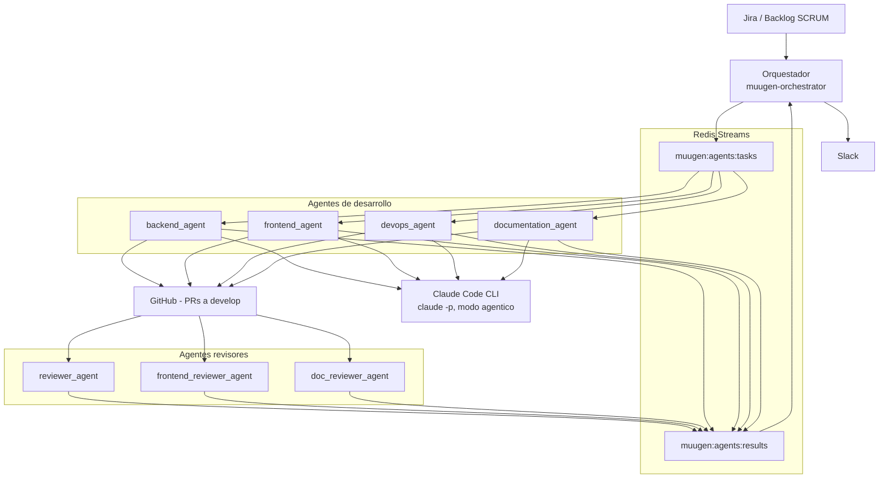

# Sistema multi-agente de desarrollo (Multi-Agent-AI-Ecosystem)

> Este documento describe la herramienta con la que se **construyó** Muugen: un ecosistema de agentes de IA que ejecutó los tickets del backlog de forma semi-autónoma. No forma parte del producto Muugen.
>
> - **Código del sistema:** https://github.com/Jonnhyx/Multi-Agent-AI-Ecosystem *(privado; acceso facilitado al evaluador)*
> - **Producto desarrollado:** https://github.com/Jonnhyx/muugen
> - **Resumen ejecutivo:** ver el [anexo del readme](../readme.md#anexo-metodología-de-desarrollo-asistido-por-ia)

---

## 1. Motivación

El proyecto tenía un backlog de 27 tickets con una estructura deliberadamente exhaustiva (user story, criterios de aceptación con happy path y edge cases, dependencias). Esa exhaustividad tenía un doble propósito: servir de especificación para humanos **y de prompt para máquinas**. La hipótesis del proyecto era que un ticket suficientemente bien escrito puede ser ejecutado por un agente de IA de principio a fin — implementación, tests y Pull Request — reservando el criterio humano para el diseño, el diagnóstico y la calidad.

El sistema se diseñó con IA (el prompt de diseño está en [`prompts.md`, sección 8](../prompts.md#8-sistema-multi-agente-de-desarrollo)) y se desplegó en un servidor de desarrollo dedicado, separado del servidor del producto.

## 2. Arquitectura

### 2.1. Componentes

| Componente | Implementación | Función |
|---|---|---|
| **Orquestador** | Servicio Python (systemd: `muugen-orchestrator`) | Lee tickets del backlog (Jira), publica tareas, consume resultados, actualiza estados y notifica |
| **Agentes de desarrollo** (4) | `backend_agent`, `frontend_agent`, `devops_agent`, `documentation_agent` — instancias systemd (`muugen-agent@{rol}`) | Ejecutan tickets de su especialidad: implementan, testean y abren PR |
| **Agentes revisores** (3) | `reviewer_agent`, `frontend_reviewer_agent`, `doc_reviewer_agent` | Revisan los PRs abiertos por los agentes de desarrollo y aprueban o solicitan cambios |
| **Cola de mensajes** | Redis Streams: `muugen:agents:tasks` y `muugen:agents:results`, con consumer groups por agente | Canal de comunicación desacoplado orquestador ↔ agentes |
| **Motor de implementación** | Claude Code CLI (`claude -p`) en modo agéntico, con presupuesto de turnos y timeout | El agente delega la escritura de código al LLM dentro de un workspace controlado |
| **Integraciones** | Jira (tickets SCRUM), GitHub (PRs contra `develop`), Slack (notificaciones) | Trazabilidad y observabilidad del flujo |

### 2.2. Diagrama

### 2.3. Decisiones de diseño relevantes

- **Redis Streams (no una cola simple):** los consumer groups permiten que cada tipo de agente consuma su trabajo sin perder mensajes, con visibilidad del lag y de los mensajes pendientes por consumidor. Lección operativa: la longitud del stream no refleja el consumo; hay que mirar los grupos.
- **Workspaces efímeros:** cada tarea clona el repositorio en un workspace aislado que se destruye al terminar. Ventaja: sin contaminación entre tareas. Coste: el paquete Python no está instalado en modo editable por defecto, lo que produce errores de colección de tests engañosos si se ejecuta la suite "a pelo" (ver §4.1).
- **El ticket es el prompt:** los agentes no reciben instrucciones ad-hoc; reciben el ticket íntegro (estructura de 10 puntos) más las convenciones del repositorio. La calidad del backlog determina la calidad de la implementación.
- **Separación implementador/revisor:** el agente que implementa nunca aprueba su propio PR. Los revisores clonan el PR de cero y lo evalúan con un prompt de revisión con veredicto.
- **Auto-corrección acotada:** si los tests fallan tras la implementación, el agente entra en un modo de corrección con presupuesto limitado (turnos y timeout) y dos prohibiciones explícitas en el prompt: no hacer commits (el commit lo hace el agente tras verificar) y no modificar tests para hacerlos pasar cuando lo roto es el código.

## 3. Flujo de ejecución de un ticket

1. **Encolado.** El orquestador toma un ticket (p. ej. SCRUM-31) y publica una tarea en `muugen:agents:tasks` con el contenido completo del ticket.
2. **Implementación.** El agente del rol correspondiente reclama la tarea, crea el workspace efímero, e invoca Claude Code CLI en modo agéntico con el ticket como prompt. El LLM implementa el código y sus tests dentro del workspace.
3. **Verificación.** El agente ejecuta la suite completa (`make test`, con umbral de cobertura). Si hay fallos, entra la fase de auto-corrección acotada.
4. **Pull Request.** Con la suite en verde (o superando el umbral de aprobación parcial configurado), el agente commitea en una rama `feat/SCRUM-NN-...` y abre un PR contra `develop`, trazable al ticket.
5. **Revisión.** El agente revisor clona el PR, extrae los ficheros cambiados, y solicita a Claude una revisión estructurada con veredicto: aprobar o solicitar cambios. La documentación derivada del ticket va en un PR separado con su propio revisor.
6. **Cierre.** El resultado (éxito/fallo, URL del PR) vuelve por `muugen:agents:results`; el orquestador actualiza el estado y notifica por Slack.

Resultado global: **más de 50 Pull Requests** del repositorio de Muugen fueron abiertos por este sistema, cada uno trazable a su ticket SCRUM.

## 4. Fallos reales e intervenciones humanas

Esta sección es deliberadamente honesta: documenta dónde el sistema **no** bastó y qué aportó el criterio humano. Estos casos son la evidencia del equilibrio autonomía/supervisión que defiende el proyecto.

### 4.1. La fase de auto-corrección se agota en tickets con muchos tests (SCRUM-30, SCRUM-31)

**Síntoma:** en dos tickets pesados (logging estructurado y validación local), el agente implementó el código correctamente pero la fase de auto-corrección de tests moría por timeout, marcando la tarea como fallida.

**Diagnóstico humano:** al reproducir manualmente en el workspace aparecieron dos capas de problema. Primero, sin instalar el paquete en modo editable (`pip install -e .`), la suite producía errores de *colección* engañosos que enmascaraban los fallos reales. Una vez instalado, los fallos reales resultaron ser **de los tests, no del código de producción**:

- En SCRUM-30, el fixture de tests usaba un transporte HTTP que no dispara el ciclo de vida de la aplicación, por lo que la configuración de logging nunca se inicializaba en el entorno de test; y al pipeline de logging le faltaba un adaptador para que los campos `extra` del logging estándar llegaran al formateador estructurado (este sí, un fix de producción de una línea).
- En SCRUM-31, tres tests del runner ejercitaban el validador real con un mock del LLM sin `return_value` configurado (un `AsyncMock` que devolvía mocks en lugar de strings), y dos asserts comparaban con igualdad estricta un YAML que legítimamente termina en salto de línea.

**Resolución:** parches quirúrgicos a los tests (no al código de producción), cada uno validado en un sandbox aislado antes de aplicarse (compilación + verificación de que el reemplazo casa exactamente una vez), commit manual documentando el diagnóstico para el revisor, y push a la rama del agente. Suite final: 520 tests en verde, cobertura 85,7 %.

**Lección:** para tickets con suites grandes, la fase de tests debe asumir intervención humana. El patrón fiable es: instalar el paquete en el workspace → diagnóstico de causa raíz test a test → parche mínimo validado en sandbox → push manual.

### 4.2. El detector de rate-limit no reconocía todas las variantes del mensaje

**Síntoma:** una tarea de documentación murió como fallo permanente cuando el CLI devolvió "You've hit your session limit". El detector de rate-limit solo reconocía la variante "hit your limit", por lo que clasificó como irrecuperable un error que era recuperable (bastaba esperar al reset de la sesión).

**Resolución:** ampliar los patrones de detección para cubrir las variantes del mensaje ("session limit", etc.), de modo que estas condiciones se traten como recuperables.

**Lección:** la detección de errores por coincidencia de substrings es frágil ante variantes de redacción del proveedor; los patrones deben cubrir la familia completa de mensajes, y las condiciones de entorno (límites de uso, autenticación) deben distinguirse de los fallos de código.

### 4.3. Sesión del CLI caducada a mitad de revisión

**Síntoma:** el agente revisor clonó el PR, preparó el prompt de revisión e invocó el CLI, que respondió "Not logged in · Please run /login". La tarea se marcó como fallida aunque el PR era correcto — la sesión de Claude Code había caducado.

**Resolución:** re-autenticación manual del CLI en el servidor y relanzamiento de la revisión.

**Lección:** la autenticación interactiva del CLI es el eslabón operativo más frágil de un sistema desatendido. Es también uno de los motivos por los que el producto Muugen usa la API (con clave de empresa) en producción y confina el CLI al entorno de desarrollo supervisado.

### 4.4. Un PR de 101 ficheros excede lo revisable automáticamente

**Síntoma:** el PR de estabilización del MVP (#54, 101 ficheros) agotaba el presupuesto de turnos del agente revisor ("Reached max turns"), incluso tras re-autenticar.

**Resolución:** se amplió provisionalmente el presupuesto de turnos del revisor y, sobre todo, la integración se validó con revisión humana. La promoción final a `main` (#56) se hizo tras validar el flujo E2E completo en el servidor de producción.

**Lección:** la revisión automática tiene un tamaño máximo de PR razonable; por encima, el veredicto pierde fiabilidad además de coste. Un sistema maduro debería detectar PRs sobredimensionados y derivarlos a revisión humana en lugar de intentar revisarlos y fallar.

### 4.5. Operación de la infraestructura del propio sistema

Durante el desarrollo también hubo mantenimiento del propio ecosistema: purga de streams preservando los consumer groups (usando trim en lugar de borrado, que los destruiría), rearranque de instancias de agentes tras la purga (con la lección de que el listado de unidades systemd oculta las unidades muertas si no se piden explícitamente), y limpieza de generaciones zombi. Nada de esto lo hace el sistema solo: es operación humana informada por los logs estructurados de agentes y orquestador.

## 5. Qué demostró el experimento

**Lo que funcionó:**
- Un backlog escrito con rigor **es** ejecutable por agentes: la mayoría de los tickets del MVP se implementaron de principio a fin sin intervención, con PRs trazables y tests.
- La separación implementador/revisor con agentes distintos detectó problemas reales antes del merge.
- Los contratos estrictos del producto (Pydantic, cobertura mínima, lint en CI) actúan como red de seguridad objetiva sobre el trabajo de los agentes: el criterio de "está bien" no depende de la opinión del LLM.

**Lo que requiere al humano (y seguirá requiriéndolo):**
- El **diagnóstico de causa raíz** cuando el fallo no está donde parece (tests vs. código, entorno vs. lógica).
- Las **decisiones de arquitectura** y de alcance (qué se difiere, qué se simplifica, qué riesgo se acepta).
- La **operación** del propio sistema: credenciales, límites de uso, colas, casos límite.
- La **revisión de integraciones grandes**, donde la revisión automática pierde fiabilidad.

Esa división del trabajo — la IA ejecuta lo sistemático, el humano aporta juicio donde el contexto o las consecuencias lo exigen — es la tesis metodológica de este proyecto, y este documento su registro.