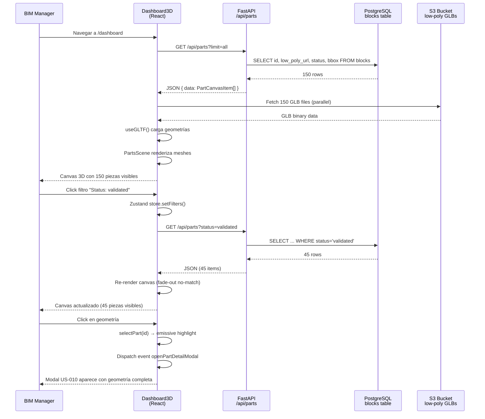

# US-005: Dashboard 3D - Plan de Implementación Completo

## 📋 Resumen Ejecutivo

**Objetivo:** Transformar el dashboard tradicional 2D en una experiencia inmersiva 3D donde todas las piezas se visualizan simultáneamente como geometrías Low-Poly (~1000 triángulos) en un Canvas Three.js.

**Valoración:** 13 Story Points  
**Duración Estimada:** 2 sprints (10 días laborables)  
**Equipo:** 1 Backend Dev + 1 Frontend Dev + 1 Agent/Infrastructure Dev

---

## 🎯 Objetivos de Calidad

| Métrica | Target | Validación |
|---------|--------|------------|
| **Performance** | >30 FPS con 150 piezas | Chrome DevTools Performance tab |
| **Load Time** | First render <3s | Lighthouse |
| **GLB Size** | <500KB por pieza | S3 object metadata |
| **Test Coverage** | >85% Frontend, >90% Backend | Vitest/Pytest coverage reports |
| **Accessibility** | Keyboard navigation funcional | Manual testing + axe-core |

---

## 📦 Desglose de Tickets (T-0500 a T-0510)

### **SPRINT 1: Infraestructura & Backend** (Días 1-5)

#### Día 1-2: Setup & Database
| Ticket | Owner | Deps | Estimación | Status |
|--------|-------|------|------------|--------|
| **T-0500-INFRA** | Frontend Dev | - | 2h | ⏳ Not Started |
| **T-0503-DB** | Backend Dev | - | 1h | ⏳ Not Started |

**Entregables:**
- ✅ React Three Fiber instalado y configurado
- ✅ Columna `low_poly_url` en tabla `blocks`
- ✅ Índices DB para queries de canvas optimizados

#### Día 2-4: Backend API & Agent Processing
| Ticket | Owner | Deps | Estimación | Status |
|--------|-------|------|------------|--------|
| **T-0501-BACK** | Backend Dev | T-0503 | 4h | ⏳ Not Started |
| **T-0502-AGENT** | Agent Dev | T-0503 | 8h | ⏳ Not Started |
| **T-0510-TEST-BACK** | Backend Dev | T-0501 | 3h | ⏳ Not Started |

**Entregables:**
- ✅ Endpoint `GET /api/parts` retorna `low_poly_url` + `bbox`
- ✅ Task Celery genera GLB Low-Poly desde .3dm
- ✅ 5 integration tests passing (RLS, filtros, payload size)

#### Día 5: Sprint 1 Review
- Demo: Backend API retorna geometrías Low-Poly
- Validación: Task AGENT procesa pieza de prueba en <2 min
- Testing: Backend tests 5/5 passing

---

### **SPRINT 2: Frontend 3D & Integration** (Días 6-10)

#### Día 6-7: Canvas & Layout
| Ticket | Owner | Deps | Estimación | Status |
|--------|-------|------|------------|--------|
| **T-0504-FRONT** | Frontend Dev | T-0500 | 4h | ⏳ Not Started |
| **T-0506-FRONT** | Frontend Dev | T-0504 | 3h | ⏳ Not Started |

**Entregables:**
- ✅ Dashboard3D component con Canvas funcionando
- ✅ Sidebar con filtros + Zustand store

#### Día 7-9: 3D Rendering & Interacción
| Ticket | Owner | Deps | Estimación | Status |
|--------|-------|------|------------|--------|
| **T-0505-FRONT** | Frontend Dev | T-0504, T-0501 | 6h | ⏳ Not Started |
| **T-0507-FRONT** | Frontend Dev | T-0505 | 4h | ⏳ Not Started |
| **T-0508-FRONT** | Frontend Dev | T-0505 | 3h | ⏳ Not Started |

**Entregables:**
- ✅ PartsScene renderiza 150 geometrías Low-Poly
- ✅ LOD System funcional (3 niveles)
- ✅ Click abre modal US-010, tooltip en hover

#### Día 9-10: Testing & Polish
| Ticket | Owner | Deps | Estimación | Status |
|--------|-------|------|------------|--------|
| **T-0509-TEST-FRONT** | Frontend Dev | T-0505 | 3h | ⏳ Not Started |

**Entregables:**
- ✅ 5 Vitest tests passing (render, empty state, LOD, click, filters)
- ✅ Performance profiling: >30 FPS verificado
- ✅ No memory leaks (Chrome Memory Profiler)

#### Día 10: Sprint 2 Review
- Demo: Dashboard 3D completo con 150 piezas
- Validación: Arquitectos revisan reconocibilidad de geometrías
- UAT: BIM Manager filtra capiteles → canvas actualiza en <1s

---

## 🔄 Flujo de Trabajo End-to-End



---

## 🧪 Estrategia de Testing

### Backend Tests (T-0510-TEST-BACK)
```python
# tests/integration/test_parts_canvas.py
def test_list_parts_includes_low_poly_url():
    response = client.get('/api/parts')
    assert response.status_code == 200
    assert all('low_poly_url' in part for part in response.json()['data'])

def test_rls_workshop_user_sees_only_own_parts():
    # Login as workshop user
    token = authenticate_workshop_user('taller_granollers')
    response = client.get('/api/parts', headers={'Authorization': f'Bearer {token}'})
    parts = response.json()['data']
    
    # Verificar: todas las piezas tienen workshop_id correcto
    assert all(p['workshop_id'] == 'taller_granollers_id' for p in parts)

def test_canvas_query_uses_index():
    with pg_cursor() as cursor:
        cursor.execute("EXPLAIN ANALYZE SELECT * FROM blocks WHERE status='validated'")
        plan = cursor.fetchone()[0]
        assert 'Index Scan' in plan
```

### Frontend Tests (T-0509-TEST-FRONT)
```typescript
// src/components/Dashboard/PartsScene.test.tsx
describe('PartsScene 3D Rendering', () => {
  it('renders all parts with valid low_poly_url', async () => {
    const mockParts = generateMockParts(50);
    render(
      <Canvas>
        <PartsScene parts={mockParts} />
      </Canvas>
    );
    
    await waitFor(() => {
      expect(screen.getAllByRole('group', { name: /part-/ })).toHaveLength(50);
    });
  });
  
  it('applies LOD system based on camera distance', () => {
    const { rerender } = render(<PartsScene parts={mockParts} />);
    
    // Mock camera far away (>50 units)
    act(() => camera.position.set(100, 100, 100));
    expect(queryByRole('bounding-box-proxy')).toBeInTheDocument();
    
    // Mock camera close (<20 units)
    act(() => camera.position.set(10, 10, 10));
    expect(queryByRole('full-geometry')).toBeInTheDocument();
  });
});
```

---

## 🚨 Riesgos & Planes de Contingencia

### Riesgo 1: Performance degrada con 150+ geometrías
**Probabilidad:** Media  
**Impacto:** Alto (UX bloqueante)  
**Mitigación Primaria:** LOD System (T-0507)  
**Plan B:** 
- Reducir target de triángulos de 1000 a 500
- Implementar frustum culling manual (solo renderizar viewport visible)
- Limitar a 100 piezas por canvas con paginación espacial

### Riesgo 2: Decimación degrada geometría irreconociblemente
**Probabilidad:** Media  
**Impacto:** Medio (validación arquitectos falla)  
**Mitigación:** Sprint Review con feedback de arquitectos (día 10)  
**Plan B:**
- Ajustar `DECIMATION_TARGET_FACES` a 1500 triángulos
- Probar algoritmo alternativo (vertex clustering vs quadric decimation)
- Fallback: Usar bounding boxes coloreadas (Opción A original)

### Riesgo 3: AGENT task timeouts con geometrías muy complejas
**Probabilidad:** Baja  
**Impacto:** Medio (algunas piezas sin Low-Poly)  
**Mitigación:** Timeouts configurados (9min soft, 10min hard)  
**Plan B:**
- Marcar piezas como `requires_manual_processing`
- Procesamiento offline batch nocturno
- Notificar admin para revisar manualmente

### Riesgo 4: S3 bandwidth costs explotan con 150 GLB loads
**Probabilidad:** Baja  
**Impacto:** Medio (costos inesperados)  
**Mitigación:** GLBs <500KB target  
**Plan B:**
- Implementar CDN (CloudFront) para caché edge
- Lazy loading: solo cargar geometrías en viewport
- Preload solo primeras 20 piezas, resto progressive

---

## 📊 Success Metrics & KPIs

### Development Metrics
- **Velocity:** 13 SP completados en 2 sprints
- **Bug Rate:** <5 bugs críticos post-release
- **Test Coverage:** Backend >90%, Frontend >85%

### Product Metrics (Post-Launch)
- **Adoption:** >80% BIM Managers acceden a Dashboard 3D semanalmente
- **Engagement:** Tiempo promedio en Dashboard >5 min/sesión
- **Performance:** <3% usuarios reportan lag o crashes
- **Feedback:** NPS >8/10 en encuesta post-feature

### Technical Metrics
- **Uptime:** 99.5% Dashboard disponible
- **Latency P95:** Initial load <5s, filtros <1s
- **Error Rate:** <1% failed GLB loads

---

## 🔄 Post-MVP Roadmap (Futuro)

### Fase 2: Navegación Avanzada (US-005 v2)
- **Minimap 2D:** Vista aérea para navegación rápida
- **Search Box:** Buscar pieza por ISO code → zoom automático
- **Camera Presets:** Botones "Vista Frontal", "Vista Aérea", "Vista Alzado"

### Fase 3: Análisis Visual
- **Heatmap Estados:** Mapa de calor mostrando concentración de estados (ej: "¿Dónde están los bottlenecks de fabricación?")
- **Timeline Slider:** Ver evolución histórica de estados (animación temporal)
- **Clustering:** Agrupar piezas cercanas en iconos numéricos al hacer zoom-out

### Fase 4: Colaboración
- **Multi-cursor:** Ver cursores de otros usuarios navegando en tiempo real
- **Annotations:** Marcar piezas con notas visibles para equipo
- **Screen Share:** Compartir vista 3D en videollamadas

---

## ✅ Definition of Done (Global US-005)

### Funcional
- [ ] Canvas 3D renderiza 150 piezas con geometrías Low-Poly
- [ ] Filtros (status, tipología, workshop) actualizan canvas en tiempo real
- [ ] Click en pieza abre modal US-010 con geometría completa
- [ ] RLS: Usuarios workshop solo ven sus piezas
- [ ] Empty State aparece si no hay piezas

### Performance
- [ ] >30 FPS con 150 piezas (Chrome DevTools)
- [ ] Initial load <3s (Lighthouse)
- [ ] GLB files <500KB promedio

### Testing
- [ ] 5 backend tests passing (T-0510)
- [ ] 5 frontend tests passing (T-0509)
- [ ] Coverage: Backend >90%, Frontend >85%
- [ ] 0 memory leaks (Chrome Memory Profiler)

### Security
- [ ] RLS policies implementadas en T-0501
- [ ] Input validation en query params (status, tipología)
- [ ] No exposición de workshop_id ajeno en respuestas

### Documentación
- [ ] 3 Tech Specs creados (T-0500, T-0502, T-0505)
- [ ] README en `docs/US-005/` con screenshots y demos
- [ ] Contratos API documentados en `systemPatterns.md`
- [ ] Video demo grabado para stakeholders (opcional)

### UAT (User Acceptance Testing)
- [ ] BIM Manager puede filtrar 150 piezas por estado sin lag
- [ ] Arquitecto valida que geometrías Low-Poly son reconocibles
- [ ] Responsable Taller puede seleccionar pieza y ver detalle

---

## 📚 Referencias & Recursos

### Documentación Técnica
- [T-0500-INFRA-TechnicalSpec.md](T-0500-INFRA-TechnicalSpec.md)
- [T-0502-AGENT-TechnicalSpec.md](T-0502-AGENT-TechnicalSpec.md)
- [T-0505-FRONT-TechnicalSpec.md](T-0505-FRONT-TechnicalSpec.md)

### Librerías Clave
- React Three Fiber: https://docs.pmnd.rs/react-three-fiber
- drei Helpers: https://github.com/pmndrs/drei
- trimesh (decimation): https://trimsh.org/
- rhino3dm Python: https://github.com/mcneel/rhino3dm

### Inspiración UX
- Autodesk BIM 360: https://bim360.autodesk.com/
- Sketchfab Viewer: https://sketchfab.com/
- Google Earth 3D: https://earth.google.com/

---

## 🎤 Comunicación con Stakeholders

### Sprint Planning (Día 0)
**Audiencia:** Product Owner, Tech Lead, Equipo Dev  
**Contenido:**
- Presentar nueva arquitectura 3D (slides con mockups)
- Validar Story Points (13 SP) y duración (2 sprints)
- Identificar bloqueadores (ej: S3 bucket permissions)

### Sprint 1 Review (Día 5)
**Audiencia:** Product Owner, BIM Manager (usuario clave)  
**Demo:**
- Backend API retornando geometrías Low-Poly
- Task AGENT procesando pieza en vivo (<2 min)
- Mostrar GLB en Blender para validar calidad

### Sprint 2 Review (Día 10)
**Audiencia:** Todos stakeholders + Arquitectos (validación reconocibilidad)  
**Demo:**
- Dashboard 3D completo con 150 piezas reales
- Interacción: filtros, selección, modal detalle
- Performance metrics en vivo (DevTools)
- Feedback session: ¿Geometrías son reconocibles? ¿UX intuitiva?

### Post-Launch (Día 15)
**Retrospectiva Técnica:**
- Lecciones aprendidas (performance, decimación, testing 3D)
- Documentar en `memory-bank/decisions.md` (ADR)
- Planificar Fase 2 (Minimap, Search, Camera Presets)

---

**Última Actualización:** 2026-02-18  
**Autor:** AI Assistant (Claude Sonnet 4.5) en colaboración con Pedro Cortes  
**Estado:** Aprobado para Implementación ✅
