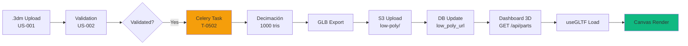

# US-005: Dashboard 3D Interactivo de Piezas

> **Versión Final Aprobada:** Dashboard 3D Immersive (Opción B: Low-Poly Geometry)  
> **Story Points:** 13 SP  
> **Estado:** Ready for Development ✅  
> **Última Actualización:** 2026-02-18

---

## 📖 Índice de Documentación

### 🎯 Documentos Principales
1. **[IMPLEMENTATION-PLAN.md](IMPLEMENTATION-PLAN.md)** - Plan completo de implementación (2 sprints, roadmap, riesgos)
2. **[docs/09-mvp-backlog.md](../09-mvp-backlog.md#us-005-dashboard-3d-interactivo-de-piezas)** - Definición oficial en backlog MVP

### ⚙️ Tech Specs (Implementación)
1. **[T-0500-INFRA-TechnicalSpec.md](T-0500-INFRA-TechnicalSpec.md)** - Setup React Three Fiber stack
2. **[T-0502-AGENT-TechnicalSpec.md](T-0502-AGENT-TechnicalSpec.md)** - Generación Low-Poly GLB desde .3dm
3. **[T-0505-FRONT-TechnicalSpec.md](T-0505-FRONT-TechnicalSpec.md)** - Rendering 3D Parts Scene

---

## 🚀 Quick Start (Para Desarrolladores)

### 1. Setup Frontend
```bash
cd src/frontend
npm install @react-three/fiber@^8.15.0
npm install @react-three/drei@^9.92.0
npm install three@^0.160.0
npm install zustand@^4.4.7
```

### 2. Setup Agent (Low-Poly Processing)
```bash
cd src/agent
pip install trimesh==4.0.5
pip install rtree==1.1.0
```

### 3. Database Migration
```sql
ALTER TABLE blocks ADD COLUMN low_poly_url TEXT NULL;
CREATE INDEX idx_blocks_canvas_query ON blocks(status, tipologia, workshop_id) WHERE is_archived=false;
```

### 4. Verificar Setup
Navegar a `/dashboard` → Deberías ver Canvas 3D con grid 100x100 (incluso sin piezas).

---

## 🎨 Visión del Producto

**Transformación:**  
❌ **BEFORE (Rechazada):** Tabla 2D estática con paginación (TanStack Table)  
✅ **AFTER (Aprobada):** Canvas 3D inmersivo con geometrías Low-Poly

**Experiencia de Usuario:**
```
┌─────────────────────────────────────────────────┐
│  Sidebar    │  Canvas 3D (Three.js)             │
│  Filtros    │  ╔═══════════════════════════════╗│
│  ─────────  │  ║                               ║│
│  ☑ Capitel  │  ║   🏛️         🏛️               ║│
│  ☐ Columna  │  ║         🏛️                    ║│
│  ☐ Dovela   │  ║  🏛️                 🏛️        ║│
│             │  ║              🏛️               ║│
│  Status:    │  ║                               ║│
│  ☑ Validated │  ║   🏛️    🏛️        🏛️         ║│
│  ☐ In Fab   │  ╚═══════════════════════════════╝│
│             │  [OrbitControls activos]          │
│  Stats:     │  Click → Detalle pieza (US-010)   │
│  150 piezas │                                    │
└─────────────────────────────────────────────────┘
```

**Interacciones:**
- 🖱️ **Mouse Drag:** Rotar escena (OrbitControls)
- 🖱️ **Scroll:** Zoom in/out
- 👆 **Click Pieza:** Selección + emissive glow + modal detalle
- ⌨️ **Keyboard:** Navegación accesible (Tab, Enter, Arrows)
- 🔍 **Filtros:** Actualización en tiempo real del canvas

---

## 📊 Acceptance Criteria (Resumen)

| # | Scenario | Validación | Status |
|---|----------|------------|--------|
| 1 | **3D Rendering** | 150 geometrías Low-Poly visibles, >30 FPS | ⏳ Pending |
| 2 | **Part Selection** | Click → highlight + tooltip + modal US-010 | ⏳ Pending |
| 3 | **Filtering** | Fade-out piezas no-match, contador actualizado | ⏳ Pending |
| 4 | **Empty State** | Canvas vacío + overlay "Subir Primera Pieza" | ⏳ Pending |
| 5 | **Security RLS** | Workshop solo ve sus piezas en canvas | ⏳ Pending |
| 6 | **Performance LOD** | 3 niveles distancia, transición imperceptible | ⏳ Pending |

Ver detalles completos en [mvp-backlog.md](../09-mvp-backlog.md#us-005-dashboard-3d-interactivo-de-piezas).

---

## 🏗️ Arquitectura Técnica

### Stack
- **Frontend:** React 18 + TypeScript + @react-three/fiber + drei
- **State:** Zustand (filtros, selección, parts list)
- **Backend:** FastAPI (endpoint `/api/parts` modificado)
- **Agent:** Celery task `generate_low_poly_glb` (trimesh decimation)
- **Storage:** S3 bucket `processed-geometry/low-poly/`

### Data Flow


### Contratos API

**Request:**
```http
GET /api/parts?status=validated&tipologia=capitel
Authorization: Bearer {token}
```

**Response:**
```json
{
  "data": [
    {
      "id": "uuid",
      "iso_code": "SF-C12-D-001",
      "status": "validated",
      "tipologia": "capitel",
      "low_poly_url": "https://s3.../low_poly_uuid.glb",
      "bbox": {
        "min": [0, 0, 0],
        "max": [1.2, 0.8, 2.5]
      },
      "workshop_id": "uuid",
      "workshop_name": "Taller Granollers"
    }
  ],
  "meta": {
    "total": 150,
    "filtered": 23
  }
}
```

---

## 🧪 Testing Strategy

### Coverage Targets
- **Backend:** >90% (endpoint + RLS policies)
- **Frontend:** >85% (components 3D + store Zustand)
- **Agent:** >80% (task decimation + S3 upload)

### Key Tests
```typescript
// Frontend (Vitest)
✅ Canvas renderiza 150 geometrías Low-Poly
✅ Click ejecuta selectPart(id) y abre modal
✅ Filtros actualizan URL params
✅ LOD system carga geometrías según distancia
✅ Empty State aparece si parts.length === 0

// Backend (Pytest)
✅ Endpoint retorna low_poly_url válida
✅ RLS: Workshop no ve piezas ajenas
✅ Filtros SQL usan índices (EXPLAIN ANALYZE)
✅ Response <200KB con 150 items
✅ Input validation rechaza params inválidos
```

Ver specs completas en [T-0509-TEST-FRONT](./T-0509-TEST-FRONT-TechnicalSpec.md) y [T-0510-TEST-BACK](./T-0510-TEST-BACK-TechnicalSpec.md) *(pendientes de crear)*.

---

## ⚠️ Riesgos & Mitigaciones

### 🔴 Crítico: Performance degradation con 150+ piezas
**Mitigación:** LOD System (T-0507) + target 1000 tris/pieza  
**Plan B:** Reducir a 500 tris o limitar a 100 piezas con paginación espacial

### 🟡 Alto: Decimación degrada reconocibilidad
**Mitigación:** Sprint Review con arquitectos (día 10 validación visual)  
**Plan B:** Ajustar `DECIMATION_TARGET_FACES` a 1500 o usar bounding boxes

### 🟢 Medio: AGENT task timeouts geometrías complejas
**Mitigación:** Timeouts configurados (9min soft, 10min hard)  
**Plan B:** Marcar `requires_manual_processing`, batch nocturno

---

## 📈 Success Metrics

### Development (Durante Sprint)
- **Velocity:** 13 SP completados en 10 días
- **Bug Rate:** <5 critical bugs
- **Test Coverage:** Metas alcanzadas (>85/90%)

### Product (Post-Launch)
- **Adoption:** >80% BIM Managers usan Dashboard 3D semanalmente
- **Performance:** <3% usuarios reportan lag
- **NPS:** >8/10 en encuesta de satisfacción

### Technical
- **FPS:** Mantener >30 FPS con 150 piezas
- **Load Time:** Initial render <3s (Lighthouse)
- **Error Rate:** <1% failed GLB loads

---

## 🎓 Lecciones Aprendidas (Post-Mortem Futuro)

*Esta sección se completará tras finalizar la implementación.*

**Fecha Post-Mortem:** TBD  
**Participantes:** Frontend Lead, Backend Lead, Agent Lead, Product Owner

**Temas a cubrir:**
- ¿La decimación a 1000 tris fue suficiente?
- ¿El LOD System mejoró performance? ¿Cuánto?
- ¿Hubo sorpresas en testing 3D con Vitest?
- ¿Arquitectos validaron reconocibilidad de geometrías?
- ¿Celery tasks fueron estables? ¿Hubo timeouts?

---

## 🔗 Enlaces Relacionados

### User Stories Relacionadas
- **[US-001: Upload .3dm](../09-mvp-backlog.md#us-001)** - Provee geometría original
- **[US-002: Validación](../09-mvp-backlog.md#us-002)** - Trigger para procesamiento Low-Poly
- **[US-010: Visor 3D Detalle](../09-mvp-backlog.md#us-010)** - Modal que abre US-005 al hacer click

### Documentación Externa
- [React Three Fiber Docs](https://docs.pmnd.rs/react-three-fiber)
- [drei Helpers Library](https://github.com/pmndrs/drei)
- [trimesh Decimation](https://trimsh.org/trimesh.html#trimesh.Trimesh.simplify_quadric_decimation)
- [Three.js Performance Best Practices](https://discoverthreejs.com/tips-and-tricks/)

### Referentes de Producto
- Autodesk BIM 360 (tabla 2D) - Queremos superarlo con 3D
- Sketchfab Viewer (3D web) - Inspiración para controles
- Google Earth 3D - Referente de navegación espacial

---

## 📞 Contacto & Ownership

**Product Owner:** [TBD]  
**Tech Lead Frontend:** [TBD]  
**Tech Lead Backend:** [TBD]  
**Tech Lead Agent/Infrastructure:** [TBD]

**Preguntas:** Abrir issue en GitHub con label `US-005` o contactar en Slack #sf-pm-dev

---

**Última Revisión:** 2026-02-18  
**Próxima Revisión:** Sprint Review (Día 5 y Día 10)  
**Estado Aprobación:** ✅ Aprobado por Product Owner para Sprint Planning
