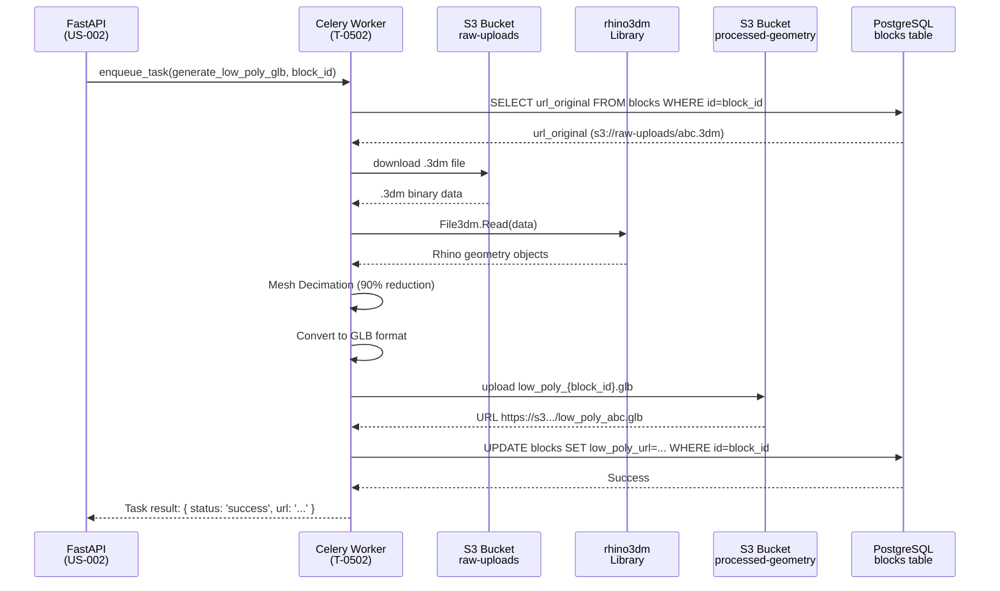

# T-0502-AGENT: Generate Low-Poly GLB from .3dm

## Objetivo
Implementar tarea Celery asíncrona que toma un archivo .3dm validado, simplifica su geometría a ~1000 triángulos (Low-Poly) mediante decimación, exporta a formato .glb optimizado para web, y actualiza el registro en base de datos con la URL del archivo procesado.

## Contexto
- **Triggered by:** Evento `status='validated'` en tabla `blocks` (tras US-002 validación exitosa)
- **Input:** `block_id` (UUID de pieza validada con `url_original` .3dm disponible en S3)
- **Output:** Archivo `.glb` Low-Poly en bucket S3 `processed-geometry/low-poly/{block_id}.glb` + actualización campo `blocks.low_poly_url`

## Arquitectura del Pipeline



## Implementación

### 1. Task Celery Definition

```python
# src/agent/tasks/geometry_processing.py
import rhino3dm as rh
import trimesh
import tempfile
import os
from celery import Task
from src.agent.celery_app import celery_app
from src.agent.infra.s3_client import s3_client
from src.agent.infra.db_client import get_db_connection
from src.agent.constants import (
    DECIMATION_TARGET_FACES,
    LOW_POLY_BUCKET,
    RAW_UPLOADS_BUCKET
)
import structlog

logger = structlog.get_logger()

@celery_app.task(
    bind=True,
    name='agent.generate_low_poly_glb',
    max_retries=3,
    default_retry_delay=60,  # 1 min
    soft_time_limit=540,     # 9 min
    time_limit=600           # 10 min hard timeout
)
def generate_low_poly_glb(self: Task, block_id: str) -> dict:
    """
    Genera geometría Low-Poly optimizada para renderizado 3D en dashboard.
    
    Args:
        block_id: UUID de la pieza en tabla blocks
        
    Returns:
        {
            'status': 'success' | 'error',
            'low_poly_url': str,
            'original_faces': int,
            'decimated_faces': int,
            'file_size_kb': int
        }
    """
    logger.info(f"Starting Low-Poly generation for block {block_id}")
    
    try:
        # Step 1: Fetch block metadata from DB
        with get_db_connection() as conn:
            cursor = conn.cursor()
            cursor.execute(
                "SELECT url_original, iso_code FROM blocks WHERE id = %s",
                (block_id,)
            )
            row = cursor.fetchone()
            if not row:
                raise ValueError(f"Block {block_id} not found in database")
            
            url_original, iso_code = row
            logger.info(f"Processing {iso_code}, original URL: {url_original}")
        
        # Step 2: Download .3dm from S3
        s3_key = url_original.split(f'{RAW_UPLOADS_BUCKET}/')[-1]
        local_3dm_path = f"/tmp/{block_id}.3dm"
        s3_client.download_file(RAW_UPLOADS_BUCKET, s3_key, local_3dm_path)
        logger.info(f"Downloaded .3dm to {local_3dm_path}")
        
        # Step 3: Parse Rhino file
        rhino_file = rh.File3dm.Read(local_3dm_path)
        if not rhino_file:
            raise ValueError(f"Failed to parse .3dm file for {iso_code}")
        
        # Step 4: Extract and merge all meshes
        all_meshes = []
        original_face_count = 0
        
        for obj in rhino_file.Objects:
            if obj.Geometry.ObjectType == rh.ObjectType.Mesh:
                mesh = obj.Geometry
                # Convert Rhino mesh to trimesh format
                vertices = [[v.X, v.Y, v.Z] for v in mesh.Vertices]
                faces = [[f.A, f.B, f.C] for f in mesh.Faces if not f.IsQuad]
                # Handle quads (split into 2 triangles)
                for f in mesh.Faces:
                    if f.IsQuad:
                        faces.append([f.A, f.B, f.C])
                        faces.append([f.A, f.C, f.D])
                
                tri_mesh = trimesh.Trimesh(vertices=vertices, faces=faces)
                all_meshes.append(tri_mesh)
                original_face_count += len(tri_mesh.faces)
        
        if not all_meshes:
            raise ValueError(f"No meshes found in {iso_code}")
        
        # Step 5: Merge all meshes into single geometry
        combined_mesh = trimesh.util.concatenate(all_meshes)
        logger.info(f"Original mesh: {original_face_count} faces")
        
        # Step 6: Decimate to target face count
        target_faces = DECIMATION_TARGET_FACES  # 1000 from constants
        if original_face_count > target_faces:
            simplified_mesh = combined_mesh.simplify_quadric_decimation(target_faces)
            logger.info(f"Decimated to {len(simplified_mesh.faces)} faces")
        else:
            simplified_mesh = combined_mesh
            logger.info(f"Mesh already below target, skipping decimation")
        
        # Step 7: Export to GLB
        glb_path = f"/tmp/low_poly_{block_id}.glb"
        simplified_mesh.export(glb_path, file_type='glb')
        file_size_kb = os.path.getsize(glb_path) // 1024
        logger.info(f"Exported GLB: {file_size_kb} KB")
        
        # Step 8: Upload to S3
        s3_key_output = f"low-poly/{block_id}.glb"
        s3_client.upload_file(glb_path, LOW_POLY_BUCKET, s3_key_output)
        low_poly_url = f"https://{LOW_POLY_BUCKET}.s3.amazonaws.com/{s3_key_output}"
        logger.info(f"Uploaded to S3: {low_poly_url}")
        
        # Step 9: Update database
        with get_db_connection() as conn:
            cursor = conn.cursor()
            cursor.execute(
                """
                UPDATE blocks 
                SET low_poly_url = %s, 
                    updated_at = NOW()
                WHERE id = %s
                """,
                (low_poly_url, block_id)
            )
            conn.commit()
        
        # Cleanup temp files
        os.remove(local_3dm_path)
        os.remove(glb_path)
        
        return {
            'status': 'success',
            'low_poly_url': low_poly_url,
            'original_faces': original_face_count,
            'decimated_faces': len(simplified_mesh.faces),
            'file_size_kb': file_size_kb
        }
        
    except Exception as exc:
        logger.error(f"Low-Poly generation failed: {exc}", exc_info=True)
        # Retry with exponential backoff
        raise self.retry(exc=exc, countdown=60 * (2 ** self.request.retries))
```

### 2. Constants Definition

```python
# src/agent/constants.py
# ... existing constants ...

# Geometry Processing
DECIMATION_TARGET_FACES = 1000  # ~1000 triángulos para Low-Poly
MAX_GLB_SIZE_MB = 5             # Máximo 5MB por archivo GLB
LOW_POLY_BUCKET = 'processed-geometry'
LOW_POLY_PREFIX = 'low-poly/'
```

### 3. Dependencies

```txt
# src/agent/requirements.txt (añadir)
trimesh==4.0.5        # Mesh decimation library
rtree==1.1.0          # Required by trimesh for spatial queries
```

### 4. Trigger Integration

```python
# src/backend/services/validation_service.py (modificar)
from src.agent.tasks.geometry_processing import generate_low_poly_glb

class ValidationService:
    async def finalize_validation(self, block_id: str, is_valid: bool):
        # ... existing validation logic ...
        
        if is_valid:
            # Update status to validated
            await self.db.execute(
                "UPDATE blocks SET status = 'validated' WHERE id = %s",
                (block_id,)
            )
            
            # Enqueue Low-Poly generation (async)
            generate_low_poly_glb.delay(block_id)
            logger.info(f"Enqueued Low-Poly generation for {block_id}")
```

## Testing Strategy

### Unit Tests

```python
# tests/agent/test_geometry_processing.py
import pytest
from unittest.mock import patch, MagicMock
from src.agent.tasks.geometry_processing import generate_low_poly_glb

@pytest.fixture
def mock_rhino_file():
    """Mock rhino3dm file con geometría simple"""
    mock_file = MagicMock()
    mock_mesh = MagicMock()
    mock_mesh.Vertices = [MagicMock(X=0, Y=0, Z=0) for _ in range(4)]
    mock_mesh.Faces = [MagicMock(A=0, B=1, C=2, IsQuad=False) for _ in range(1000)]
    
    mock_obj = MagicMock()
    mock_obj.Geometry = mock_mesh
    mock_obj.Geometry.ObjectType = rh.ObjectType.Mesh
    
    mock_file.Objects = [mock_obj]
    return mock_file

def test_generate_low_poly_success(mock_rhino_file):
    with patch('rhino3dm.File3dm.Read', return_value=mock_rhino_file):
        with patch('src.agent.infra.s3_client.download_file'):
            with patch('src.agent.infra.s3_client.upload_file'):
                result = generate_low_poly_glb('test-block-id')
                
                assert result['status'] == 'success'
                assert result['low_poly_url'].endswith('.glb')
                assert result['decimated_faces'] <= 1000

def test_generate_low_poly_no_meshes():
    mock_file = MagicMock()
    mock_file.Objects = []  # No geometry
    
    with patch('rhino3dm.File3dm.Read', return_value=mock_file):
        with pytest.raises(ValueError, match="No meshes found"):
            generate_low_poly_glb('test-block-id')
```

### Integration Test

```python
# tests/integration/test_low_poly_pipeline.py
def test_full_pipeline_with_real_3dm(test_db, s3_mock):
    # Upload real .3dm fixture
    block_id = upload_test_fixture('test-capitel.3dm')
    
    # Wait for validation
    wait_for_validation(block_id)
    
    # Wait for Low-Poly generation (max 2 min)
    wait_for_low_poly(block_id, timeout=120)
    
    # Verify DB updated
    block = get_block(block_id)
    assert block['low_poly_url'] is not None
    assert block['low_poly_url'].endswith('.glb')
    
    # Verify GLB file exists in S3
    assert s3_client.object_exists(LOW_POLY_BUCKET, f'low-poly/{block_id}.glb')
    
    # Verify GLB is valid and under 5MB
    glb_data = s3_client.download_object(LOW_POLY_BUCKET, f'low-poly/{block_id}.glb')
    assert len(glb_data) < 5 * 1024 * 1024
```

## Performance Expectations

| Metric | Target | Measurement |
|--------|--------|-------------|
| Processing Time | <2 min/pieza | Celery task duration |
| Output File Size | <500KB | GLB file size |
| Triangle Count | ~1000 | trimesh face count |
| Memory Usage | <2GB | Worker RSS |
| Success Rate | >95% | Task success/failure ratio |

## DoD Checklist
- [ ] Task `generate_low_poly_glb` definido en `src/agent/tasks/geometry_processing.py`
- [ ] Decimación reduce geometría a ~1000 triángulos conservando forma reconocible
- [ ] GLB exportado correctamente (validar con Blender o three.js inspector)
- [ ] Campo `blocks.low_poly_url` actualizado tras procesamiento exitoso
- [ ] Unit tests passing: mock rhino3dm, mock S3, test decimación
- [ ] Integration test: archivo .3dm real → GLB válido en <2 min
- [ ] Error handling: retry 3 veces si falla, log estructurado con error details
- [ ] Celery logs muestran progreso: download → parse → decimate → upload → DB update

## Riesgos & Mitigaciones

### Riesgo 1: Decimación degrada geometría irreconociblemente
**Likelihood:** Media  
**Impact:** Alto (UX negativo)  
**Mitigación:** 
- Validar visualmente con arquitectos en sprint review
- Ajustar `DECIMATION_TARGET_FACES` si necesario (ej: 1500 triángulos)
- Considerar algoritmo decimación alternativo (ej: `simplify_vertex_clustering`)

### Riesgo 2: Timeouts con geometrías muy complejas (>10M triángulos)
**Mitigación:**
- Timeout suave 9 min, hard 10 min
- Si timeout, marcar pieza con flag `requires_manual_processing`

### Riesgo 3: Formatos Rhino no estándar (bloques anidados, curvas NURBS)
**Mitigación:**
- Validar `ObjectType == Mesh` antes de procesar
- Convertir NURBS a meshes con tolerancia (si implementado en futuro)

## Estimación
**Tiempo:** 8 horas  
**Complejidad:** Alta (geometría 3D + decimación + S3 + DB transaccional)  
**Bloqueadores:** T-0503-DB (necesita columna `low_poly_url`)

## Referencias
- trimesh docs: https://trimsh.org/trimesh.html
- rhino3dm Python: https://github.com/mcneel/rhino3dm
- GLB Spec: https://www.khronos.org/gltf/
