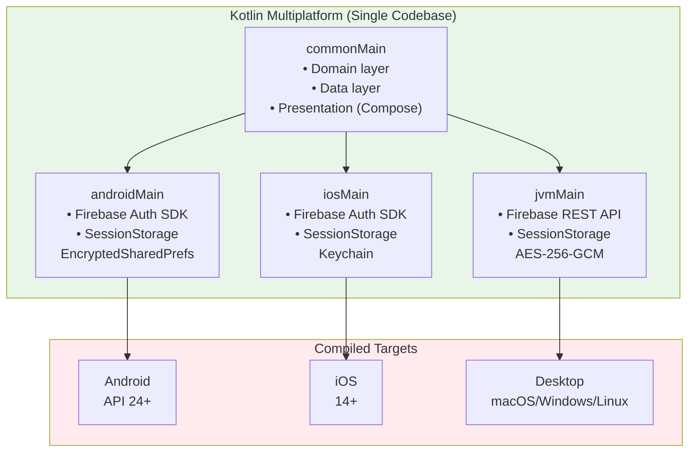
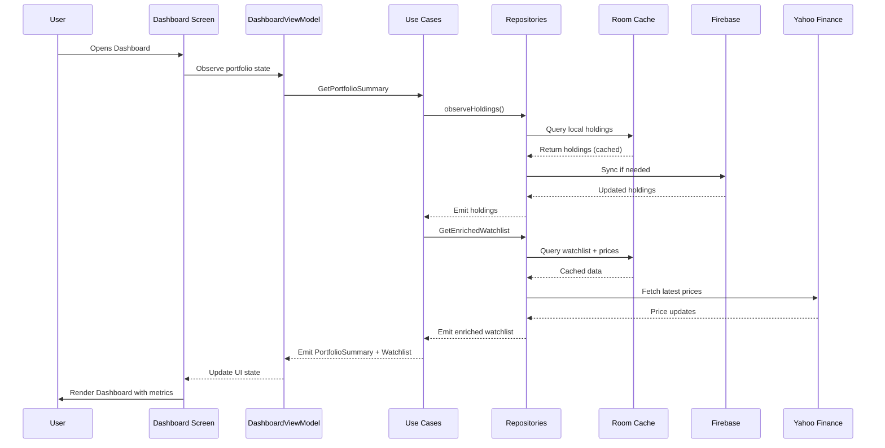
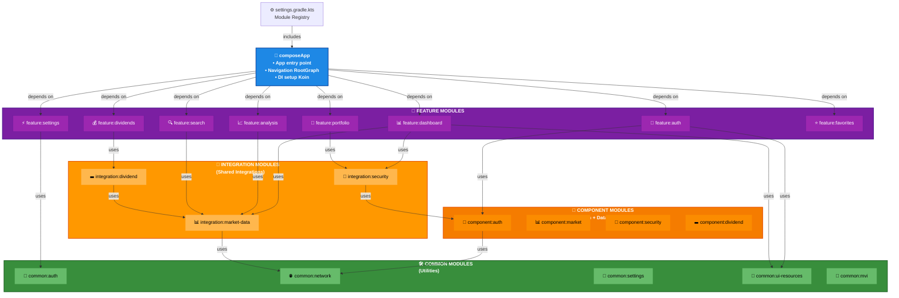

# DiviDox Architecture Diagram

---

## Cross-Platform Targets (Kotlin Multiplatform)

```mermaid
graph TB
    subgraph KMP["Kotlin Multiplatform (Single Codebase)"]
        Common["commonMain<br/>• Domain layer<br/>• Data layer<br/>• Presentation (Compose)"]
        Android["androidMain<br/>• Firebase Auth SDK<br/>• SessionStorage<br/>  EncryptedSharedPrefs"]
        iOS["iosMain<br/>• Firebase Auth SDK<br/>• SessionStorage<br/>  Keychain"]
        Desktop["jvmMain<br/>• Firebase REST API<br/>• SessionStorage<br/>  AES-256-GCM"]
    end

    subgraph Targets["Compiled Targets"]
        AndroidApp["Android<br/>API 24+"]
        iOSApp["iOS<br/>14+"]
        DesktopApp["Desktop<br/>macOS/Windows/Linux"]
    end

    Common --> Android
    Common --> iOS
    Common --> Desktop

    Android --> AndroidApp
    iOS --> iOSApp
    Desktop --> DesktopApp

    style KMP fill:#E8F5E9
    style Targets fill:#FFEBEE
```

---

## Data Flow: Dashboard Loading Sequence

```mermaid
sequenceDiagram
    participant User
    participant Dashboard as Dashboard Screen
    participant ViewModel as DashboardViewModel
    participant UC as Use Cases
    participant Repo as Repositories
    participant Cache as Room Cache
    participant Firebase as Firebase
    participant Yahoo as Yahoo Finance

    User->>Dashboard: Opens Dashboard
    Dashboard->>ViewModel: Observe portfolio state
    ViewModel->>UC: GetPortfolioSummary
    UC->>Repo: observeHoldings()
    Repo->>Cache: Query local holdings
    Cache-->>Repo: Return holdings (cached)
    Repo->>Firebase: Sync if needed
    Firebase-->>Repo: Updated holdings
    Repo-->>UC: Emit holdings
    
    UC->>Repo: GetEnrichedWatchlist
    Repo->>Cache: Query watchlist + prices
    Cache-->>Repo: Cached data
    Repo->>Yahoo: Fetch latest prices
    Yahoo-->>Repo: Price updates
    Repo-->>UC: Emit enriched watchlist
    
    UC-->>ViewModel: Emit PortfolioSummary + Watchlist
    ViewModel-->>Dashboard: Update UI state
    Dashboard->>User: Render Dashboard with metrics

```

---

## Build Configuration: Gradle Module Structure

```mermaid
graph TB
    Root["⚙️ settings.gradle.kts<br/>Module Registry"]
    
    App["🎯 composeApp<br/>• App entry point<br/>• Navigation RootGraph<br/>• DI setup Koin"]
    
    subgraph Features["<b>🎨 FEATURE MODULES</b><br/>(Screens Only)"]
        FA["🔐 feature:auth"]
        FD["📊 feature:dashboard"]
        FP["💼 feature:portfolio"]
        FAn["📈 feature:analysis"]
        FDiv["💰 feature:dividends"]
        FSearch["🔍 feature:search"]
        FSettings["⚡ feature:settings"]
        FFav["⭐ feature:favorites"]
    end

    subgraph Components["<b>🧠 COMPONENT MODULES</b><br/>(Domain + Data)"]
        CA["🔐 component:auth"]
        CM["📊 component:market"]
        CS["💼 component:security"]
        CD["💵 component:dividend"]
    end

    subgraph Integration["<b>🔗 INTEGRATION MODULES</b><br/>(Shared Integrations)"]
        IM["📊 integration:market-data"]
        IS["💼 integration:security"]
        ID["💵 integration:dividend"]
    end

    subgraph Common["<b>🛠️ COMMON MODULES</b><br/>(Utilities)"]
        CAu["🔑 common:auth"]
        CN["🌐 common:network"]
        CSt["📝 common:settings"]
        CUI["🎨 common:ui-resources"]
        CMVI["📐 common:mvi"]
    end

    Root -->|includes| App
    App -->|depends on| FA
    App -->|depends on| FD
    App -->|depends on| FP
    App -->|depends on| FAn
    App -->|depends on| FDiv
    App -->|depends on| FSearch
    App -->|depends on| FSettings
    App -->|depends on| FFav

    FA -->|uses| CA
    FA -->|uses| CUI
    FD -->|uses| IM
    FD -->|uses| IS
    FD -->|uses| CUI
    FP -->|uses| IS
    FAn -->|uses| IM
    FDiv -->|uses| ID
    FSearch -->|uses| IM
    FSettings -->|uses| CAu

    CA -->|uses| CN
    IM -->|uses| CN
    IS -->|uses| CA
    ID -->|uses| IM

    style App fill:#1E88E5,stroke:#0D47A1,stroke-width:2px,color:#fff,font-weight:bold
    style Features fill:#7B1FA2,stroke:#4A148C,stroke-width:2px,color:#fff,font-weight:bold
    style Components fill:#F57C00,stroke:#E65100,stroke-width:2px,color:#fff,font-weight:bold
    style Integration fill:#FF9800,stroke:#E65100,stroke-width:2px,color:#fff,font-weight:bold
    style Common fill:#388E3C,stroke:#1B5E20,stroke-width:2px,color:#fff,font-weight:bold
    
    style FA fill:#9C27B0,stroke:#6A1B9A,color:#fff
    style FD fill:#9C27B0,stroke:#6A1B9A,color:#fff
    style FP fill:#9C27B0,stroke:#6A1B9A,color:#fff
    style FAn fill:#9C27B0,stroke:#6A1B9A,color:#fff
    style FDiv fill:#9C27B0,stroke:#6A1B9A,color:#fff
    style FSearch fill:#9C27B0,stroke:#6A1B9A,color:#fff
    style FSettings fill:#9C27B0,stroke:#6A1B9A,color:#fff
    style FFav fill:#9C27B0,stroke:#6A1B9A,color:#fff
    
    style CA fill:#FB8C00,stroke:#F57C00,color:#000
    style CM fill:#FB8C00,stroke:#F57C00,color:#000
    style CS fill:#FB8C00,stroke:#F57C00,color:#000
    style CD fill:#FB8C00,stroke:#F57C00,color:#000
    
    style IM fill:#FFB74D,stroke:#FF9800,color:#000
    style IS fill:#FFB74D,stroke:#FF9800,color:#000
    style ID fill:#FFB74D,stroke:#FF9800,color:#000
    
    style CAu fill:#66BB6A,stroke:#388E3C,color:#000
    style CN fill:#66BB6A,stroke:#388E3C,color:#000
    style CSt fill:#66BB6A,stroke:#388E3C,color:#000
    style CUI fill:#66BB6A,stroke:#388E3C,color:#000
    style CMVI fill:#66BB6A,stroke:#388E3C,color:#000
```

