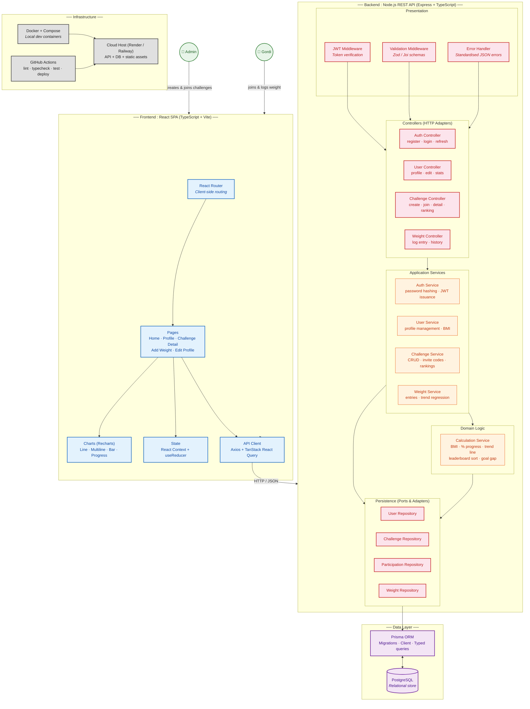

[//]: # "Gordi Challenge — C4-inspired Architecture Diagram"

```mermaid
flowchart TB
    %% ── Styles ──
    classDef person fill:#e8f5e9,stroke:#2e7d32,stroke-width:2px,color:#1b5e20
    classDef frontend fill:#e3f2fd,stroke:#1565c0,stroke-width:2px,color:#0d47a1
    classDef backend fill:#fce4ec,stroke:#c62828,stroke-width:2px,color:#b71c1c
    classDef domain fill:#fff3e0,stroke:#e65100,stroke-width:1px,color:#bf360c
    classDef data fill:#f3e5f5,stroke:#6a1b9a,stroke-width:2px,color:#4a148c
    classDef infra fill:#e0e0e0,stroke:#424242,stroke-width:2px,color:#212121
    classDef external fill:#fff8e1,stroke:#f57f17,stroke-width:2px,color:#e65100

    %% ═══════════════════════ LEVEL 1: PERSONAS ═══════════════════════
    Admin(("👑 Admin")):::person
    Gordi(("👤 Gordi")):::person

    %% ═══════════════════════ LEVEL 2: CONTAINERS ═══════════════════════
    subgraph Frontend["── Frontend : React SPA (TypeScript + Vite) ──"]
        direction TB
        Router["React Router<br/><i>Client-side routing</i>"]:::frontend
        Pages["Pages<br/>Home · Profile · Challenge Detail<br/>Add Weight · Edit Profile"]:::frontend
        Charts["Charts (Recharts)<br/>Line · Multiline · Bar · Progress"]:::frontend
        State["State<br/>React Context + useReducer"]:::frontend
        API["API Client<br/>Axios + TanStack React Query"]:::frontend

        Router --> Pages
        Pages --> Charts
        Pages --> State
        Pages --> API
    end

    subgraph Backend["── Backend : Node.js REST API (Express + TypeScript) ──"]
        direction TB

        subgraph Middleware["Presentation"]
            AuthMW["JWT Middleware<br/><i>Token verification</i>"]:::backend
            ValidMW["Validation Middleware<br/><i>Zod / Joi schemas</i>"]:::backend
            ErrorMW["Error Handler<br/><i>Standardised JSON errors</i>"]:::backend
        end

        subgraph Controllers["Controllers (HTTP Adapters)"]
            AuthCtrl["Auth Controller<br/>register · login · refresh"]:::backend
            UserCtrl["User Controller<br/>profile · edit · stats"]:::backend
            ChallengeCtrl["Challenge Controller<br/>create · join · detail · ranking"]:::backend
            WeightCtrl["Weight Controller<br/>log entry · history"]:::backend
        end

        subgraph Services["Application Services"]
            AuthSvc["Auth Service<br/>password hashing · JWT issuance"]:::domain
            UserSvc["User Service<br/>profile management · BMI"]:::domain
            ChallengeSvc["Challenge Service<br/>CRUD · invite codes · rankings"]:::domain
            WeightSvc["Weight Service<br/>entries · trend regression"]:::domain
        end

        subgraph Domain["Domain Logic"]
            CalcSvc["Calculation Service<br/>BMI · % progress · trend line<br/>leaderboard sort · goal gap"]:::domain
        end

        subgraph Repositories["Persistence (Ports & Adapters)"]
            UserRepo["User Repository"]:::backend
            ChallengeRepo["Challenge Repository"]:::backend
            ParticipationRepo["Participation Repository"]:::backend
            WeightRepo["Weight Repository"]:::backend
        end
    end

    subgraph Data["── Data Layer ──"]
        direction LR
        ORM["Prisma ORM<br/>Migrations · Client · Typed queries"]:::data
        DB[("PostgreSQL<br/><i>Relational store</i>")]:::data
        ORM <--> DB
    end

    subgraph DevOps["── Infrastructure ──"]
        Docker["Docker + Compose<br/><i>Local dev containers</i>"]:::infra
        CI["GitHub Actions<br/>lint · typecheck · test · deploy"]:::infra
        Host["Cloud Host (Render / Railway)<br/>API + DB + static assets"]:::infra
    end

    %% ═══════════════════════ LEVEL 3: RELATIONSHIPS ═══════════════════════
    Admin    -->|"creates & joins challenges"| Frontend
    Gordi    -->|"joins & logs weight"| Frontend

    API     -->|"HTTP / JSON"| Backend
    Frontend --> API

    AuthMW  --> Controllers
    ValidMW --> Controllers
    ErrorMW --> Controllers

    Controllers --> Services
    Services   --> Domain
    Services   --> Repositories
    Domain     --> Repositories

    Repositories --> ORM

    Docker --> Host
    CI     --> Host
```

