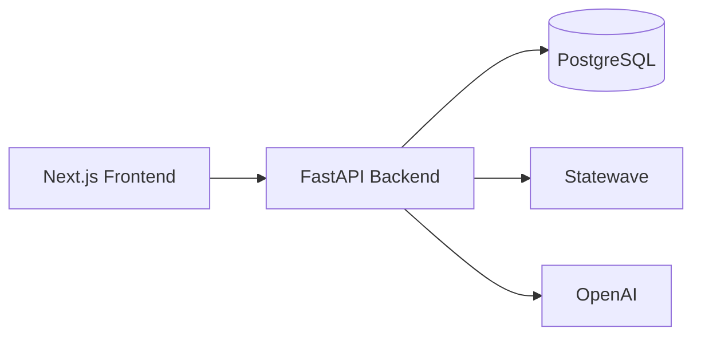

# Arquitectura

AuditCare Timeline usa una arquitectura por capas:

- Frontend Next.js.
- Backend FastAPI.
- PostgreSQL para persistencia.
- Statewave para memoria contextual.
- OpenAI para extracción de eventos clínicos.

