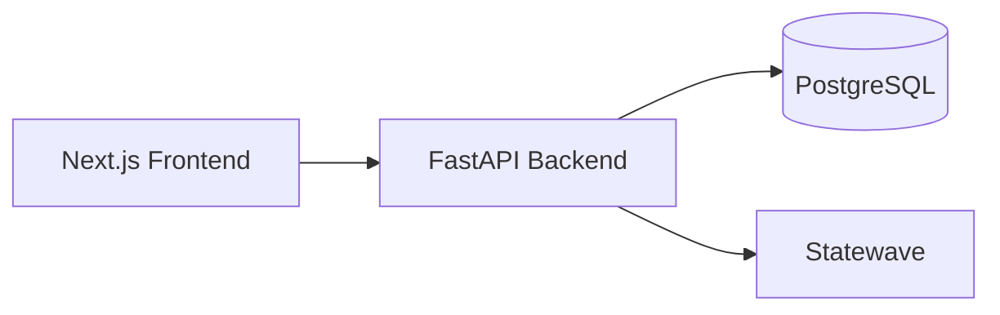

# Arquitectura

AuditCare Timeline usa una arquitectura por capas:

- Frontend Next.js.
- Backend FastAPI.
- PostgreSQL para persistencia.
- Statewave para memoria contextual y trazabilidad (API v1: episodios, compilación y contexto).
- LLM configurable compatible con OpenAI para extracción de eventos clínicos,
  con fallback determinista por reglas cuando no hay LLM configurado.

