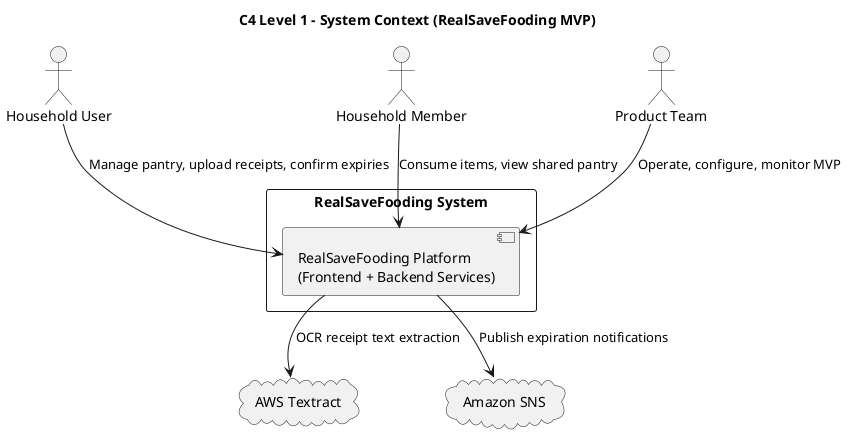
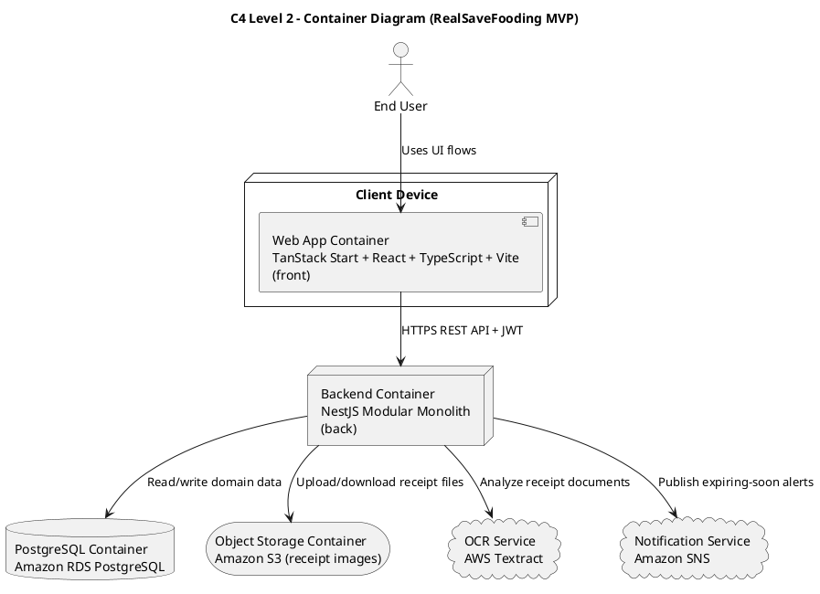
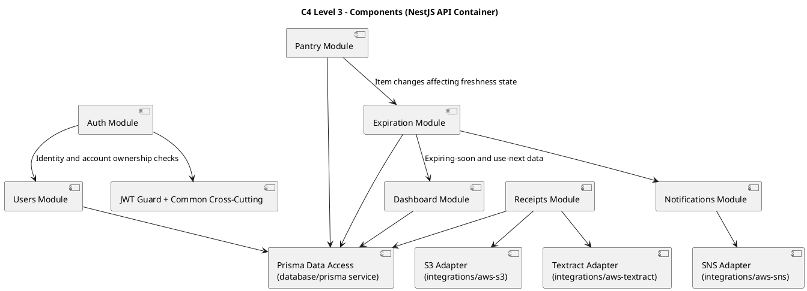

# C4 Model — RealSaveFooding (MVP)

This document provides the C4 model at three levels for the first version of RealSaveFooding:
- Level 1: System Context
- Level 2: Container Diagram
- Level 3: Component Diagram (Backend API)

Scope follows the MVP defined in `docs/product/3_PRD.md`:
- Authentication and JWT authorization
- Pantry CRUD
- Receipt upload + OCR extraction
- Expiration estimation and 3-day expiring-soon policy
- Notifications
- Dashboard and use-next prioritization
- Basic shared pantry

## C4 Level 1 — System Context

### Context notes
- The platform serves household users through a mobile-first web app.
- OCR and notifications are delegated to AWS managed services.
- Shared pantry behavior is part of the core system boundary in MVP.

## C4 Level 2 — Container Diagram

### Container notes
- `front` is the presentation container that handles UI state, feature flows, and API calls.
- `back` is a modular monolith exposing API endpoints and coordinating domain logic.
- RDS stores transactional domain data.
- S3 stores raw receipt files.
- Textract and SNS are external service containers integrated by backend adapters.

## C4 Level 3 — Component Diagram (Backend API Container)

### Component notes
- Modules follow clear domain boundaries inside a single deployable backend container.
- Data persistence is centralized through Prisma service.
- External integrations are isolated behind dedicated adapters.
- Expiration and notifications are coupled by the 3-day policy for expiring-soon alerts in MVP.

## Traceability to Main User Flows
- Login/registration: Auth + Users modules
- Pantry CRUD and shared visibility: Pantry + Users + Dashboard modules
- Receipt ingestion: Receipts + S3 adapter + Textract adapter
- Expiry confirmation and status: Expiration + Pantry modules
- Alerts: Expiration + Notifications + SNS adapter
- Dashboard and use-next list: Dashboard + Expiration + Pantry modules

## Security View (Cross-Cutting)

### Security controls expected per level
- Context level:
  - End users authenticate before accessing household data.
  - External providers (Textract/SNS) are accessed through backend-only trust boundary.
- Container level:
  - Frontend to backend traffic requires HTTPS and JWT-based access control.
  - S3 object access should remain private and scoped via backend integration layer.
  - RDS access should be limited to backend service identity.
- Component level:
  - Auth module and common guards enforce identity and authorization boundaries.
  - Receipts module validates uploaded file metadata and OCR output before persistence.
  - Notifications module publishes minimal data payloads.

### Architecture risks documented (not fixed here)
- JWT lifecycle policy is not yet fully specified (refresh/revocation behavior pending).
- Shared pantry access boundaries may be under-specified for multi-household edge cases.
- No explicit throttling strategy is represented in the current C4 container interactions.
- Receipt data privacy depends on strict S3 policy and retention configuration outside this model.
- Operational concentration in a single MVP environment increases accidental exposure risk.

## Out of Scope (Post-MVP)
- Recipe recommendation engine and external recipe APIs
- Dynamic live supermarket price integrations
- Multi-role household permissions
- Cross-user benchmarking
- ML-based expiry learning loop persistence
