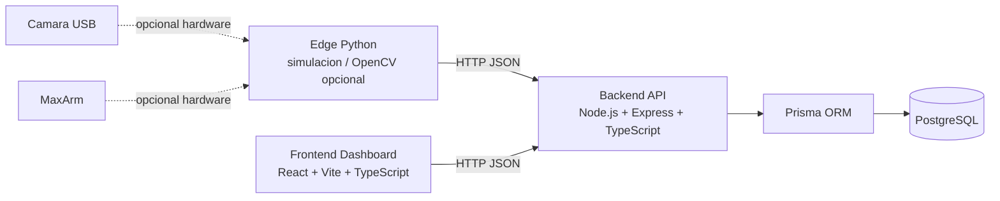
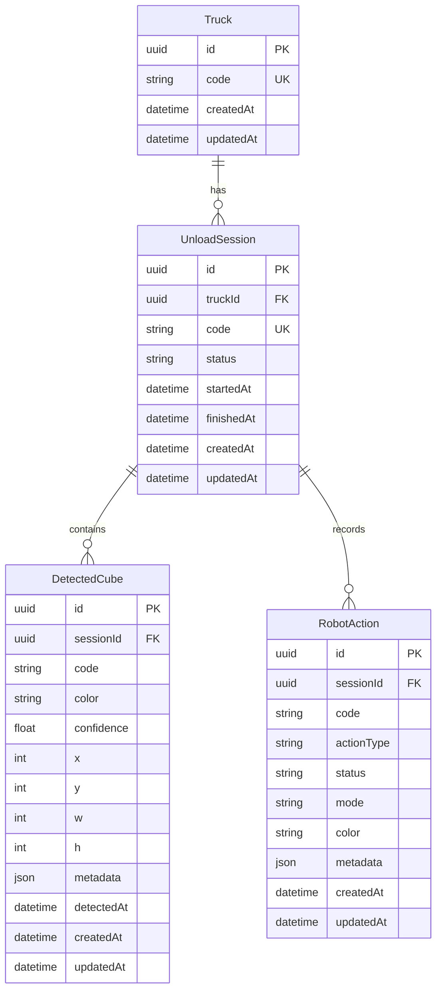

# Arquitectura Entrega 2 - RoboDock AI

## 1. Arquitectura MVP

La Entrega 2 usara una arquitectura local y simple, orientada a demostrar el flujo funcional antes que una plataforma completa.



Principios para Entrega 2:

- Backend como fuente de verdad de sesiones, cubos, acciones y estado operacional.
- Edge como productor de eventos, en modo simulado por defecto.
- Frontend como dashboard operacional minimo, consumiendo API real.
- PostgreSQL + Prisma para persistencia relacional.
- Maximo 3 endpoints principales, alineados con la rubrica de Entrega 1.
- Sin autenticacion, colas, WebSockets, streaming productivo ni control obligatorio de hardware.

## 2. Componentes principales

| Componente | Tecnologia | Rol en MVP | Evolucion futura |
|---|---|---|---|
| Backend API | Node.js, Express, TypeScript | Expone endpoints, valida payloads, persiste datos y arma estado operacional | Separar modulos, auth, auditoria avanzada |
| Prisma ORM | Prisma | Define modelo minimo y acceso seguro a PostgreSQL | Migraciones completas, indices avanzados, seeds por ambiente |
| Base de datos | PostgreSQL | Guarda camiones, sesiones, detecciones y acciones | Modelo completo con edge nodes, calibraciones, drop zones y logs |
| Edge | Python | Simula QR, detecciones y acciones robot; opcionalmente adapta salida de spikes | Vision real continua, serial MaxArm, calibracion |
| Frontend | React, Vite, TypeScript | Muestra dashboard operacional minimo | Historico, analytics, stream de camara, configuracion |
| Spikes | Python / HTML / FastAPI experimental | Referencia tecnica para QR, color, dashboard y MaxArm dry run | Fuente para extraer funciones o contratos, no codigo productivo completo |

## 3. Responsabilidades

### Backend

- Crear o reutilizar `Truck` por `truckCode`.
- Crear `UnloadSession` con `id` UUID tecnico y `code` funcional.
- Registrar detecciones de cubos enviadas por Edge.
- Registrar acciones simuladas del robot.
- Exponer estado operacional para el dashboard.
- Validar entradas y devolver JSON consistente.
- Documentar variables en `.env.example`.

### Frontend

- Consultar el estado operacional desde backend.
- Mostrar camion, sesion, estado, conteos por color y ultimas acciones.
- Manejar estados de carga, vacio y error.
- Evitar funcionalidades secundarias como analytics, historico o configuracion.

### Edge

- Ejecutar flujo simulado de Entrega 2:
  - generar o recibir `truckCode`;
  - enviar inicio de sesion;
  - enviar detecciones de cubos;
  - enviar accion robot simulada.
- Reutilizar como referencia los spikes:
  - `truck_code_detection` para QR;
  - `vision_color_detection` e `integrated_vision_detection` para cubos;
  - `dynamic_pickup_maxarm_pick` para secuencia/dry run MaxArm.
- Mantener hardware real como opcional, no requisito de aprobacion de Entrega 2.

## 4. Contratos entre componentes

### Edge -> Backend

El Edge se comunica por HTTP JSON. Para el MVP no se requiere streaming ni conexion persistente.

Eventos aceptados por el backend:

- `CUBES_DETECTED`: registra cubos y conteos.
- `ROBOT_ACTION_RECORDED`: registra accion simulada del MaxArm.
- `SESSION_COMPLETED`: opcional para cerrar la sesion si queda tiempo.

Ejemplo de evento de deteccion:

```json
{
  "sessionId": "uuid",
  "eventType": "CUBES_DETECTED",
  "payload": {
    "source": "simulation",
    "summary": {
      "red": 1,
      "blue": 2,
      "green": 0,
      "yellow": 1,
      "total": 4
    },
    "detections": [
      {
        "color": "red",
        "x": 143,
        "y": 323,
        "w": 84,
        "h": 68,
        "confidence": 0.9
      }
    ]
  }
}
```

Ejemplo de evento de accion robot:

```json
{
  "sessionId": "uuid",
  "eventType": "ROBOT_ACTION_RECORDED",
  "payload": {
    "actionType": "PICK_AND_DROP",
    "status": "SUCCESS",
    "mode": "simulation",
    "color": "red",
    "metadata": {
      "dryRun": true,
      "commandPreview": "POSE 32 -204 124 1"
    }
  }
}
```

### Frontend -> Backend

El frontend consume solo estado operacional agregado.

Contrato esperado:

```json
{
  "activeSession": {
    "id": "uuid",
    "code": "UNLOAD-20260607-001",
    "status": "IN_PROGRESS",
    "truckCode": "TRUCK-001",
    "startedAt": "2026-06-07T21:00:00.000Z"
  },
  "counts": {
    "red": 1,
    "blue": 2,
    "green": 0,
    "yellow": 1,
    "total": 4
  },
  "lastActions": [
    {
      "id": "uuid",
      "code": "ACTION-001",
      "actionType": "PICK_AND_DROP",
      "status": "SUCCESS",
      "mode": "simulation",
      "createdAt": "2026-06-07T21:01:00.000Z"
    }
  ]
}
```

## 5. Endpoints minimos

Nota de implementacion: el backend MVP validado por QA usa rutas sin prefijo `/api`. El prefijo `/api` queda como posible evolucion futura si se decide versionar o agrupar la API.

### `GET /health`

Verifica que el backend esta vivo.

Respuesta `200`:

```json
{
  "status": "ok",
  "service": "robodock-api"
}
```

### `POST /sessions`

Crea una sesion de descarga para un camion identificado.

Request:

```json
{
  "truckCode": "TRUCK-001"
}
```

Respuesta `201`:

```json
{
  "session": {
    "id": "uuid",
    "code": "UNLOAD-20260607-001",
    "status": "IN_PROGRESS",
    "truckCode": "TRUCK-001"
  }
}
```

### `POST /sessions/:id/cubes`

Registra cubos detectados o simulados en una sesion.

Request:

```json
{
  "source": "simulation",
  "cubes": [
    {
      "color": "red",
      "x": 143,
      "y": 323,
      "w": 84,
      "h": 68,
      "confidence": 0.9
    }
  ]
}
```

Respuesta `201`:

```json
{
  "session": {
    "id": "uuid",
    "code": "UNLOAD-20260607-001",
    "status": "IN_PROGRESS",
    "truckCode": "TRUCK-001"
  }
}
```

### `POST /robot/actions`

Registra una accion simulada del robot.

Request:

```json
{
  "sessionId": "uuid",
  "actionType": "PICK_AND_DROP",
  "status": "SUCCESS",
  "mode": "simulation",
  "color": "red",
  "metadata": {
    "dryRun": true
  }
}
```

Respuesta `201`:

```json
{
  "action": {
    "id": "uuid",
    "code": "ACTION-001",
    "sessionId": "uuid",
    "actionType": "PICK_AND_DROP",
    "status": "SUCCESS",
    "mode": "simulation",
    "color": "red"
  }
}
```

### `GET /dashboard/operational`

Entrega el estado operacional actual para el dashboard.

Respuesta `200`:

```json
{
  "activeSession": {},
  "counts": {},
  "lastActions": []
}
```

Endpoints auxiliares implementados para prueba y trazabilidad:

- `GET /sessions`
- `GET /sessions/:id`

Nota arquitectonica: el plan original contemplaba un endpoint unico de eventos Edge. La implementacion MVP actual usa rutas REST granulares sin prefijo `/api` para facilitar pruebas academicas y consumo directo desde Edge simulado.

## 6. Modelo de datos minimo

El modelo minimo evita replicar todas las entidades de Entrega 1. Debe permitir demostrar sesion, deteccion, robot y dashboard.



Reglas de modelo:

- `id`: UUID tecnico interno.
- `code`: identificador funcional visible.
- `Truck.code`: unico, por ejemplo `TRUCK-001`.
- `UnloadSession.code`: unico, por ejemplo `UNLOAD-20260607-001`.
- `DetectedCube.color`: valores permitidos `red`, `blue`, `green`, `yellow`.
- `RobotAction.status`: valores minimos `PLANNED`, `SUCCESS`, `ERROR`.
- `RobotAction.mode`: valores minimos `simulation`, `hardware`.
- `metadata`: JSON para conservar datos de spikes sin ampliar el modelo prematuramente.

Evolucion futura:

- `EdgeNode`, `CameraDevice`, `RobotArm`, calibraciones, `DropZone`, `DropPosition`, `RobotActionStep`, `Event` y `SystemLog`.
- Restricciones transaccionales para posiciones de descarga.
- Auditoria y trazabilidad tecnica fina.

## 7. Flujo principal end-to-end

1. El operador o Edge identifica un camion con `truckCode`.
2. Edge o una prueba HTTP llama a `POST /sessions`.
3. Backend crea o reutiliza `Truck`.
4. Backend crea `UnloadSession` en estado `IN_PROGRESS`.
5. Edge simula o detecta cubos y llama a `POST /sessions/:id/cubes`.
6. Backend registra `DetectedCube` y deja disponible el conteo por color.
7. Edge simula una accion MaxArm y llama a `POST /robot/actions`.
8. Backend registra `RobotAction`.
9. Frontend llama a `GET /dashboard/operational`.
10. Dashboard muestra camion, sesion, conteos y ultimas acciones.

## 8. Modo simulation vs modo hardware

### Modo simulation

Es el modo principal para Entrega 2.

- No requiere camara ni MaxArm.
- Usa payloads deterministicos o archivos JSON de ejemplo.
- Permite validar backend, persistencia, dashboard y flujo E2E.
- Las acciones robot se registran con `mode = "simulation"` y `dryRun = true`.

### Modo hardware

Es opcional para Entrega 2 y queda como base para entrega final.

- Puede reutilizar QR y deteccion de cubos desde los spikes de OpenCV.
- Puede usar `dry_run=true` del spike MaxArm para previsualizar comandos.
- El movimiento real del MaxArm no es requisito.
- Si se activa, debe ser explicito mediante variables/configuracion y documentarse como evidencia adicional.

Regla de seguridad: nunca mover hardware por defecto. El modo inicial debe ser simulation o dry run.

## 9. Riesgos tecnicos

| Riesgo | Impacto | Mitigacion |
|---|---|---|
| Modelo de datos demasiado grande | Alto | Implementar solo 4 entidades MVP y dejar el resto como evolucion futura. |
| API con demasiados endpoints | Medio | Mantener solo rutas REST necesarias para sesion, cubos, robot y dashboard. |
| Edge acoplado a OpenCV real | Alto | Mantener simulacion por defecto y adaptar spikes de forma opcional. |
| Dashboard bloqueado por datos incompletos | Medio | Exponer estado operacional agregado desde backend. |
| PostgreSQL/Prisma ralentiza entrega | Medio | Usar schema minimo, seed simple y comandos documentados. |
| Claims de hardware no demostrados | Medio | Separar claramente simulation, dry run y hardware real. |
| Falta de validacion de payloads | Medio | Validar `truckCode`, `eventType`, colores y campos obligatorios. |
| Inconsistencia entre docs y codigo | Medio | Documenter/Governance deben revisar lo implementado al cierre. |

## 10. Decisiones recomendadas como ADR

1. **ADR-001: Arquitectura local edge-first para Entrega 2**
   - Decision: Backend central con Edge productor de eventos y Frontend consumidor de estado.
   - Motivo: conserva la vision del producto sin introducir infraestructura compleja.

2. **ADR-002: Modo simulation como camino principal del MVP**
   - Decision: Entrega 2 se valida con simulacion/dry run; hardware queda opcional.
   - Motivo: reduce riesgo de demo y permite evaluar software funcional.

3. **ADR-003: Modelo Prisma minimo**
   - Decision: usar `Truck`, `UnloadSession`, `DetectedCube` y `RobotAction`.
   - Motivo: cubre historias Must sin implementar el modelo completo de Entrega 1.

4. **ADR-004: Endpoint unico de eventos Edge**
   - Decision original: consolidar detecciones y acciones robot en un endpoint unico de eventos Edge.
   - Estado Entrega 2: reemplazada en la implementacion MVP por rutas REST sin prefijo `/api`.
   - Motivo: mantiene API pequeña y extensible.

5. **ADR-005: Dashboard operacional agregado**
   - Decision: frontend consume `GET /dashboard/operational`.
   - Motivo: evita que el frontend conozca detalles internos del modelo y facilita la demo.
