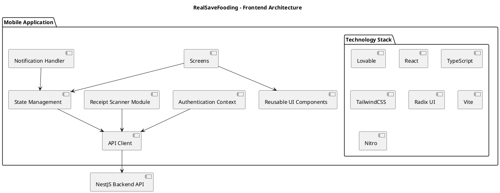
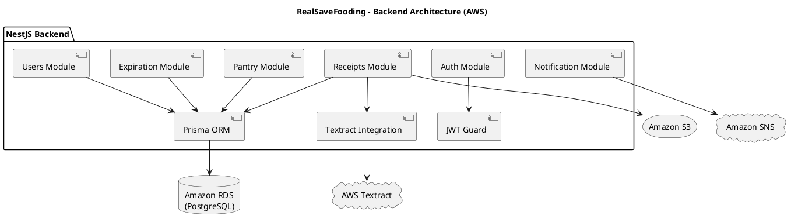
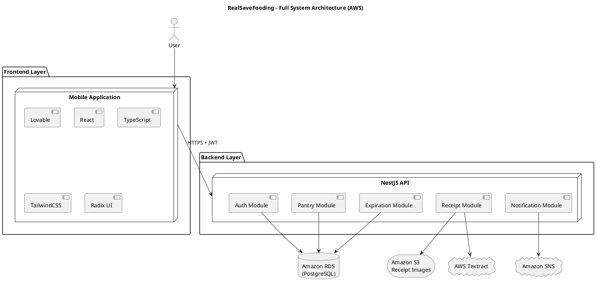
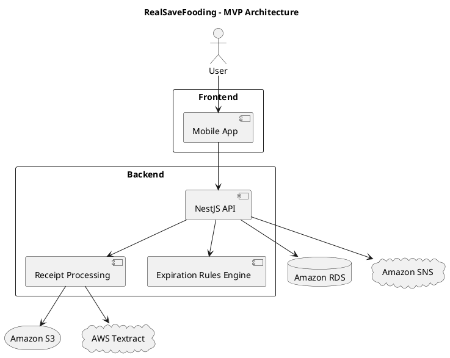
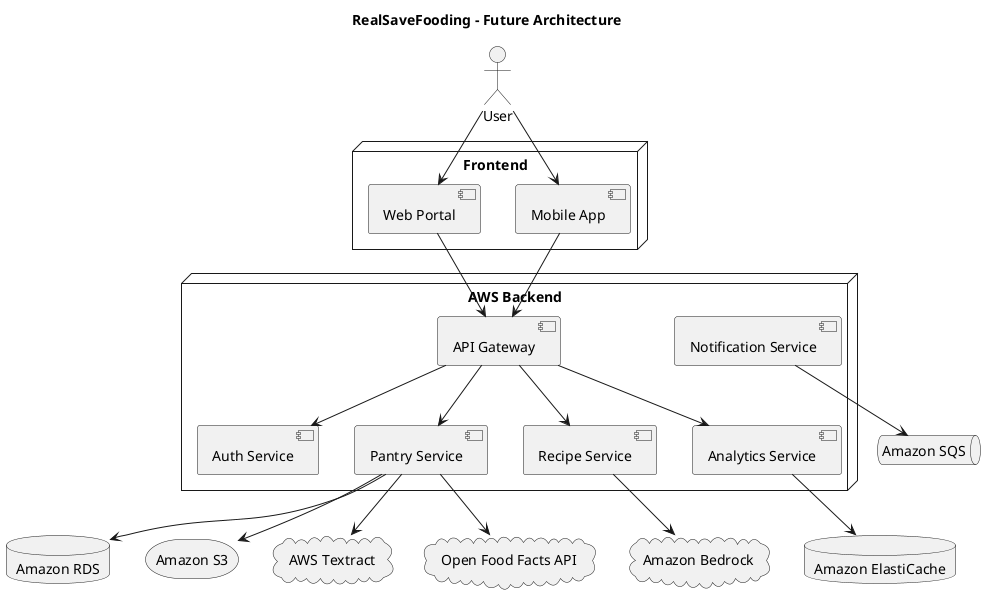
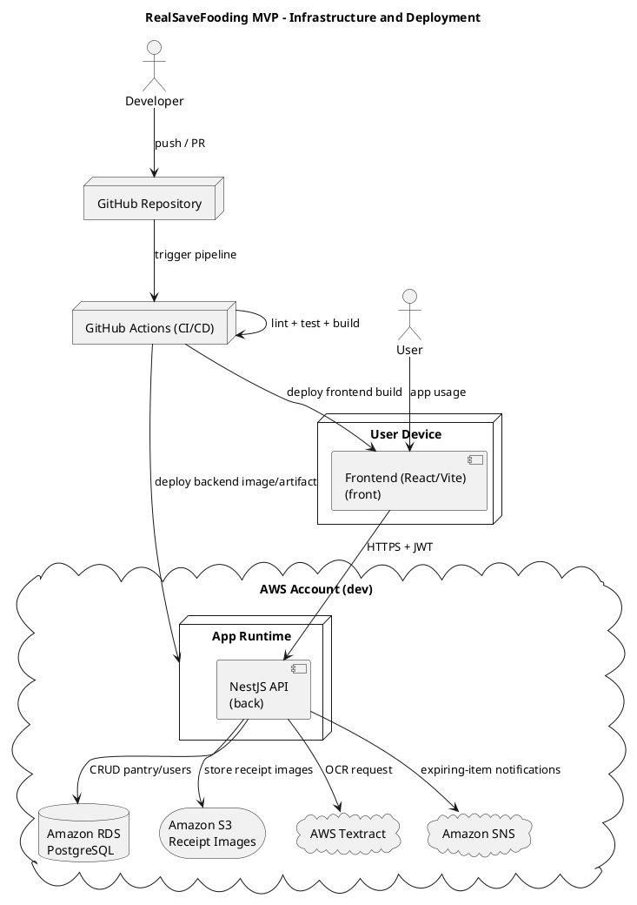

# 2. Arquitectura del Sistema

## **2.1. Diagrama de arquitectura:**
Frontend Architecture


Backend Architecture (AWS-based)

Full System Architecture (AWS)

MVP Architecture (AWS)

This is what I would actually implement.


Future Architecture (Non-MVP)

If you want to show how RealSaveFooding could evolve:




## **2.2. Descripción de componentes principales:**

```text
MVP
|
├──Frontend
|  └─── Lovable / React
|
├──Backend
|  └─-- NestJS + Prisma
|
├──Database
|  └──-- Local: Docker PostgreSQL
|  └──-- AWS: Amazon RDS PostgreSQL
|       (Aurora PostgreSQL Serverless as future evolution)
|
├──Storage
|  └─-- Amazon S3
|
├──OCR
|  └─-- AWS Textract
|
├──Notifications
   └─ Amazon SNS
```

```text
Future Work (design only)
│
├── AI Features
│   ├── Recipe Generation
│   │   └── Amazon Bedrock
│   │
│   └── Smart Expiration Prediction
│       ├── Amazon Bedrock
│       └── Amazon SageMaker
│
├── Scalability & Architecture
│   └── Event-Driven Processing
│       └── Amazon SQS
│
├── Performance & Analytics
│   └── Analytics Dashboard
│       └── Amazon ElastiCache
│
├── External Integrations
│   └── Barcode Enrichment
│       └── Open Food Facts API
│
└── Collaboration Features
    └── Household Collaboration
        └── Additional Backend Modules
            ├── Household Module
            ├── Household Members Module
            ├── Shared Pantry Module
            └── Role & Permissions Management
```


## **2.3. Descripción de alto nivel del proyecto y estructura de ficheros**

MVP-first repository structure implemented in this repository:

```text
RealSaveFooding/
├── front/
│   ├── src/
│   │   ├── app/                           # New MVP composition entrypoints
│   │   ├── features/                      # New feature-oriented MVP folders
│   │   │   ├── auth/
│   │   │   ├── pantry/
│   │   │   ├── receipts/
│   │   │   ├── dashboard/
│   │   │   └── notifications/
│   │   ├── shared/
│   │   │   ├── api/
│   │   │   ├── hooks/
│   │   │   ├── lib/
│   │   │   ├── types/
│   │   │   └── ui/
│   │   ├── components/                    # Existing code kept for safe migration
│   │   ├── hooks/                         # Existing code kept for safe migration
│   │   ├── lib/                           # Existing code kept for safe migration
│   │   ├── routes/                        # Existing route files
│   │   ├── router.tsx
│   │   ├── routeTree.gen.ts
│   │   ├── server.ts
│   │   ├── start.ts
│   │   └── styles.css
│   └── tests/
│
├── back/
│   ├── src/
│   │   ├── main.ts
│   │   ├── app.module.ts
│   │   ├── common/
│   │   ├── config/
│   │   ├── database/
│   │   ├── health/
│   │   ├── integrations/
│   │   │   ├── aws-s3/
│   │   │   ├── aws-textract/
│   │   │   └── aws-sns/
│   │   └── modules/
│   │       ├── auth/
│   │       ├── users/
│   │       ├── pantry/
│   │       ├── receipts/
│   │       ├── expiration/
│   │       ├── notifications/
│   │       └── dashboard/
│   ├── prisma/
│   │   ├── schema.prisma
│   │   ├── migrations/
│   │   └── seed.ts
│   ├── test/
│   ├── package.json
│   ├── tsconfig.json
│   ├── tsconfig.build.json
│   ├── nest-cli.json
│   └── .env.example
│
├── infra/
│   ├── terraform/
│   │   └── envs/
│   │       └── dev/
│   └── docker/
│       └── docker-compose.local.yml
│
├── docs/
│   ├── db/
│   │   └── database-model.md
│   ├── architecture/
│   │   ├── context-diagram.md
│   │   ├── container-diagram.md
│   │   └── decisions/
│   ├── api/
│   │   └── openapi.yaml
│   └── testing/
│       └── test-strategy.md
│
├── tests/
│   └── e2e/
│
├── .github/
│   └── workflows/
│       └── ci.yml
│
└── .env.example
```

Can be introduced later:

- `infra/terraform/envs/prod`
- `tests/performance` and `tests/contract`
- Additional docs/runbooks and advanced CI gates

## **2.4. Infraestructura y despliegue**

MVP infrastructure (AWS-focused):

- Frontend: React app in `front/` built with Vite/Nitro.
- Backend API: NestJS service in `back/` (containerized for deployment).
- Database: Amazon RDS PostgreSQL.
- Receipt image storage: Amazon S3.
- OCR processing: AWS Textract.
- Notifications: Amazon SNS.
- Infrastructure management: Terraform (`infra/terraform/envs/dev`).
- CI/CD orchestration: GitHub Actions (`.github/workflows`).

MVP infrastructure diagram:



Deployment process followed (MVP):

1. Local development
    - Frontend runs with `bun run dev` in `front/`.
    - Backend runs in `back/` with NestJS local env vars.
    - Local support services (optional) run through `infra/docker/docker-compose.local.yml`.

2. Source control and branching
    - Developer opens a feature branch and creates a pull request.
    - PR review validates architecture alignment (modules, DTOs, contracts).

3. Continuous Integration (on PR)
    - Install dependencies.
    - Run lint and tests (frontend and backend).
    - Build frontend and backend artifacts.
    - Optional: run Prisma migration checks.

4. Infrastructure provisioning (dev)
    - Terraform in `infra/terraform/envs/dev` provisions or updates:
      - RDS instance
      - S3 bucket for receipts
      - SNS topic(s)
      - IAM roles/policies required by backend

5. Application deployment (dev)
    - Backend artifact/container is deployed to the selected runtime.
    - Frontend static build is deployed to the selected hosting target.
    - Environment variables are injected from the dev environment configuration.

6. Data and app startup
    - Prisma migrations are executed against RDS.
    - Health endpoint checks verify API readiness.
    - Smoke test verifies the critical flow:
      - login -> create pantry item -> upload receipt -> Textract processing -> expiration alert.

7. Monitoring and rollback (basic MVP)
    - Logs are reviewed after deployment.
    - If smoke tests fail, rollback to previous backend artifact and frontend build.

MVP notes:

- Only one cloud environment (`dev`) is required for the academic scope.
- `prod` and advanced release strategies (blue/green, canary) are intentionally left for future iterations.

## **2.5. C4 Model**

[C4 Model](C4-Model.md)

## **2.6. Seguridad**

Security baseline for MVP architecture:

1. Authentication and access control
- JWT-based protection for private API endpoints.
- Ownership checks required for pantry, receipt, and shared-household operations.
- Sensitive account actions should require recent authentication.

2. Data protection
- HTTPS is required in deployed environments.
- Receipt files in S3 must be private by default.
- Environment secrets (JWT secret, AWS credentials, database URL) must remain outside source code.

3. API and input hardening
- DTO validation for all external payloads.
- File upload constraints (type and size validation).
- Error handling must avoid internal detail leakage.

4. Integration security
- Least-privilege IAM for Textract, S3, and SNS adapters.
- OCR output is treated as untrusted input until validated.
- Notification payloads should contain minimal personal data.

5. Audit and monitoring expectations
- Traceability for critical actions (actor + timestamp).
- Logging for failed authentication and integration failures.
- Log redaction policy for PII and receipt content.

Documented risks from the current architecture (not fixed in this section):

- Single-environment concentration (`dev`) increases operational and data-mixing risk.
- JWT lifecycle controls are not yet fully specified (rotation/revocation policy pending).
- Shared pantry authorization rules need explicit boundary definitions to avoid horizontal access issues.
- Missing explicit throttling policy leaves auth flows exposed to brute-force attempts.
- Sensitive receipt data handling depends on correct bucket policy and retention configuration.

Reference details:
- Security NFR and readiness checklist are defined in [docs/product/3_PRD.md](../product/3_PRD.md).
- C4 security mapping is documented in [docs/architecture/C4-Model.md](C4-Model.md).

## **2.7. Tests**

MVP test strategy covers three levels:

- Frontend component tests for critical screens and UX flows.
- Backend unit and integration tests for domain modules and API behavior.
- End-to-end validation for the critical flow: login -> pantry -> receipt upload -> OCR path.

Security-oriented coverage documented for MVP includes:

- Authentication and authorization checks (invalid/missing JWT, ownership boundaries).
- Input and upload validation checks (payload validation, file constraints).
- Integration safety checks (OCR output validation, notification payload minimization).
- Abuse-resistance baseline checks (throttling behavior once enabled, failed-auth audit events).
- Data protection checks (no secret leakage in fixtures/logs).

Reference:
- Detailed strategy: [docs/testing/test-strategy.md](../testing/test-strategy.md)

---

## 3. Database model
- [Database Model](../db/database-model.md)
