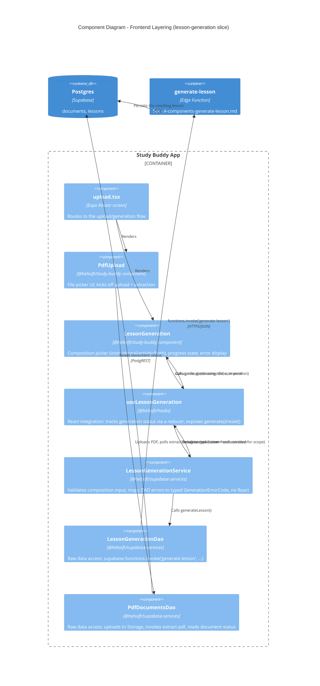

# C4 — Component Diagram: Frontend Layering (Study Buddy App)

Level 3. Audience: developers. Zooms into the `Study Buddy App` container from
[c4-containers.md](./c4-containers.md) to show the layering enforced repo-wide by
`.agents/rules/hooks-service-dao.mdc`:

```
Component → Hook → Service → DAO → Supabase / Edge Function
```

This diagram uses the **lesson generation** vertical slice as the representative example — the
same pattern repeats for every feature (auth, PDF upload, lessons list, lesson attempts, API
key management), each with its own Component/Hook/Service/DAO set.



## Notes

- **DAOs never appear in components.** Only `useLessonGeneration` calls
  `LessonGenerationService`; only the service calls `LessonGenerationDao`. This is the rule in
  `hooks-service-dao.mdc`, not just a convention observed by accident — reviewers
  (`reviewer_slice`) check for it on every slice.
- **Two DAO backends behind the same pattern.** `LessonGenerationDao` invokes an Edge Function;
  other DAOs in the same lib (e.g. `LessonsDao`, `LessonAttemptDao`) talk to Postgres directly via
  PostgREST. The Hook/Service layers above them don't need to know which — that's the point of
  the DAO boundary.
- **State shape.** `useLessonGeneration` uses a `useReducer` (`use-lesson-generation.reducer.ts`)
  because generation has ≥3 related fields that change together (status, error, result) — per
  `state.mdc`.
- **Why this slice.** `lesson-generation` was picked as the representative example because it's
  the deepest chain in the app (component → hook → service → DAO → Edge Function → external AI
  call → persistence) and touches every layer described in `AGENTS.md`. Other features
  (lesson player, activities, saved lessons, settings) follow the identical shape with shallower
  DAOs (straight to Postgres, no Edge Function hop).
