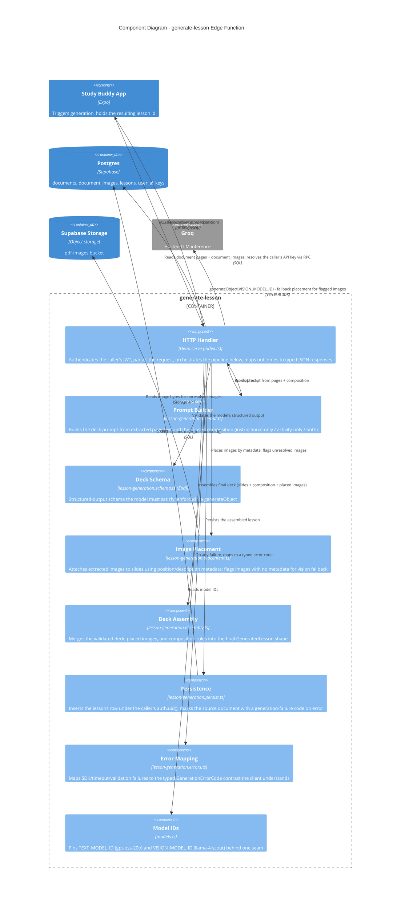

# C4 — Component Diagram: `generate-lesson` Edge Function

Level 3. Audience: developers. Zooms into the `generate-lesson` container from
[c4-containers.md](./c4-containers.md) — chosen because it is the richest container in the
system (prompt construction, structured-output validation, image placement, and persistence all
live here) and its internal seams matter for anyone changing generation behavior.

Source: `supabase/functions/generate-lesson/index.ts` + `./_shared/*.ts` (hand-mirrored from the
Jest-tested modules in `libs/supabase-services/src/services/lesson-generation.*`, since Deno
Edge Functions sit outside this repo's Jest/Stryker harness).

## Notes

- **HTTP Handler is thin by design.** `index.ts` is intentionally orchestration-only glue; every
  decision (prompt shape, schema, placement rule, error mapping) lives in a pure, unit-testable
  module — the comment at the top of `index.ts` calls this out explicitly as a Deno-testing-gap
  mitigation (Jest/Stryker can't run against the Deno runtime in this sandbox).
- **Vision fallback is conditional, not always-on.** The vision-model call only happens for
  images `placement` can't resolve from text metadata (R2's placement rule); slides with no
  resolvable image render text-only rather than failing the whole generation.
- **Composition enforcement isn't a separate component** — it's a parameter threaded through
  `promptBuilder` and validated again in `assembly`/`deckSchema`, per R2.1 (`instructional-only`
  / `activity-only` / `both`).
- **`manage-api-key` and `extract-pdf` are simpler** (HTTP handler + 2-4 pure modules each) and
  are not diagrammed separately — their responsibilities are already fully captured at the
  container level in [c4-containers.md](./c4-containers.md).
