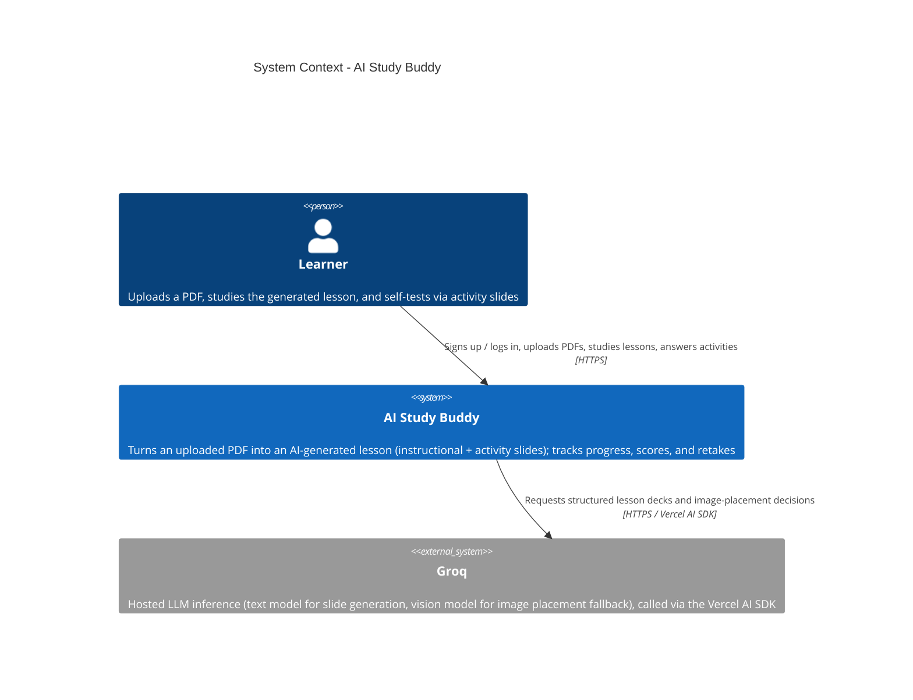

# C4 — System Context: AI Study Buddy

Level 1. Audience: everyone (product, engineering, reviewers).

AI Study Buddy turns an uploaded PDF into an AI-generated lesson of alternating instructional
and activity slides, so a learner can study material and self-test in one flow. Users bring
their own AI provider API key (bring-your-own-key model, v1 provider: Groq).

## Notes

- **Single system boundary.** The Expo app (web/iOS/Android) and its Supabase backend
  (Postgres, Auth, Storage, Edge Functions) are modeled as one system — `AI Study Buddy` — since
  this team owns the schema, RLS policies, and Edge Function code even though Supabase hosts it.
  See [c4-containers.md](./c4-containers.md) for that breakdown.
- **Groq is the only external system.** It is reached exclusively from the `generate-lesson`
  Edge Function — the client never calls it directly and never holds the API key (R2, R6).
- **No other external integrations exist yet.** There is no email/notification provider, no
  payment provider, and no analytics SaaS in the current codebase — the PRD's success metrics
  (§ Success Metrics) are intended to be instrumented but no third-party analytics system is
  wired up as of this writing.
