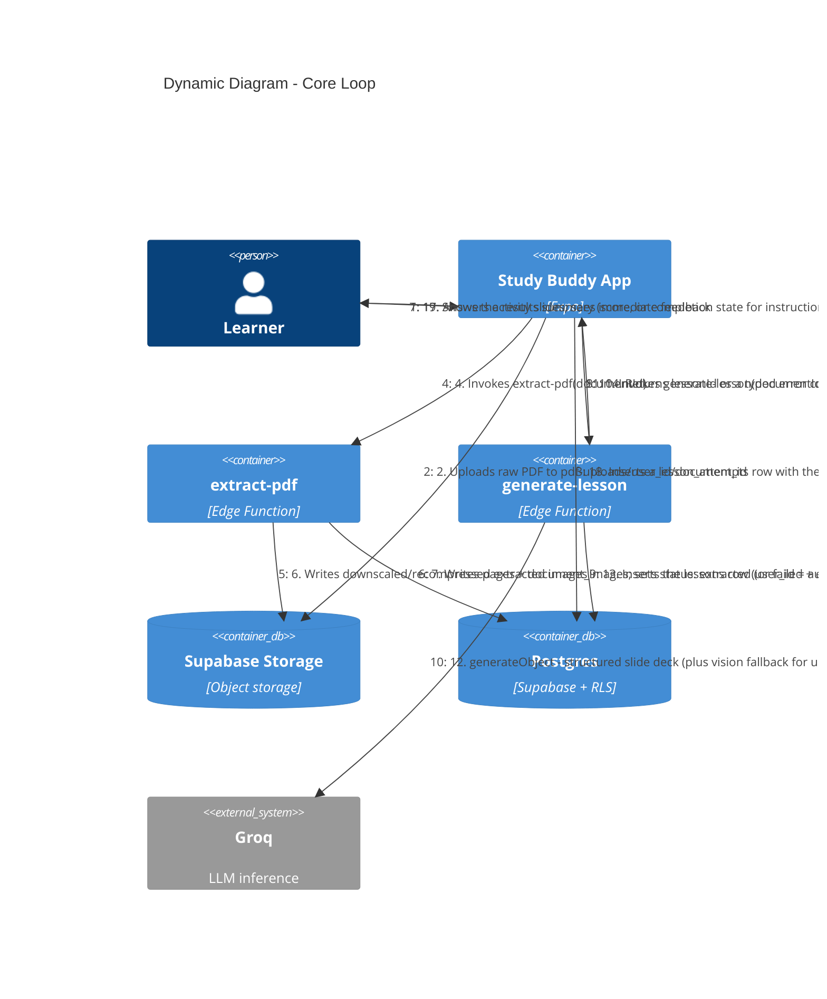

# C4 — Dynamic Diagram: Core Loop (Upload → Generate → Study → Score)

Audience: engineers, technical reviewers. Traces the PRD's headline flow — "upload → generate →
study → score" — across the containers from [c4-containers.md](./c4-containers.md), in call
order. Assumes the learner is already authenticated and has a Groq key saved (see
`c4-components-generate-lesson.md` for `manage-api-key`, not repeated here).

## Notes

- **Steps 1-8 (extraction) and 9-14 (generation) are two independent Edge Function round-trips**,
  not one call — the client owns the state transition between them and can retry extraction
  without re-triggering generation.
- **Step 12 is itself two possible LLM calls** (text model, then a conditional vision-model call)
  — see [c4-components-generate-lesson.md](./c4-components-generate-lesson.md) for that detail;
  this diagram keeps generation as one logical step to stay readable end-to-end.
- **Steps 15-19 (player, activities, scoring, resume) do not go through any Edge Function** —
  the app talks to Postgres directly (RLS-scoped) for slide position and attempt persistence,
  matching R9 and R7 in the PRD.
- Everything after step 1 assumes the learner is authenticated (`Supabase Auth`, per
  [c4-containers.md](./c4-containers.md)) — omitted here to keep the flow scoped to the core loop.
