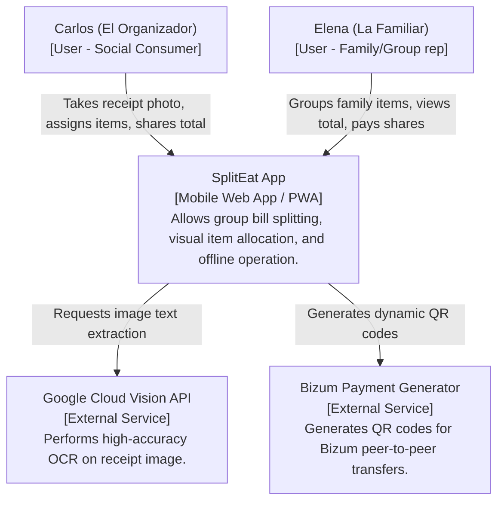
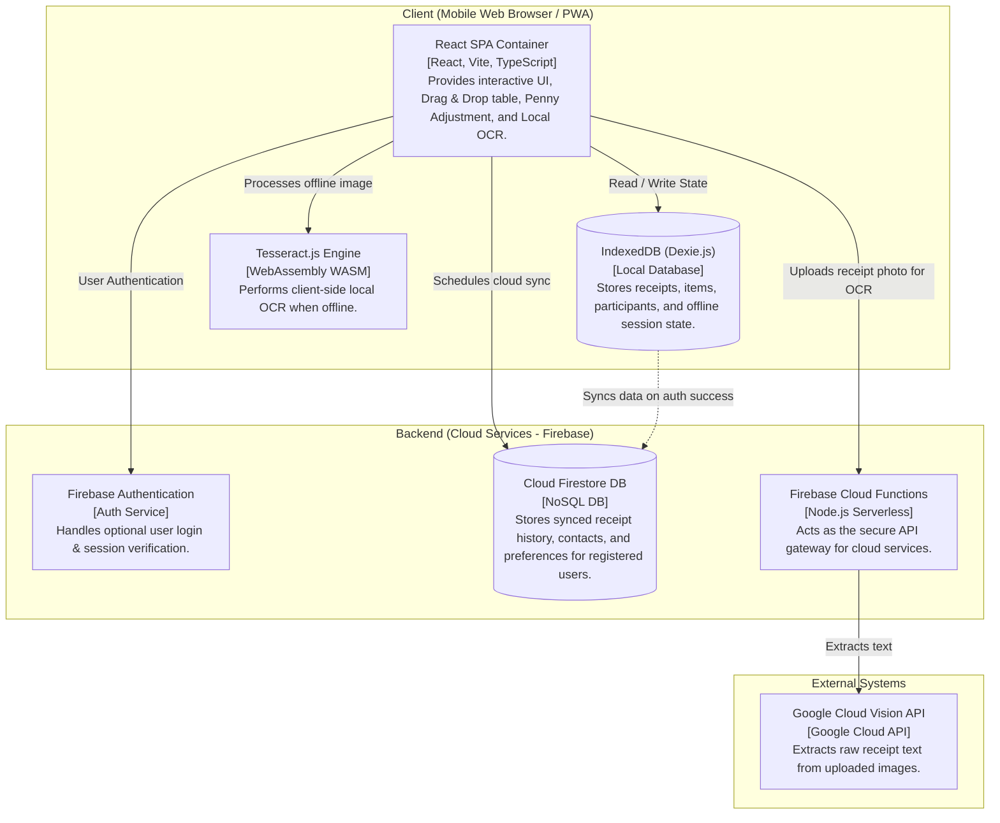
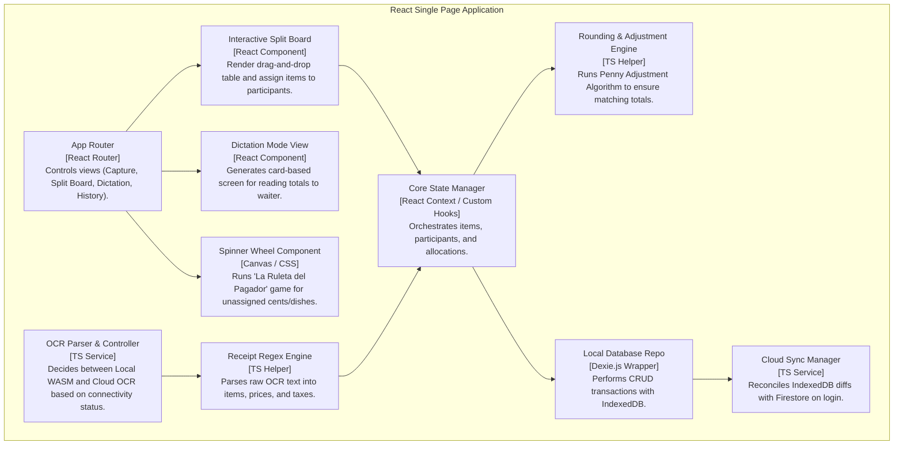
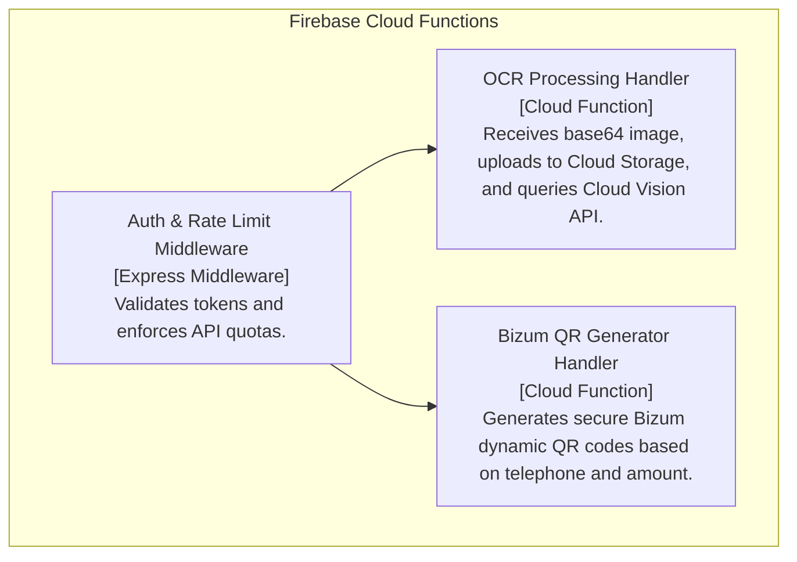
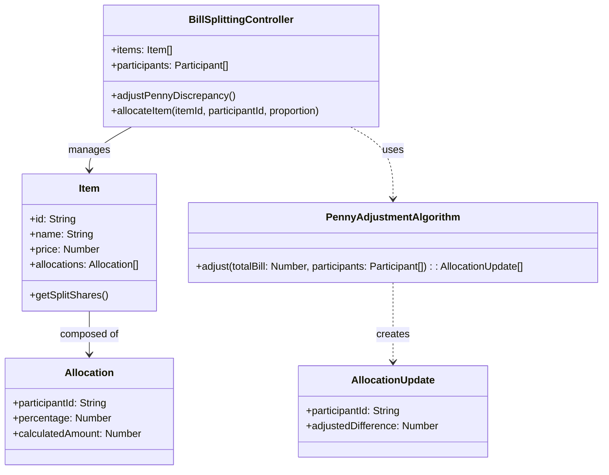

# SplitEat: System Architecture (C4 Model)

This document provides a detailed view of the SplitEat architecture using the **C4 Model** (Context, Container, and Component) to illustrate how the mobile and offline-first restaurant bill-splitting application is structured.

---

## 1. Level 1: System Context Diagram

The System Context diagram shows how SplitEat interacts with users (comensales) and external services.

---

## 2. Level 2: Container Diagram

The Container diagram decomposes SplitEat into its frontend application (running in the client's mobile browser) and backend services (Firebase cloud infrastructure). It highlights the **offline-first** design where the client holds the state and database locally.

---

## 3. Level 3: Component Diagram

This diagram decomposes the **React SPA** (client-side container) and the **Firebase Cloud Functions** (serverless API container) into their internal logical components.

### 3.1 Client Components (React SPA)

### 3.2 Backend Components (Firebase Functions)

---

## 4. Level 4: Code Diagram (Selected Module)

For the critical **Penny Adjustment Algorithm** (mitigating decimal rounding discrepancies), the logical structure is detailed below.

