# 🔧 Component Diagrams - Nura Microkernel Architecture

## 🏗️ Resumen Arquitectónico

La arquitectura de Nura implementa un **Microkernel Pattern híbrido** que integra **DDD + Screaming Architecture + Vertical Slicing + Clean Architecture**. El sistema se organiza en un **nura-core (kernel)** central que orquesta **plugins especializados**, donde cada plugin representa un Bounded Context con vertical slices internos.

### Principios de Diseño Híbridos

- **Microkernel Pattern**: nura-core como hub central, plugins como bounded contexts
- **DDD Integration**: Plugins = BCs, Kernel = Shared Kernel, Event-driven integration
- **Screaming Architecture**: Estructura revela intención a múltiples niveles (macro + micro)
- **Vertical Slicing**: Features completos end-to-end dentro de cada plugin
- **Clean Architecture**: Dependency inversion dentro de cada plugin
- **Plugin Extensibility**: Hot-swappable plugins con registration dinámico

---

## 🟣 Nura-Core (Microkernel)

**Responsabilidad**: Hub central que provee servicios de infraestructura compartidos y orquesta comunicación entre plugins.

### 🔧 Kernel Architecture Overview

```mermaid
graph TB
    subgraph "🟣 NURA-CORE (Microkernel)"
        subgraph "Core Services"
            NR[🔄 nura-router<br/>Intent Routing & Distribution]
            NPM[🔌 nura-plugin-manager<br/>Plugin Lifecycle Management]
            EB[📡 event-bus<br/>Async Pub/Sub Communication]
            CS[💾 context-store<br/>Shared Memory & Session State]
        end
        
        subgraph "Intelligence Services"
            VR[🔍 vector-retriever<br/>Vector Database Search Interface]
            VG[🤖 vector-generator<br/>Embedding Generation Service]
            LLM[🧠 nura-llm-gateway<br/>LLM Orchestration & Fallbacks]
            CONF[📊 nura-confidence-engine<br/>Response Quality Scoring]
        end
        
        subgraph "Infrastructure Services"
            SEC[🔒 nura-security<br/>Auth, RBAC, Rate Limiting]
            OAUTH[🔐 nura-oauth<br/>Social Auth & Corporate SSO]
            CFG[⚙️ nura-config<br/>Feature Flags & Tenant Config]
            TEL[📊 nura-telemetry<br/>Observability & Metrics]
            PER[💾 nura-persistence<br/>Data Layer Abstractions]
            API[📡 nura-api<br/>Public REST/WebSocket Surface]
        end
    end
    
    %% Core Service Dependencies
    NR --> EB
    NR --> CS
    NR --> CONF
    NPM --> EB
    NPM --> CFG
    
    %% Intelligence Service Dependencies  
    VR --> PER
    VG --> LLM
    LLM --> TEL
    CONF --> CS
    
    %% Infrastructure Dependencies
    API --> SEC
    API --> OAUTH
    API --> NR
    SEC --> OAUTH
    OAUTH --> PER
    OAUTH --> CFG
    TEL --> PER
    CFG --> PER
```



### 🔧 Kernel Components Deep Dive

#### Core Services Layer

**nura-router**

**Responsabilidad**: Análisis inteligente de intenciones de usuario y enrutamiento dinámico hacia plugins especializados con balanceo de carga

```mermaid
graph LR
    subgraph "nura-router"
        IR[🎯 Intent Recognition]
        PS[🔌 Plugin Selection]
        LB[⚖️ Load Balancing]
        RT[🔄 Request Transformation]
    end
    
    UserQuery[👤 User Query] --> IR
    IR --> PS
    PS --> LB
    LB --> RT
    RT --> TargetPlugin[🎯 Target Plugin]
    
    PluginRegistry[📋 Plugin Registry] --> PS
    RoutingRules[📏 Routing Rules] --> PS
```



**nura-plugin-manager**

**Responsabilidad**: Gestión completa del ciclo de vida de plugins incluyendo registro, dependencias, salud y hot-swapping

```mermaid
graph TB
    subgraph "nura-plugin-manager"
        PR[📋 Plugin Registry]
        LC[🔄 Lifecycle Controller]
        DC[🔗 Dependency Controller]
        HC[💓 Health Checker]
    end
    
    PluginManifest[📄 Plugin Manifest] --> PR
    PR --> LC
    LC --> DC
    DC --> HC
    
    LC --> PluginInstance[🔌 Plugin Instance]
    HC --> PluginStatus[📊 Plugin Status]
```



**event-bus**

**Responsabilidad**: Comunicación asíncrona inter-plugin con pub/sub, enrutamiento inteligente y manejo de fallos


**context-store**

**Responsabilidad**: Gestión centralizada de estado de sesión, contexto conversacional y preferencias con políticas de privacidad


---

## 🚀 Advanced RAG Strategies Implementation

### 🔄 Late Chunking Strategy Component

**Responsabilidad**: Contextualización dinámica de chunks post-retrieval para mejora de relevancia


### 🎯 Contextual Retrieval Strategy Component

**Responsabilidad**: Enriquecimiento contextual de chunks antes del embedding y híbrido BM25+semantic


### 🤖 Advanced RAG Integration Flow


---

## 🔌 Plugin Architecture Overview

### Plugin Ecosystem

**Responsabilidad**: Arquitectura completa de plugins organizados por bounded contexts con comunicación bidireccional con kernel central


### Plugin Registration Pattern

**Responsabilidad**: Protocolo estandardizado de registro y activación de plugins con validación de dependencias y capacidades


#### Infrastructure Services Layer

**nura-oauth (Social Authentication & Corporate SSO)**

**Responsabilidad**: Autenticación corporativa integrada con Google Workspace, mapeo de dominios y gestión de sesiones SSO


**nura-oauth Integration with nura-security**

**Responsabilidad**: Integración fluida entre autenticación OAuth y sistema de seguridad para validación y creación de contexto


---

## 🔵 Agent Plugins (Bounded Context)

### Dev Agent Plugin

**Responsabilidad**: Mentoring técnico contextual con educación de negocio integrada


### PM Agent Plugin

**Responsabilidad**: Business context, requirements analysis, y project management guidance

```mermaid
graph TB
    subgraph "🔵 pm-agent Plugin (BC)"
        subgraph "🟢 requirements/ (Feature Slice)"
            subgraph "Presentation Layer"
                RA[Requirements API Handler]
                RE[Requirements Events Handler]
            end
            subgraph "Application Layer"
                RAn[Requirements Analyzer]
                VS[Validation Service]
            end
            subgraph "Domain Layer"
                Req[Requirement Entity]
                AC[Acceptance Criteria]
            end
            subgraph "Infrastructure Layer"
                RR[Requirements Repository]
                CT[Confluence Tool]
            end
        end
        
        subgraph "🟢 business-context/ (Feature Slice)"
            subgraph "Presentation Layer"
                BCA[Business Context API Handler]
                BCE[Business Context Events Handler]
            end
            subgraph "Application Layer"
                BCAn[Business Context Analyzer]
                RM[Rules Mapper]
            end
            subgraph "Domain Layer"
                BC[Business Context]
                BR[Business Rule]
            end
            subgraph "Infrastructure Layer"
                BCR[Business Context Repository]
                BI[Business Intelligence Store]
            end
        end
        
        subgraph "Plugin Infrastructure"
            PI[Plugin Interface]
            EM[Event Manager]
            CM[Config Manager]
        end
    end
    
    %% Event-driven communication with kernel
    PI <==> KERNEL[🟣 nura-core]
    EM <==> KERNEL
    
    %% Internal plugin communication
    RA --> RAn
    RE --> RAn
    RAn --> Req
    VS --> AC
    Req --> RR
    AC --> CT
    
    BCA --> BCAn
    BCE --> BCAn
    BCAn --> BC
    RM --> BR
    BC --> BCR
    BR --> BI
```



### Architect Agent Plugin

**Responsabilidad**: Architectural guidance, pattern recommendations, system design


---

## 🔵 Interface Plugins (Bounded Context)

### Streamlit Interface Plugin (MVP)

**Responsabilidad**: Interface minimalista para validación rápida de hipótesis

```mermaid
graph TB
    subgraph "🔵 streamlit-interface Plugin (BC)"
        subgraph "🟢 chat-experience/ (Feature Slice)"
            subgraph "Presentation Layer"
                CI[Chat Interface Component]
                MI[Message Input Component]
            end
            subgraph "Application Layer"
                CM[Chat Manager]
                RM[Response Manager]
            end
            subgraph "Domain Layer"
                ChatSession[Chat Session]
                Message[Message Entity]
            end
            subgraph "Infrastructure Layer"
                SS[Session State Manager]
                WS[WebSocket Client]
            end
        end
        
        subgraph "🟢 conversation-history/ (Feature Slice)"
            subgraph "Presentation Layer"
                CL[Conversation List Component]
                CS[Conversation Sidebar]
            end
            subgraph "Application Layer"
                ConvManager[Conversation Manager]
            end
            subgraph "Domain Layer"
                Conversation[Conversation Entity]
            end
            subgraph "Infrastructure Layer"
                ConvStore[Conversation Store]
            end
        end
        
        subgraph "🟢 agent-status/ (Feature Slice)"
            subgraph "Presentation Layer"
                ASC[Agent Status Component]
                MC[Metrics Component]
            end
            subgraph "Application Layer"
                SM[Status Manager]
            end
            subgraph "Domain Layer"
                AgentStatus[Agent Status]
            end
            subgraph "Infrastructure Layer"
                SC[Status Cache]
            end
        end
        
        subgraph "Plugin Infrastructure"
            PI[Plugin Interface]
            EM[Event Manager]
            SC[Streamlit Config]
        end
    end
    
    %% Event-driven communication with kernel
    PI <==> KERNEL[🟣 nura-core]
    EM <==> KERNEL
    
    %% Internal plugin communication
    CI --> CM
    MI --> RM
    CM --> ChatSession
    RM --> Message
    ChatSession --> SS
    Message --> WS
    
    CL --> ConvManager
    CS --> ConvManager
    ConvManager --> Conversation
    Conversation --> ConvStore
    
    ASC --> SM
    MC --> SM
    SM --> AgentStatus
    AgentStatus --> SC
```



### React Interface Plugin (Future)

**Responsabilidad**: Interface avanzada para producción con features empresariales


---

## 🔵 Orchestration Plugins (Bounded Context)

### Agent Teams Plugin

**Responsabilidad**: Gestión de equipos de agentes preconfigurados para propósitos específicos

```mermaid
graph TB
    subgraph "🔵 agent-teams Plugin (BC)"
        subgraph "🟢 team-management/ (Feature Slice)"
            subgraph "Presentation Layer"
                TMA[Team Management API Handler]
                TME[Team Management Events Handler]
            end
            subgraph "Application Layer"
                TMM[Team Manager]
                TC[Team Coordinator]
            end
            subgraph "Domain Layer"
                Team[Agent Team]
                TeamConfig[Team Configuration]
            end
            subgraph "Infrastructure Layer"
                TR[Team Repository]
                AR[Agent Registry]
            end
        end
        
        subgraph "🟢 team-execution/ (Feature Slice)"
            subgraph "Presentation Layer"
                TEA[Team Execution API Handler]
                TEE[Team Execution Events Handler]
            end
            subgraph "Application Layer"
                TEM[Team Execution Manager]
                SO[Synchronization Orchestrator]
            end
            subgraph "Domain Layer"
                TeamExecution[Team Execution]
                SyncStrategy[Sync Strategy]
            end
            subgraph "Infrastructure Layer"
                TER[Team Execution Repository]
                ESM[Execution State Manager]
            end
        end
        
        subgraph "Plugin Infrastructure"
            PI[Plugin Interface]
            EM[Event Manager]
            CM[Config Manager]
        end
    end
    
    %% Event-driven communication with kernel
    PI <==> KERNEL[🟣 nura-core]
    EM <==> KERNEL
    
    %% Internal plugin communication
    TMA --> TMM
    TME --> TMM
    TMM --> Team
    TC --> TeamConfig
    Team --> TR
    TeamConfig --> AR
    
    TEA --> TEM
    TEE --> TEM
    TEM --> TeamExecution
    SO --> SyncStrategy
    TeamExecution --> TER
    SyncStrategy --> ESM
```



### 🔄 Workflows Plugin

**Responsabilidad**: Definición y ejecución de workflows YAML con secuencias de pasos y condiciones


---

## 🟢 Resource Plugins (Bounded Context)

### Templates Plugin

**Responsabilidad**: Gestión de plantillas reutilizables (PRDs, historias de usuario, specs técnicas)

```mermaid
graph TB
    subgraph "🟢 templates Plugin (BC)"
        subgraph "🟢 template-management/ (Feature Slice)"
            subgraph "Presentation Layer"
                TmpA[Template API Handler]
                TmpE[Template Events Handler]
            end
            subgraph "Application Layer"
                TmpM[Template Manager]
                TV[Template Validator]
            end
            subgraph "Domain Layer"
                Template[Template Entity]
                TemplateVar[Template Variable]
            end
            subgraph "Infrastructure Layer"
                TmpR[Template Repository]
                FS[File System Store]
            end
        end
        
        subgraph "🟢 template-rendering/ (Feature Slice)"
            subgraph "Presentation Layer"
                TRA[Template Rendering API Handler]
                TRE[Template Rendering Events Handler]
            end
            subgraph "Application Layer"
                TRM[Template Rendering Manager]
                RE[Rendering Engine]
            end
            subgraph "Domain Layer"
                RenderedDoc[Rendered Document]
                RenderContext[Render Context]
            end
            subgraph "Infrastructure Layer"
                RDR[Rendered Document Repository]
                TE[Template Engine]
            end
        end
        
        subgraph "Plugin Infrastructure"
            PI[Plugin Interface]
            EM[Event Manager]
            CM[Config Manager]
        end
    end
    
    %% Event-driven communication with kernel
    PI <==> KERNEL[🟣 nura-core]
    EM <==> KERNEL
    
    %% Internal plugin communication
    TmpA --> TmpM
    TmpE --> TmpM
    TmpM --> Template
    TV --> TemplateVar
    Template --> TmpR
    TemplateVar --> FS
    
    TRA --> TRM
    TRE --> TRM
    TRM --> RenderedDoc
    RE --> RenderContext
    RenderedDoc --> RDR
    RenderContext --> TE
```



### Checklists Plugin

**Responsabilidad**: Listas de verificación de calidad para distintos roles (PO, Architect, etc.)

```mermaid
graph TB
    subgraph "🟢 checklists Plugin (BC)"
        subgraph "🟢 checklist-management/ (Feature Slice)"
            subgraph "Presentation Layer"
                CLA[Checklist API Handler]
                CLE[Checklist Events Handler]
            end
            subgraph "Application Layer"
                CLM[Checklist Manager]
                RoleValidator[Role Validator]
            end
            subgraph "Domain Layer"
                Checklist[Checklist Entity]
                CheckItem[Check Item]
                Role[Role Definition]
            end
            subgraph "Infrastructure Layer"
                CLR[Checklist Repository]
                RR[Role Repository]
            end
        end
        
        subgraph "🟢 checklist-execution/ (Feature Slice)"
            subgraph "Presentation Layer"
                CEA[Checklist Execution API Handler]
                CEE[Checklist Execution Events Handler]
            end
            subgraph "Application Layer"
                CEM[Checklist Execution Manager]
                PT[Progress Tracker]
            end
            subgraph "Domain Layer"
                ChecklistExecution[Checklist Execution]
                CheckResult[Check Result]
            end
            subgraph "Infrastructure Layer"
                CER[Checklist Execution Repository]
                PS[Progress Store]
            end
        end
        
        subgraph "Plugin Infrastructure"
            PI[Plugin Interface]
            EM[Event Manager]
            CM[Config Manager]
        end
    end
    
    %% Event-driven communication with kernel
    PI <==> KERNEL[🟣 nura-core]
    EM <==> KERNEL
    
    %% Internal plugin communication
    CLA --> CLM
    CLE --> CLM
    CLM --> Checklist
    RoleValidator --> Role
    Checklist --> CLR
    Role --> RR
    
    CEA --> CEM
    CEE --> CEM
    CEM --> ChecklistExecution
    PT --> CheckResult
    ChecklistExecution --> CER
    CheckResult --> PS
```

### Data Plugin

**Responsabilidad**: Conocimiento central, preferencias técnicas e información clave del proyecto

```mermaid
graph TB
    subgraph "🟢 data Plugin (BC)"
        subgraph "🟢 knowledge-base/ (Feature Slice)"
            subgraph "Presentation Layer"
                KBA[Knowledge Base API Handler]
                KBE[Knowledge Base Events Handler]
            end
            subgraph "Application Layer"
                KBM[Knowledge Base Manager]
                KS[Knowledge Searcher]
            end
            subgraph "Domain Layer"
                Knowledge[Knowledge Entity]
                KnowledgeItem[Knowledge Item]
            end
            subgraph "Infrastructure Layer"
                KBR[Knowledge Base Repository]
                IS[Index Store]
            end
        end
        
        subgraph "🟢 project-preferences/ (Feature Slice)"
            subgraph "Presentation Layer"
                PPA[Project Preferences API Handler]
                PPE[Project Preferences Events Handler]
            end
            subgraph "Application Layer"
                PPM[Project Preferences Manager]
                PV[Preference Validator]
            end
            subgraph "Domain Layer"
                ProjectPref[Project Preference]
                TechStandard[Technical Standard]
            end
            subgraph "Infrastructure Layer"
                PPR[Project Preferences Repository]
                TS[Technical Standards Store]
            end
        end
        
        subgraph "Plugin Infrastructure"
            PI[Plugin Interface]
            EM[Event Manager]
            CM[Config Manager]
        end
    end
    
    %% Event-driven communication with kernel
    PI <==> KERNEL[🟣 nura-core]
    EM <==> KERNEL
    
    %% Internal plugin communication
    KBA --> KBM
    KBE --> KBM
    KBM --> Knowledge
    KS --> KnowledgeItem
    Knowledge --> KBR
    KnowledgeItem --> IS
    
    PPA --> PPM
    PPE --> PPM
    PPM --> ProjectPref
    PV --> TechStandard
    ProjectPref --> PPR
    TechStandard --> TS
```

---

## 🤖 Models Plugins (Bounded Context)

### AWS Bedrock Plugin

**Responsabilidad**: Servicio administrado de modelos de lenguaje en AWS

```mermaid
graph TB
    subgraph "🟣 aws-bedrock Plugin (BC)"
        subgraph "🟢 model-management/ (Feature Slice)"
            subgraph "Presentation Layer"
                MMA[Model Management API Handler]
                MME[Model Management Events Handler]
            end
            subgraph "Application Layer"
                MMM[Model Manager]
                MC[Model Catalog]
            end
            subgraph "Domain Layer"
                BedrockModel[Bedrock Model]
                ModelCapability[Model Capability]
            end
            subgraph "Infrastructure Layer"
                BMR[Bedrock Model Repository]
                BC[Bedrock Client]
            end
        end
        
        subgraph "🟢 inference-service/ (Feature Slice)"
            subgraph "Presentation Layer"
                ISA[Inference Service API Handler]
                ISE[Inference Service Events Handler]
            end
            subgraph "Application Layer"
                ISM[Inference Service Manager]
                CT[Cost Tracker]
            end
            subgraph "Domain Layer"
                InferenceRequest[Inference Request]
                InferenceResponse[Inference Response]
            end
            subgraph "Infrastructure Layer"
                IR[Inference Repository]
                MT[Metrics Tracker]
            end
        end
        
        subgraph "Plugin Infrastructure"
            PI[Plugin Interface]
            EM[Event Manager]
            CM[Config Manager]
        end
    end
    
    %% Event-driven communication with kernel
    PI <==> KERNEL[🟣 nura-core]
    EM <==> KERNEL
    
    %% Internal plugin communication
    MMA --> MMM
    MME --> MMM
    MMM --> BedrockModel
    MC --> ModelCapability
    BedrockModel --> BMR
    ModelCapability --> BC
    
    ISA --> ISM
    ISE --> ISM
    ISM --> InferenceRequest
    CT --> InferenceResponse
    InferenceRequest --> IR
    InferenceResponse --> MT
```

### AWS SageMaker Plugin

**Responsabilidad**: Plataforma de entrenamiento e inferencia de modelos en AWS

```mermaid
graph TB
    subgraph "🟣 aws-sagemaker Plugin (BC)"
        subgraph "🟢 endpoint-management/ (Feature Slice)"
            subgraph "Presentation Layer"
                EMA[Endpoint Management API Handler]
                EME[Endpoint Management Events Handler]
            end
            subgraph "Application Layer"
                EMM[Endpoint Manager]
                HS[Health Monitor]
            end
            subgraph "Domain Layer"
                SMEndpoint[SageMaker Endpoint]
                EndpointConfig[Endpoint Configuration]
            end
            subgraph "Infrastructure Layer"
                SMR[SageMaker Repository]
                SMC[SageMaker Client]
            end
        end
        
        subgraph "🟢 embedding-service/ (Feature Slice)"
            subgraph "Presentation Layer"
                ESA[Embedding Service API Handler]
                ESE[Embedding Service Events Handler]
            end
            subgraph "Application Layer"
                ESM[Embedding Service Manager]
                EC[Embedding Cache]
            end
            subgraph "Domain Layer"
                EmbeddingRequest[Embedding Request]
                EmbeddingResponse[Embedding Response]
            end
            subgraph "Infrastructure Layer"
                ER[Embedding Repository]
                VectorCache[Vector Cache]
            end
        end
        
        subgraph "Plugin Infrastructure"
            PI[Plugin Interface]
            EM[Event Manager]
            CM[Config Manager]
        end
    end
    
    %% Event-driven communication with kernel
    PI <==> KERNEL[🟣 nura-core]
    EM <==> KERNEL
    
    %% Internal plugin communication
    EMA --> EMM
    EME --> EMM
    EMM --> SMEndpoint
    HS --> EndpointConfig
    SMEndpoint --> SMR
    EndpointConfig --> SMC
    
    ESA --> ESM
    ESE --> ESM
    ESM --> EmbeddingRequest
    EC --> EmbeddingResponse
    EmbeddingRequest --> ER
    EmbeddingResponse --> VectorCache
```

---

## 🔵 Connector Plugins (Bounded Context)

### AWS Connector Plugin

**Responsabilidad**: Integration con servicios AWS (Bedrock, SageMaker, S3)

```mermaid
graph TB
    subgraph "🔵 aws-connector Plugin (BC)"
        subgraph "🟢 bedrock-integration/ (Feature Slice)"
            subgraph "Presentation Layer"
                BA[Bedrock API Handler]
                BE[Bedrock Events Handler]
            end
            subgraph "Application Layer"
                BM[Bedrock Manager]
                LLMProxy[LLM Proxy Service]
            end
            subgraph "Domain Layer"
                BedrockModel[Bedrock Model]
                LLMRequest[LLM Request]
            end
            subgraph "Infrastructure Layer"
                BC[Bedrock Client]
                CT[Cost Tracker]
            end
        end
        
        subgraph "🟢 sagemaker-integration/ (Feature Slice)"
            subgraph "Presentation Layer"
                SA[SageMaker API Handler]
                SE[SageMaker Events Handler]
            end
            subgraph "Application Layer"
                SM[SageMaker Manager]
                ES[Embedding Service]
            end
            subgraph "Domain Layer"
                SMEndpoint[SageMaker Endpoint]
                Embedding[Embedding Request]
            end
            subgraph "Infrastructure Layer"
                SMC[SageMaker Client]
                EC[Embedding Cache]
            end
        end
        
        subgraph "Plugin Infrastructure"
            PI[Plugin Interface]
            EM[Event Manager]
            AC[AWS Config]
            Creds[Credentials Manager]
        end
    end
    
    %% Event-driven communication with kernel
    PI <==> KERNEL[🟣 nura-core]
    EM <==> KERNEL
    
    %% Internal plugin communication
    BA --> BM
    BE --> BM
    BM --> BedrockModel
    LLMProxy --> LLMRequest
    BedrockModel --> BC
    LLMRequest --> CT
    
    SA --> SM
    SE --> SM
    SM --> SMEndpoint
    ES --> Embedding
    SMEndpoint --> SMC
    Embedding --> EC
```

### Confluence Connector Plugin

**Responsabilidad**: Sincronización y indexación de documentación empresarial

```mermaid
graph TB
    subgraph "🔵 confluence-connector Plugin (BC)"
        subgraph "🟢 content-sync/ (Feature Slice)"
            subgraph "Presentation Layer"
                CSA[Content Sync API Handler]
                CSE[Content Sync Events Handler]
            end
            subgraph "Application Layer"
                CSM[Content Sync Manager]
                IS[Indexing Service]
            end
            subgraph "Domain Layer"
                Page[Confluence Page]
                Space[Confluence Space]
            end
            subgraph "Infrastructure Layer"
                CC[Confluence Client]
                CI[Content Indexer]
            end
        end
        
        subgraph "🟢 knowledge-extraction/ (Feature Slice)"
            subgraph "Presentation Layer"
                KEA[Knowledge Extraction API Handler]
                KEE[Knowledge Extraction Events Handler]
            end
            subgraph "Application Layer"
                KEM[Knowledge Extraction Manager]
                NLP[NLP Service]
            end
            subgraph "Domain Layer"
                Knowledge[Knowledge Entity]
                BusinessRule[Business Rule]
            end
            subgraph "Infrastructure Layer"
                KS[Knowledge Store]
                BRS[Business Rules Store]
            end
        end
        
        subgraph "Plugin Infrastructure"
            PI[Plugin Interface]
            EM[Event Manager]
            ConC[Confluence Config]
            Auth[Auth Manager]
        end
    end
    
    %% Event-driven communication with kernel
    PI <==> KERNEL[🟣 nura-core]
    EM <==> KERNEL
    
    %% Internal plugin communication
    CSA --> CSM
    CSE --> CSM
    CSM --> Page
    IS --> Space
    Page --> CC
    Space --> CI
    
    KEA --> KEM
    KEE --> KEM
    KEM --> Knowledge
    NLP --> BusinessRule
    Knowledge --> KS
    BusinessRule --> BRS
```

---

## Event-Driven Communication Patterns

### 🔄 Global Event Flow

**Responsabilidad**: Flujo completo de eventos desde consulta de usuario hasta respuesta final con coordinación multi-agente

```mermaid
sequenceDiagram
    participant UI as streamlit-interface
    participant Router as nura-router
    participant EventBus as event-bus
    participant DevAgent as dev-agent
    participant PMAgent as pm-agent
    participant AWS as aws-connector
    
    UI->>Router: user_query_event
    Router->>Router: analyze_intent()
    Router->>EventBus: route_to_agents_event
    
    EventBus->>DevAgent: technical_question_event
    EventBus->>PMAgent: business_context_request_event
    
    DevAgent->>AWS: llm_request_event
    PMAgent->>EventBus: business_context_response_event
    
    AWS->>DevAgent: llm_response_event
    DevAgent->>EventBus: technical_response_event
    
    EventBus->>UI: combined_response_event
    UI->>UI: render_response()
```

### Plugin Lifecycle Events

**Responsabilidad**: Gestión de eventos del ciclo completo de plugins desde startup hasta shutdown con monitoreo continuo

```mermaid
graph TB
    subgraph "Plugin Lifecycle Events"
        PE[plugin_registered]
        PS[plugin_started]
        PR[plugin_ready]
        PH[plugin_health_check]
        PU[plugin_updated]
        PSt[plugin_stopped]
        PUn[plugin_unregistered]
    end
    
    subgraph "System Events"
        SS[system_startup]
        SR[system_ready]
        SSD[system_shutdown]
        CB[circuit_breaker_opened]
        CC[circuit_breaker_closed]
    end
    
    subgraph "Business Events"
        UQ[user_query_received]
        QP[query_processed]
        QR[query_responded]
        CE[conversation_ended]
        US[user_session_started]
    end
    
    SS --> PE
    PE --> PS
    PS --> PR
    PR --> PH
    PH --> PU
    PU --> PSt
    PSt --> PUn
    
    UQ --> QP
    QP --> QR
    QR --> CE
```

---

## Migration Strategy: Streamlit → React

### Interface Plugin Coexistence

**Responsabilidad**: Estrategia de migración gradual permitiendo coexistencia de interfaces Streamlit y React con routing inteligente

```mermaid
graph TB
    subgraph "Migration Phase 1: Coexistence"
        subgraph "🟡 streamlit-interface (Active)"
            SCI[Chat Interface]
            SCH[Conversation History]  
            SAS[Agent Status]
        end
        
        subgraph "🟡 react-interface (Development)"
            RCI[Advanced Chat Interface]
            RAD[Analytics Dashboard]
            RUP[User Preferences]
        end
        
        subgraph "🟣 NURA-CORE"
            Router[nura-router]
            EventBus[event-bus]
        end
        
        SCI <==> Router
        SCH <==> EventBus
        SAS <==> EventBus
        
        RCI <==> Router
        RAD <==> EventBus
        RUP <==> EventBus
    end
    
    subgraph "Migration Phase 2: Transition"
        subgraph "Feature Flagging"
            FF[Feature Flags]
            UT[User Toggle]
            AB[A/B Testing]
        end
        
        FF --> SCI
        FF --> RCI
        UT --> ReactRouting[Route to React]
        AB --> StreamlitRouting[Route to Streamlit]
    end
    
    subgraph "Migration Phase 3: Complete"
        subgraph "🟡 react-interface (Production)"
            RACI[Advanced Chat Interface]
            RCAD[Analytics Dashboard] 
            RCUP[User Preferences]
        end
        
        RACI <==> Router
        RCAD <==> EventBus
        RCUP <==> EventBus
        
        Note1[streamlit-interface plugin retired]
    end
```

### Plugin Hot-Swapping Strategy

**Responsabilidad**: Implementación de hot-swapping sin downtime usando feature flags y migración gradual de tráfico

```mermaid
sequenceDiagram
    participant PM as nura-plugin-manager
    participant SUI as streamlit-interface
    participant RUI as react-interface  
    participant Router as nura-router
    participant Users as Active Users
    
    Note over PM,Users: Phase 1: Install React Plugin
    PM->>RUI: install_plugin()
    RUI->>PM: registration_complete()
    PM->>Router: register_capabilities(react-ui)
    
    Note over PM,Users: Phase 2: Feature Flag Routing
    Users->>Router: user_request
    Router->>Router: check_feature_flag(user_id)
    alt Feature Enabled
        Router->>RUI: route_request()
    else Feature Disabled  
        Router->>SUI: route_request()
    end
    
    Note over PM,Users: Phase 3: Gradual Migration
    Router->>Router: increase_react_traffic(10% → 50% → 100%)
    
    Note over PM,Users: Phase 4: Retirement
    PM->>SUI: graceful_shutdown()
    SUI->>PM: shutdown_complete()
    PM->>Router: unregister_capabilities(streamlit-ui)
```

---

## Benefits of Microkernel + DDD Hybrid

### **Architectural Benefits**

1. **🟣 Centralized Orchestration**: nura-core provides single point of control
2. **🔵 Domain Isolation**: Plugins encapsulate bounded contexts completamente  
3. **🟢 Feature Clarity**: Screaming architecture a multiple niveles
4. **⚡ Hot-Swappable**: Plugins can be updated without system restart
5. **🔗 Event-Driven**: Loose coupling via async event communication
6. **📊 Unified Observability**: Centralized telemetry and monitoring

### **Development Benefits**

1. **🏗️ Independent Teams**: Each plugin can be developed by different teams
2. **🚀 Rapid MVP**: Streamlit plugin enables fast validation
3. **📈 Gradual Evolution**: React plugin for enterprise features
4. **🧪 A/B Testing**: Multiple interface plugins enable experimentation
5. **🔒 Security Isolation**: Plugin sandboxing and controlled communication
6. **📚 Clear Contracts**: Well-defined event interfaces between plugins

### **Operational Benefits**

1. **🎯 Targeted Scaling**: Scale individual plugins based on load
2. **🛠️ Selective Updates**: Update plugins independently
3. **📊 Granular Monitoring**: Plugin-level metrics and health checks
4. **🔄 Fault Isolation**: Plugin failures don't cascade
5. **⚙️ Configuration Management**: Centralized config with plugin-specific overrides
6. **🚨 Circuit Breakers**: Automatic fallback when plugins fail

Este diseño híbrido mantiene la **flexibilidad del microkernel** con la **organización clara del DDD**, permitiendo **evolución gradual** de Streamlit MVP a React enterprise mientras preserva **screaming architecture** y **vertical slicing** a múltiples niveles.